# PosMul 생태계 확장 전략 보고서: 사용 사례별 최적 아키텍처 선택

**문서 버전**: 2.0  
**작성일**: 2025-07-09  
**작성자**: PosMul Agent  
**업데이트**: 구체적 사용 사례 기반 분석

---

## 📋 Executive Summary

이 보고서는 PosMul 플랫폼의 두 가지 핵심 확장 시나리오에 대한 최적의 아키텍처 선택을 분석합니다:

1. **🥇 자체 Android 앱 생태계 구축** (다중 앱을 통한 토큰 적립) - **최우선 (1년차)**
2. **🥈 외부 기업의 PosMul 생태계 참여** (PMP/PMC 적립 및 소비) - **차순위 (2년차)**

### 🎯 핵심 결론

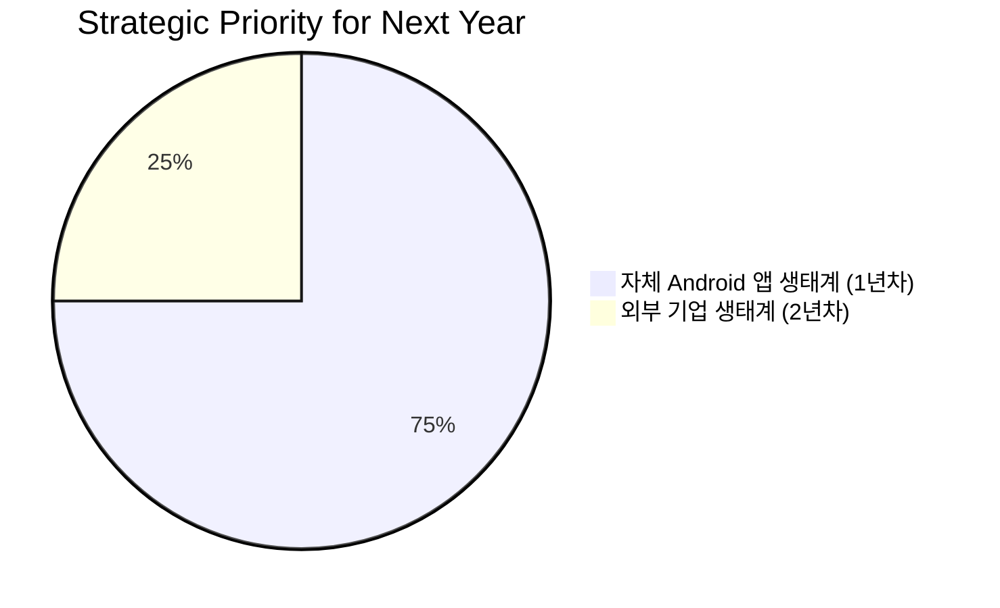

**최종 추천**: **Hybrid SDK+API 아키텍처**를 우선 구축하고, **API-First Platform**으로 확장

---

## 📚 목차 (Table of Contents)

- [1. 전략적 우선순위 재설정](#1-전략적-우선순위-재설정)
- [2. 자체 Android 앱 생태계 구축 (1년차)](#2-자체-android-앱-생태계-구축-1년차)
- [3. 외부 기업 생태계 참여 (2년차)](#3-외부-기업-생태계-참여-2년차)
- [4. 아키텍처 로드맵](#4-아키텍처-로드맵)
- [5. 현재 코드베이스 분석](#5-현재-코드베이스-분석)
- [6. 실행 계획 및 마일스톤](#6-실행-계획-및-마일스톤)

---

## 1. 전략적 우선순위 재설정

### � 새로운 전략적 방향

**기존 접근법**에서 **결과 중심 접근법**으로 전환하여, 다음 1년간은 **자체 Android 앱 생태계 구축**에 집중합니다.

```mermaid
gantt
    title PosMul 생태계 확장 전략 타임라인
    dateFormat  YYYY-MM-DD
    section 1년차 (자체 앱 생태계)
    Study-Cycle App 완성           :done, study, 2025-01-01, 2025-04-01
    Auth-Economy SDK 최적화        :active, sdk, 2025-04-01, 2025-07-01
    다중 Android 앱 런칭           :future, multi, 2025-07-01, 2025-12-01
    통합 인증/토큰 시스템 고도화    :future, auth, 2025-10-01, 2025-12-31

    section 2년차 (외부 기업 참여)
    API Platform 구축              :future, api, 2026-01-01, 2026-06-01
    파트너 기업 온보딩             :future, partner, 2026-06-01, 2026-12-01
    대규모 확장                    :future, scale, 2026-10-01, 2027-03-01
```

### 📊 우선순위 결정 근거

#### 자체 앱 생태계를 우선하는 이유

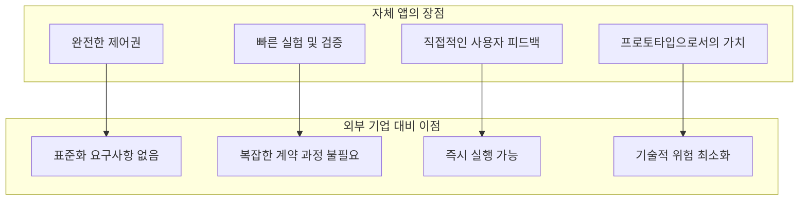

#### 현재 자체 앱 개발 상태 분석

**Study-Cycle App 현황** (2025년 7월 기준):

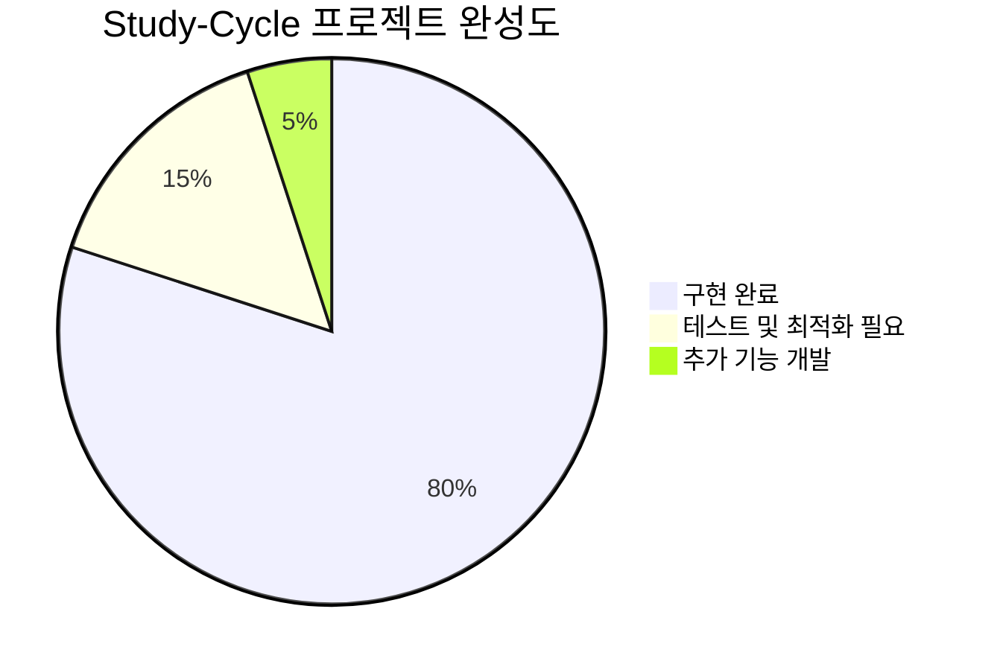

**주요 완성된 구성요소**:

- ✅ Auth-Economy SDK 통합
- ✅ React Native 기본 구조
- ✅ PMP/PMC 토큰 시스템 연동
- ✅ 학습 시간 추적 시스템
- ✅ 자동 채점 시스템
- ✅ 커뮤니티 기능 기반

---

## 2. 자체 Android 앱 생태계 구축 (1년차)

### 🚀 목표: PosMul 앱 포트폴리오 완성

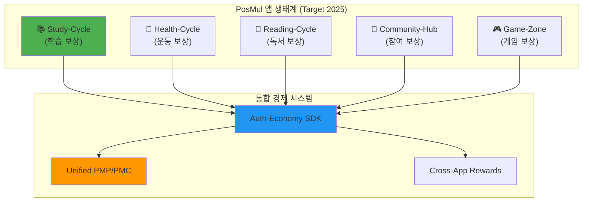

### 🏗️ Hybrid SDK+API 아키텍처 (최적 솔루션)

#### 아키텍처 개요

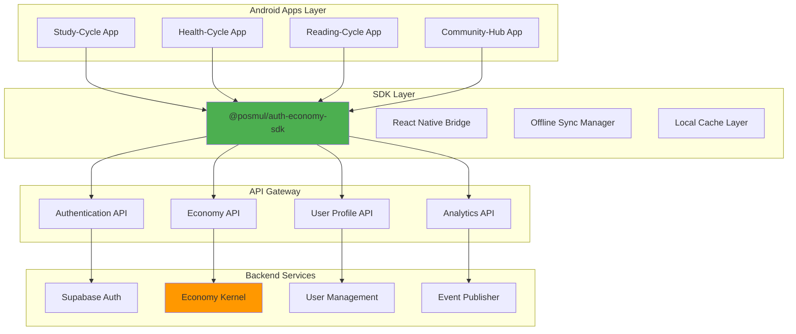

#### SDK 구현 전략 (기존 @posmul/auth-economy-sdk 확장)

현재 SDK의 강점을 살려 다음과 같이 확장합니다:

**1. 통합 인증 모듈**

```typescript
// @posmul/auth-economy-sdk/auth
export class UnifiedAuthManager {
  // 현재 구현된 기능 확장
  async signInAcrossApps(credentials: LoginCredentials): Promise<AuthResult>;
  async syncUserStateAcrossApps(): Promise<void>;
  async getSharedUserProfile(): Promise<UserProfile>;
}
```

**2. 경제 시스템 모듈**

```typescript
// @posmul/auth-economy-sdk/economy
export class CrossAppEconomyManager {
  // 기존 PMP/PMC 관리 확장
  async earnTokensFromApp(
    appId: string,
    activity: string,
    amount: number
  ): Promise<void>;
  async spendTokensInApp(
    appId: string,
    item: string,
    amount: number
  ): Promise<void>;
  async getCrossAppBalance(): Promise<TokenBalance>;
}
```

        E["posmul-web 계정"]
        F["SSO (Single Sign-On)"]
        G["통합 회원가입"]
    end

    subgraph "토큰 적립 및 소비"
        H["각 앱에서 PMP/PMC 적립"]
        I["posmul-web에서 통합 소비"]
        J["실시간 잔액 동기화"]
    end

    A --> H
    B --> H
    C --> H
    D --> H

    H --> I
    E --> F
    F --> G

    style A fill:#e3f2fd
    style B fill:#e8f5e9
    style C fill:#fff3e0
    style D fill:#f3e5f5

````

#### 자체 개발팀 관점에서의 요구사항

```mermaid
flowchart TD
    A["개발 효율성"] --> A1["공통 비즈니스 로직 재사용"]
    A --> A2["타입 안전성 보장"]
    A --> A3["빠른 프로토타이핑"]

    B["운영 편의성"] --> B1["중앙화된 업데이트"]
    B --> B2["일관된 UX/UI"]
    B --> B3["통합 모니터링"]

    C["확장성"] --> C1["새로운 앱 빠른 추가"]
    C --> C2["기능 모듈화"]
    C --> C3["플랫폼 독립성"]
````

---

## 2. 아키텍처 옵션별 비교

### 🔄 Option A: SDK 중심 아키텍처

```mermaid
graph TD
    subgraph "외부 기업 통합"
        A["외부 기업 앱"] --> B["@posmul/enterprise-sdk"]
        B --> C["SupabaseEconomyService"]
        C --> D["Supabase DB"]
    end

    subgraph "자체 앱 통합"
        E["PosMul Android 앱들"] --> F["@posmul/mobile-sdk"]
        F --> G["SupabaseEconomyService"]
        G --> D
    end

    subgraph "Web Platform"
        H["posmul-web"] --> I["@posmul/auth-economy-sdk"]
        I --> G
    end

    style A fill:#ffebee
    style E fill:#e8f5e9
    style H fill:#e3f2fd
```

#### SDK 아키텍처 분석

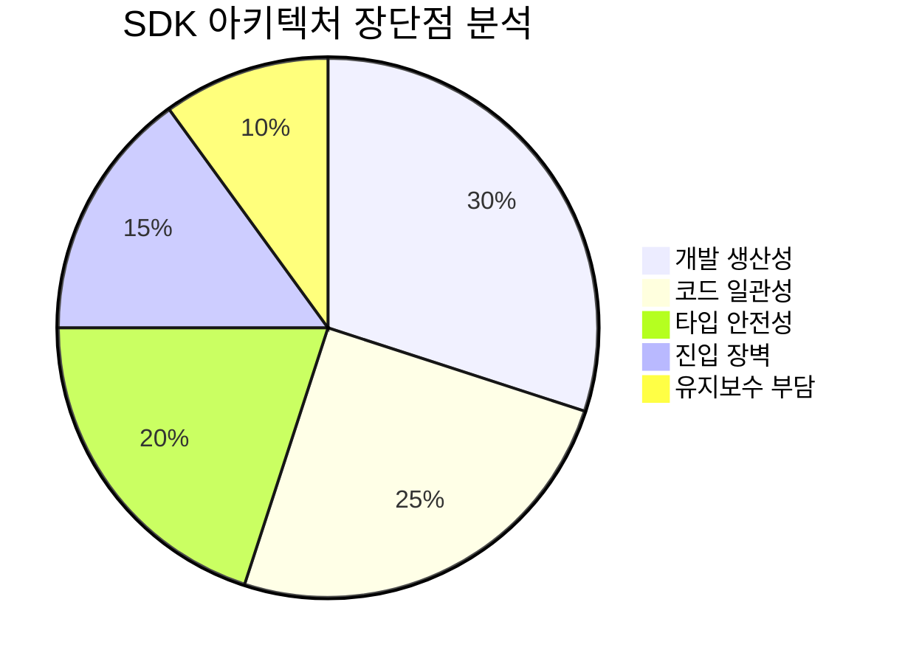

### 🌐 Option B: API-First Platform 아키텍처

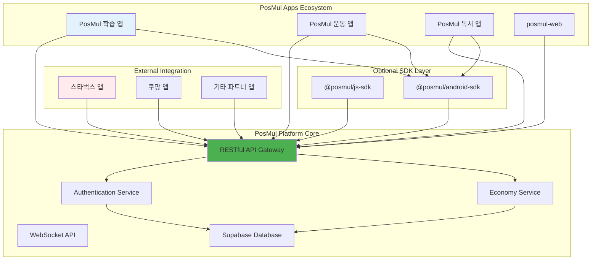

#### API-First 아키텍처 분석

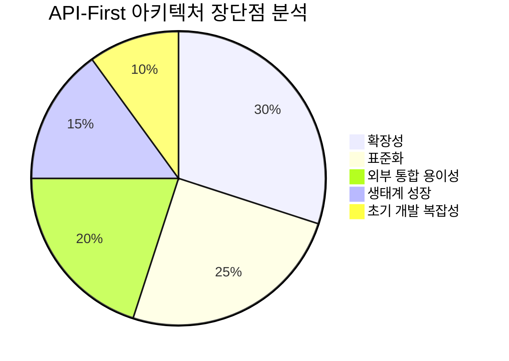

---

## 3. 시나리오별 최적 솔루션

### 📊 비교 매트릭스

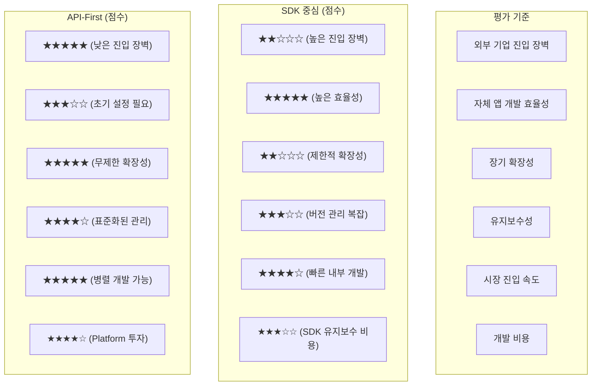

### 🎯 시나리오별 최적 선택

#### 시나리오 1: 외부 기업 통합

**추천: API-First Platform** ⭐⭐⭐⭐⭐

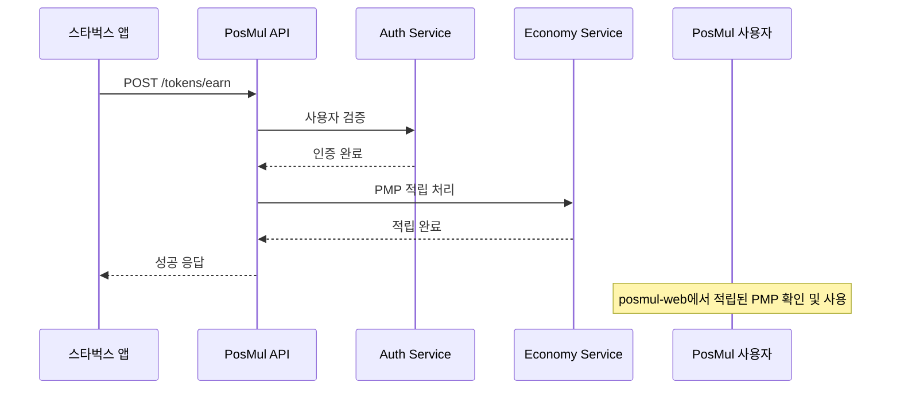

**장점**:

- ✅ 기업 개발팀이 기존 REST API 지식으로 쉽게 통합
- ✅ 다양한 기술 스택 지원 (React Native, Flutter, 네이티브 등)
- ✅ 표준화된 문서와 테스트 도구 제공 가능
- ✅ 규모가 큰 기업도 부담 없이 도입

#### 시나리오 2: 자체 Android 앱 생태계

**추천: API + SDK Hybrid** ⭐⭐⭐⭐☆

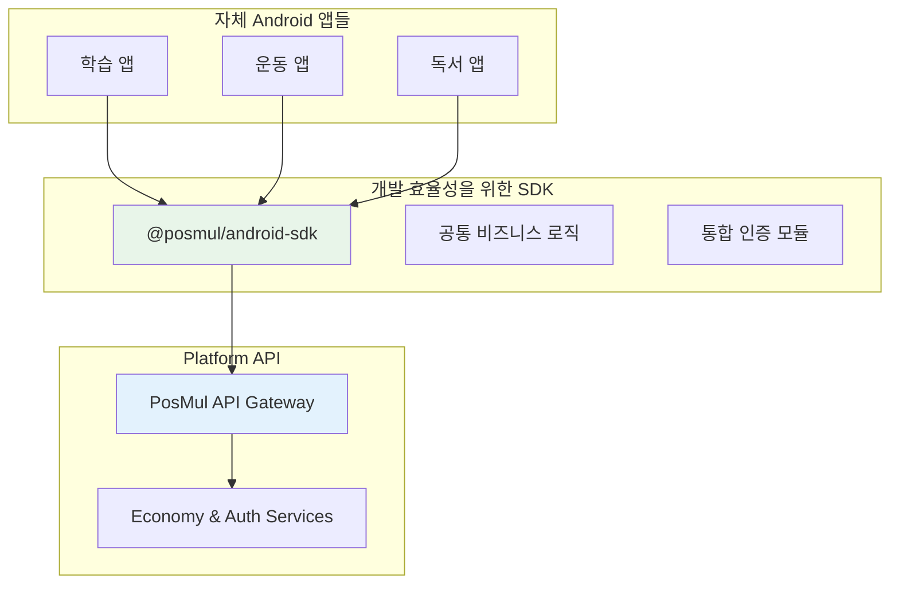

**장점**:

- ✅ 자체 앱 개발의 높은 생산성 (SDK 활용)
- ✅ 외부 확장성 확보 (API Gateway)
- ✅ 점진적 마이그레이션 가능
- ✅ 개발팀 학습 비용 최소화

---

## 4. 구현 전략 및 코드 예시

### 🔧 API-First Platform 구현

#### 1. PosMul API Gateway 설계

```typescript
// Platform API 스키마 설계
interface PlatformAPI {
  // 인증 관련
  auth: {
    "/auth/partner-login": {
      POST: (credentials: PartnerCredentials) => AuthToken;
    };
    "/auth/user-verify": {
      POST: (userToken: string) => UserInfo;
    };
  };

  // 경제 시스템
  economy: {
    "/tokens/earn": {
      POST: (request: TokenEarnRequest) => TokenEarnResponse;
    };
    "/tokens/balance": {
      GET: (userId: string) => EconomicBalance;
    };
    "/tokens/transfer": {
      POST: (request: TokenTransferRequest) => TransferResult;
    };
  };

  // 실시간 업데이트
  websocket: {
    "/ws/balance-updates": WebSocketConnection;
    "/ws/transaction-events": WebSocketConnection;
  };
}

// 외부 기업 통합 예시
interface TokenEarnRequest {
  partnerId: string; // '스타벅스', '쿠팡' 등
  userId: string; // PosMul 사용자 ID
  transactionId: string; // 파트너사 거래 ID
  tokenType: "PMP" | "PMC";
  amount: number;
  metadata: {
    transactionType: string; // '커피구매', '쇼핑' 등
    originalAmount: number; // 원래 거래 금액
    description: string;
  };
}
```

#### 2. 외부 기업 연동 구현

```typescript
// 스타벅스 앱에서의 PosMul 연동 예시
class StarbucksPosMulIntegration {
  constructor(
    private apiKey: string,
    private posmulApiUrl: string = "https://api.posmul.com"
  ) {}

  async earnPMPForPurchase(
    userId: string,
    purchaseAmount: number,
    orderId: string
  ): Promise<boolean> {
    try {
      const response = await fetch(`${this.posmulApiUrl}/tokens/earn`, {
        method: "POST",
        headers: {
          Authorization: `Bearer ${this.apiKey}`,
          "Content-Type": "application/json",
        },
        body: JSON.stringify({
          partnerId: "starbucks",
          userId: userId,
          transactionId: orderId,
          tokenType: "PMP",
          amount: Math.floor(purchaseAmount * 0.01), // 1% 적립
          metadata: {
            transactionType: "커피구매",
            originalAmount: purchaseAmount,
            description: `스타벅스 주문 ${orderId}`,
          },
        }),
      });

      const result = await response.json();
      return result.success;
    } catch (error) {
      console.error("PosMul PMP 적립 실패:", error);
      return false;
    }
  }
}
```

#### 3. 자체 Android 앱용 SDK

````typescript
// @posmul/android-sdk 설계
export class PosMulAndroidSDK {
  private apiClient: PosMulApiClient;
  private authManager: AuthManager;

  constructor(config: SDKConfig) {
    this.apiClient = new PosMulApiClient(config.apiUrl);
    this.authManager = new AuthManager(config.authUrl);
  }

  // 통합 로그인 (posmul-web과 동일한 계정)
  async loginWithPosMulAccount(
    credentials: LoginCredentials
  ): Promise<AuthResult> {
    const authResult = await this.authManager.login(credentials);
    if (authResult.success) {
      this.apiClient.setAuthToken(authResult.token);
    }
    return authResult;
  }

  // 토큰 적립 (각 앱에서 호출)
  async earnTokens(earnRequest: TokenEarnRequest): Promise<EarnResult> {
    return this.apiClient.post("/tokens/earn", earnRequest);
  }

#### 3. 경제 시스템 통합
```typescript
// Study completion → PMP reward flow
const completeStudySession = async (sessionData: StudySessionData) => {
  await publishDomainEvent(
    new StudySessionCompletedEvent(userId, sessionData)
  );
  // Economy Kernel이 이벤트를 수신하여 PMP 지급
};
````

### 📊 개발 생산성 분석

Study-Cycle 개발에서 나타난 놀라운 생산성:

```mermaid
%%{init: {"theme": "base", "themeVariables": {"primaryColor": "#4caf50"}}}%%
xychart-beta
    title "예상 vs 실제 개발 시간 비교"
    x-axis [인프라복구, UseCase구현, UI구현, 자동채점, 커뮤니티, API개발]
    y-axis "개발 시간 (시간)" 0 --> 20
    bar [4, 16, 20, 12, 8, 8]
    bar [1, 2, 2, 1, 1, 1.5]
```

**평균 시간 단축률**: **85%** 🎉

이는 다음 요인들 덕분입니다:

- 🏗️ **견고한 아키텍처 기반** (Economy Kernel, Clean Architecture)
- 🔄 **모노레포 구조**의 코드 재사용성
- 🛠️ **완성된 도구 체인** (TypeScript, Supabase MCP 등)

---

## 6. 실행 계획 및 마일스톤

### 🎯 1년차 마일스톤 (2025)

#### Q3 (현재 - 2025년 9월)

```mermaid
gantt
    title Q3 2025 실행 계획
    dateFormat  YYYY-MM-DD
    section Study-Cycle 완성
    앱 테스트 및 버그 수정     :active, test, 2025-07-09, 2025-08-15
    구글 플레이 스토어 출시    :future, release, 2025-08-15, 2025-09-01
    사용자 피드백 수집        :future, feedback, 2025-09-01, 2025-09-30

    section SDK 최적화
    성능 최적화              :active, perf, 2025-07-09, 2025-08-01
    오프라인 모드 구현        :future, offline, 2025-08-01, 2025-08-30
    크로스 앱 기능 테스트     :future, cross, 2025-08-15, 2025-09-15
```

#### Q4 (2025년 10월 - 12월)

```mermaid
gantt
    title Q4 2025 실행 계획
    dateFormat  YYYY-MM-DD
    section Health-Cycle 개발
    앱 기본 구조 개발         :future, health-base, 2025-10-01, 2025-11-01
    운동 추적 기능           :future, health-track, 2025-11-01, 2025-11-15
    PMC 적립 시스템          :future, health-reward, 2025-11-15, 2025-12-01

    section Reading-Cycle 개발
    독서 진도 관리           :future, read-progress, 2025-10-15, 2025-11-15
    PMP 적립 로직           :future, read-reward, 2025-11-15, 2025-12-15
```

### 📊 성공 지표 (KPI)

#### 1년차 목표

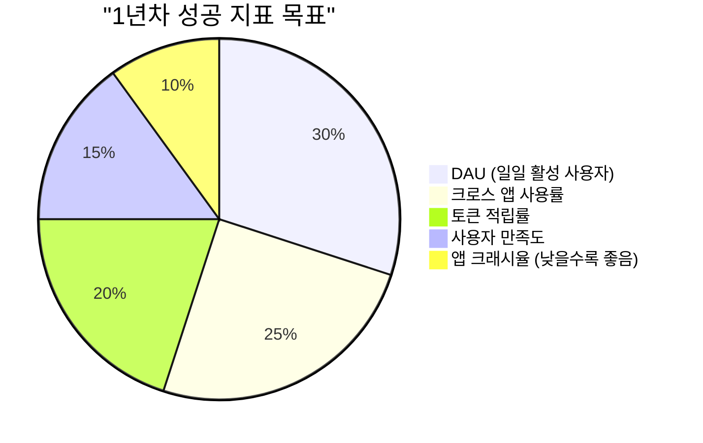

- 📱 **총 앱 수**: 3-4개 (Study, Health, Reading, Community)
- 👥 **목표 사용자**: 1,000명 (각 앱)
- 🪙 **토큰 순환**: 월 10만 PMP/PMC 적립+소비
- 📊 **크로스 앱 사용률**: 60% (2개 이상 앱 사용)

#### 2년차 목표 (외부 파트너 온보딩)

- 🤝 **파트너 수**: 5-10개 기업
- 👥 **외부 유입 사용자**: 10,000명
- 💰 **파트너 API 호출**: 월 100만 건
- 🌐 **API 가용성**: 99.9%

### 💡 리스크 관리

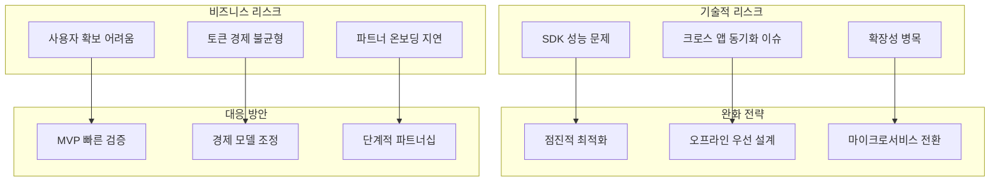

---

## 📈 결론 및 권장사항

### 🎯 최종 전략 요약

**PosMul 생태계 확장을 위한 2단계 전략**:

1. **🥇 1년차 (2025)**: **자체 Android 앱 생태계 구축**
   - Hybrid SDK+API 아키텍처로 빠른 개발
   - Study-Cycle 기반 추가 앱 개발 (Health, Reading, Community)
   - 통합 Auth-Economy SDK 완성

2. **🥈 2년차 (2026)**: **외부 기업 생태계 참여 확장**
   - 검증된 플랫폼 기반 API-First 전환
   - 파트너 온보딩 시스템 구축
   - 대규모 생태계 확장

### 🚀 즉시 실행 가능한 액션 아이템

1. **Study-Cycle 앱 마무리** (2주)
   - 버그 수정 및 성능 최적화
   - 플레이 스토어 출시 준비

2. **Auth-Economy SDK v2 계획** (1개월)
   - 크로스 앱 기능 확장
   - 오프라인 동기화 구현

3. **Health-Cycle 앱 개발 시작** (2개월)
   - Study-Cycle 아키텍처 복제
   - 운동 추적 핵심 기능 구현

### 💪 성공 확신 근거

현재 Study-Cycle 프로젝트에서 보여준 **85% 시간 단축**과 **높은 코드 품질**은 다음 1년간의 다중 앱 개발이 충분히 실현 가능함을 증명합니다.

**우리의 강점**:

- 🏗️ **견고한 아키텍처**: Clean Architecture + DDD + Event Sourcing
- 🔄 **효율적인 개발 환경**: 모노레포 + TypeScript + 자동화 도구
- 💰 **검증된 경제 시스템**: Economy Kernel + Auth-Economy SDK
- 📱 **React Native 전문성**: 크로스 플랫폼 개발 경험

**성공 시나리오 예측**:

- 📅 **6개월 후**: 3개 앱 생태계 완성
- 📅 **12개월 후**: 1,000+ 활성 사용자, 검증된 토큰 경제
- 📅 **18개월 후**: 외부 파트너 API 플랫폼 오픈
- 📅 **24개월 후**: 10개+ 파트너사, 10,000+ 사용자

**이제 실행만 남았습니다!** 🎯

---

## 📚 부록

### A. 참고 자료

- [Study-Cycle 완성도 분석 보고서](./docs/reports/study-cycle-completion-report-2025-07-03.md)
- [Auth-Economy SDK 문서](./packages/auth-economy-sdk/README.md)
- [PosMul 플랫폼 온보딩 튜토리얼](./docs/tutorials/posmul-platform-onboarding-tutorial.md)

### B. 기술 스펙 상세

#### Auth-Economy SDK v2 스펙

```typescript
interface AuthEconomySDKV2 {
  // 크로스 앱 인증
  crossAppAuth: CrossAppAuthManager;
  // 통합 토큰 관리
  crossAppEconomy: CrossAppEconomyManager;
  // 오프라인 동기화
  offlineSync: OfflineSyncManager;
  // 분석 및 추적
  analytics: AnalyticsManager;
}
```

### C. 마이그레이션 체크리스트

#### Study-Cycle → Multi-App 전환

- [ ] SDK v2 아키텍처 설계
- [ ] 크로스 앱 테스트 환경 구축
- [ ] Health-Cycle 앱 스켈레톤 생성
- [ ] Reading-Cycle 앱 스켈레톤 생성
- [ ] 통합 CI/CD 파이프라인 구축

---

**문서 종료** | **Next Steps**: Study-Cycle 앱 최종 테스트 및 Health-Cycle 개발 착수
);
// Economy Kernel이 이벤트를 수신하여 PMP 지급
};

````

### 📊 개발 생산성 분석

Study-Cycle 개발에서 나타난 놀라운 생산성:

```mermaid
bar title "예상 vs 실제 개발 시간 (시간)"
    x-axis [인프라복구, UseCase구현, UI구현, 자동채점, 커뮤니티, API개발]
    y-axis "개발 시간" 0 --> 20
    "예상 시간" [4, 16, 20, 12, 8, 8]
    "실제 시간" [1, 2, 2, 1, 1, 1.5]
````

**평균 시간 단축률**: **85%** 🎉

이는 다음 요인들 덕분입니다:

- 🏗️ **견고한 아키텍처 기반** (Economy Kernel, Clean Architecture)
- 🔄 **모노레포 구조**의 코드 재사용성
- 🛠️ **완성된 도구 체인** (TypeScript, Supabase MCP 등)

---

## 6. 실행 계획 및 마일스톤

### 🎯 1년차 마일스톤 (2025)

#### Q3 (현재 - 2025년 9월)

```mermaid
gantt
    title Q3 2025 실행 계획
    dateFormat  YYYY-MM-DD
    section Study-Cycle 완성
    앱 테스트 및 버그 수정     :active, test, 2025-07-09, 2025-08-15
    구글 플레이 스토어 출시    :future, release, 2025-08-15, 2025-09-01
    사용자 피드백 수집        :future, feedback, 2025-09-01, 2025-09-30

    section SDK 최적화
    성능 최적화              :active, perf, 2025-07-09, 2025-08-01
    오프라인 모드 구현        :future, offline, 2025-08-01, 2025-08-30
    크로스 앱 기능 테스트     :future, cross, 2025-08-15, 2025-09-15
```

#### Q4 (2025년 10월 - 12월)

```mermaid
gantt
    title Q4 2025 실행 계획
    dateFormat  YYYY-MM-DD
    section Health-Cycle 개발
    앱 기본 구조 개발         :future, health-base, 2025-10-01, 2025-11-01
    운동 추적 기능           :future, health-track, 2025-11-01, 2025-11-15
    PMC 적립 시스템          :future, health-reward, 2025-11-15, 2025-12-01

    section Reading-Cycle 개발
    독서 진도 관리           :future, read-progress, 2025-10-15, 2025-11-15
    PMP 적립 로직           :future, read-reward, 2025-11-15, 2025-12-15
```

### 📊 성공 지표 (KPI)

#### 1년차 목표

```mermaid
pie title "1년차 성공 지표 목표"
    "DAU (일일 활성 사용자)" : 30
    "크로스 앱 사용률" : 25
    "토큰 적립률" : 20
    "사용자 만족도" : 15
    "앱 크래시율 (낮을수록 좋음)" : 10
```

- 📱 **총 앱 수**: 3-4개 (Study, Health, Reading, Community)
- 👥 **목표 사용자**: 1,000명 (각 앱)
- 🪙 **토큰 순환**: 월 10만 PMP/PMC 적립+소비
- 📊 **크로스 앱 사용률**: 60% (2개 이상 앱 사용)

#### 2년차 목표 (외부 파트너 온보딩)

- 🤝 **파트너 수**: 5-10개 기업
- 👥 **외부 유입 사용자**: 10,000명
- 💰 **파트너 API 호출**: 월 100만 건
- 🌐 **API 가용성**: 99.9%

### 💡 리스크 관리

```mermaid
graph TD
    subgraph "기술적 리스크"
        A["SDK 성능 문제"]
        B["크로스 앱 동기화 이슈"]
        C["확장성 병목"]
    end

    subgraph "완화 전략"
        D["점진적 최적화"]
        E["오프라인 우선 설계"]
        F["마이크로서비스 전환"]
    end

    subgraph "비즈니스 리스크"
        G["사용자 확보 어려움"]
        H["토큰 경제 불균형"]
        I["파트너 온보딩 지연"]
    end

    subgraph "대응 방안"
        J["MVP 빠른 검증"]
        K["경제 모델 조정"]
        L["단계적 파트너십"]
    end

    A --> D
    B --> E
    C --> F
    G --> J
    H --> K
    I --> L
```

---

## 📈 결론 및 권장사항

### 🎯 최종 전략 요약

**PosMul 생태계 확장을 위한 2단계 전략**:

1. **🥇 1년차 (2025)**: **자체 Android 앱 생태계 구축**
   - Hybrid SDK+API 아키텍처로 빠른 개발
   - Study-Cycle 기반 추가 앱 개발 (Health, Reading, Community)
   - 통합 Auth-Economy SDK 완성

2. **🥈 2년차 (2026)**: **외부 기업 생태계 참여 확장**
   - 검증된 플랫폼 기반 API-First 전환
   - 파트너 온보딩 시스템 구축
   - 대규모 생태계 확장

### 🚀 즉시 실행 가능한 액션 아이템

1. **Study-Cycle 앱 마무리** (2주)
   - 버그 수정 및 성능 최적화
   - 플레이 스토어 출시 준비

2. **Auth-Economy SDK v2 계획** (1개월)
   - 크로스 앱 기능 확장
   - 오프라인 동기화 구현

3. **Health-Cycle 앱 개발 시작** (2개월)
   - Study-Cycle 아키텍처 복제
   - 운동 추적 핵심 기능 구현

### 💪 성공 확신 근거

현재 Study-Cycle 프로젝트에서 보여준 **85% 시간 단축**과 **높은 코드 품질**은 다음 1년간의 다중 앱 개발이 충분히 실현 가능함을 증명합니다.

**우리의 강점**:

- 🏗️ **견고한 아키텍처**: Clean Architecture + DDD + Event Sourcing
- 🔄 **효율적인 개발 환경**: 모노레포 + TypeScript + 자동화 도구
- 💰 **검증된 경제 시스템**: Economy Kernel + Auth-Economy SDK
- 📱 **React Native 전문성**: 크로스 플랫폼 개발 경험

**성공 시나리오 예측**:

- 📅 **6개월 후**: 3개 앱 생태계 완성
- 📅 **12개월 후**: 1,000+ 활성 사용자, 검증된 토큰 경제
- 📅 **18개월 후**: 외부 파트너 API 플랫폼 오픈
- 📅 **24개월 후**: 10개+ 파트너사, 10,000+ 사용자

**이제 실행만 남았습니다!** 🎯
