# PosMul 플랫폼 전략 분석 보고서: Platform vs SDK 아키텍처 선택

**문서 버전**: 1.0  
**작성일**: 2025-07-09  
**작성자**: PosMul Agent

---

## 📋 Executive Summary

이 보고서는 PosMul 프로젝트의 현재 아키텍처(`posmul-web`이 `auth-economy-sdk`에 의존하는 구조)와 대안적 아키텍처(Platform 중심 생태계)의 장단점을 분석하고, 향후 성장을 위한 최적의 방향성을 제시합니다.

### 🎯 핵심 발견사항

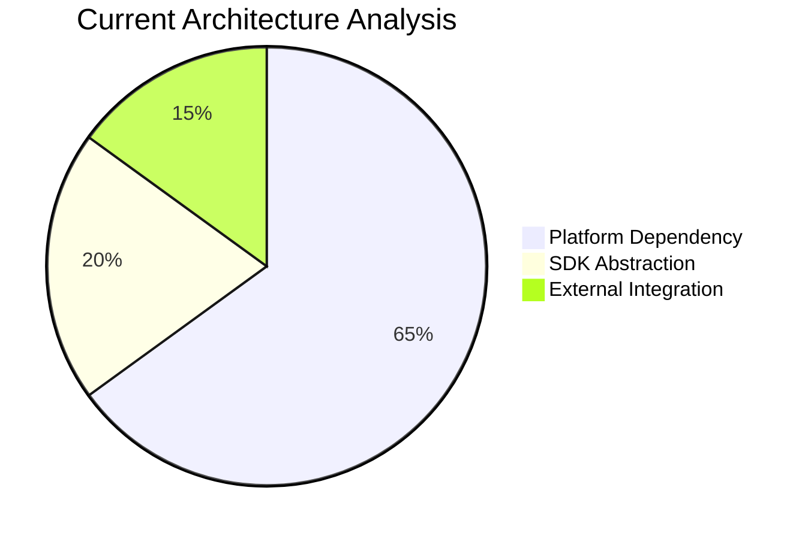

1. **현재 구조의 강점**: 비즈니스 로직의 재사용성과 일관성 확보
2. **성장 제약**: 외부 생태계 확장의 복잡성과 플랫폼 종속성
3. **미래 기회**: Platform-as-a-Service 모델로의 진화 가능성

---

## 📚 목차 (Table of Contents)

- [1. 현재 상황 분석](#1-현재-상황-분석)
- [2. 전략 옵션 비교 분석](#2-전략-옵션-비교-분석)
- [3. 코드베이스 영향 분석](#3-코드베이스-영향-분석)
- [4. 성장 전략 및 추천](#4-성장-전략-및-추천)
- [5. 마이그레이션 로드맵](#5-마이그레이션-로드맵)
- [6. 결론 및 제언](#6-결론-및-제언)

---

## 1. 현재 상황 분석

### 🏗️ 현재 아키텍처: posmul-web → auth-economy-sdk

현재 PosMul 프로젝트는 다음과 같은 의존성 구조를 가지고 있습니다:

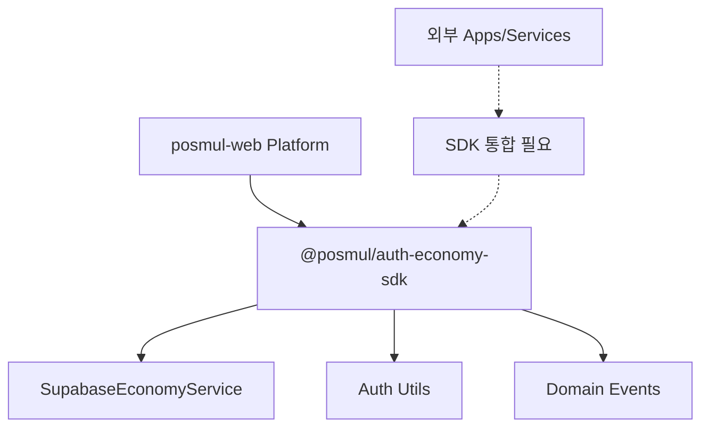

### 📊 현재 구조 분석

#### ✅ 장점

1. **비즈니스 로직 중앙화**
   - 경제 시스템 로직이 SDK에 캡슐화되어 일관성 보장
   - PMP/PMC 계산 로직의 재사용성 극대화

2. **개발 생산성**
   - 핵심 기능의 빠른 개발과 테스트 가능
   - 타입 안전성과 인터페이스 일관성 확보

3. **유지보수성**
   - 경제 시스템 변경 시 SDK만 업데이트하면 전체 반영
   - 버전 관리를 통한 안정적 배포 가능

#### ❌ 단점

1. **생태계 확장 제약**
   - 외부 개발자/기업이 PosMul 생태계 참여 시 복잡한 SDK 학습 필요
   - Platform API보다 높은 진입 장벽

2. **Platform 종속성**
   - posmul-web이 SDK 변경에 강하게 결합
   - 독립적인 서비스 확장의 어려움

3. **스케일링 복잡성**
   - 대규모 외부 통합 시 SDK 버전 관리의 복잡성
   - 다양한 환경(React Native, Vue, Angular 등) 지원의 어려움

### 📈 현재 패키지 의존성 현황

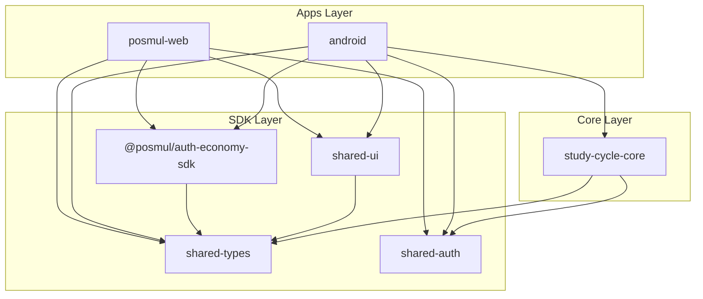

---

## 2. 전략 옵션 비교 분석

### 🔄 Option A: 현재 구조 유지 (App → SDK)

#### 구조 특징

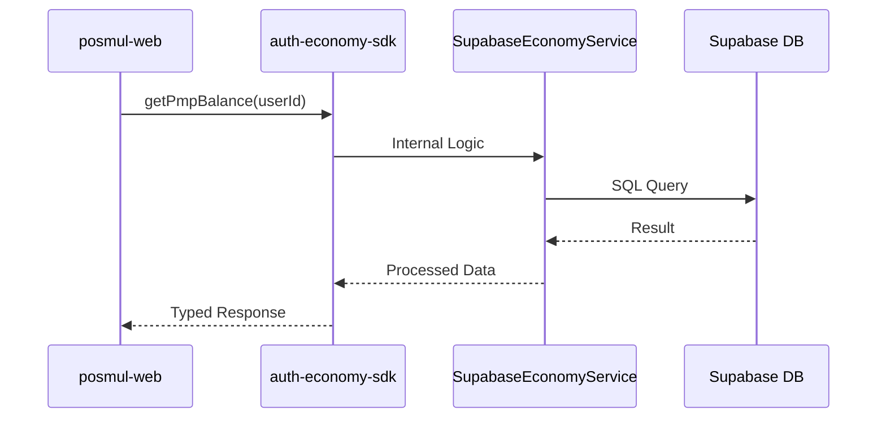

#### 📊 SWOT 분석

| 구분              | 내용                                                                      |
| ----------------- | ------------------------------------------------------------------------- |
| **Strengths**     | • 빠른 개발 속도<br>• 일관된 비즈니스 로직<br>• 강력한 타입 안전성        |
| **Weaknesses**    | • 외부 생태계 확장 제약<br>• SDK 버전 의존성<br>• 높은 결합도             |
| **Opportunities** | • Enterprise 고객 대상 SDK 라이센싱<br>• 내부 개발팀 생산성 극대화        |
| **Threats**       | • 경쟁사의 더 개방적인 Platform API<br>• 외부 개발자 커뮤니티 형성 어려움 |

### 🌐 Option B: Platform 중심 생태계 (Platform ← SDK)

#### 구조 특징

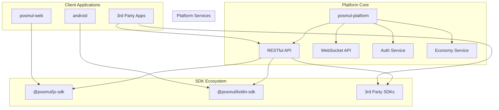

#### 📊 SWOT 분석

| 구분              | 내용                                                                                     |
| ----------------- | ---------------------------------------------------------------------------------------- |
| **Strengths**     | • 개방적 생태계 구축<br>• 다양한 클라이언트 지원<br>• 낮은 진입 장벽                     |
| **Weaknesses**    | • 초기 개발 복잡성 증가<br>• API 버전 관리 부담<br>• 보안 고려사항 증가                  |
| **Opportunities** | • 글로벌 개발자 커뮤니티 형성<br>• Platform-as-a-Service 수익 모델<br>• 다양한 산업 적용 |
| **Threats**       | • API 남용 및 보안 위험<br>• 플랫폼 안정성 요구 증가<br>• 초기 투자 비용                 |

### 🔄 비교 매트릭스

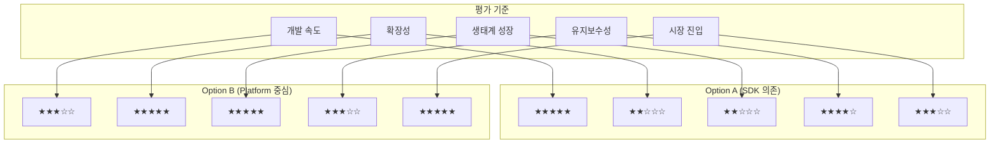

---

## 3. 코드베이스 영향 분석

### 🔧 현재 코드 구조 분석

#### auth-economy-sdk 핵심 모듈

```typescript
// 현재 SDK 구조
export class SupabaseEconomyService implements EconomyService {
  async getPmpBalance(
    userId: UserId
  ): Promise<Result<PmpAmount, EconomyError>> {
    // 직접 Supabase 접근
    const { data, error } = await this.supabase
      .from("user_profiles")
      .select("pmp_balance")
      .eq("id", userId)
      .single();

    return { success: true, data: data.pmp_balance as PmpAmount };
  }
}
```

#### posmul-web의 의존성

```typescript
// apps/posmul-web/package.json 현재 의존성
{
  "dependencies": {
    "@posmul/auth-economy-sdk": "workspace:*",
    // ... 기타 의존성
  }
}
```

### 🚀 Option A 강화 방안

#### 1. SDK 계층화 및 모듈화

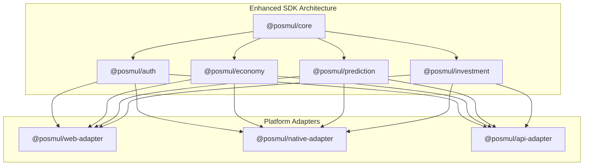

#### 2. 코드 변경 최소화

```typescript
// 기존 코드 유지하면서 확장
export class EnhancedEconomyService extends SupabaseEconomyService {
  constructor(
    supabase: SupabaseClient,
    private apiAdapter?: PlatformApiAdapter
  ) {
    super(supabase);
  }

  async getPmpBalance(
    userId: UserId
  ): Promise<Result<PmpAmount, EconomyError>> {
    if (this.apiAdapter) {
      return this.apiAdapter.getPmpBalance(userId);
    }
    return super.getPmpBalance(userId);
  }
}
```

### 🌐 Option B 전환 방안

#### 1. Platform API 설계

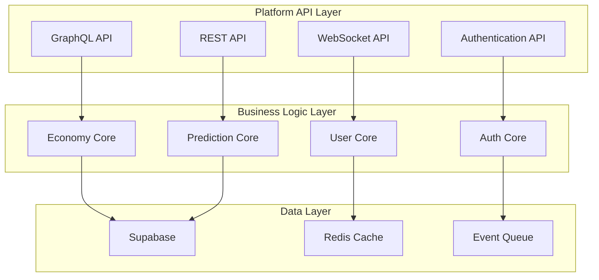

#### 2. 마이그레이션 경로

```typescript
// Phase 1: API Gateway 추가
export class HybridEconomyService implements EconomyService {
  constructor(
    private directService: SupabaseEconomyService,
    private apiService: PlatformApiService
  ) {}

  async getPmpBalance(
    userId: UserId
  ): Promise<Result<PmpAmount, EconomyError>> {
    if (process.env.USE_PLATFORM_API === "true") {
      return this.apiService.getPmpBalance(userId);
    }
    return this.directService.getPmpBalance(userId);
  }
}

// Phase 2: 완전한 Platform API 전환
export class PlatformEconomyService implements EconomyService {
  constructor(private apiClient: PlatformApiClient) {}

  async getPmpBalance(
    userId: UserId
  ): Promise<Result<PmpAmount, EconomyError>> {
    return this.apiClient.economy.getPmpBalance(userId);
  }
}
```

### 📊 변경 범위 분석

#### Option A: SDK 강화

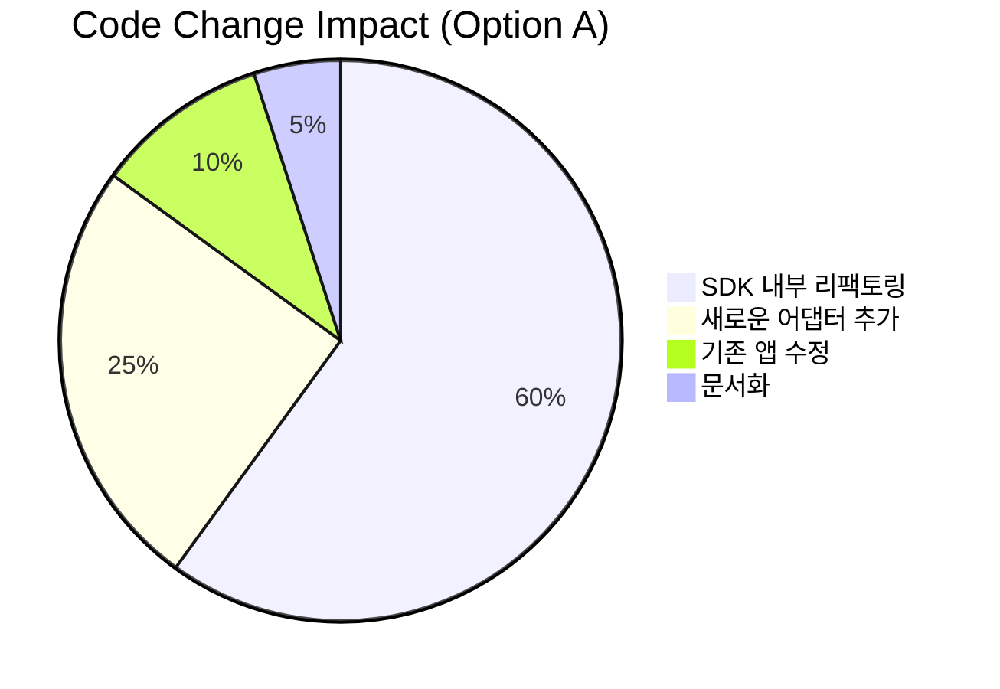

#### Option B: Platform 전환

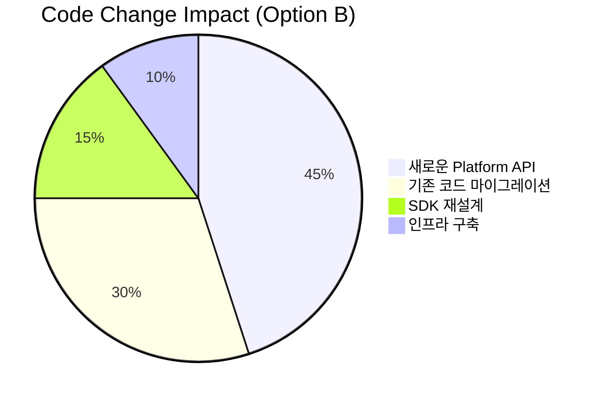

---

## 4. 성장 전략 및 추천

### 🎯 추천 전략: Hybrid Evolution Model

장기적 성장을 위해 **단계적 하이브리드 모델**을 추천합니다:

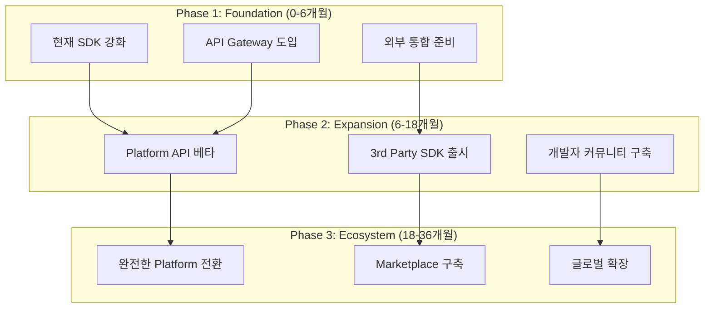

### 💡 핵심 이유

#### 1. 점진적 위험 관리

- 기존 posmul-web의 안정성 유지
- 새로운 Platform 기능의 단계적 검증
- 시장 반응에 따른 유연한 조정 가능

#### 2. 투자 효율성

- 기존 코드 자산의 최대 활용
- 점진적 투자로 리스크 분산
- ROI 측정을 통한 의사결정

#### 3. 생태계 성장 최적화

- 내부 개발 생산성 유지
- 외부 개발자 유입 촉진
- 양방향 피드백 루프 구축

### 🏆 성공 메트릭

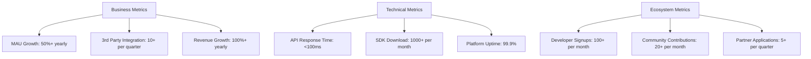

---

## 5. 마이그레이션 로드맵

### 📅 Phase 1: Foundation (0-6개월)

#### Month 1-2: SDK 강화

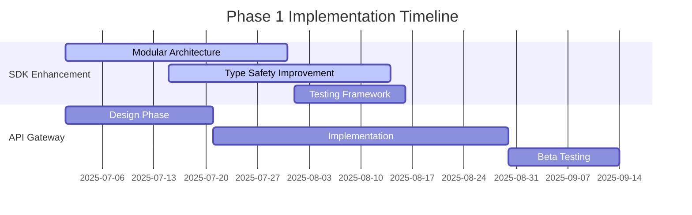

#### 주요 작업

1. **SDK 모듈 분리**

   ```typescript
   // Before
   "@posmul/auth-economy-sdk": "workspace:*"

   // After
   "@posmul/core": "workspace:*",
   "@posmul/auth": "workspace:*",
   "@posmul/economy": "workspace:*",
   "@posmul/web-adapter": "workspace:*"
   ```

2. **API Gateway 프로토타입**

   ```typescript
   // 새로운 API 계층
   export class PlatformGateway {
     constructor(
       private sdk: AuthEconomySDK,
       private apiRouter: express.Router
     ) {}

     setupRoutes() {
       this.apiRouter.get("/economy/balance/:userId", async (req, res) => {
         const result = await this.sdk.economy.getPmpBalance(req.params.userId);
         res.json(result);
       });
     }
   }
   ```

### 📅 Phase 2: Expansion (6-18개월)

#### Platform API 베타 출시

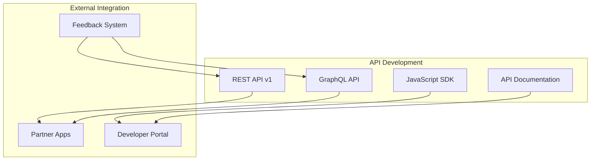

#### 개발자 생태계 구축

1. **Developer Portal 구축**
   - API 문서 자동 생성
   - 인터랙티브 API 테스트 도구
   - 샘플 코드 및 튜토리얼

2. **3rd Party SDK 지원**

   ```typescript
   // @posmul/javascript-sdk (for external developers)
   export class PosMulClient {
     constructor(apiKey: string, baseURL?: string) {
       this.client = new ApiClient(apiKey, baseURL);
     }

     get economy() {
       return new EconomyAPI(this.client);
     }

     get prediction() {
       return new PredictionAPI(this.client);
     }
   }
   ```

### 📅 Phase 3: Ecosystem (18-36개월)

#### 완전한 Platform 전환

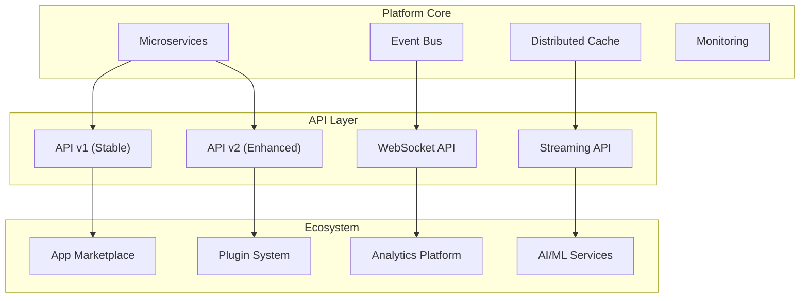

---

## 6. 결론 및 제언

### 🎯 최종 추천: Hybrid Evolution Strategy

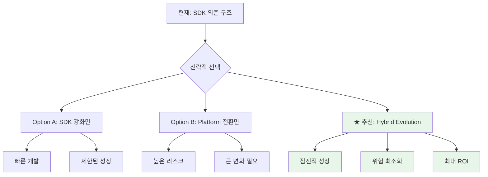

### 💪 핵심 성공 요인

#### 1. 기술적 우선순위

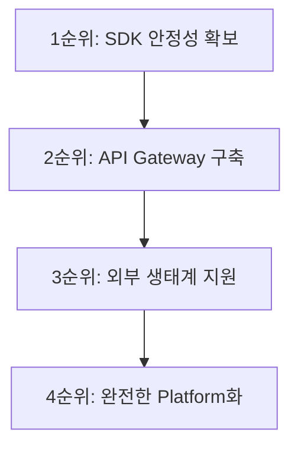

#### 2. 비즈니스 우선순위

1. **기존 사용자 만족도 유지** (posmul-web 사용자)
2. **파트너 유치 및 개발자 커뮤니티 구축**
3. **수익 다각화** (Platform API 수익 모델)
4. **글로벌 확장** (다양한 지역/산업 진출)

### 🚀 실행 계획

#### Immediate Actions (다음 1개월)

- [ ] SDK 모듈화 설계 완료
- [ ] API Gateway 아키텍처 확정
- [ ] Phase 1 개발팀 구성
- [ ] 외부 파트너 사전 조사

#### Short-term Goals (3개월)

- [ ] 강화된 SDK 베타 출시
- [ ] API Gateway 프로토타입 완성
- [ ] 첫 번째 외부 파트너 POC 시작
- [ ] 개발자 문서 초안 작성

#### Long-term Vision (12-24개월)

- [ ] 연간 100+ 3rd party 통합 달성
- [ ] Platform API 기반 수익 30% 이상
- [ ] 글로벌 개발자 커뮤니티 1000+ 구축
- [ ] Enterprise급 SLA 99.9% 달성

### 📊 최종 메시지

PosMul 플랫폼은 현재의 **견고한 SDK 기반 아키텍처**를 바탕으로, **점진적인 Platform 진화**를 통해 글로벌 생태계로 성장할 수 있는 최적의 위치에 있습니다.

**Hybrid Evolution Strategy**는:

- ✅ **기존 투자 보호**: 현재 코드 자산 최대 활용
- ✅ **위험 최소화**: 단계적 검증을 통한 안정적 성장
- ✅ **성장 극대화**: 내부 + 외부 생태계 동시 확장
- ✅ **경쟁 우위**: 독특한 경제 시스템 기반 차별화

이 전략을 통해 PosMul은 **"AI 시대 직접 민주주의 플랫폼"**이라는 비전을 성공적으로 실현할 수 있을 것입니다.

---

**참고 문서**:

- [PosMul 종합 아키텍처 오버뷰](./docs/architecture/posmul-comprehensive-architecture-overview.md)
- [모노레포 전략](./docs/architecture/posmul-monorepo-strategy.md)
- [Platform 발전방향 전략](./docs/reports/posmul-platform-development-strategy-report.md)
