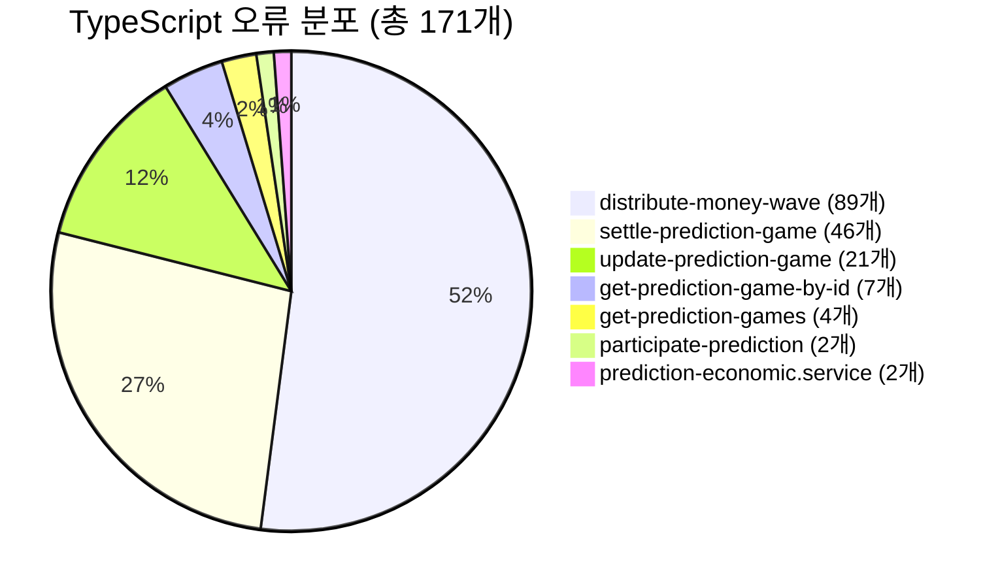
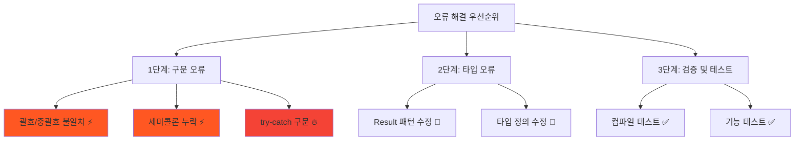
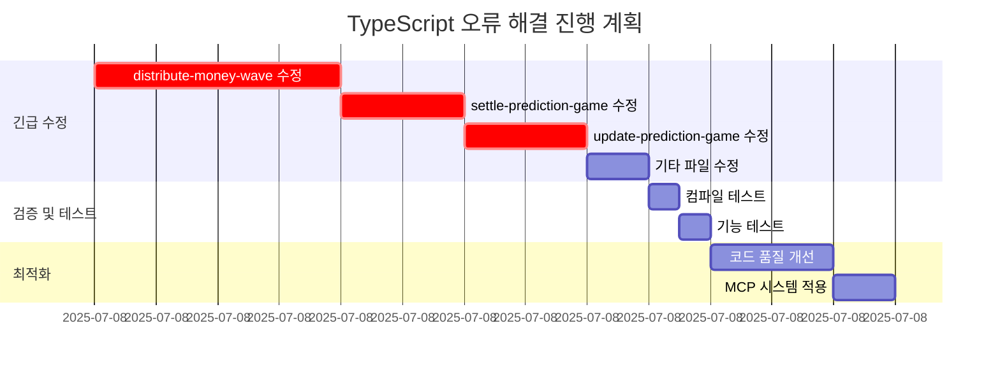
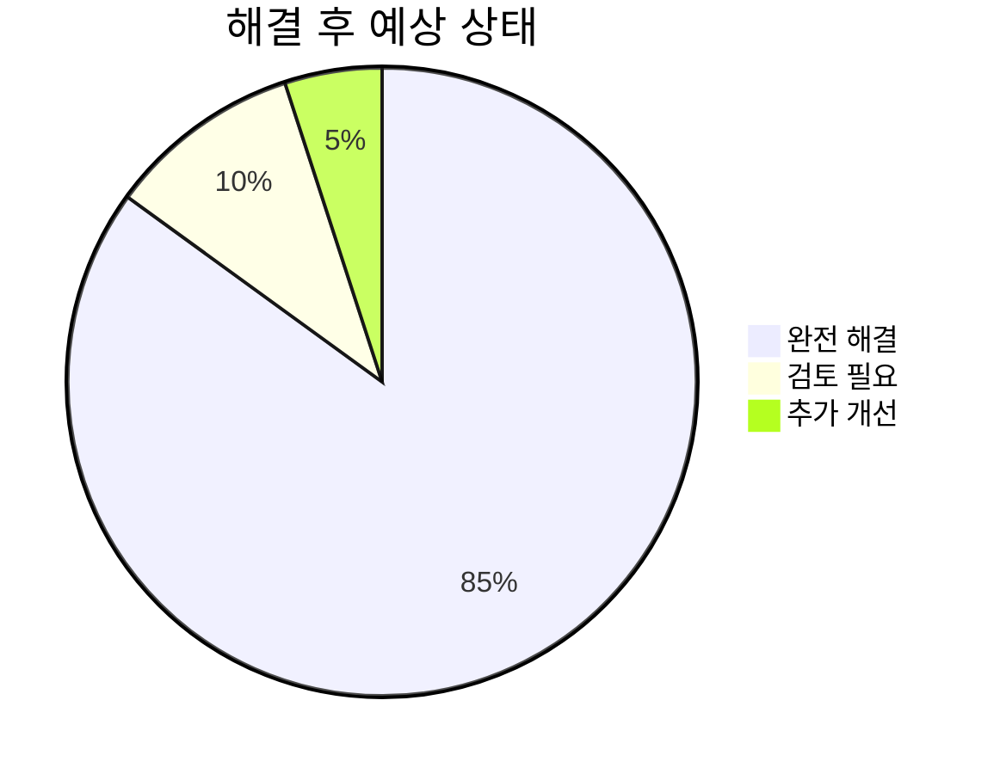

# TypeScript 오류 해결 TODO 리스트

> **📅 생성일**: 2025년 7월 8일  
> **🎯 목표**: 171개 TypeScript 오류를 체계적으로 해결  
> **📊 현재 상황**: 7개 파일에서 171개 오류 발생

## 📋 오류 현황 분석

## 🚨 긴급도별 우선순위

---

## ✅ 1단계: 구문 오류 해결 (최우선)

### 🔥 **distribute-money-wave.use-case.ts** (89개 오류)

- [ ] **라인 94**: `),` 괄호 불일치 수정
- [ ] **라인 117**: `error: new UseCaseError("Unsupported wave type"))` 구문 수정
- [ ] **라인 137-145**: try-catch 블록 구조 수정
- [ ] **라인 162, 177**: 괄호 불일치 수정
- [ ] **라인 249**: Declaration statement 오류 수정
- [ ] **라인 257-325**: 메서드 정의 구문 수정
- [ ] **라인 330-446**: 전체 클래스 구조 재정리

### 🔥 **settle-prediction-game.use-case.ts** (46개 오류)

- [ ] **라인 146**: `),` 괄호 불일치 수정
- [ ] **라인 157-158**: if 문 구문 수정
- [ ] **라인 161-162**: 메서드 체이닝 구문 수정
- [ ] **라인 170-180**: const 선언 구문 수정
- [ ] **라인 186**: for 루프 구문 수정
- [ ] **라인 240-247**: 변수 할당 구문 수정
- [ ] **라인 286-299**: catch 블록 구문 수정

### 🔥 **update-prediction-game.use-case.ts** (21개 오류)

- [ ] **라인 82-83**: if 문 구문 수정
- [ ] **라인 86-91**: 오류 처리 구문 수정
- [ ] **라인 214-215**: Result 패턴 구문 수정
- [ ] **라인 232-242**: try-catch 구문 수정

### 📝 **기타 파일들** (13개 오류)

- [ ] **get-prediction-game-by-id.use-case.ts**: 7개 오류 수정
- [ ] **get-prediction-games.use-case.ts**: 4개 오류 수정
- [ ] **participate-prediction.use-case.ts**: 2개 오류 수정
- [ ] **prediction-economic.service.ts**: 2개 오류 수정

---

## ✅ 2단계: 패턴 정규화

### 📋 **Result 패턴 일관성**

- [ ] 모든 `return { success: false, error: ... }` 패턴 검증
- [ ] `isFailure()` 사용법 통일
- [ ] 오류 처리 패턴 표준화

### 📋 **타입 정의 확인**

- [ ] `UseCaseError` 임포트 확인
- [ ] `PredictionGame` 타입 정의 검증
- [ ] `Result<T, E>` 타입 사용법 확인

---

## ✅ 3단계: 자동화 도구 활용

### 🔧 **자동 수정 도구**

- [ ] ESLint 자동 수정 실행
- [ ] Prettier 포맷팅 적용
- [ ] TypeScript 컴파일러 검증

### 🧪 **검증 및 테스트**

- [ ] `npx tsc --noEmit` 실행하여 오류 재확인
- [ ] 기본 빌드 테스트
- [ ] 단위 테스트 실행

---

## 🚀 4단계: 최적화 및 개선

### 📈 **코드 품질 개선**

- [ ] 중복 코드 제거
- [ ] 메서드 분리 및 리팩토링
- [ ] 주석 및 문서화 개선

### 🔄 **Universal MCP 적용**

- [ ] 타입 정의 자동 생성
- [ ] 스키마 기반 타입 동기화
- [ ] 도메인별 타입 관리 개선

---

## 📊 진행 상황 추적

---

## 🎯 예상 결과

**목표**: 171개 → 0개 오류로 감소

---

## 📝 작업 로그

### ✅ 완료된 작업

- [x] 오류 현황 분석 완료
- [x] TODO 리스트 생성 완료
- [x] 우선순위 설정 완료

### 🔄 진행 중인 작업

- [ ] distribute-money-wave.use-case.ts 수정 중...

### ⏳ 대기 중인 작업

- [ ] 나머지 파일들 순차 수정
- [ ] 전체 검증 및 테스트

---

**📋 다음 단계**: 가장 심각한 `distribute-money-wave.use-case.ts`부터 시작하여 체계적으로 수정
