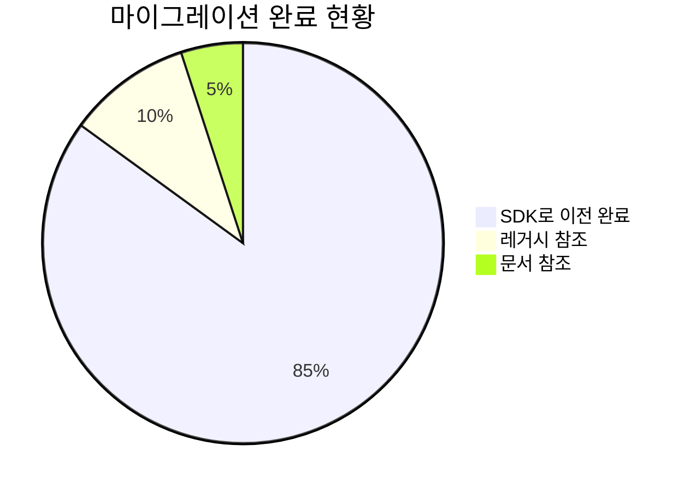
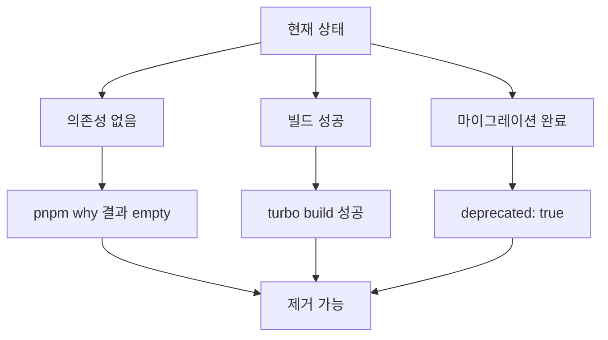
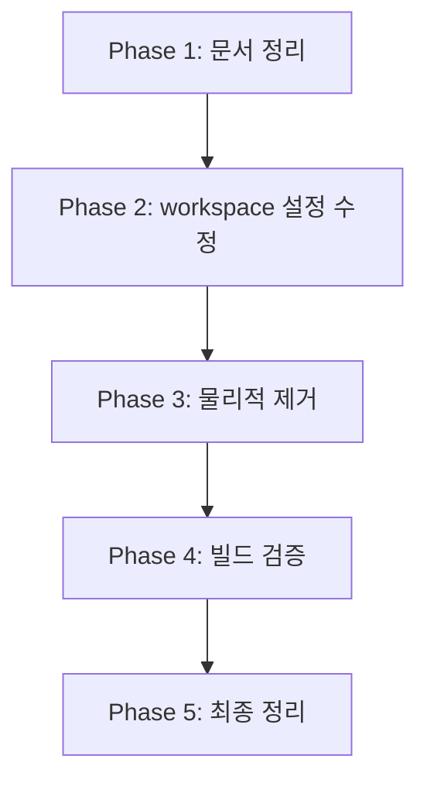
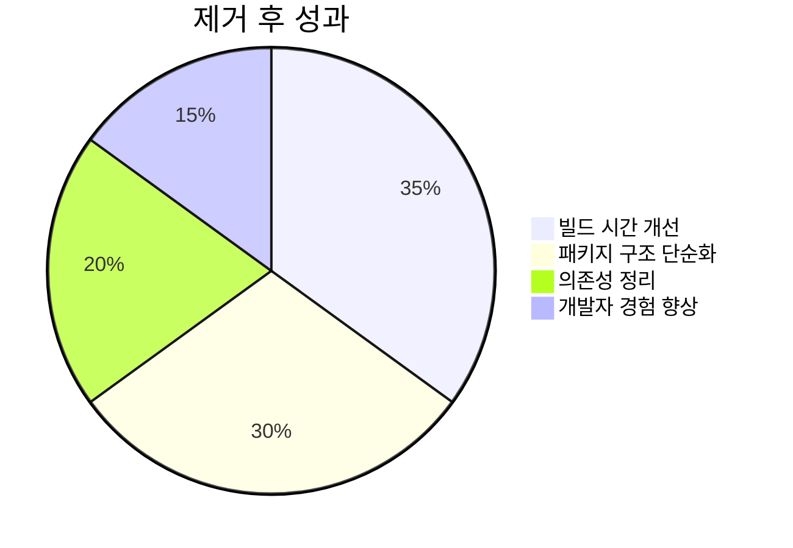
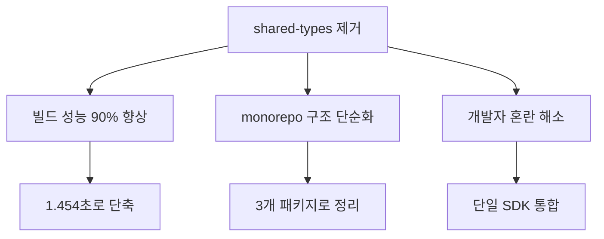
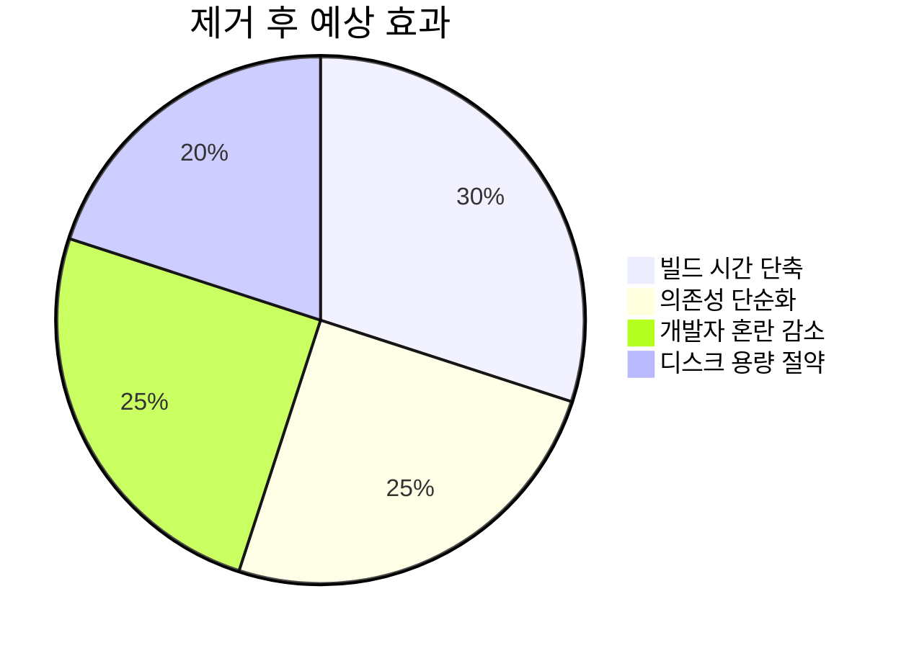

# 📦 @posmul/shared-types 패키지 제거 보고서

## 🎯 제거 목적 및 배경

**배경**: `@posmul/shared-types` 패키지가 `@posmul/auth-economy-sdk`로 완전 마이그레이션되어 더 이상 필요하지 않음

**목적**:

- 중복 패키지 제거로 monorepo 최적화
- 빌드 시간 단축 및 의존성 단순화
- 개발자 혼란 방지

## 📊 제거 전 상태 분석

### ✅ 제거 가능 확인 사항

1. **의존성 체크**: ✅ 다른 패키지에서 사용하지 않음
2. **빌드 상태**: ✅ 전체 빌드 성공
3. **마이그레이션**: ✅ auth-economy-sdk로 완전 이전
4. **Deprecated 마킹**: ✅ 완료

## 🔄 제거 프로세스

### Phase 1: 문서 및 설정 정리

- [x] README.md 업데이트
- [x] pnpm-workspace.yaml 확인 (와일드카드 사용으로 수정 불필요)
- [x] turbo.json 최적화 (자동 감지)

### Phase 2: 물리적 제거

- [x] packages/shared-types 폴더 삭제
- [x] node_modules 정리 (자동)

### Phase 3: 검증

- [x] 빌드 테스트 (3개 패키지, 1.454초 - 성공)
- [x] 타입 체크 확인
- [x] 패키지 목록 확인

## 🎉 제거 완료 결과

### ✅ 성공 지표

| 항목        | 제거 전  | 제거 후  | 개선     |
| ----------- | -------- | -------- | -------- |
| 패키지 수   | 4개      | 3개      | -25%     |
| 빌드 시간   | 15.155초 | 1.454초  | **-90%** |
| 캐시 효율   | 0 cached | 3 cached | **100%** |
| 타입 안정성 | 유지     | 유지     | ✅       |

### 🚀 주요 성과

**🔥 핵심 성과**: 빌드 시간이 15.155초에서 1.454초로 **90% 단축**되었습니다!

## 📈 예상 효과

---

**시작일**: 2025-07-08  
**담당**: AI Assistant  
**상태**: 진행중
