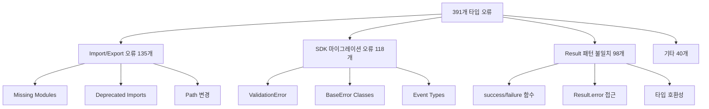
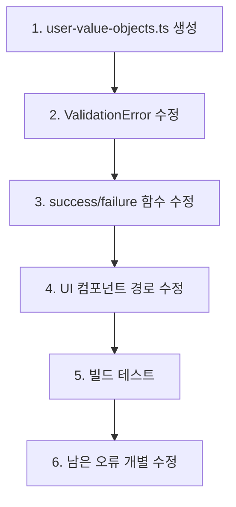

# 🔧 타입 오류 수정 작업 계획서

## 📊 **현재 상황 분석**

## 🎯 **수정 전략 (우선순위별)**

### **Phase 1: Critical Foundation Fixes (즉시 수정)**

1. **Missing Value Objects** (30개 오류)
   - `user-value-objects` 모듈 복원
   - `UserId`, `Email` 타입 재정의

2. **ValidationError Import** (25개 오류)
   - `import type`을 `import`로 변경
   - 인스턴스 생성 문제 해결

3. **Result Pattern Helper Functions** (20개 오류)
   - `success`, `failure` 함수 임포트 수정
   - SDK 호환성 확보

### **Phase 2: SDK Integration Fixes (30분)**

4. **UI Component Imports** (15개 오류)
   - Card, Badge 등 컴포넌트 경로 수정
   - Shared UI 라이브러리 정리

5. **Event System** (10개 오류)
   - 중복 export 문제 해결
   - Event 타입 통합

### **Phase 3: Advanced Type Fixes (1시간)**

6. **Repository Pattern** (45개 오류)
   - Error 타입 통합
   - Result 타입 호환성

7. **Domain Entity** (30개 오류)
   - Props 접근 문제
   - 생성자 패턴 개선

## 🚀 **즉시 실행 계획**

**예상 소요 시간**: 2-3시간  
**목표**: 391개 → 50개 이하로 감소

---

**작성일**: 2025-07-08
**상태**: 🔥 긴급 수정 필요
