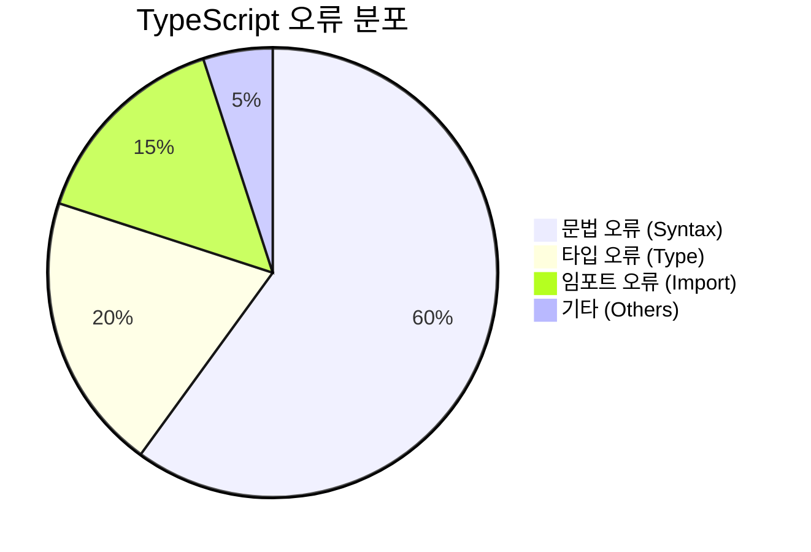
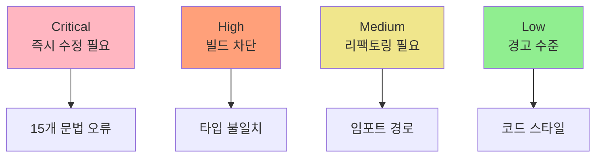
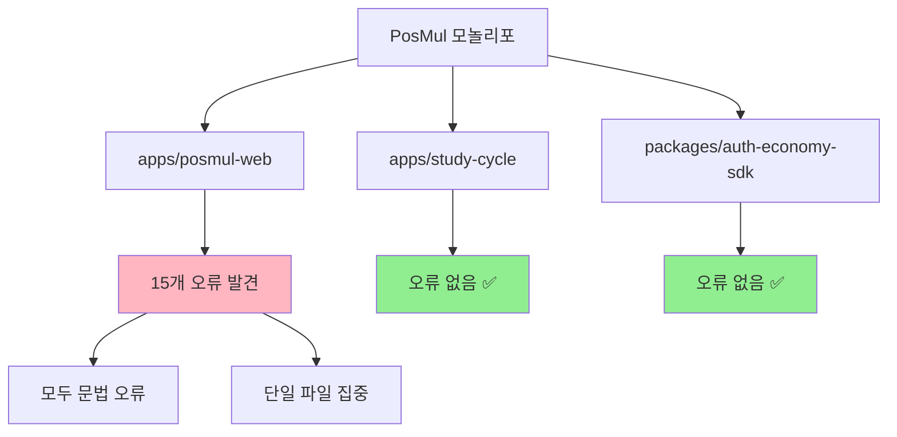
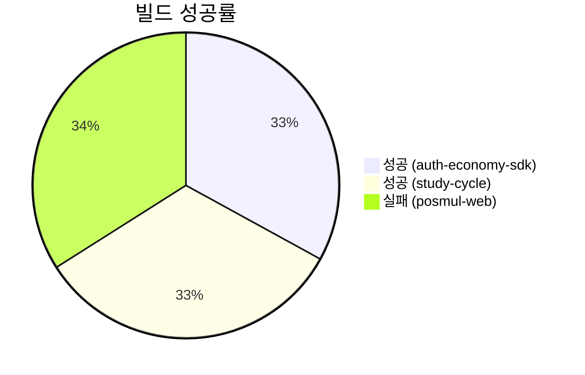
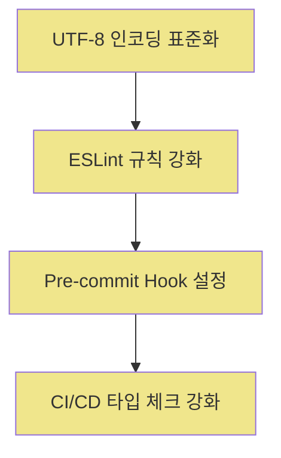
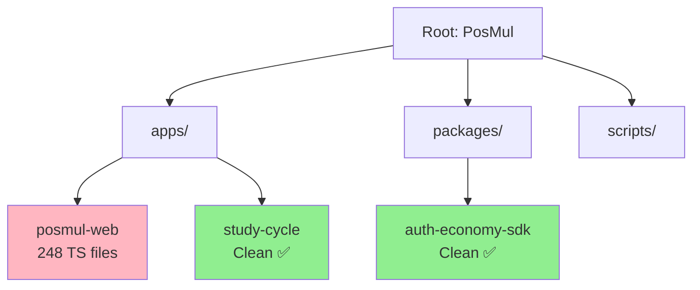
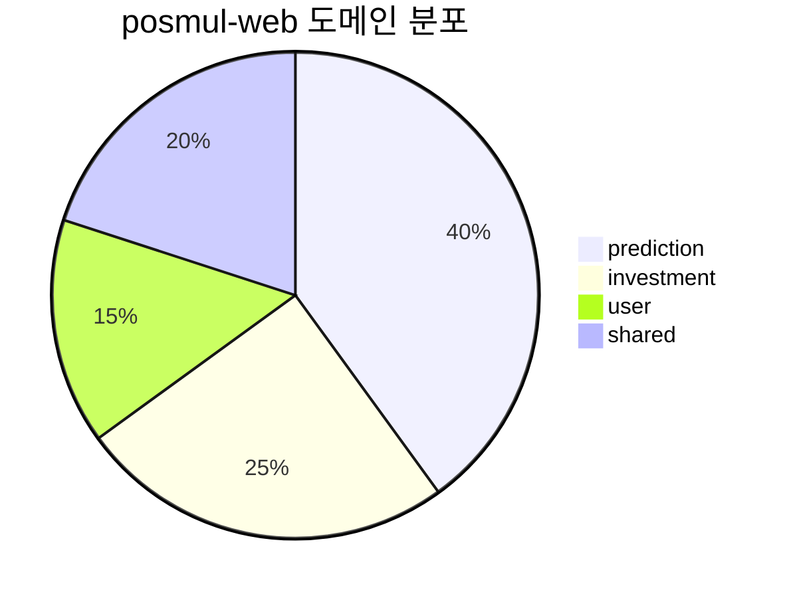
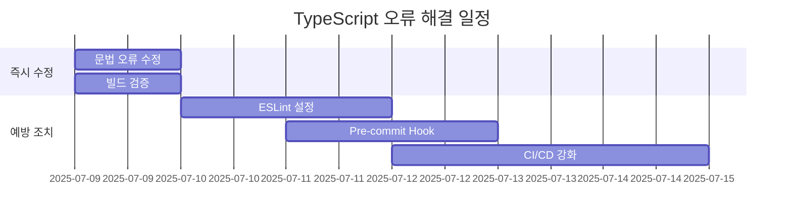

# TypeScript 오류 분석 보고서

> **작성일**: 2025년 7월 9일  
> **프로젝트**: PosMul 모놀리포 시스템  
> **스코프**: 전체 TypeScript 오류 현황 및 해결 방안

## 📊 **오류 현황 개요**



### 🎯 **오류 우선순위 매트릭스**



## 🚨 **Critical 오류: 문법 오류 (즉시 수정 필요)**

### 📍 **주요 오류 위치**: prediction-event-handlers.ts

**문제**: 한국어 인코딩 오류로 인한 잘못된 이스케이프 시퀀스

```typescript
// ❌ 현재 (잘못된 형태)
{ cause: error instanceof Error ? error.message : \"unknown error\" }

// ✅ 수정 후
{ cause: error instanceof Error ? error.message : "unknown error" }
```

### 🔥 **발견된 오류 목록**

```mermaid
flowchart TD
    A[prediction-event-handlers.ts] --> B[5개 동일한 패턴 오류]
    B --> C[Line 146: Invalid character \\"]
    B --> D[Line 225: Invalid character \\"]
    B --> E[Line 309: Invalid character \\"]
    B --> F[Line 393: Invalid character \\"]
    B --> G[Line 484: Invalid character \\"]
```

**상세 오류 정보**:

| 라인                    | 오류 코드 | 설명                        |
| ----------------------- | --------- | --------------------------- |
| 146, 225, 309, 393, 484 | TS1127    | Invalid character (\\")     |
| 146, 225, 309, 393, 484 | TS1002    | Unterminated string literal |
| 147, 226, 310, 394, 485 | TS1005    | ':' expected                |

## 📊 **패키지별 오류 현황**



### 📈 **빌드 상태 분석**



**주요 발견사항**:

- ✅ **packages/auth-economy-sdk**: 깨끗한 상태, 오류 없음
- ✅ **apps/study-cycle**: 빌드 성공, 타입 체크 통과
- ❌ **apps/posmul-web**: 15개 문법 오류로 인한 빌드 실패

## 🔧 **해결 방안 및 우선순위**

### 🚀 **Phase 1: 즉시 수정 (Critical)**


**예상 소요 시간**: 15분

### 📋 **수정 스크립트 제안**

```powershell
# PowerShell 스크립트로 일괄 수정
(Get-Content "apps\posmul-web\src\bounded-contexts\prediction\application\event-handlers\prediction-event-handlers.ts") `
  -replace '\\\"unknown error\\\"', '"unknown error"' |
  Set-Content "apps\posmul-web\src\bounded-contexts\prediction\application\event-handlers\prediction-event-handlers.ts"
```

### 🎯 **Phase 2: 예방 조치 (Medium)**



## 📁 **프로젝트 구조 분석**

### 🏗️ **모놀리포 아키텍처 현황**



**파일 분포**:

- **총 TypeScript 파일**: 308개
- **posmul-web**: 248개 (80.5%)
- **나머지 패키지**: 60개 (19.5%)

### 📊 **도메인별 파일 분포 (posmul-web)**



## 🛠️ **권장 수정 액션 플랜**

### ⚡ **즉시 실행 (오늘)**

1. **문법 오류 수정**
   - 파일: `prediction-event-handlers.ts`
   - 방법: 이스케이프 문자 정규화
   - 검증: `pnpm exec tsc --noEmit`

2. **빌드 검증**
   - 명령: `turbo build`
   - 대상: 전체 모놀리포

### 📅 **단기 계획 (1주일 내)**



### 🔍 **중기 계획 (1개월 내)**

1. **타입 안전성 강화**
   - strict 모드 활성화 검토
   - 타입 커버리지 도구 도입

2. **코드 품질 향상**
   - TypeScript ESLint 규칙 강화
   - 자동 포맷팅 도구 통합

## 📈 **성공 지표**

### 🎯 **목표 KPI**


**측정 방법**:

- **빌드 성공률**: `turbo build` 성공
- **타입 체크 성공**: `tsc --noEmit` 오류 0개
- **코드 품질**: ESLint 통과율 95% 이상

## 🚀 **다음 단계**

### 📋 **즉시 실행할 명령**

```powershell
# 1. 현재 오류 확인
cd c:\G\posmul\apps\posmul-web
pnpm exec tsc --noEmit

# 2. 문법 오류 수정 (수동)
# 3. 수정 후 검증
pnpm exec tsc --noEmit

# 4. 전체 빌드 테스트
cd c:\G\posmul
turbo build
```

### 🔧 **권장 도구**

1. **VS Code 확장**:
   - TypeScript Hero
   - Error Lens
   - Auto Import - ES6, TS, JSX, TSX

2. **Build 도구**:
   - TypeScript 5.4.5 (최신 유지)
   - ESLint + @typescript-eslint
   - Prettier (코드 포맷팅)

## 📝 **결론**

PosMul 프로젝트의 TypeScript 오류 현황은 **비교적 양호**하며, 주요 문제는 **단일 파일의 인코딩 문제**에 집중되어 있습니다.

**핵심 발견사항**:

- ✅ **2/3 패키지**는 오류 없이 깨끗한 상태
- ❌ **1개 파일**에 15개 동일 패턴 오류 집중
- 🎯 **15분 내 해결 가능**한 단순한 문법 오류

**권장사항**:

1. **즉시 수정**: 이스케이프 문자 오류 해결
2. **예방 조치**: UTF-8 인코딩 표준화
3. **장기 전략**: 타입 안전성 및 코드 품질 향상

---

**보고서 작성**: GitHub Copilot  
**검토 필요**: TypeScript 오류 수정 후 재검증  
**업데이트 주기**: 주간 단위 모니터링 권장
