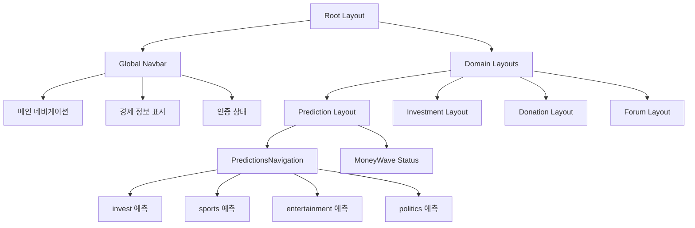
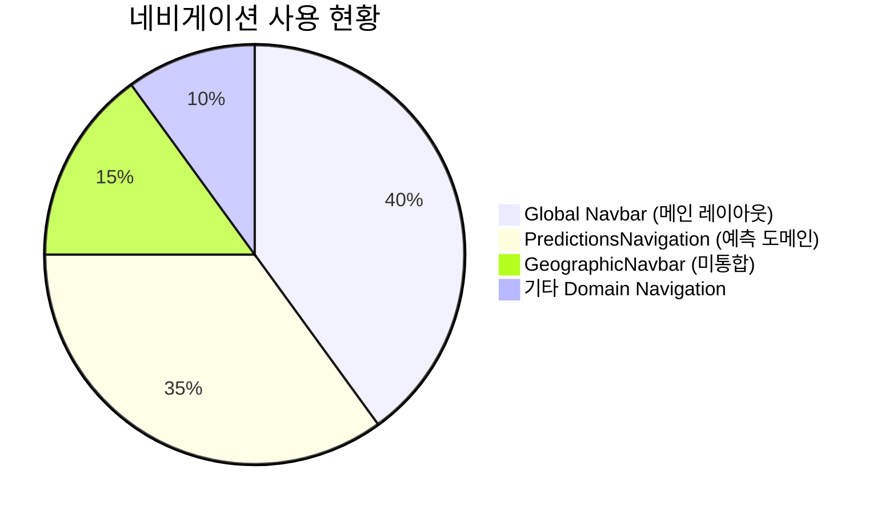

# PosMul 네비게이션 시스템 현황 분석

## 🎯 **현재 네비게이션 아키텍처**

### 📊 **네비게이션 레이어 구조**



### 🔧 **현재 구현된 컴포넌트들**

#### 1. **Global Navigation (새로 구현)**

- **위치**: `src/shared/ui/components/layout/Navbar.tsx`
- **기능**:
  - ✅ 3-level 고정 네비게이션 (예측/투자/기부/포럼)
  - ✅ Unlock 로직 (진행도 표시, 잠금 상태)
  - ✅ 경제 정보 표시 (PMP/PMC)
  - ✅ 드롭다운 메뉴
  - ✅ 다크모드 지원

#### 2. **Geographic Navigation (새로 구현)**

- **위치**: `src/shared/ui/components/layout/GeographicNavbar.tsx`
- **기능**:
  - ✅ 지역 선택 드롭다운
  - ✅ 지역별 퀵 링크
  - ✅ 지역 정보 요약

#### 3. **Domain-Specific Navigation (기존)**

- **PredictionsNavigation**: 예측 도메인 전용
- **위치**: `src/bounded-contexts/prediction/presentation/components/PredictionsNavigation.tsx`
- **기능**: 3-tier 예측 카테고리 네비게이션

### 💡 **사용 현황**



## 🚨 **현재 문제점**

### ❌ **중복 네비게이션**

1. **Global Navbar**: 메인 도메인 간 이동
2. **PredictionsNavigation**: 예측 서브카테고리 이동
3. **GeographicNavbar**: 지역 기반 네비게이션 (미통합)

### 📋 **해결 방안**

#### Option 1: **계층적 통합** (권장)

```
Root Layout
├── Global Navbar (도메인 레벨)
├── Geographic Navbar (지역 레벨)
└── Domain Layout
    └── Domain Navigation (서브카테고리 레벨)
```

#### Option 2: **완전 교체**

- PredictionsNavigation 제거
- Global Navbar에 모든 기능 통합

## 🎯 **즉시 적용 가능한 개선사항**

### 1. **GeographicNavbar 메인 레이아웃 통합**

현재 상태:

```tsx
// src/app/layout.tsx
<Navbar economicBalance={mockEconomicBalance} isAuthenticated={false} />
```

제안하는 변경:

```tsx
// src/app/layout.tsx
<>
  <Navbar economicBalance={mockEconomicBalance} isAuthenticated={false} />
  <GeographicNavbar selectedRegion="seoul" />
</>
```

### 2. **Unlock 로직 활성화**

현재는 mockEconomicBalance를 사용하고 있으므로, 실제 unlock 상태를 반영하도록 수정 가능

## ✅ **완료된 작업**

- [x] Global Navbar 리팩토링 (Unlock 로직, 드롭다운)
- [x] GeographicNavbar 신규 구현
- [x] 개발 서버 정상 실행 확인
- [x] TypeScript 오류 해결
- [x] @heroicons/react 설치

## 🔄 **다음 단계**

1. **즉시 실행**: GeographicNavbar를 메인 레이아웃에 통합
2. **중기**: Domain Navigation과의 역할 분담 정리
3. **장기**: DB 연동하여 실제 unlock 로직 구현
