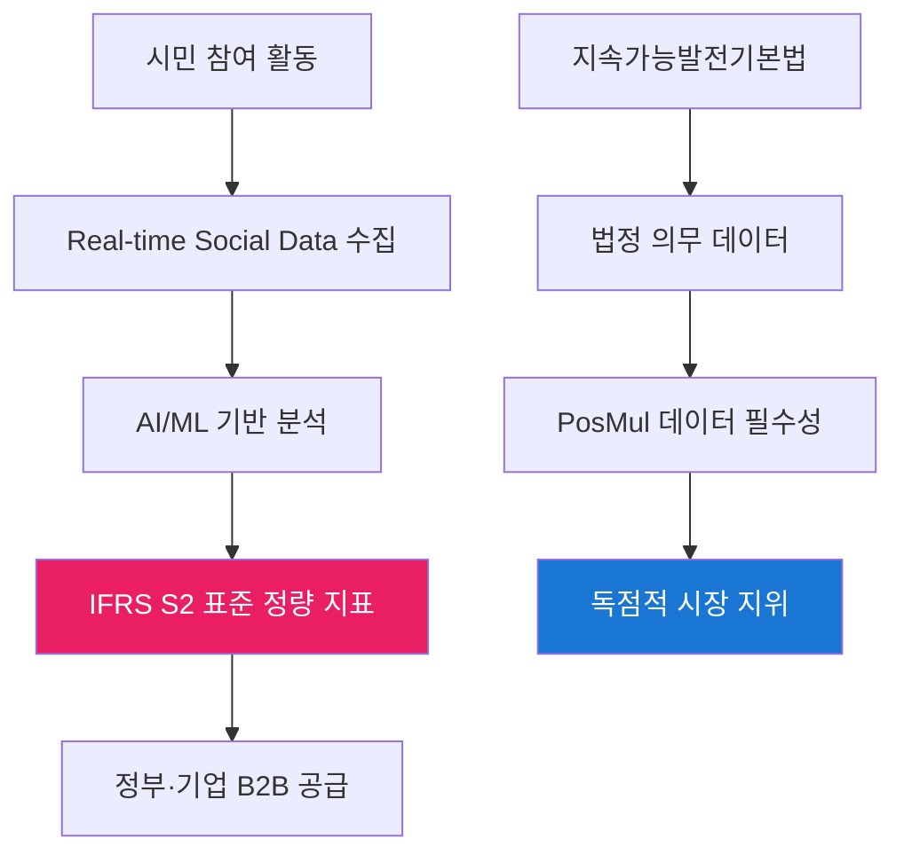
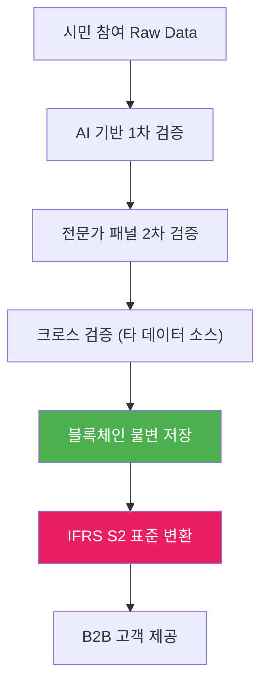

# PosMul ESG BigData 플랫폼 전략 보고서

> **제목**: PosMul → ESG Social Framework 정량 데이터 공급 플랫폼 전환 전략  
> **대상**: 정부·기업 B2B 시장  
> **기준**: 지속가능발전기본법 + IFRS S2 ESG Social Framework  
> **작성일**: 2025년 7월 20일

## 🎯 **전략 개요**

### **핵심 아이디어**

**PosMul 플랫폼을 "시민 참여 기반 ESG Social 데이터 생산·분석·공급 허브"로 전환**



## 📊 **시장 기회 분석**

### **1. 시장 규모 및 성장성**

#### **글로벌 ESG 데이터 시장**

- **2024년 시장 규모**: $1.2조 USD
- **연평균 성장률**: 15.2% (2024-2030)
- **예상 2030년 규모**: $2.8조 USD

#### **한국 ESG 의무 공시 시장**

```
지속가능발전기본법 (2022) → ESG 의무 공시 확대
IFRS S2 (2024 도입) → Social Framework 정량 데이터 필수
K-ESG 가이드라인 → 사회적 가치 측정 의무화

→ 연간 추정 시장: 3,000억원 (2025년 기준)
```

### **2. 경쟁 환경 분석**

| 구분              | 기존 ESG 데이터 업체        | **PosMul 차별화**                   |
| ----------------- | --------------------------- | ----------------------------------- |
| **데이터 소스**   | 기업 자체 보고서, 공개 정보 | **시민 직접 참여 Real-time 데이터** |
| **정확성**        | 기업 편향 가능성            | **독립적 시민 검증 시스템**         |
| **실시간성**      | 분기별/연간 업데이트        | **일일 실시간 모니터링**            |
| **사회적 신뢰도** | 낮음-중간                   | **매우 높음 (시민 직접 생산)**      |
| **법적 근거**     | 민간 자율 기준              | **지속가능발전기본법 기반**         |

## 🏛️ **법적 프레임워크 활용 전략**

### **1. 지속가능발전기본법 연계**

#### **법적 근거 (제28조 지속가능발전 지표)**

```
"정부는 지속가능발전 목표의 이행 상황을 점검·평가하기 위하여
지속가능발전 지표를 개발·활용하여야 한다"

→ PosMul = 정부 법정 의무 이행을 위한 필수 데이터 공급자
```

#### **PosMul 데이터의 법적 가치**

- **사회적 참여 지표**: 시민 직접 민주주의 참여도
- **투명성 지표**: 예산 집행 투명성 실시간 모니터링
- **사회적 신뢰 지표**: 기부·사회공헌 활동 정량 측정
- **혁신 지표**: 예측 게임을 통한 사회적 학습 효과

### **2. IFRS S2 Social Framework 대응**

#### **IFRS S2 요구 사항**

```typescript
// IFRS S2 Social 정량 지표 예시
interface IFRS_S2_Social_Metrics {
  employeeWellbeing: number; // 직원 복지 지수
  communityImpact: number; // 지역사회 영향도
  socialInnovation: number; // 사회혁신 기여도
  stakeholderEngagement: number; // 이해관계자 참여도
  humanRightsCompliance: number; // 인권 준수 수준
}
```

#### **PosMul 제공 가능 데이터**

```typescript
// PosMul이 생산하는 IFRS S2 호환 데이터
interface PosMulESGData {
  // 1. 사회적 참여 (Community Impact)
  citizenParticipation: {
    forumDebateParticipants: number;
    policyPredictionAccuracy: number;
    budgetTransparencyScore: number;
  };

  // 2. 사회적 혁신 (Social Innovation)
  socialLearningIndex: {
    predictionGameLearningCurve: number;
    collectiveIntelligenceScore: number;
    democraticDecisionMakingEfficiency: number;
  };

  // 3. 이해관계자 참여 (Stakeholder Engagement)
  stakeholderEngagement: {
    donationTransparencyLevel: number;
    opinionLeaderInfluenceIndex: number;
    crossSectorCollaborationScore: number;
  };

  // 4. 사회적 가치 창출 (Social Value Creation)
  socialValueMetrics: {
    ironTriangleDisruptionIndex: number;
    publicGoodContributionScore: number;
    socialWelfareImprovementRate: number;
  };
}
```

## 🎯 **B2B 사업 모델 설계**

### **1. 정부 대상 B2G 모델**

#### **서비스 제품군**

```
📊 Real-time Social Dashboard
- 지자체별 시민 참여 지수 실시간 모니터링
- 정책 예측 정확도 및 시민 만족도 추적
- 예산 투명성 및 Iron Triangle 해체 진행률

📈 Policy Impact Analytics
- 정책 시행 전후 사회적 영향 분석
- 시민 예측 vs 실제 결과 비교 리포트
- 정책 개선 권고사항 AI 생성

📋 ESG Compliance Dashboard
- 지속가능발전기본법 의무 지표 자동 생성
- K-ESG 평가를 위한 사회적 가치 정량화
- 국정감사용 투명성 보고서 자동 작성
```

#### **가격 모델**

- **기본 패키지**: 월 5,000만원 (광역지자체)
- **프리미엄 패키지**: 월 8,000만원 (중앙정부 부처)
- **통합 솔루션**: 월 1.5억원 (전국 통합 대시보드)

### **2. 기업 대상 B2B 모델**

#### **서비스 제품군**

```
🎯 ESG Social Score Platform
- IFRS S2 기준 Social Framework 자동 측정
- 업종별 벤치마킹 및 개선점 분석
- 투자자 대상 ESG 리포트 자동 생성

🔍 Social Risk Monitoring
- 사회적 갈등 조기 경보 시스템
- 브랜드 평판 리스크 실시간 감지
- Crisis Communication 전략 AI 권고

💡 Social Innovation Consulting
- 시민 아이디어 크라우드소싱 플랫폼
- 사회적 가치 창출 프로젝트 기획
- ESG 투자 유치를 위한 데이터 패키지
```

#### **가격 모델**

- **스타트업**: 월 500만원
- **중견기업**: 월 2,000만원
- **대기업**: 월 5,000만원
- **글로벌 기업**: 월 1억원

## 🔧 **필요한 개선사항**

### **1. 기술 인프라 강화**

#### **현재 상태 vs 목표 상태**

```typescript
// 현재: 시민 참여 플랫폼
interface CurrentPosMul {
  userParticipation: "6개 모듈 기반";
  dataCollection: "기본적 활동 로그";
  analysis: "간단한 통계";
  export: "CSV/JSON 기본 형태";
}

// 목표: Enterprise급 ESG 데이터 플랫폼
interface TargetESGPlatform {
  realTimeProcessing: "초당 10만건 이벤트 처리";
  aiAnalytics: "GPT-4 급 분석 엔진";
  compliance: "IFRS S2 자동 매핑";
  api: "Enterprise급 REST/GraphQL API";
  security: "금융권 수준 보안";
  sla: "99.9% 가용성 보장";
}
```

#### **필요한 기술 투자**

```
🏗️ 인프라 확장
- AWS/Azure 멀티 클라우드 구축: 20억원
- Kubernetes 기반 마이크로서비스: 15억원
- 실시간 데이터 파이프라인 (Kafka, Spark): 10억원

🤖 AI/ML 플랫폼
- ESG 분석 전용 AI 모델 개발: 30억원
- 자연어 처리 (NLP) 엔진: 15억원
- 예측 분석 (Forecasting) 모델: 20억원

🔒 보안 및 컴플라이언스
- ISO 27001, SOC 2 인증: 5억원
- 개인정보보호 강화: 10억원
- 블록체인 기반 데이터 무결성: 8억원

→ 총 필요 투자: 133억원 (2년간)
```

### **2. 데이터 품질 및 신뢰성 강화**

#### **데이터 검증 체계**



#### **데이터 품질 KPI**

- **정확도**: 95% 이상 (외부 검증 기관 감사)
- **실시간성**: 15분 이내 업데이트
- **완전성**: 99% 이상 데이터 커버리지
- **일관성**: 표준 편차 5% 이내

### **3. 법적·제도적 기반 구축**

#### **필요한 인증 및 승인**

```
🏛️ 정부 승인
- 개인정보보호위원회 승인
- 금융감독원 ESG 데이터 제공기관 등록
- 환경부 지속가능발전 공식 파트너 지정

🌍 국제 인증
- IFRS Foundation 파트너십
- UN SDGs 공식 데이터 제공기관
- GRI Standards 호환성 인증

📋 업계 표준
- ISO 14001 (환경경영시스템)
- ISO 26000 (사회적 책임 가이드라인)
- SA 8000 (사회적 책임 국제 표준)
```

### **4. 조직 역량 강화**

#### **필요 인력 충원**

```
📊 데이터 사이언스팀 (30명)
- Chief Data Officer (CDO)
- 시니어 데이터 사이언티스트 10명
- ML 엔지니어 10명
- 데이터 엔지니어 10명

🏛️ ESG 컨설팅팀 (20명)
- ESG 전문 컨설턴트 10명
- IFRS/K-IFRS 회계사 5명
- 지속가능경영 전문가 5명

💼 B2B 영업팀 (15명)
- B2G 영업 전문가 8명
- 대기업 담당 Account Manager 7명

→ 총 인력: 65명 추가 (연간 인건비 130억원)
```

## 💰 **재무 계획 및 ROI**

### **투자 계획 (3년간)**

```
Year 1 (2025): 80억원
- 기술 인프라: 50억원
- 인력 충원: 20억원
- 마케팅/영업: 10억원

Year 2 (2026): 70억원
- 기술 고도화: 30억원
- 조직 확장: 25억원
- 국제 진출: 15억원

Year 3 (2027): 50억원
- R&D 지속: 20억원
- 글로벌 확장: 20억원
- 예비비: 10억원

→ 총 투자: 200억원
```

### **매출 예측**

```
Year 1 (2025): 50억원
- 정부 계약: 30억원 (5개 지자체)
- 기업 계약: 20억원 (20개 기업)

Year 2 (2026): 180억원
- 정부 계약: 100억원 (전국 확산)
- 기업 계약: 80억원 (100개 기업)

Year 3 (2027): 400억원
- 국내: 250억원
- 해외: 150억원 (동남아 진출)

→ 3년 누적: 630억원
→ ROI: 315% (3년간)
```

## 🎯 **실행 로드맵**

### **Phase 1: 기반 구축 (6개월)**

```
Month 1-2: 기술 아키텍처 설계
- Enterprise급 인프라 설계
- IFRS S2 매핑 알고리즘 개발

Month 3-4: 핵심 인력 충원
- CDO 및 데이터팀 구성
- ESG 컨설팅팀 설립

Month 5-6: MVP 개발
- 정부/기업용 대시보드 프로토타입
- 파일럿 고객 확보 (2-3곳)
```

### **Phase 2: 상용화 (6개월)**

```
Month 7-9: 제품 완성
- 정식 ESG 데이터 플랫폼 런칭
- IFRS S2 완전 호환 달성

Month 10-12: 시장 진입
- 첫 B2G 계약 체결 (서울시)
- 대기업 파일럿 프로젝트 시작
```

### **Phase 3: 스케일업 (12개월)**

```
Year 2: 전국 확산
- 전국 17개 광역지자체 진출
- 코스피 200 기업 대상 영업

Year 3: 글로벌 진출
- 동남아시아 진출 (싱가포르, 말레이시아)
- EU CSRD 대응 제품 개발
```

## 🔍 **리스크 분석 및 대응 방안**

### **주요 리스크**

```
⚠️ 기술적 리스크
- AI 모델 편향성 문제
- 대용량 데이터 처리 한계
→ 대응: 외부 AI 전문기업 파트너십

⚠️ 시장 리스크
- 기존 ESG 업체 견제
- 정부 정책 변경
→ 대응: 법적 독점 지위 확보

⚠️ 재무 리스크
- 초기 투자 회수 지연
- 고객 이탈
→ 대응: 단계적 투자, SaaS 모델
```

## 🚀 **성공 요인**

### **1. 독점적 경쟁 우위**

- **시민 직접 참여 데이터**: 기존 업체 모방 불가
- **법적 근거**: 지속가능발전기본법 기반 필수성
- **실시간성**: 타 업체 대비 압도적 속도

### **2. 강력한 네트워크 효과**

- 사용자 증가 → 데이터 품질 향상 → 고객 가치 증대
- Metcalfe's Law 적용: 가치 = n²

### **3. 정부 정책 지원**

- ESG 의무 공시 확대 정책
- 디지털 뉴딜 정책 부합
- 사회적 가치 중시 정부 기조

## 📊 **결론 및 권고사항**

### **핵심 결론**

**PosMul → ESG BigData 플랫폼 전환은 매우 실현 가능하고 수익성 높은 전략입니다.**

### **즉시 착수 권고 사항**

1. **CDO 영입**: 3개월 내 최우선 추진
2. **정부 파트너십**: 환경부·행안부와 MOU 체결
3. **기술 투자**: AI/ML 플랫폼 구축 착수
4. **파일럿 프로젝트**: 서울시·경기도와 시범 사업

### **5년 후 비전**

**"PosMul = 글로벌 ESG Social 데이터의 Netflix"**

- 전 세계 정부·기업이 의존하는 필수 플랫폼
- 연매출 1조원 규모 달성
- 사회적 가치와 경제적 성과 동시 실현

---

**이 전략은 PosMul을 단순한 시민 참여 플랫폼에서 글로벌 ESG 데이터 인프라로 도약시킬 수 있는 혁신적 전환점이 될 것입니다.**
