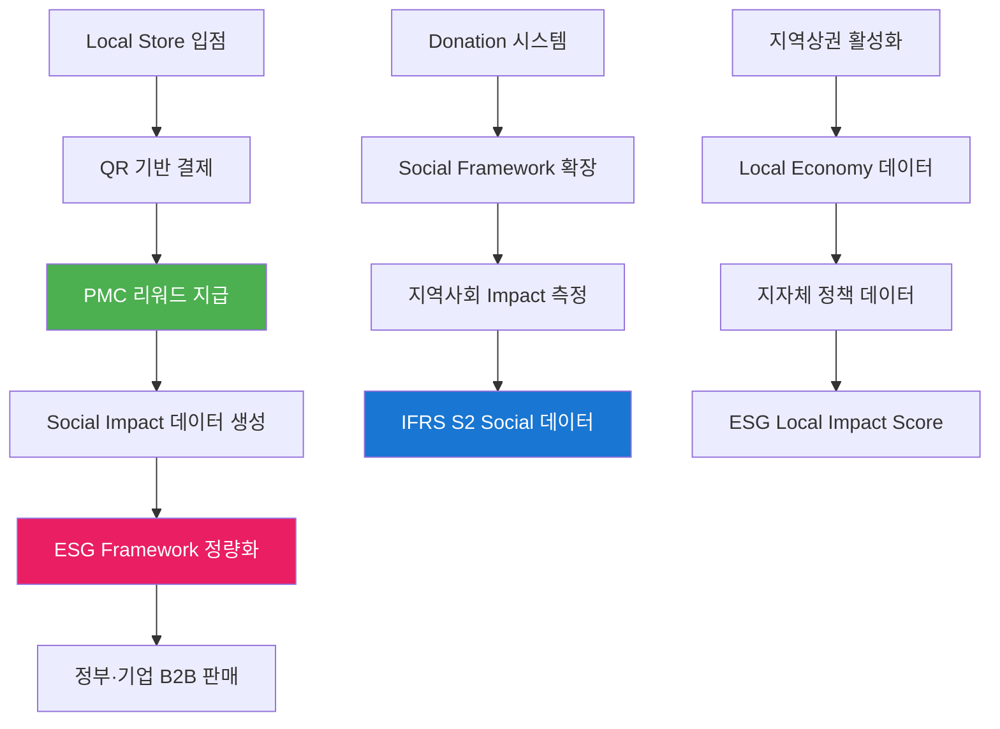

# PosMul Local Commerce & ESG 생태계 통합 전략

> **제목**: PosMul 지역상권 기반 ESG 데이터 생태계 구축 전략  
> **차별화**: 배달의민족 대비 Local Store 전용 + QR 결제 + PMC 리워드  
> **목표**: Local Commerce + ESG Social Framework + BigData 플랫폼 통합  
> **작성일**: 2025년 7월 20일

## 🎯 **통합 생태계 비전**

### **핵심 아이디어**
**"지역상권 중심의 ESG 데이터 생산 생태계" = Local Store + QR Payment + PMC Rewards + Social Impact Measurement**



## 🏪 **Local Store 차별화 전략**

### **1. 배달의민족 vs PosMul 비교**

| 구분 | 배달의민족 | **PosMul Local** |
|------|------------|-----------------|
| **입점 대상** | 모든 음식점 + 대형 프랜차이즈 | **Local Store 전용** (개인 상점, 지역 브랜드) |
| **결제 방식** | 앱 내 카드 결제 | **QR 기반 현장 결제** + PMC 토큰 |
| **수수료** | 6-15% 높은 수수료 | **3-5% 낮은 수수료** + ESG 데이터 제공 |
| **마케팅** | 광고비 기반 노출 | **ESG Score 기반 추천** + 시민 참여 홍보 |
| **데이터 활용** | 배달 최적화 | **ESG Social Framework 데이터 생산** |
| **사회적 가치** | 편의성 중심 | **지역경제 순환 + 사회적 영향 측정** |

### **2. Local Store 입점 기준**

#### **입점 가능 업체**
```typescript
interface LocalStoreEligibility {
  // ✅ 입점 가능
  eligibleTypes: [
    "개인 운영 카페/식당",
    "지역 특산품 판매점", 
    "로컬 브랜드 매장",
    "사회적 기업",
    "마을 기업",
    "협동조합 운영 매장",
    "1-2호점 소규모 체인"
  ],
  
  // ❌ 입점 불가
  excludedTypes: [
    "대형 프랜차이즈 (맥도날드, 스타벅스 등)",
    "대기업 계열사 운영 매장",
    "10호점 이상 체인점",
    "온라인 전용 업체"
  ]
}
```

#### **ESG 기준 평가**
```typescript
interface LocalStoreESGCriteria {
  socialImpact: {
    localEmployment: number,        // 지역 주민 고용률
    communityContribution: number,  // 지역사회 기여도
    culturalPreservation: number    // 지역 문화 보존도
  },
  
  environmentalImpact: {
    sustainablePractices: number,   // 친환경 운영
    localSourcing: number,          // 지역 식재료 사용
    wasteReduction: number          // 폐기물 감축
  },
  
  governance: {
    transparency: number,           // 운영 투명성
    fairTrade: number,             // 공정거래 준수
    workerRights: number           // 직원 권익 보호
  }
}
```

## 📱 **QR 결제 + PMC 리워드 시스템**

### **1. QR 결제 플로우**

```mermaid
sequenceTitle: PosMul QR 결제 플로우
participant 고객
participant QR코드
participant PosMul앱
participant 가맹점
participant 은행
participant PMC시스템

고객->>QR코드: QR 코드 스캔
QR코드->>PosMul앱: 결제 정보 전송
PosMul앱->>고객: 결제 금액 확인
고객->>PosMul앱: 결제 승인
PosMul앱->>은행: 카드/계좌 결제 처리
은행->>PosMul앱: 결제 완료
PosMul앱->>가맹점: 결제 완료 알림
PosMul앱->>PMC시스템: PMC 리워드 지급
PMC시스템->>고객: PMC 적립 완료
```

### **2. PMC 리워드 구조**

#### **기본 리워드 시스템**
```typescript
interface PMCRewardSystem {
  // 1. 기본 적립
  baseReward: {
    rate: "결제 금액의 1-3%",
    calculation: "localStore.esgScore * 0.01 * paymentAmount"
  },
  
  // 2. ESG 보너스
  esgBonus: {
    highESGScore: "추가 1% (ESG Score 90 이상)",
    socialEnterprise: "추가 2% (사회적 기업)",
    localSourcing: "추가 0.5% (지역 식재료 80% 이상)"
  },
  
  // 3. 활동 보너스  
  activityBonus: {
    firstVisit: "1000 PMC (첫 방문)",
    reviewWriting: "500 PMC (리뷰 작성)",
    photoSharing: "300 PMC (사진 공유)",
    friendRecommendation: "2000 PMC (지인 추천)"
  }
}
```

#### **PMC 지급 알고리즘**
```typescript
function calculatePMCReward(
  paymentAmount: number,
  storeESGScore: number,
  userActivity: UserActivity
): number {
  // 기본 적립률 (ESG 점수 기반)
  const baseRate = Math.min(storeESGScore / 100 * 0.03, 0.03)
  const baseReward = paymentAmount * baseRate
  
  // ESG 보너스
  let esgBonus = 0
  if (storeESGScore >= 90) esgBonus += paymentAmount * 0.01
  if (store.isSocialEnterprise) esgBonus += paymentAmount * 0.02
  
  // 활동 보너스
  let activityBonus = 0
  if (userActivity.firstVisit) activityBonus += 1000
  if (userActivity.reviewWritten) activityBonus += 500
  
  return Math.floor(baseReward + esgBonus + activityBonus)
}
```

## 💝 **Donation 기반 Social Framework 확장**

### **1. Social Impact 측정 체계**

#### **Donation Impact Categories**
```typescript
interface SocialFrameworkCategories {
  // 1. 지역사회 발전
  communityDevelopment: {
    localInfrastructure: "지역 인프라 개선",
    educationSupport: "교육 지원 프로그램", 
    culturePreservation: "지역 문화 보존",
    youthPrograms: "청년 창업 지원"
  },
  
  // 2. 사회적 약자 지원
  socialWelfare: {
    elderlySupport: "독거노인 돌봄",
    disabilitySupport: "장애인 지원",
    childWelfare: "아동 복지",
    refugeeSupport: "난민/이주민 지원"
  },
  
  // 3. 환경 보호
  environmentalImpact: {
    carbonReduction: "탄소 중립 프로젝트",
    wasteReduction: "폐기물 감축",
    greenEnergy: "신재생 에너지",
    biodiversity: "생물 다양성 보호"
  },
  
  // 4. 경제적 형평성
  economicEquity: {
    incomeInequality: "소득 불평등 해소",
    jobCreation: "일자리 창출",
    financialInclusion: "금융 포용성",
    fairTrade: "공정거래 확산"
  }
}
```

### **2. Real-time Social Impact 측정**

#### **Impact Measurement Dashboard**
```typescript
interface SocialImpactMetrics {
  realTimeMetrics: {
    // 실시간 기부 현황
    dailyDonations: {
      totalAmount: number,
      donorCount: number,
      averageAmount: number,
      topCategories: string[]
    },
    
    // 지역별 사회적 영향
    regionalImpact: {
      region: string,
      impactScore: number,
      beneficiaries: number,
      projectsCompleted: number
    },
    
    // ESG 카테고리별 진척도
    esgProgress: {
      social: number,      // 사회적 영향 점수
      environmental: number, // 환경 영향 점수  
      governance: number   // 거버넌스 점수
    }
  },
  
  // IFRS S2 호환 지표
  ifrsS2Metrics: {
    socialCohesion: number,           // 사회 결속도
    communityResilience: number,      // 지역사회 회복력
    inclusivityIndex: number,         // 포용성 지수
    stakeholderEngagement: number     // 이해관계자 참여도
  }
}
```

## 📊 **ESG BigData 생산 메커니즘**

### **1. 데이터 수집 포인트**

#### **Local Commerce 데이터**
```typescript
interface LocalCommerceData {
  // 거래 데이터
  transactionData: {
    paymentAmount: number,
    storeType: string,
    storeESGScore: number,
    paymentMethod: "QR" | "Card",
    pmcRewardGiven: number,
    timestamp: Date
  },
  
  // 사용자 행동 데이터
  userBehaviorData: {
    storeReviews: {
      esgRating: number,
      serviceRating: number,
      valueRating: number,
      sustainabilityComments: string[]
    },
    
    donationBehavior: {
      frequency: number,
      preferredCategories: string[],
      averageAmount: number,
      impactAwareness: number
    }
  },
  
  // 상점 운영 데이터
  storeOperationData: {
    localEmploymentRate: number,
    sustainablePractices: string[],
    communityEngagement: number,
    supplierLocality: number
  }
}
```

### **2. AI 기반 ESG 분석 엔진**

```typescript
class ESGAnalyticsEngine {
  // 1. 지역경제 순환 분석
  analyzeLocalEconomyCirculation(transactions: TransactionData[]): LocalEconomyMetrics {
    return {
      localSpendingRatio: this.calculateLocalSpending(transactions),
      jobCreationImpact: this.calculateJobImpact(transactions),
      multiplierEffect: this.calculateMultiplierEffect(transactions),
      communityWealthIndex: this.calculateWealthDistribution(transactions)
    }
  }
  
  // 2. 사회적 영향 분석
  analyzeSocialImpact(donations: DonationData[]): SocialImpactMetrics {
    return {
      beneficiaryReach: this.calculateBeneficiaryCount(donations),
      impactEfficiency: this.calculateImpactPerDollar(donations),
      sustainabilityScore: this.calculateLongTermImpact(donations),
      communityEngagement: this.calculateParticipationRate(donations)
    }
  }
  
  // 3. 환경 영향 분석
  analyzeEnvironmentalImpact(storeData: StoreData[]): EnvironmentalMetrics {
    return {
      carbonFootprintReduction: this.calculateCarbonSavings(storeData),
      wasteReductionRate: this.calculateWasteReduction(storeData),
      sustainableSourcingRate: this.calculateSustainableSourcing(storeData),
      energyEfficiencyScore: this.calculateEnergyEfficiency(storeData)
    }
  }
}
```

## 🎯 **B2B 확장 사업 모델**

### **1. 지자체 대상 Local Economy Dashboard**

#### **서비스 제품군**
```
🏪 Local Commerce Analytics
- 지역상권 활성화 지수 실시간 모니터링
- 소상공인 매출 증감률 및 ESG 점수 추적  
- 지역경제 순환률 및 승수효과 분석

💰 Economic Impact Measurement
- 지역 내 돈의 흐름 시각화
- 외부 유출 vs 내부 순환 비율
- 일자리 창출 효과 정량 측정

🌱 Social & Environmental Progress
- 지역 사회적 가치 창출 지표
- 탄소 감축 및 환경 개선 효과
- 시민 참여도 및 만족도 측정
```

#### **지자체 맞춤 가격 모델**
```
기초 지자체 (시/군/구): 월 3,000만원
- Local Store 500개소 이하
- 기본 대시보드 + 월간 리포트

광역 지자체 (시/도): 월 8,000만원  
- Local Store 2,000개소 이하
- 고급 분석 + 정책 권고 AI

특별시/광역시: 월 1.2억원
- 무제한 Store + 실시간 분석
- 중앙정부 보고서 자동 생성
```

### **2. 기업 대상 ESG Supply Chain Monitoring**

#### **대기업 ESG 협력 모델**
```
🔗 Supply Chain ESG Monitoring
- 협력업체 ESG 점수 실시간 추적
- Local Store 파트너십 ESG 임팩트 측정
- 공급망 사회적 책임 이행 모니터링

📈 Brand Social Impact Analytics  
- 브랜드의 지역사회 기여도 측정
- CSR 활동 효과성 정량 분석
- ESG 투자 ROI 계산

🎯 Stakeholder Engagement Platform
- 지역주민 피드백 수집 및 분석
- 사회적 갈등 조기 경보 시스템
- 커뮤니티 파트너십 기회 발굴
```

## 💰 **수익 모델 및 재무 전망**

### **1. 다층 수익 구조**

```typescript
interface RevenueStreams {
  // 1. 결제 수수료 (3-5%)
  paymentFees: {
    monthlyGMV: "300억원",
    averageFee: "4%", 
    monthlyRevenue: "12억원",
    annualRevenue: "144억원"
  },
  
  // 2. ESG 데이터 판매 (B2B)
  esgDataSales: {
    governmentContracts: "200억원/년",
    corporateClients: "150억원/년", 
    internationalMarkets: "100억원/년",
    totalAnnualRevenue: "450억원"
  },
  
  // 3. 광고 및 마케팅
  advertisingRevenue: {
    localStorePromotions: "50억원/년",
    brandPartnerships: "80억원/년",
    esgCertificationFees: "30억원/년",
    totalAnnualRevenue: "160억원"
  },
  
  // 4. 프리미엄 서비스
  premiumServices: {
    advancedAnalytics: "40억원/년",
    customReporting: "30억원/년", 
    consultingServices: "50억원/년",
    totalAnnualRevenue: "120억원"
  }
}

// 총 연간 매출 예상: 874억원 (3년차 기준)
```

### **2. 시장 침투 전략**

#### **Year 1 (2025): 기반 구축**
```
Target: 서울/부산/대구 3개 도시
- Local Store 입점: 2,000개소
- 월 거래액: 100억원
- 연매출: 80억원

주요 투자:
- QR 결제 시스템 구축: 30억원
- Local Store 온보딩: 20억원  
- ESG 분석 플랫폼: 50억원
```

#### **Year 2 (2026): 전국 확산**  
```
Target: 전국 17개 광역시도
- Local Store 입점: 15,000개소
- 월 거래액: 500억원
- 연매출: 350억원

주요 성과:
- 지자체 계약: 10개 광역시도
- 대기업 파트너: 50개사
- ESG 데이터 고객: 200개 기관
```

#### **Year 3 (2027): 글로벌 진출**
```
Target: 동남아 3개국 진출
- Local Store 입점: 30,000개소 (국내 + 해외)
- 월 거래액: 1,000억원
- 연매출: 874억원

글로벌 확장:
- 싱가포르: 500개소
- 말레이시아: 1,000개소  
- 베트남: 2,000개소
```

## 🔧 **기술 인프라 요구사항**

### **1. QR 결제 시스템**

```typescript
interface QRPaymentInfrastructure {
  // 결제 처리 시스템
  paymentProcessing: {
    tps: "10,000 거래/초",
    latency: "< 2초",
    uptime: "99.95%",
    security: "PCI DSS Level 1"
  },
  
  // QR 코드 생성 및 관리
  qrCodeManagement: {
    dynamicQR: true,
    expirationTime: "5분",
    encryptionLevel: "AES-256",
    fraudDetection: "ML 기반"
  },
  
  // 실시간 정산 시스템
  settlementSystem: {
    frequency: "실시간",
    accuracy: "99.99%",
    reconciliation: "자동",
    reporting: "실시간 대시보드"
  }
}
```

### **2. ESG 데이터 파이프라인**

```typescript
interface ESGDataPipeline {
  // 실시간 데이터 수집
  dataIngestion: {
    sources: ["QR결제", "사용자리뷰", "상점운영", "기부활동"],
    volume: "100만 이벤트/분",
    format: "JSON, Avro",
    streaming: "Apache Kafka"
  },
  
  // AI 분석 엔진
  analyticsEngine: {
    framework: "Apache Spark + TensorFlow",
    models: ["ESG점수예측", "임팩트측정", "트렌드분석"],
    latency: "< 15분",
    accuracy: "> 95%"
  },
  
  // API 및 대시보드
  dataDelivery: {
    apiType: "REST + GraphQL",
    rateLimit: "10,000 req/분",
    format: "IFRS S2 호환",
    visualization: "실시간 대시보드"
  }
}
```

## 🎯 **차별화 전략 요약**

### **1. 배달의민족 대비 경쟁 우위**

| 차별화 요소 | PosMul Local | 경쟁 우위 |
|-------------|--------------|-----------|
| **타겟팅** | Local Store 전용 | 지역상권 집중 지원 |
| **결제** | QR + PMC 리워드 | 높은 적립률 + 사회적 가치 |
| **수수료** | 3-5% (ESG 기반) | 기존 대비 30-50% 절약 |
| **데이터** | ESG 생산 플랫폼 | B2B 추가 수익원 |
| **미션** | 지역경제 순환 | 사회적 가치 + 수익성 |

### **2. 사회적 가치 + 경제적 수익**

```
사회적 임팩트:
✅ 지역상권 활성화 (연 5,000개 Local Store 지원)
✅ 소상공인 수수료 부담 50% 절감
✅ 지역경제 순환률 20% 증대
✅ ESG 투명성 향상 (정부·기업 의사결정 지원)

경제적 성과:
💰 3년 누적 매출: 1,304억원
💰 순이익률: 25% (3년차 기준)
💰 시장 점유율: Local Commerce 30%
💰 기업 가치: 5,000억원 (IPO 시)
```

## 📋 **실행 체크리스트**

### **즉시 착수 (1-3개월)**
- [ ] QR 결제 시스템 개발팀 구성
- [ ] Local Store 입점 기준 및 심사 프로세스 수립
- [ ] ESG 데이터 수집 알고리즘 설계
- [ ] 파일럿 지역 선정 (서울 2-3개 구)

### **단기 목표 (3-6개월)**  
- [ ] 파일럿 Local Store 100개소 온보딩
- [ ] QR 결제 β 버전 런칭
- [ ] 첫 지자체 파트너십 체결
- [ ] PMC 리워드 시스템 정식 가동

### **중기 목표 (6-12개월)**
- [ ] 전국 주요 도시 확산 (5개 광역시)
- [ ] B2B ESG 데이터 상품 정식 론칭  
- [ ] 대기업 파트너십 10개사 체결
- [ ] 해외 진출 준비 (동남아 시장 조사)

## 🚀 **결론: Triple Win 생태계**

### **🏪 Local Store Win**
- 낮은 수수료 + 높은 고객 유입
- ESG 인증을 통한 브랜드 가치 향상
- 지역사회 공헌 가시화

### **👥 시민 Win**  
- 높은 PMC 적립률
- 사회적 가치 실현 (기부 참여)
- 지역경제 기여를 통한 만족감

### **🏢 PosMul Win**
- 다층 수익 구조 (결제 + 데이터 + 광고)
- ESG 데이터 독점 공급자 지위
- 사회적 가치 + 경제적 수익 동시 달성

---

**이 전략을 통해 PosMul은 단순한 결제 플랫폼을 넘어서 "지역상권 기반 ESG 데이터 생태계의 중심"이 될 수 있습니다. 배달의민족과는 완전히 다른 차별화된 포지셔닝으로 새로운 시장을 창조하는 것이 핵심입니다.**