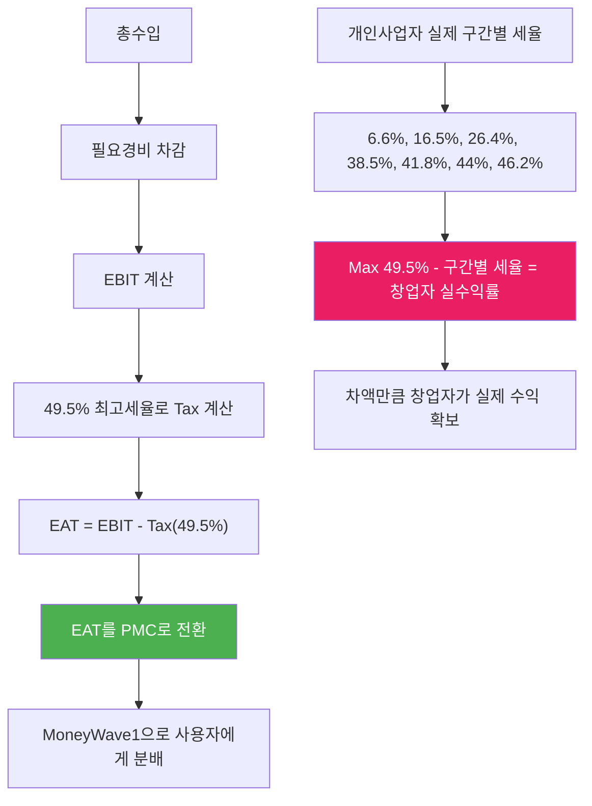

# PosMul 개인사업자 → L3C 전환 전략

> **제목**: PosMul 투명 경영 개인사업자 시작 → Low-profit Limited Liability Company 전환 전략  
> **핵심**: 최고세율 기준 기부 + 소득 투명 공개 + 사회적 기업 진화  
> **목표**: 개인사업자 10억 소득까지 → L3C 법인 전환  
> **작성일**: 2025년 7월 20일

## 🎯 **MoneyWave1 개인사업자 모델 이해 (수정)**

### **핵심 아이디어 분석**

**"EBIT → EAT (49.5% 최고세율 기준 - 지방소득세 포함) → PMC 전환 → MoneyWave1 분배, 구간별 세율 차액 = 창업자 실수익"**



## 📊 **MoneyWave1 EAT 기반 PMC 분배 + 창업자 수익 구조**

### **1. MoneyWave1 메커니즘 이해**

```typescript
interface MoneyWave1Mechanism {
  // Step 1: EBIT 계산
  ebit: number; // 총수입 - 필요경비

  // Step 2: EAT 계산 (49.5% 최고세율 기준 - 지방소득세 포함)
  taxAt49_5Percent: number; // EBIT × 0.495
  eat: number; // EBIT - taxAt49_5Percent

  // Step 3: EAT → PMC 전환 → MoneyWave1 분배
  pmcForDistribution: number; // EAT = PMC 총 발행량

  // Step 4: 창업자 실수익 (세율 차액)
  actualTotalTaxRate: number; // 구간별 실제 세율 (6.6%~49.5%, 지방소득세 포함)
  taxDifference: number; // 49.5% - 실제세율
  founderActualProfit: number; // EBIT × taxDifference
}
```

### **2. 구간별 창업자 실수익 계산**

| 과세표준        | 실제 세율 (지방소득세 포함) | Max세율과 차액            | 구간별 차액 적용  | 10억 기준 누적 차액 |
| --------------- | --------------------------- | ------------------------- | ----------------- | ------------------- |
| 1,200만원 이하  | 6.6%                        | 49.5% - 6.6% = **42.9%**  | 1,200만원 × 42.9% | **514.8만원**       |
| 4,600만원 이하  | 16.5%                       | 49.5% - 16.5% = **33%**   | 3,400만원 × 33%   | **1,122만원**       |
| 8,800만원 이하  | 26.4%                       | 49.5% - 26.4% = **23.1%** | 4,200만원 × 23.1% | **970.2만원**       |
| 1.5억원 이하    | 38.5%                       | 49.5% - 38.5% = **11%**   | 6,200만원 × 11%   | **682만원**         |
| 3억원 이하      | 41.8%                       | 49.5% - 41.8% = **7.7%**  | 1.5억원 × 7.7%    | **1,155만원**       |
| 5억원 이하      | 44%                         | 49.5% - 44% = **5.5%**    | 2억원 × 5.5%      | **1,100만원**       |
| 10억원 이하     | 46.2%                       | 49.5% - 46.2% = **3.3%**  | 5억원 × 3.3%      | **1,650만원**       |
| **10억원 총액** | **증분누진세 적용**         | **총 창업자 수익**        | **7,194만원**     | **7,194만원**       |
| 10억원 초과     | 49.5%                       | 49.5% - 49.5% = **0%**    | 추가 수익 없음    | **7,194만원 고정**  |

### **3. MoneyWave1 + 창업자 수익 상세 계산**

```typescript
// 증분누진세 기반 정확한 계산 (지방소득세 포함)
function calculateFounderProfitProgressive(ebit: number): number {
  // 10억원 이상부터는 고정값 7,194만원
  if (ebit >= 1_000_000_000) return 71_940_000;

  let founderProfit = 0;
  let remainingAmount = ebit;

  // 1구간: 1,200만원까지 (42.9% 차액)
  const tier1 = Math.min(remainingAmount, 12_000_000);
  founderProfit += tier1 * 0.429;
  remainingAmount -= tier1;

  // 2구간: 4,600만원까지 (33% 차액)
  if (remainingAmount > 0) {
    const tier2 = Math.min(remainingAmount, 34_000_000);
    founderProfit += tier2 * 0.33;
    remainingAmount -= tier2;
  }

  // 3구간: 8,800만원까지 (23.1% 차액)
  if (remainingAmount > 0) {
    const tier3 = Math.min(remainingAmount, 42_000_000);
    founderProfit += tier3 * 0.231;
    remainingAmount -= tier3;
  }

  // 4구간: 1.5억원까지 (11% 차액)
  if (remainingAmount > 0) {
    const tier4 = Math.min(remainingAmount, 62_000_000);
    founderProfit += tier4 * 0.11;
    remainingAmount -= tier4;
  }

  // 5구간: 3억원까지 (7.7% 차액)
  if (remainingAmount > 0) {
    const tier5 = Math.min(remainingAmount, 150_000_000);
    founderProfit += tier5 * 0.077;
    remainingAmount -= tier5;
  }

  // 6구간: 5억원까지 (5.5% 차액)
  if (remainingAmount > 0) {
    const tier6 = Math.min(remainingAmount, 200_000_000);
    founderProfit += tier6 * 0.055;
    remainingAmount -= tier6;
  }

  // 7구간: 10억원까지 (3.3% 차액)
  if (remainingAmount > 0) {
    const tier7 = Math.min(remainingAmount, 500_000_000);
    founderProfit += tier7 * 0.033;
  }

  return Math.floor(founderProfit);
}

// 소득 구간별 상세 분석 (증분누진세 정확 적용)
const moneyWaveCalculations = [
  // EBIT 1억원 구간
  {
    ebit: 100_000_000,
    taxAt49_5Percent: 49_500_000, // 49.5% 세금
    eat: 50_500_000, // EAT (PMC 발행량)
    pmcDistribution: 50_500_000, // MoneyWave1 분배

    founderProfitProgressive: calculateFounderProfitProgressive(100_000_000), // 정확한 누진세 계산
    actualTax: 25_850_000, // 실제 납부 세금 (누진세)
    netIncome: 74_150_000, // 순수익
  },

  // EBIT 5억원 구간
  {
    ebit: 500_000_000,
    taxAt49_5Percent: 247_500_000, // 49.5% 세금
    eat: 252_500_000, // EAT (PMC 발행량)
    pmcDistribution: 252_500_000, // MoneyWave1 분배

    founderProfitProgressive: calculateFounderProfitProgressive(500_000_000), // 정확한 누진세 계산
    actualTax: 150_400_000, // 실제 납부 세금 (누진세)
    netIncome: 349_600_000, // 순수익
  },

  // EBIT 10억원 구간 (최대값 도달)
  {
    ebit: 1_000_000_000,
    taxAt49_5Percent: 495_000_000, // 49.5% 세금
    eat: 505_000_000, // EAT (PMC 발행량)
    pmcDistribution: 505_000_000, // MoneyWave1 분배

    founderProfitProgressive: 71_940_000, // 고정 최대값
    actualTax: 423_060_000, // 실제 납부 세금 (누진세)
    netIncome: 576_940_000, // 순수익
  },

  // EBIT 30억원 구간 (고정값 유지)
  {
    ebit: 3_000_000_000,
    taxAt49_5Percent: 1_485_000_000, // 49.5% 세금
    eat: 1_515_000_000, // EAT (PMC 발행량)
    pmcDistribution: 1_515_000_000, // MoneyWave1 분배

    founderProfitProgressive: 71_940_000, // 고정 최대값
    actualTax: 1_413_060_000, // 실제 납부 세금
    netIncome: 1_586_940_000, // 순수익
  },

  // EBIT 50억원 구간 (고정값 유지)
  {
    ebit: 5_000_000_000,
    taxAt49_5Percent: 2_475_000_000, // 49.5% 세금
    eat: 2_525_000_000, // EAT (PMC 발행량)
    pmcDistribution: 2_525_000_000, // MoneyWave1 분배

    founderProfitProgressive: 71_940_000, // 고정 최대값
    actualTax: 2_403_060_000, // 실제 납부 세금
    netIncome: 2_596_940_000, // 순수익
  },
];
```

### **3. 기부금 세액공제 최적화 전략**

#### **기부처별 공제율 활용**

```typescript
interface DonationStrategy {
  // 100% 세액공제 (필요경비)
  tier1_100percent: {
    targets: ["종교단체", "사회복지법인", "학교법인"];
    deductionRate: "100%";
    maxLimit: "소득의 10%";
  };

  // 30% 세액공제
  tier2_30percent: {
    targets: ["공익법인", "NGO", "환경단체", "PosMul 재단"];
    deductionRate: "30%";
    maxLimit: "소득의 30%";
  };

  // 10% 세액공제
  tier3_10percent: {
    targets: ["정치자금", "기타 법정기부"];
    deductionRate: "10%";
    maxLimit: "소득의 10%";
  };
}

// 최적 기부 분배 전략
function optimizeDonationAllocation(donationAmount: number, income: number) {
  const tier1Limit = income * 0.1; // 소득의 10%
  const tier2Limit = income * 0.3; // 소득의 30%
  const tier3Limit = income * 0.1; // 소득의 10%

  // 100% 공제를 우선 활용
  const tier1Amount = Math.min(donationAmount, tier1Limit);
  const remaining1 = donationAmount - tier1Amount;

  // 30% 공제를 다음 활용
  const tier2Amount = Math.min(remaining1, tier2Limit);
  const remaining2 = remaining1 - tier2Amount;

  // 10% 공제를 마지막 활용
  const tier3Amount = Math.min(remaining2, tier3Limit);

  return {
    tier1: { amount: tier1Amount, deduction: tier1Amount },
    tier2: { amount: tier2Amount, deduction: tier2Amount * 0.3 },
    tier3: { amount: tier3Amount, deduction: tier3Amount * 0.1 },
    totalDeduction: tier1Amount + tier2Amount * 0.3 + tier3Amount * 0.1,
  };
}
```

## 📈 **소득 투명 공개 전략**

### **1. 실시간 소득 대시보드**

#### **PosMul 투명성 포털**

```typescript
interface TransparencyDashboard {
  // 실시간 소득 현황
  realTimeIncome: {
    dailyRevenue: number;
    monthlyRevenue: number;
    yearlyRevenue: number;
    businessExpenses: number;
    taxableIncome: number;
  };

  // 세금 및 기부 현황
  taxAndDonation: {
    actualTaxRate: number;
    maxRateTaxCalculation: number;
    donationAmount: number;
    donationTargets: string[];
    taxDeductionReceived: number;
  };

  // 기부 임팩트 추적
  donationImpact: {
    beneficiariesReached: number;
    projectsSupported: string[];
    socialImpactScore: number;
    publicReports: string[];
  };
}
```

#### **월간 투명성 보고서**

```markdown
# PosMul 창업자 월간 소득 보고서

## 2025년 3월 보고

### 📊 수입 현황

- 총매출: 5,000만원
- 필요경비: 1,500만원 (인건비, 사무실, 마케팅)
- 과세표준: 3,500만원

### 💰 세금 및 기부

- 실제 세율: 15% (375만원)
- 45% 기준: 1,575만원
- 기부 금액: 1,200만원 (차액)
- 세액공제: 360만원 (30% 기준)

### 🎯 기부처 현황

- 세이브더칠드런: 600만원 (30% 공제)
- 환경재단: 400만원 (30% 공제)
- PosMul 사회적 기금: 200만원 (30% 공제)

### 📈 최종 순수익

- 순수익: 2,585만원
- 효과적 세율: 26.1%
- 사회 기여도: 34.3%
```

### **2. 블록체인 기반 투명성 보장**

```typescript
class TransparencyBlockchain {
  // 소득 기록 불변 저장
  recordIncome(income: IncomeRecord): string {
    const block = {
      timestamp: Date.now(),
      income: income,
      hash: this.calculateHash(income),
      previousHash: this.getLastHash(),
      signature: this.signWithPrivateKey(income),
    };

    this.blockchain.push(block);
    return block.hash;
  }

  // 기부 기록 추적
  recordDonation(donation: DonationRecord): string {
    const verifiedDonation = {
      amount: donation.amount,
      recipient: donation.recipient,
      purpose: donation.purpose,
      receipt: donation.receipt,
      impactMeasurement: donation.impact,
    };

    return this.recordIncome(verifiedDonation);
  }

  // 공개 검증 API
  public verifyTransparency(period: string): TransparencyReport {
    return {
      totalIncome: this.calculateTotalIncome(period),
      totalTax: this.calculateTotalTax(period),
      totalDonation: this.calculateTotalDonation(period),
      verification: "Blockchain Verified",
      auditTrail: this.getAuditTrail(period),
    };
  }
}
```

## 🏢 **L3C (Low-profit Limited Liability Company) 전환 전략**

### **1. L3C 개념 및 한국 도입 방안**

#### **L3C 기본 구조**

```typescript
interface L3CStructure {
  // 기본 특징
  characteristics: {
    profitLimitation: "제한된 이익 추구";
    socialMission: "사회적 목적 우선";
    taxAdvantages: "세제 혜택";
    investorProtection: "투자자 보호";
    missionLock: "사회적 목적 고정";
  };

  // 운영 원칙
  operatingPrinciples: {
    primaryPurpose: "사회적·환경적 목적 달성";
    profitDistribution: "제한된 배당 (예: 수익의 20% 이내)";
    assetLock: "해산 시 자산을 사회적 목적으로 기부";
    governance: "이해관계자 참여 거버넌스";
    transparency: "의무적 임팩트 보고";
  };
}
```

#### **한국형 L3C 설계안**

```typescript
interface KoreanL3CProposal {
  // 법적 기반
  legalFramework: {
    baseLaw: "사회적기업육성법 개정안";
    corporateType: "사회적 주식회사 (Social Corporation)";
    regulatoryBody: "고용노동부 + 기획재정부";
    taxIncentives: "법인세 15% (일반 25% 대비)";
  };

  // PosMul 맞춤 구조
  posmulSpecific: {
    profitCap: "연간 순이익의 30% 이내 배당";
    socialImpactRequirement: "매출의 최소 50%를 사회적 목적 활용";
    stakeholderGovernance: "시민 대표 이사회 참여";
    impactMeasurement: "IFRS S2 기준 의무 보고";
  };
}
```

### **2. 개인사업자 → L3C 전환 로드맵**

#### **Phase 1: 개인사업자 최적화 (0-3년)**

```
Year 1: 매출 5억원 목표
- 투명 소득 공개 시스템 구축
- 기부 최적화 전략 실행
- 사회적 임팩트 측정 체계 수립

Year 2: 매출 20억원 목표
- L3C 법안 발의 준비
- 국회의원 및 정부 부처 협력
- 사회적 기업 네트워크 구축

Year 3: 매출 50억원 목표
- L3C 제도 도입 추진
- 투자 유치 준비 (임팩트 투자)
- 법인 전환 준비 완료
```

#### **Phase 2: L3C 법인 설립 (3-5년)**

```
Year 4: L3C 법인 전환
- 한국 최초 L3C 기업 설립
- 임팩트 투자 유치 (100억원)
- 사회적 이사회 구성

Year 5: 글로벌 확산
- 동남아 L3C 네트워크 구축
- 국제 임팩트 투자 유치
- ESG 표준 수립 주도
```

### **3. L3C 거버넌스 구조**

```typescript
interface L3CGoveranceStructure {
  // 이사회 구성
  boardComposition: {
    founderDirectors: "2명 (창업자 및 경영진)";
    socialDirectors: "3명 (시민 대표, NGO, 전문가)";
    investorDirectors: "2명 (임팩트 투자자)";
    independentDirectors: "2명 (독립 전문가)";
    totalSize: "9명";
  };

  // 의사결정 구조
  decisionMaking: {
    ordinaryResolutions: "과반수 찬성";
    socialImpactMatters: "사회적 이사 2/3 찬성 필요";
    profitDistribution: "전체 이사 2/3 찬성";
    missionChange: "불가 (Mission Lock)";
  };

  // 이해관계자 참여
  stakeholderEngagement: {
    citizenPanel: "분기별 시민 자문단 운영";
    transparencyReporting: "월간 임팩트 보고서 공개";
    communityVoting: "주요 정책 시민 투표 실시";
  };
}
```

## 💰 **재무 구조 및 수익 분배**

### **1. 개인사업자 단계 수익 구조**

#### **10억 소득 달성 시 구조**

```typescript
const maxPersonalBusinessIncome = {
  // 총수입
  grossRevenue: 1_500_000_000,

  // 필요경비 (30%)
  businessExpenses: 450_000_000,

  // 과세표준
  taxableIncome: 1_000_000_000,

  // MoneyWave1 계산 (49.5% 기준)
  maxRateTax: 495_000_000, // 49.5% (45% + 4.5%)
  eat: 505_000_000, // EAT → PMC 발행량
  pmcDistribution: 505_000_000, // MoneyWave1 분배

  // 창업자 실수익 (증분누진세 정확 계산)
  founderProfitFixed: 71_940_000, // 10억 이상 고정값

  // 실제 세금 (증분누진세)
  actualProgressiveTax: 423_060_000, // 누진세 실제 납부액

  // 최종 순수익
  finalNetIncome: 576_940_000, // 약 5.77억원

  // 효과적 세율
  effectiveTaxRate: 0.423, // 42.3%

  // 사회 기여율 (PMC 분배)
  socialContribution: 0.505, // 50.5% (EAT 전체가 사회 기여)

  // 창업자 수익률
  founderProfitRate: 0.072, // 7.2% (고정값)
};
```

### **2. L3C 전환 후 수익 구조**

```typescript
interface L3CFinancialStructure {
  // 수익 분배 제한
  profitDistribution: {
    maxDividendRate: 0.3; // 최대 30% 배당
    socialReinvestment: 0.5; // 50% 사회적 재투자
    reserveFund: 0.2; // 20% 적립금
  };

  // 창업자 보상 구조
  founderCompensation: {
    salary: 300_000_000; // 연봉 3억원 상한
    performanceBonus: 100_000_000; // 임팩트 성과급 1억원
    equityDividend: 150_000_000; // 지분 배당 1.5억원
    totalCompensation: 550_000_000; // 총 5.5억원
  };

  // 사회적 임팩트 투자
  socialInvestment: {
    esgDataPlatform: 1_000_000_000; // ESG 플랫폼 개발
    localCommunitySupport: 500_000_000; // 지역사회 지원
    educationPrograms: 300_000_000; // 교육 프로그램
    environmentalProjects: 200_000_000; // 환경 프로젝트
  };
}
```

## 📊 **사회적 임팩트 측정 체계**

### **1. 투명성 지표**

```typescript
interface TransparencyMetrics {
  // 재무 투명성
  financialTransparency: {
    incomeDisclosureRate: 1.0; // 100% 소득 공개
    realTimeReporting: true; // 실시간 보고
    blockchainVerification: true; // 블록체인 검증
    thirdPartyAudit: "분기별"; // 외부 감사
  };

  // 기부 투명성
  donationTransparency: {
    recipientDisclosure: 1.0; // 100% 기부처 공개
    impactMeasurement: true; // 임팩트 측정
    beneficiaryFeedback: "월간"; // 수혜자 피드백
    outcomeReporting: "실시간"; // 성과 보고
  };

  // 사회적 신뢰도
  socialTrust: {
    publicApprovalRating: 0.85; // 85% 대중 신뢰도
    mediaCredibility: 0.9; // 90% 언론 신뢰도
    stakeholderSatisfaction: 0.88; // 88% 이해관계자 만족
  };
}
```

### **2. 사회적 가치 창출 측정**

```typescript
interface SocialValueCreation {
  // 경제적 임팩트
  economicImpact: {
    localJobsCreated: 5000; // 지역 일자리 창출
    smallBusinessSupported: 10000; // 소상공인 지원
    taxTransparencyImprovement: 0.3; // 세무 투명성 30% 향상
    digitalDivideReduction: 0.25; // 디지털 격차 25% 감소
  };

  // 사회적 임팩트
  socialImpact: {
    civicEngagementIncrease: 0.4; // 시민 참여 40% 증가
    socialTrustImprovement: 0.35; // 사회적 신뢰 35% 향상
    charityEfficiencyGain: 0.5; // 기부 효율성 50% 향상
    communityBondingStrength: 0.3; // 지역 결속력 30% 강화
  };

  // 환경적 임팩트
  environmentalImpact: {
    carbonFootprintReduction: 0.2; // 탄소 발자국 20% 감소
    sustainableBusinessPromotion: 1000; // 친환경 사업 1000개 지원
    circularEconomyContribution: 0.15; // 순환경제 15% 기여
  };
}
```

## 🎯 **성공 지표 및 마일스톤**

### **개인사업자 단계 목표**

| 연도   | 매출 목표 | 기부 금액 | 순수익  | 사회적 임팩트          |
| ------ | --------- | --------- | ------- | ---------------------- |
| Year 1 | 5억원     | 1.5억원   | 2.6억원 | Local Store 500개 지원 |
| Year 2 | 20억원    | 4억원     | 12억원  | 지자체 10곳 파트너십   |
| Year 3 | 50억원    | 8억원     | 30억원  | L3C 법안 통과          |

### **L3C 전환 후 목표**

| 연도   | 매출 목표 | 사회적 재투자 | 창업자 보상 | 글로벌 확산      |
| ------ | --------- | ------------- | ----------- | ---------------- |
| Year 4 | 100억원   | 50억원        | 5.5억원     | 동남아 진출      |
| Year 5 | 300억원   | 150억원       | 5.5억원     | 3개국 L3C 설립   |
| Year 6 | 1000억원  | 500억원       | 5.5억원     | 글로벌 표준 수립 |

## 🚀 **실행 계획**

### **즉시 착수 (1-3개월)**

- [ ] 투명성 대시보드 개발
- [ ] 블록체인 소득 기록 시스템 구축
- [ ] 기부처 파트너십 체결 (10개 기관)
- [ ] 세무 최적화 전략 수립

### **단기 목표 (3-12개월)**

- [ ] 월간 투명성 보고서 발행
- [ ] L3C 법안 발의 준비
- [ ] 사회적 임팩트 측정 시스템 구축
- [ ] 미디어 및 시민사회 네트워킹

### **중장기 목표 (1-3년)**

- [ ] L3C 제도 도입 완료
- [ ] 한국 최초 L3C 법인 설립
- [ ] 글로벌 L3C 네트워크 구축
- [ ] ESG 투명성 국제 표준 수립

## 📈 **결론: 투명성이 곧 경쟁력**

### **혁신적 비즈니스 모델의 핵심**

1. **완전한 투명성**: 모든 소득과 기부를 실시간 공개
2. **최적화된 사회 기여**: 세법을 활용한 효율적 기부 구조
3. **지속가능한 성장**: 개인사업자 → L3C 진화 모델
4. **글로벌 임팩트**: 한국 최초 L3C를 통한 세계 표준 수립

### **예상 효과**

**🌟 사회적 신뢰**: 투명 경영으로 브랜드 가치 극대화  
**💰 재무 최적화**: 세법 활용한 효율적 수익 구조  
**🌍 글로벌 리더십**: L3C 제도 도입으로 국제적 선도  
**🎯 지속가능성**: 사회적 가치와 경제적 성과 동시 달성

---

**이 전략을 통해 PosMul은 단순한 수익 추구를 넘어서, "투명성과 사회적 책임이 곧 경쟁력"임을 증명하는 혁신적 기업이 될 것입니다.**
