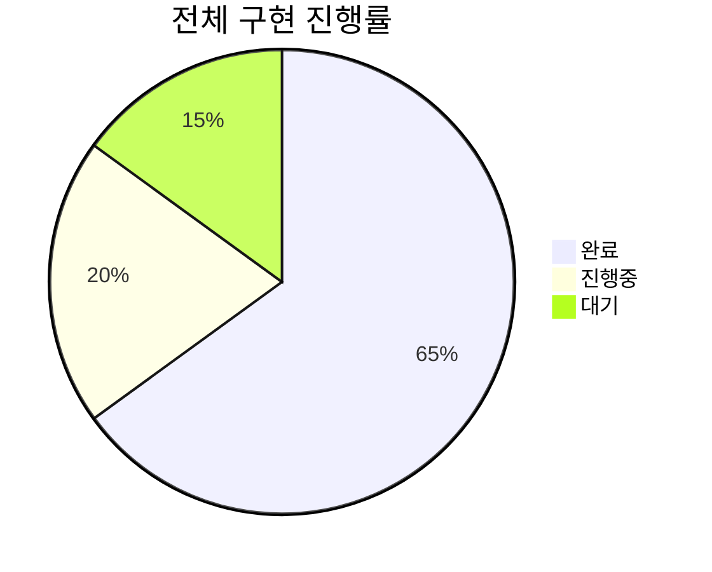
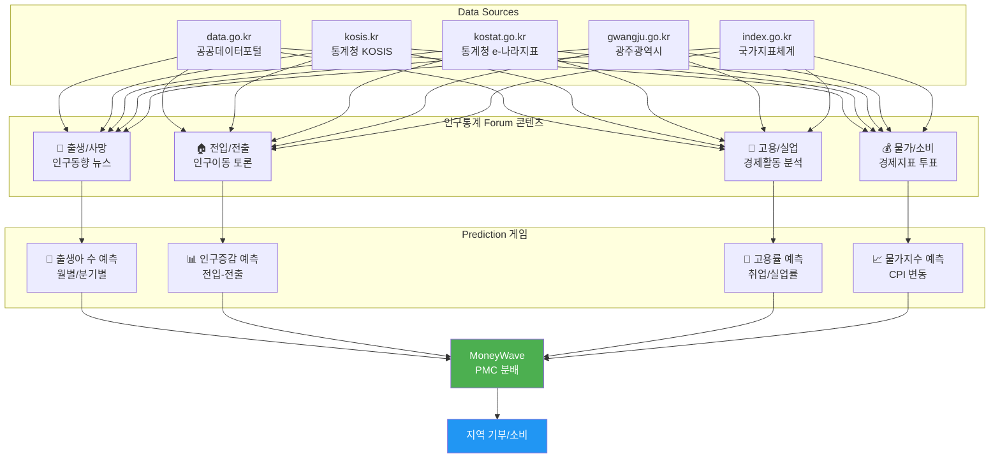
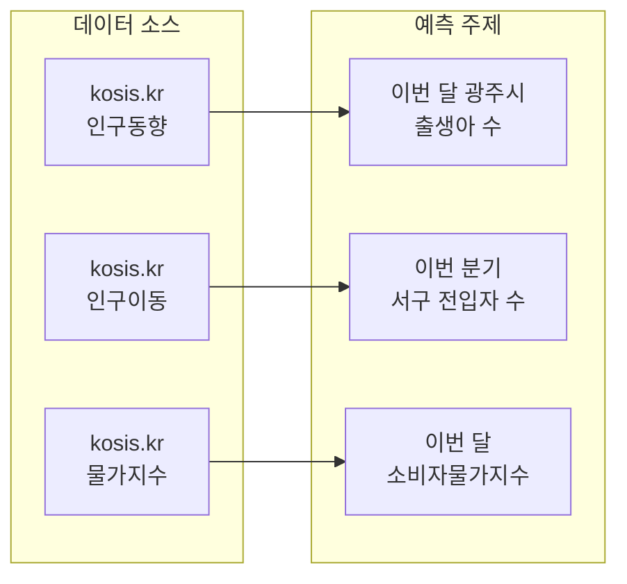
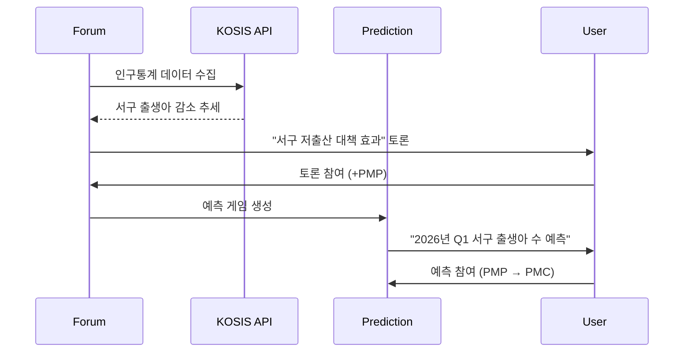
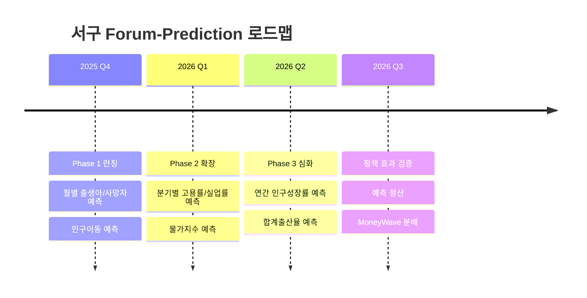
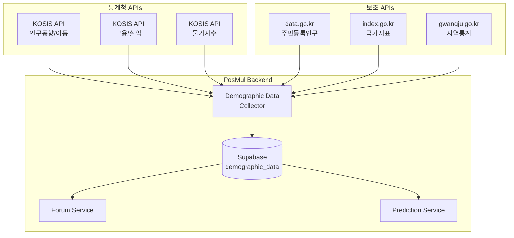
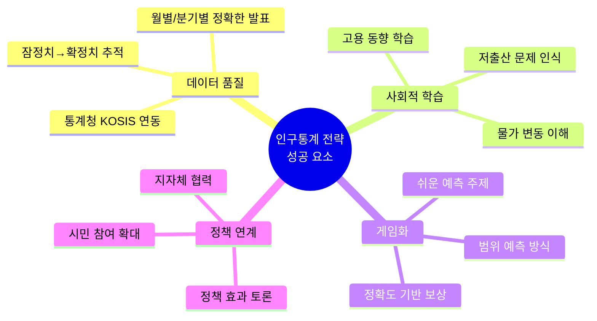

# 광주광역시 서구 Forum-Prediction 연계 전략

> **작성일**: 2025-11-29  
> **최종 업데이트**: 2025-11-29  
> **목표**: 지역 데이터 기반 Forum 콘텐츠 → Prediction 게임 연계  
> **시작점**: 광주광역시 서구 (서구청 데이터 활용)  
> **현재 상태**: ✅ Phase 1-2 완료, Phase 3 진행중

---

## 🎯 구현 진행 현황



| Phase | 상태 | 완료율 | 주요 산출물 |
|-------|------|--------|------------|
| Phase 1: DB 스키마 | ✅ 완료 | 100% | forum_regions, demographic_data.* |
| Phase 2: API 클라이언트 | ✅ 완료 | 100% | KOSISClient, MCPStatisticRepository |
| Phase 3: Forum-Prediction 연계 | ⏳ 진행중 | 80% | CreatePredictionFromForumUseCase |
| Phase 4: Presentation | ⬜ 대기 | 0% | UI 컴포넌트 |

---

## 📊 전략 개요



---

## 🗂️ 인구통계 데이터 소스 분석

### 1. kosis.kr (통계청 KOSIS) - 핵심 데이터

| 카테고리 | 세부 데이터 | Forum 연계 | Prediction 연계 |
|---------|------------|-----------|----------------|
| **출생통계** | 월별 출생아 수, 합계출산율 | 저출산 정책 토론 | 월별 출생아 수 예측 |
| **사망통계** | 월별 사망자 수, 사망원인 | 고령화 대책 토론 | 월별 사망자 수 예측 |
| **혼인/이혼** | 월별 혼인/이혼 건수 | 가족정책 토론 | 분기별 혼인율 예측 |
| **인구이동** | 전입/전출, 순이동 | 인구유출 대책 토론 | 월별 순유입 예측 |
| **고용통계** | 취업자 수, 실업률, 고용률 | 일자리 정책 토론 | 분기별 실업률 예측 |
| **물가지수** | CPI, 생활물가지수 | 생활경제 토론 | 월별 물가상승률 예측 |

**API 활용**:
```
Base URL: https://kosis.kr/openapi
인증: apiKey
형식: JSON/XML
지역코드: 29140 (광주 서구)
```

**주요 통계표 ID**:
- `DT_1B8000F` - 시군구별 출생/사망
- `DT_1B26001` - 시군구별 인구이동
- `DT_1DA7012S` - 시도별 경제활동인구
- `DT_1J20003` - 소비자물가지수

---

### 2. data.go.kr (공공데이터포털) - 보조 데이터

| 카테고리 | 세부 데이터 | Forum 연계 | Prediction 연계 |
|---------|------------|-----------|----------------|
| **주민등록인구** | 연령별/성별 인구 | 인구구조 분석 토론 | 연간 인구 변화 예측 |
| **세대수** | 1인가구, 다인가구 | 주거정책 토론 | 1인가구 비율 예측 |
| **외국인** | 외국인 등록현황 | 다문화 정책 토론 | 외국인 인구 예측 |
| **고령인구** | 65세 이상 비율 | 고령화 정책 토론 | 고령화율 예측 |

**API 활용**:
```
Base URL: https://api.odcloud.kr/api
인증: 서비스키 (API Key)
형식: JSON/XML
```

**주요 API 엔드포인트**:
- `15058038` - 광주광역시 주민등록 인구통계
- `15083277` - 시군구별 연령별 인구현황
- `15076566` - 외국인 등록현황

---

### 3. index.go.kr (국가지표체계) - 거시 지표

| 카테고리 | 세부 데이터 | Forum 연계 | Prediction 연계 |
|---------|------------|-----------|----------------|
| **경제성장** | 지역내총생산(GRDP) | 지역경제 토론 | 연간 GRDP 성장률 예측 |
| **소득** | 1인당 지역소득 | 소득불평등 토론 | 소득 증가율 예측 |
| **고용** | 지역별 고용률 | 청년일자리 토론 | 고용률 변동 예측 |
| **복지** | 기초생활수급자 비율 | 복지정책 토론 | 수급자 비율 예측 |

**API 활용**:
```
Base URL: https://kosis.kr/openapi
인증: apiKey
형식: JSON/XML
지역코드: 29140 (광주 서구)
```

---

### 4. kostat.go.kr (e-나라지표) - 정책 연계

| 카테고리 | 세부 데이터 | Forum 연계 | Prediction 연계 |
|---------|------------|-----------|----------------|
| **인구정책** | 합계출산율, 인구성장률 | 저출산 대책 토론 | 연간 출산율 예측 |
| **청년정책** | 청년실업률, NEET 비율 | 청년 일자리 토론 | 청년고용률 예측 |
| **고령화** | 노인인구 비율, 부양비 | 고령사회 대책 토론 | 고령화율 예측 |
| **주거** | 주택보급률, 자가점유율 | 주거복지 토론 | 주택가격 변동 예측 |

---

### 5. gwangju.go.kr (광주광역시) - 지역 특화

| 카테고리 | 세부 데이터 | Forum 연계 | Prediction 연계 |
|---------|------------|-----------|----------------|
| **인구현황** | 서구 인구, 세대수 | 인구변화 토론 | 연간 인구 예측 |
| **청년정책** | 청년 지원사업 | 청년정책 토론 | 청년 유입 예측 |
| **일자리** | 지역 고용동향 | 일자리 토론 | 신규 취업자 예측 |
| **복지** | 복지수급자 현황 | 복지정책 토론 | 수급자 변동 예측 |

---

## 🎯 Prediction 게임 설계

### Phase 1: 인구통계 기초 예측 (쉬움)



**예측 게임 예시**:

| 게임 ID | 주제 | 기간 | 데이터 소스 | 난이도 |
|---------|------|------|------------|--------|
| GJ-001 | 12월 광주시 출생아 수 | 월간 | kosis.kr 인구동향 | ⭐ |
| GJ-002 | Q4 서구 순유입 인구 (전입-전출) | 분기 | kosis.kr 인구이동 | ⭐ |
| GJ-003 | 12월 소비자물가지수 (전월대비 %) | 월간 | kosis.kr 물가 | ⭐⭐ |
| GJ-004 | Q4 광주시 실업률 | 분기 | kosis.kr 고용 | ⭐⭐ |
| GJ-005 | 2025년 서구 혼인 건수 | 연간 | kosis.kr 혼인통계 | ⭐⭐⭐ |

---

### Phase 2: 정책 연계 예측 (중간)

**Forum Debate → Prediction 연계**:



**예측 게임 예시**:

| 게임 ID | Forum 토론 연계 | 예측 주제 | 결과 확인 |
|---------|----------------|----------|----------|
| GJ-101 | "서구 저출산 대책 효과" | 2026년 Q1 서구 출생아 수 | 분기말 통계청 발표 |
| GJ-102 | "청년 유출 막을 방법" | Q1 서구 20-30대 순유입 | 분기말 인구이동통계 |
| GJ-103 | "서구 일자리 정책 효과" | Q1 서구 취업자 증가율 | 분기말 고용동향 |

---

### Phase 3: 심화 인구통계 예측 (어려움)

**거시 지표 + 정책 효과 측정**:



**심화 예측 게임 예시**:

| 게임 ID | 난이도 | 예측 주제 | 배팅 범위 | 결과 확인 |
|---------|--------|----------|----------|----------|
| GJ-201 | ⭐⭐⭐ | 2026년 광주시 합계출산율 | 500~5000 PMP | 연말 통계청 |
| GJ-202 | ⭐⭐⭐ | 2026년 서구 인구증감률 | 500~5000 PMP | 연말 인구통계 |
| GJ-203 | ⭐⭐⭐ | 2026년 평균 실업률 | 300~3000 PMP | 연말 고용동향 |
| GJ-204 | ⭐⭐⭐⭐ | 2026년 연간 CPI 상승률 | 1000~10000 PMP | 연말 물가통계 |

---

## 🔌 API 통합 설계

### 인구통계 데이터 수집 아키텍처



### DB 스키마 설계

```sql
-- 인구통계 데이터 저장 스키마
CREATE SCHEMA IF NOT EXISTS demographic_data;

-- 지역 기본 정보
CREATE TABLE demographic_data.regions (
    id UUID PRIMARY KEY DEFAULT gen_random_uuid(),
    code VARCHAR(10) NOT NULL UNIQUE,  -- 29140 (광주 서구)
    name VARCHAR(100) NOT NULL,        -- 광주광역시 서구
    parent_code VARCHAR(10),           -- 29000 (광주광역시)
    level VARCHAR(20) NOT NULL,        -- 'district' | 'city' | 'province' | 'nation'
    population INTEGER,                -- 최신 인구수
    created_at TIMESTAMPTZ DEFAULT NOW(),
    updated_at TIMESTAMPTZ DEFAULT NOW()
);

-- 인구통계 카테고리
CREATE TYPE demographic_data.stat_category AS ENUM (
    'BIRTH',           -- 출생
    'DEATH',           -- 사망
    'MARRIAGE',        -- 혼인
    'DIVORCE',         -- 이혼
    'MIGRATION_IN',    -- 전입
    'MIGRATION_OUT',   -- 전출
    'EMPLOYMENT',      -- 취업자
    'UNEMPLOYMENT',    -- 실업자
    'LABOR_FORCE',     -- 경제활동인구
    'CPI',             -- 소비자물가지수
    'POPULATION'       -- 총인구
);

-- 데이터 소스 등록
CREATE TABLE demographic_data.data_sources (
    id UUID PRIMARY KEY DEFAULT gen_random_uuid(),
    name VARCHAR(100) NOT NULL,        -- 통계청 KOSIS
    api_base_url TEXT,
    api_key_env VARCHAR(100),          -- 환경변수명
    rate_limit_per_day INTEGER,
    is_active BOOLEAN DEFAULT true,
    created_at TIMESTAMPTZ DEFAULT NOW()
);

-- 인구통계 데이터 포인트
CREATE TABLE demographic_data.statistics (
    id UUID PRIMARY KEY DEFAULT gen_random_uuid(),
    source_id UUID REFERENCES demographic_data.data_sources(id),
    region_code VARCHAR(10) REFERENCES demographic_data.regions(code),
    category demographic_data.stat_category NOT NULL,
    period_type VARCHAR(20) NOT NULL,   -- 'monthly', 'quarterly', 'yearly'
    period_year INTEGER NOT NULL,
    period_month INTEGER,               -- 1-12 (월간), NULL (연간)
    period_quarter INTEGER,             -- 1-4 (분기), NULL (월간/연간)
    value DECIMAL(20, 4) NOT NULL,
    unit VARCHAR(50),                   -- '명', '%', '지수'
    is_preliminary BOOLEAN DEFAULT true, -- 잠정치 여부
    metadata JSONB,
    collected_at TIMESTAMPTZ DEFAULT NOW(),
    created_at TIMESTAMPTZ DEFAULT NOW(),
    
    UNIQUE(region_code, category, period_year, period_month, period_quarter)
);

-- Forum과 연계
CREATE TABLE demographic_data.forum_stat_links (
    id UUID PRIMARY KEY DEFAULT gen_random_uuid(),
    forum_post_id UUID,                -- forum.forum_posts 참조
    statistic_id UUID REFERENCES demographic_data.statistics(id),
    relevance_score DECIMAL(3, 2),     -- 0.00 ~ 1.00
    created_at TIMESTAMPTZ DEFAULT NOW()
);

-- Prediction과 연계
CREATE TABLE demographic_data.prediction_stat_links (
    id UUID PRIMARY KEY DEFAULT gen_random_uuid(),
    prediction_game_id UUID,           -- prediction.prediction_games 참조
    category demographic_data.stat_category NOT NULL,
    region_code VARCHAR(10),
    target_period_year INTEGER NOT NULL,
    target_period_month INTEGER,
    target_period_quarter INTEGER,
    is_result_source BOOLEAN DEFAULT false,
    actual_value DECIMAL(20, 4),       -- 결과 확정 시
    confirmed_at TIMESTAMPTZ,
    created_at TIMESTAMPTZ DEFAULT NOW()
);

-- 초기 지역 데이터 삽입
INSERT INTO demographic_data.regions (code, name, parent_code, level, population) VALUES
    ('00', '전국', NULL, 'nation', 51000000),
    ('29000', '광주광역시', '00', 'city', 1450000),
    ('29110', '광주광역시 동구', '29000', 'district', 95000),
    ('29140', '광주광역시 서구', '29000', 'district', 290000),
    ('29155', '광주광역시 남구', '29000', 'district', 210000),
    ('29170', '광주광역시 북구', '29000', 'district', 430000),
    ('29200', '광주광역시 광산구', '29000', 'district', 410000);

INSERT INTO demographic_data.data_sources (name, api_base_url, api_key_env, rate_limit_per_day) VALUES
    ('통계청 KOSIS', 'https://kosis.kr/openapi', 'KOSIS_API_KEY', 1000),
    ('공공데이터포털', 'https://api.odcloud.kr/api', 'DATA_GO_KR_API_KEY', 1000),
    ('국가지표체계', 'https://www.index.go.kr/api', 'INDEX_GO_KR_API_KEY', 500),
    ('광주광역시', 'https://data.gwangju.go.kr/api', 'GWANGJU_DATA_API_KEY', 500);

-- 인덱스
CREATE INDEX idx_stats_region ON demographic_data.statistics(region_code);
CREATE INDEX idx_stats_category ON demographic_data.statistics(category);
CREATE INDEX idx_stats_period ON demographic_data.statistics(period_year, period_month);
CREATE INDEX idx_prediction_links_game ON demographic_data.prediction_stat_links(prediction_game_id);
```

---

## 📱 API 통합 코드

### 환경 변수 설정

```bash
# .env.local 추가
DATA_GO_KR_API_KEY=your_data_go_kr_key
LOCAL_DATA_API_KEY=your_local_data_key
KOSIS_API_KEY=your_kosis_key
GWANGJU_DATA_API_KEY=your_gwangju_key
```

### API 클라이언트 구조

```
bounded-contexts/
└── local-data/
    ├── domain/
    │   ├── entities/
    │   │   ├── region.entity.ts
    │   │   ├── data-source.entity.ts
    │   │   └── data-point.entity.ts
    │   └── repositories/
    │       └── data-source.repository.interface.ts
    ├── infrastructure/
    │   ├── api-clients/
    │   │   ├── data-go-kr.client.ts
    │   │   ├── local-data.client.ts
    │   │   ├── kosis.client.ts
    │   │   └── gwangju.client.ts
    │   └── repositories/
    │       └── mcp-data-source.repository.ts
    ├── application/
    │   └── use-cases/
    │       ├── collect-local-data.use-case.ts
    │       └── link-forum-data.use-case.ts
    └── presentation/
        └── hooks/
            └── use-local-data.ts
```

---

## 🗓️ 구현 로드맵

### Phase 1: 인프라 구축 (2주)

| 주차 | 작업 | 산출물 |
|------|------|--------|
| 1주 | API 키 발급, DB 스키마 | 환경설정 완료 |
| 2주 | API 클라이언트 구현 | data-go-kr, localdata 연동 |

### Phase 2: Forum 연계 (2주)

| 주차 | 작업 | 산출물 |
|------|------|--------|
| 3주 | 뉴스 자동 수집 | 서구 News 콘텐츠 |
| 4주 | 데이터 시각화 | Forum 대시보드 |

### Phase 3: Prediction 연계 (2주)

| 주차 | 작업 | 산출물 |
|------|------|--------|
| 5주 | 예측 게임 템플릿 | 기초 데이터 예측 |
| 6주 | 자동 정산 시스템 | API 기반 결과 검증 |

---

## 📈 KPI 및 성과 지표

### Forum 지표 (인구통계 토론)

| 지표 | 목표 (3개월) | 측정 방법 |
|------|-------------|----------|
| 인구통계 관련 게시글 | 100+ | forum_posts WHERE category IN (출생, 고용, 물가) |
| 정책 토론 참여자 | 500+ | DISTINCT user_id (DEBATE section) |
| PMP 발행량 | 50,000+ | pmp_transactions SUM |

### Prediction 지표 (인구통계 예측)

| 지표 | 목표 (3개월) | 측정 방법 |
|------|-------------|----------|
| 인구통계 예측 게임 | 30+ | prediction_games WHERE category='DEMOGRAPHIC' |
| 예측 참여 수 | 2,000+ | predictions COUNT |
| 예측 정확도 | 55%+ | 오차범위 내 적중률 |
| 월별 출생아 예측 참여 | 500+ | 가장 인기 있는 게임 유형 |

### 경제 효과

| 지표 | 목표 (6개월) | 측정 방법 |
|------|-------------|----------|
| 광주시 PMC 발행 | 150,000+ | 지역 코드 기준 |
| 서구 지역 기부 | 50,000 PMC+ | donation WHERE region='29140' |
| 사회적 학습 효과 | 측정 필요 | 예측 정확도 향상률 |

---

## 🎯 핵심 성공 요소



---

## 📝 다음 단계

### ✅ 완료된 작업

1. ✅ `demographic_data` 스키마 마이그레이션 완료
2. ✅ `forum.forum_regions` 테이블 생성 (광주 5개 구 데이터 포함)
3. ✅ `forum.forum_prediction_links` 테이블 생성
4. ✅ KOSIS 클라이언트 구현 (`KOSISClient` - 11개 카테고리 지원)
5. ✅ `MCPStatisticRepository`, `MCPDataSourceRepository` 구현
6. ✅ `CollectDemographicsUseCase`, `GetStatisticsUseCase` 구현
7. ✅ `CreatePredictionFromForumUseCase` 구현
8. ✅ `VerifyPredictionResultUseCase` 구현
9. ✅ `MCPPostRepository` 구현

### ⏳ 진행 중

1. **KOSIS API 키 발급**: https://kosis.kr/openapi 에서 발급 후 `.env.local`에 추가
   ```bash
   KOSIS_API_KEY=your_api_key_here
   ```

### 🔜 다음 작업

1. **즉시**: KOSIS API 키 발급 신청 (https://kosis.kr/openapi)
2. **1주 내**: 첫 번째 인구통계 예측 게임 ("12월 광주시 출생아 수") 런칭
3. **2주 내**: Forum 토론 연계 (저출산/고용 정책 토론)
4. **3주 내**: Presentation Layer UI 컴포넌트 구현

### 우선순위 API 연동

| 순서 | API | 데이터 | 예측 게임 활용 |
|------|-----|--------|---------------|
| 1 | KOSIS 인구동향 | 출생/사망/혼인 | 월별 출생아 예측 |
| 2 | KOSIS 고용동향 | 실업률/고용률 | 분기별 실업률 예측 |
| 3 | KOSIS 물가 | CPI | 월별 물가상승률 예측 |
| 4 | KOSIS 인구이동 | 전입/전출 | 분기별 순이동 예측 |

---

*Last Updated: 2025-11-29*
