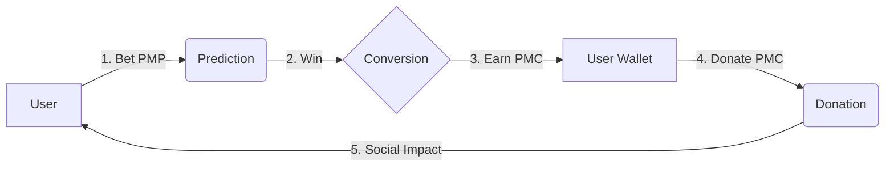

# PosMul 경제 순환 및 UX 가이드

PosMul 플랫폼의 핵심은 **예측(Prediction)**을 통해 **재화(PMP)**를 **가치(PMC)**로 전환하고, 이를 **기부(Donation)**하여 사회적 영향력을 행사하는 순환 구조에 있습니다.

## 1. 경제 순환 구조 (The Economic Cycle)

### 1.1 PMP (Point Major Policy) - "참여의 씨앗"
- **성격**: 예측 게임 참여를 위한 화폐.
- **획득**: 출석, 활동, 기본 지급.
- **사용**: 예측 게임 베팅.

### 1.2 PMC (Point Minor Community) - "영향력의 열매"
- **성격**: 기부 및 투자를 위한 가치 화폐.
- **획득**: 예측 성공 시, 베팅한 PMP와 배당금이 **PMC로 변환**되어 지급.
- **사용**: 기부(Donation), 로컬 투자(Investment).

---

## 2. UX 개선 포인트 (Current vs Improved)

사용자가 이 순환을 직관적으로 이해하고 행동할 수 있도록 UI/UX를 개선합니다.

### 2.1 베팅 단계 (Input)
**AS-IS (현재)**:
- 베팅 확인 창에서 "예상 수익"이 **PMP**로 표기됨.
- 사용자는 "PMP를 걸어서 PMP를 더 버나?"라고 오해할 수 있음.

**TO-BE (개선)**:
- **명확한 가치 변환 표시**: "예상 획득 PMC"로 표기 변경.
- **Micro-copy**: "예측 성공 시 PMP는 PMC로 변환되어 지급됩니다."

### 2.2 결과 확인 (Output)
**TO-BE (제안)**:
- 예측 성공 알림에 "획득한 PMC로 기부해보세요!" CTA(Call To Action) 추가.
- `MyPredictions` 리스트에서 정산 완료(Settled) 항목에 "획득 PMC" 표시 및 "기부하러 가기" 버튼 노출.

### 2.3 기부 (Action)
**TO-BE (제안)**:
- 기부 화면에 "나의 가용 PMC"를 강조.
- "최근 예측 성공으로 모은 PMC"와 같은 문구로 연결 고리 강화.

---

## 3. 구현 가이드

### `BettingConfirmation.tsx` 수정
- 예상 수익 단위를 `PMP` -> `PMC`로 변경.
- 툴팁이나 설명 텍스트로 변환 로직 안내.

### `MyPredictions.tsx` 개선
- 정산된 게임(Win)의 경우, 획득한 PMC 표시.
- [기부하기] 숏컷 버튼 추가.
