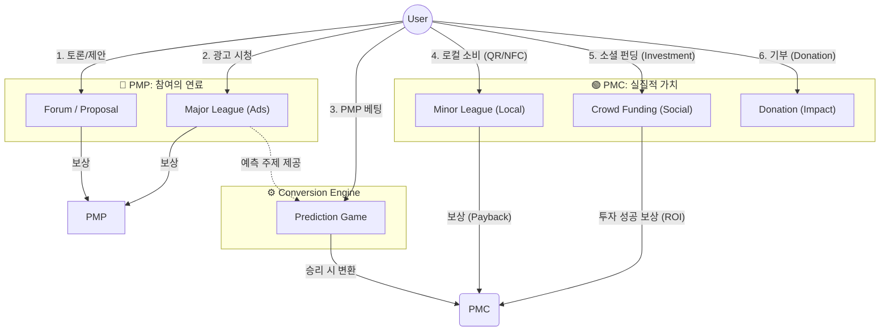

# PosMul Revised Economic Model & Domain Roles

> **목적**: 사용자의 정정 요청에 따라 Major/Minor League의 역할과 PMP/PMC의 흐름을 재정의하고 명확히 정리함.

---

## 1. 🔄 전체 순환 구조 (The Big Picture)

PosMul의 경제는 **"관심(Attention)과 참여(Action)를 가치(Value)로 전환하여 사회에 환원(Impact)하는 시스템"**입니다.

---

## 2. 도메인별 상세 역할 정의

### 🏢 Major League (기업/광고)
**"기업은 관심을 얻고, 유저는 연료(PMP)를 얻는다."**

1.  **Ad View (광고 시청)**:
    - 기업의 광고를 시청하면 **PMP**를 획득합니다. (기존모델 유지)
2.  **Product Prediction (흥행 예측)**:
    - 단순 시청을 넘어, **"이 제품이 성공할까?", "이 광고가 효과적일까?"**를 예측하는 게임의 **주제(Topic)**가 됩니다.
    - 유저는 여기서 획득한 PMP를 다시 이 **기업 관련 예측 게임**에 베팅할 수 있습니다.
    - 기업 입장에선 마케팅 + 시장 조사를 동시에 수행합니다.

### 🏪 Minor League (로컬/상생)
**"착한 소비가 더 큰 가치(PMC)로 돌아온다."**

1.  **Local Consumption (로컬 소비)**:
    - 프랜차이즈가 아닌 동네 가게 이용.
2.  **Payment Rewards (결제 리워드)**:
    - QR/NFC 결제 시, 결제 금액의 일부를 **PMC**로 적립받습니다.
    - **의의**: 단순한 소비 행위를 "가치 생산 행위(Mining)"로 격상시킵니다. 돈을 썼지만, 그 행위가 로컬 경제를 살렸기에 플랫폼은 PMC(영향력)로 보상합니다.

### 🤝 Crowd Funding (소셜 펀딩)
**"이웃의 꿈에 투자하고, 성공의 결실(PMC)을 함께 나눈다."**

1.  **Social Investment (소셜 투자)**:
    - 개인이나 소상공인의 프로젝트에 **PMC**를 투자(Funding)합니다.
2.  **Success Reward (성공 보상)**:
    - 프로젝트가 목표를 달성하거나 성공하면, 투자 원금과 함께 **추가 PMC**를 보상(ROI)으로 돌려받습니다. (실패 시 소멸 or 부분 반환)
    - 단순 기부(Donation)와 달리 **"수익성 있는 사회 공헌"** 모델입니다.

### 🗳️ Forum & Prediction (공론장)
**"참여와 집단지성이 자산이 된다."**

1.  **PMP Mining**: Forum 활동, 게임 제안 등을 통해 PMP를 채굴합니다.
2.  **Value Conversion**: Prediction은 PMP(단순 활동 점수)를 리스크를 감수한 승리(Skin in the game)를 통해 PMC(교환 가치)로 연금술처럼 변화시킵니다.

---

## 3. 요약: 화폐의 성격 (Concept Cleanup)

| 화폐 | 성격 | 획득 방법 (Sources) | 사용처 (Sinks) | 비유 |
| :--- | :--- | :--- | :--- | :--- |
| **PMP** | **활동 연료** (Fuel) | 1. **Major League** (광고 시청) 2. **Forum** (글쓰기, 댓글) 3. **Proposal** (게임 제안) | **Prediction 베팅** (예측을 위한 탄환) | 게임의 '행동력', '에너지' |
| **PMC** | **사회적 가치** (Value) | 1. **Prediction** 승리 (PMP 변환) 2. **Minor League** 결제 리워드 (착한 소비) 3. **Crowd Funding** 투자 성공 (ROI) | **Donation** (기부) | 마일리지, 투자금 |

---

## 4. 수정된 UX 전략 방향

이 모델에 따르면 UX 전략은 다음과 같이 수정되어야 합니다.

1.  **Major League**:
    - 단순 '충전소'가 아니라, **"보고(Watch) -> 얻고(Earn PMP) -> 예측하라(Bet)"**의 즉각적인 흐름이 필요합니다.
    - *예: 신상품 광고 보고 PMP 받고, 바로 그 상품의 '첫 달 판매량 예측'에 베팅.*
    - 기업의 사회공헌 광고를 보고 광고흥행 또는 밈이 제작될까 예측

2.  **Minor League**:
    - '소비처'가 아니라 또 하나의 **'채굴처(Mining Station)'** 개념 추가.
    - *"오늘 점심, 스타벅스 대신 동네 카페 가고 PMC 받자"*는 메시지 소구.
3.  **Crowd Funding**:
    - 신인작가의 작품을 처녀작구매하주고 PMC를 획득하여 Donation까지 할 수 있는 모델로 변경.