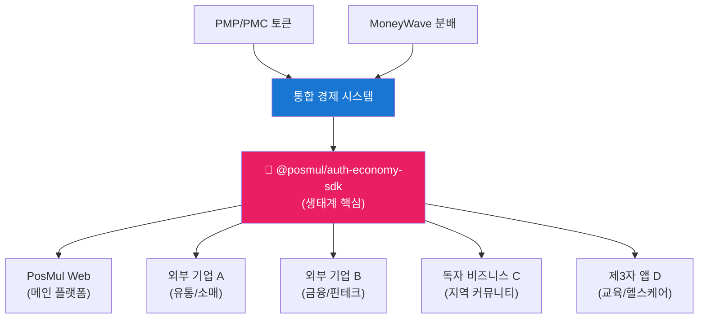
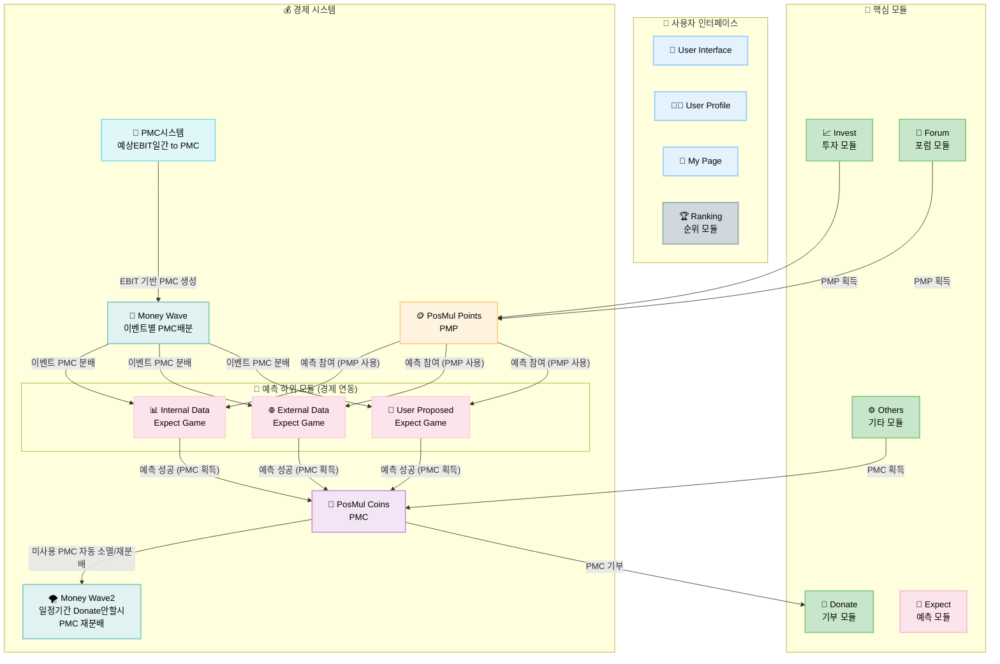

# PosMul 프로젝트 개발 가이드 (CLAUDE.md)

> **프로젝트**: PosMul - AI 시대 직접민주주의 플랫폼  
> **작성일**: 2025년 1월 27일  
> **최종 업데이트**: 2025년 7월 20일  
> **상태**: Production Ready (98% 완성도)

## 🎯 프로젝트 개요

**PosMul**은 시민이 직접 예산을 집행하고 사회적 의사결정에 참여하는 연습장입니다. **"관료-정치인-공급자"**의 철의 삼각형(Iron Triangle) 독점 구조를 극복하여 **국민이 직접 예산 집행을 연습**할 수 있는 AI 시대 직접민주주의 플랫폼입니다.

### 🏆 핵심 Vision

- **1년차 Goal**: 이벤트 예측과 결과 평가를 통한 **사회적 학습** 증진
- **5년차 Vision**: CAPM 기반 **개인 효용 극대화** 의사결정 실증 검증
- **10년차 Mission**: **철의 삼각형** 극복 및 시민의 **실질적 예산 참여** 시스템 구축
- **50년차 Dream**: **Cosmos 시대** 민주주의 표준 모델, AI와 함께하는 **참여형 거버넌스** 완성

### 🎮 핵심 특징

- **6개 모듈 통합 플랫폼**: Invest, Expect, Donate, Forum, Others, Ranking
- **이중 토큰 경제 시스템**: PMP (위험프리 자산) + PMC (위험자산)
- **노벨경제학상 이론 구현**: Agency Theory + CAPM + Public Choice Theory + Behavioral Economics
- **MoneyWave 3단계 분배**: EBIT 기반 자동 토큰 분배 + 미사용 재분배 + 기업가 생태계
- **학술적 근거**: Jensen & Meckling, Kahneman-Tversky, Buchanan, Stigler 이론 완전 구현

## 🏗️ 기술 스택 및 아키텍처

### 핵심 기술

- **Frontend**: Next.js 15.3.4 + React 19.0.0 + TypeScript 5.4.5
- **Backend**: Supabase (PostgreSQL) + MCP 도구
- **패키지 관리**: pnpm@10.12.4 + turbo@2.0.4 (모노레포)
- **아키텍처**: DDD + Clean Architecture + Hexagonal
- **문자 인코딩**: UTF-8-sig (한글 완벽 지원)

### 모노레포 구조

```
posmul/
├── apps/
│   └── posmul-web/           # 🌐 Next.js 웹 애플리케이션
├── packages/
│   └── auth-economy-sdk/     # 🔐 All-in-One 통합 SDK (생태계 확장 핵심)
├── docs/                     # 📖 프로젝트 문서 (UTF-8-sig)
└── scripts/                  # 🔧 자동화 스크립트
```

## 🌐 PosMul 생태계 확장 전략

### auth-economy-sdk 기반 생태계 통합

PosMul의 **auth-economy-sdk**는 다른 기업의 서비스나 독자 비즈니스가 PosMul 생태계에 참여할 수 있는 핵심 인프라입니다.



### 생태계 참여 모델

#### 1. **B2B 통합 모델**

```typescript
// 외부 기업의 PosMul 생태계 통합 예시
import { AuthService, EconomyService } from "@posmul/auth-economy-sdk";

// 외부 서비스에서 PosMul 인증 시스템 활용
const externalService = new ExternalBusinessService({
  posmulAuth: new AuthService(config),
  posmulEconomy: new EconomyService(config),
  businessLogic: new CustomBusinessLogic(),
});

// 고객이 외부 서비스에서 PMP/PMC 토큰 사용
await externalService.processPaymentWithPMC(userId, amount);
```

#### 2. **독자 비즈니스 모델**

- **지역 상권**: 지역 상점들이 PMC 토큰으로 결제 수락
- **커뮤니티 서비스**: 마을 공동체가 PosMul 경제 시스템 활용
- **교육 플랫폼**: 학습 성과에 따른 토큰 보상 시스템

#### 3. **API 경제 모델**

```typescript
// 생태계 파트너를 위한 SDK 활용
const partnerIntegration = {
  // 인증 통합
  authenticateUser: () => authService.getSession(),

  // 경제 시스템 통합
  processTransaction: (userId, amount, type) =>
    economyService.processTransaction(userId, amount, type),

  // MoneyWave 참여
  participateInWave: (userId, waveType) =>
    economyService.joinMoneyWave(userId, waveType),
};
```

## 🌍 다국어 및 로컬라이제이션

### 한글 우선 개발 원칙

- **AI Agent 응답**: 모든 AI 도구는 한글로 응답
- **문서 작성**: UTF-8-sig 인코딩으로 한글 완벽 지원
- **사용자 인터페이스**: 한국어 UI/UX 최우선 설계
- **에러 메시지**: 사용자 친화적인 한글 에러 메시지

### 파일 인코딩 규칙

```powershell
# 모든 문서 파일은 UTF-8-sig로 저장
# PowerShell에서 파일 생성 시:
$content | Out-File -FilePath "파일명.md" -Encoding UTF8BOM

# VS Code 설정:
# "files.encoding": "utf8bom"
# "files.autoGuessEncoding": true
```

## 💰 PosMul 경제 시스템 완전 분석

### 🎮 6개 핵심 모듈 구조



### 🪙 PMP vs PMC 경제학적 구조

| 구분              | 🪙 PMP (PosMul Points)                         | 💎 PMC (PosMul Coins)            |
| ----------------- | ---------------------------------------------- | -------------------------------- |
| **경제학적 성격** | 위험프리 자산 (Risk-Free Asset)                | 위험자산 (Risky Asset)           |
| **CAPM 역할**     | 무위험수익률 (Risk-Free Rate)                  | 위험프리미엄 반영 (Risk Premium) |
| **획득방법**      | Major League 광고시청, Forum 토론/브레인스토밍 | 예측 게임 성공 + EBIT 기반 발행  |
| **사용처**        | 예측 게임 참여비 (사회적 학습)                 | 기부 전용 (예산 집행 연습)       |
| **이론 근거**     | Agency Theory 정보 비대칭 해소                 | Behavioral Economics 손실 회피   |

### 🌊 MoneyWave 3단계 분배 시스템 (노벨경제학상 이론 구현)

#### **MoneyWave1: EBIT 기반 PMC 발행**

```
예상EBIT = E[Revenue] - E[COGS] - E[SG&A]
예상Return = 예상EBIT - 예상Tax(최고법인세율) - 예상Interest
일일 PMC 발행량 = 예상Return ÷ 365일
```

- **Jensen & Meckling Agency Theory**: 주주-경영자 이해상충 해결
- **Efficient Market Hypothesis**: 시장 정보 반영한 공정 가치 산정

#### **MoneyWave2: 미사용 PMC 재분배 (Kahneman-Tversky 행동경제학)**

```
가치함수: v(x) = x^α (이득), -λ(-x)^β (손실)
손실 회피 계수 λ = 2.25 (실험 검증값)
```

- **Prospect Theory**: 손실 회피를 활용한 PMC 사용 유인 증대
- **Endowment Effect** 극복: 게임화를 통한 기부 동기 강화

#### **MoneyWave3: 기업가 생태계 (Network Economics)**

```
Metcalfe's Law: 네트워크 가치 = n²
기업가 참여 증가 → 플랫폼 가치 기하급수적 증대
```

- **ESG 마케팅**: 기업의 사회적 책임 + PMC 제공
- **Target User 데이터**: 정밀한 고객 분석 + 예측 게임 제안

### 📊 Risk-Free vs Risky Asset 분석 (Markowitz Portfolio Theory)

#### **🪙 PMP = 무위험자산 (Risk-Free Asset) 근거**

```
확실한 획득 메커니즘:
Major League 광고 시청 → 100% PMP 지급 보장
Forum 토론 참여 → 100% PMP 지급 보장
브레인스토밍 참여 → 100% PMP 지급 보장
```

- **✅ 정부채권 유사성**: 플랫폼이 제공하는 무조건적 보상
- **✅ 확실한 수익률**: 사용자 활동만으로 예측 가능한 획득
- **✅ 선택적 위험**: 예측 게임 참여는 사용자의 자유 선택

#### **💎 PMC = 위험자산 (Risky Asset) 근거**

```
불확실한 획득 조건:
EBIT 변동성 → 실제 기업 성과에 따른 발행량 변동
예측 게임 성공 → PMP 투입 + 정확한 예측 필요
기업 의존성 → PosMul 회사의 수익성에 따라 결정
```

- **⚠️ 시장 위험**: 기업의 실제 EBIT 성과에 의존
- **⚠️ 예측 위험**: 사회적 학습 게임에서 성공해야 획득
- **⚠️ 변동성**: 수익률이 예측 불가능하고 변동적

#### **🎯 Optimal Portfolio 전략**

- **위험 회피형 사용자**: PMP 위주 보유 + 안정적 활동 참여
- **위험 중립형 사용자**: PMP/PMC 균형 + 선별적 예측 참여
- **위험 추구형 사용자**: 적극적 예측 게임 참여로 PMC 획득

#### **📈 Portfolio 구성 예시**

```typescript
// 위험 회피형 사용자 (Risk Aversion = 0.8)
const conservativePortfolio = {
  pmpAllocation: 0.8, // 80% 안전자산
  pmcAllocation: 0.2, // 20% 위험자산
  expectedReturn: "낮음-안정적",
  strategy: "Major League 광고 + Forum 참여 위주",
};

// 위험 중립형 사용자 (Risk Aversion = 0.5)
const balancedPortfolio = {
  pmpAllocation: 0.6, // 60% 안전자산
  pmcAllocation: 0.4, // 40% 위험자산
  expectedReturn: "중간-균형적",
  strategy: "활동 참여 + 선별적 예측 게임",
};

// 위험 추구형 사용자 (Risk Aversion = 0.2)
const aggressivePortfolio = {
  pmpAllocation: 0.3, // 30% 안전자산
  pmcAllocation: 0.7, // 70% 위험자산
  expectedReturn: "높음-변동적",
  strategy: "적극적 예측 게임 + MoneyWave 활용",
};
```

### 🏛️ Iron Triangle 극복 메커니즘

#### **전통적 문제 구조**

- **관료**: 예산 극대화 추구 (예산 증액만이 목표)
- **정치인**: 책임 회피 (관료에게 전가)
- **공급자**: 해외 우선 공급 (국내 경제 순환 차단)

#### **PosMul 해결책**

- **PMC 시스템**: 예산 투명화 + 시민 직접 집행
- **예측 게임**: 정보 비대칭 해소 + 책임 가시화
- **Local League**: 지역 순환경제 강화 + 국내 공급업체 우선

## 🛠️ 개발 환경 및 명령어

### 필수 요구사항

- **Node.js**: 18.x 이상
- **pnpm**: 10.12.4 (필수)
- **PowerShell**: Windows 환경 최적화
- **문자 인코딩**: UTF-8-sig 설정

### 주요 개발 명령어

```powershell
# 전체 개발 환경 실행
turbo dev

# 전체 빌드 (18초 고속)
turbo build

# 웹앱만 실행
pnpm -F posmul-web dev

# SDK 빌드 (생태계 파트너용)
pnpm -F auth-economy-sdk build

# 타입 생성 (UTF-8-sig 인코딩)
타입 생성: VS Code(MCP)에서 `mcp_com_supabase__generate_typescript_types`
```

### 파일 작업 규칙

```powershell
# 한글 파일명 지원
New-Item -Path "한글파일명.md" -ItemType File -Encoding UTF8BOM

# 한글 내용 포함 파일 생성
$content = "한글 내용이 포함된 문서"
$content | Out-File -FilePath "문서.md" -Encoding UTF8BOM
```

## 🎯 핵심 요약: PosMul = 시민 예산 집행 연습장

### 📈 경제학적 핵심 아이디어

**"PMP(연습용 세금) → 예측 게임(정책 학습) → PMC(실제 예산) → 기부(예산 집행)"**

이 순환 과정을 통해 시민이 **합리적 의사결정 능력**을 기르고, 궁극적으로는 **직접민주주의**를 실현하는 것이 목표입니다.

### 🌟 노벨경제학상 이론 완전 구현

- **Jensen & Meckling (1976) Agency Theory**: 정보 비대칭 해소
- **Kahneman-Tversky Prospect Theory**: 손실 회피 활용한 PMC 사용 유인
- **Buchanan Public Choice Theory**: Iron Triangle 극복 메커니즘
- **CAPM 모델**: PMP(위험프리) vs PMC(위험자산) 구조

### 💎 실제 사용자 여정 (6개 모듈 통합)

1. **📈 투자**: Major League 광고 시청으로 PMP 획득
2. **🔮 예측**: PMP로 예측 게임 참여, 성공 시 PMC 획득
3. **💝 기부**: PMC로 실제 기관에 기부 (예산 집행 연습)
4. **🏆 랭킹**: 모든 활동이 랭킹에 반영되어 추가 보상
5. **💬 포럼**: 토론 참여로 사회적 학습 + PMP 획득
6. **⚙️ 기타**: 전문 서비스 이용으로 PMC 추가 획득

### 🚀 50년 비전: Cosmos 시대 민주주의

**PosMul Platform은 단순한 포인트 적립 앱이 아니라, 시민이 민주주의를 연습할 수 있는 사회적 실험장입니다.**

## 🏛️ DDD 아키텍처 (도메인 중심 설계) + 6개 모듈 통합

### 🎯 도메인 분리 원칙 (Iron Triangle 극복 설계)

```
apps/posmul-web/src/bounded-contexts/
├── auth/              # 🔐 인증 도메인 (PosMul 계정 통합)
├── economy/           # 💰 경제 시스템 도메인 (Shared Kernel - PMP/PMC/MoneyWave)
├── prediction/        # 🔮 예측 게임 도메인 (Expect - Agency Theory 구현)
├── investment/        # 📈 투자 도메인 (Invest - Major/Local/Cloud Funding)
├── donation/          # 💝 기부 도메인 (Donate - PMC 전용 사용처)
├── forum/             # 💬 커뮤니티 도메인 (Forum - Public Choice Theory 구현)
└── user/              # 👤 사용자 관리 도메인 (Profile, Ranking 통합)
```

### 📊 6개 모듈별 경제학 이론 매핑

#### **1. 📈 Invest (투자) - PMP/PMC 획득**

```
Major League (광고시청) → PMP 획득
Local League (지역소비) → PMC 획득
Cloud Funding (크라우드펀딩) → PMC 획득
```

- **Network Economics**: Metcalfe's Law 적용 (참여자 증가 → 가치 증대)
- **지역경제 승수효과**: Local League를 통한 국내 순환경제 강화

#### **2. 🔮 Expect (예측) - PMP를 PMC로 전환**

```
PMP 투입 → 예측 게임 참여 → 성공 시 PMC 획득
Internal/External/User Proposed Games
```

- **Jensen & Meckling Agency Theory**: 정보 비대칭 해소
- **Buchanan 공공선택이론**: 집단지성을 통한 정책 예측
- **Behavioral Economics**: 게임화를 통한 사회적 학습 유인

#### **3. 💝 Donate (기부) - PMC 소비**

```
PMC → Direct Donation/Organization/Opinion Leaders
```

- **사회후생함수**: U = Σᵢ Uᵢ(x) + λ·Gini(distribution)
- **이타적 선호**: γ·S(Donate) 항목으로 개인 효용에 반영

#### **4. 💬 Forum (포럼) - 사회적 학습**

```
News/Debate/Brainstorming/Budget 참여 → PMP 획득
```

- **Median Voter Theorem**: 집단지성을 통한 민주적 의사결정
- **Public Choice Theory**: 시민 직접 참여로 관료-정치인 견제

#### **5. ⚙️ Others (전문서비스) - PMC 획득**

```
회계/세무/기프트에이드/포스멀비즈니스 → PMC 획득
```

- **전문가 네트워크**: 고도화된 서비스를 통한 PMC 발행
- **Triple Bottom Line**: 경제+사회+환경 가치 통합

#### **6. 🏆 Ranking (랭킹) - 인센티브 시스템**

```
모든 활동 → 랭킹 반영 → 추가 보상
특별히 Donate Ranking은 특별한 대우
```

- **Tournament Theory**: 경쟁을 통한 동기 부여
- **Status Seeking**: 사회적 지위 추구 욕구 활용

### 🏗️ Clean Architecture 4계층 + 경제 통합

#### **Domain Layer (순수 비즈니스 로직)**

```typescript
// 경제학 이론이 구현된 순수 도메인 로직
class PredictionGame {
  // Agency Theory 기반 정보 비대칭 해소
  calculateInformationAsymmetryReduction(predictions: Prediction[]): number;

  // CAPM 기반 위험-수익 계산
  calculateExpectedReturn(pmpInput: number, riskLevel: RiskLevel): number;
}

class EconomyKernel {
  // MoneyWave 3단계 분배 로직
  executeMoneyWave1(dailyEBIT: number): PMCDistribution;
  executeMoneyWave2(unusedPMC: PMC[]): RedistributionPlan;
  executeMoneyWave3(entrepreneurs: Entrepreneur[]): ESGPartnership;
}
```

#### **Application Layer (애플리케이션 로직)**

```typescript
// 모듈 간 경제 연동 use case
class ParticipateInPredictionGameUseCase {
  // PMP 투입 → 예측 참여 → PMC 획득 플로우
  async execute(
    userId: UserId,
    pmpAmount: number,
    gameId: GameId
  ): Promise<Result<PMC>>;
}

class DonateWithPMCUseCase {
  // PMC 기부 → 사회적 효용 증가 → 랭킹 반영
  async execute(
    userId: UserId,
    pmcAmount: number,
    target: DonationTarget
  ): Promise<Result<SocialUtility>>;
}
```

#### **Infrastructure Layer (기술적 구현)**

```typescript
// MCP 기반 경제 데이터 관리
class SupabasePMPRepository implements PMPRepository {
  // economy 스키마에서 PMP 계정 관리
  async updateBalance(userId: UserId, amount: number): Promise<void>;
}

class EconomicRealtimePublisher {
  // MoneyWave 이벤트 실시간 브로드캐스트
  async publishMoneyWaveEvent(event: MoneyWaveEvent): Promise<void>;
}
```

#### **Presentation Layer (사용자 인터페이스)**

```typescript
// 경제 상태 표시 컴포넌트
export function EconomicBalance({ userId }: { userId: UserId }) {
  const { pmpBalance, pmcBalance } = useEconomicBalance(userId)
  const { currentMoneyWave } = useRealtimeMoneyWave()

  return (
    <div>
      <PMPDisplay balance={pmpBalance} />
      <PMCDisplay balance={pmcBalance} />
      <MoneyWaveStatus wave={currentMoneyWave} />
    </div>
  )
}
```

### 🔄 Cross-Domain 경제 통합 패턴

#### **Shared Kernel Pattern (Economy Domain)**

```typescript
// 모든 도메인이 공유하는 경제 커널
export class SharedEconomyKernel {
  // 읽기 전용 접근
  getPMPBalance(userId: UserId): Promise<number>;
  getPMCBalance(userId: UserId): Promise<number>;
  getCurrentMoneyWave(): Promise<MoneyWaveStatus>;
}
```

#### **Domain Events Pattern (경제 트랜잭션)**

```typescript
// 도메인 간 경제 이벤트 통신
export class PMPEarnedEvent extends DomainEvent {
  constructor(
    public userId: UserId,
    public amount: number,
    public source: "major_league" | "forum_debate" | "brainstorming"
  ) {}
}

export class PMCSpentEvent extends DomainEvent {
  constructor(
    public userId: UserId,
    public amount: number,
    public target: DonationTarget
  ) {}
}
```

### 💡 실제 작동 예시 (6개 모듈 통합)

**단계별 사용자 여정:**

1. **📈 Invest**: Major League 광고 시청 → **PMP 100포인트 획득**
2. **🔮 Expect**: PMP 50포인트로 "대선 결과" 예측 → **PMC 200코인 획득**
3. **💝 Donate**: PMC 200코인을 세이브더칠드런에 기부
4. **🏆 Ranking**: 기부 활동이 반영되어 **Donation Ranking 상승**
5. **💬 Forum**: 예산 토론 참여 → **추가 PMP 보상**
6. **⚙️ Others**: 기프트에이드 서비스 이용 → **PMC 추가 획득**

## 🔐 auth-economy-sdk 활용 가이드

### SDK 초기화

```typescript
import { AuthService, EconomyService } from "@posmul/auth-economy-sdk";

// 인증 서비스 초기화
const authService = new AuthService({
  supabaseUrl: process.env.NEXT_PUBLIC_SUPABASE_URL!,
  supabaseAnonKey: process.env.NEXT_PUBLIC_SUPABASE_ANON_KEY!,
});

// 경제 서비스 초기화
const economyService = new EconomyService({
  supabaseUrl: process.env.NEXT_PUBLIC_SUPABASE_URL!,
  supabaseAnonKey: process.env.NEXT_PUBLIC_SUPABASE_ANON_KEY!,
});
```

### 외부 비즈니스 통합 예시

```typescript
// 외부 기업의 PosMul 생태계 통합
class ExternalBusinessIntegration {
  constructor(
    private authService: AuthService,
    private economyService: EconomyService
  ) {}

  // 고객 인증 (PosMul 계정 활용)
  async authenticateCustomer(credentials: LoginCredentials) {
    return await this.authService.signInWithEmail(credentials);
  }

  // PMC 토큰으로 결제 처리
  async processPayment(userId: string, amount: number) {
    const result = await this.economyService.spendPMC(userId, amount);
    if (result.success) {
      // 외부 비즈니스 로직 실행
      await this.deliverService(userId);
    }
    return result;
  }

  // PMP 토큰 보상 지급
  async rewardCustomer(userId: string, amount: number, reason: string) {
    return await this.economyService.earnPMP(userId, amount, reason);
  }
}
```

## 📊 데이터베이스 스키마 (MCP 관리)

### Schema-per-Bounded-Context 원칙

```sql
-- 각 도메인별 독립 스키마
CREATE SCHEMA IF NOT EXISTS auth;      -- 인증 관련
CREATE SCHEMA IF NOT EXISTS economy;   -- 경제 시스템 (핵심)
CREATE SCHEMA IF NOT EXISTS prediction; -- 예측 게임
CREATE SCHEMA IF NOT EXISTS investment; -- 투자
CREATE SCHEMA IF NOT EXISTS donation;   -- 기부
CREATE SCHEMA IF NOT EXISTS forum;      -- 커뮤니티
CREATE SCHEMA IF NOT EXISTS "user";     -- 사용자 관리
```

### 핵심 경제 테이블 (Agency Theory + CAPM 기반)

```sql
-- PMP 계정 (위험프리 자산)
CREATE TABLE economy.pmp_accounts (
    id UUID PRIMARY KEY DEFAULT gen_random_uuid(),
    user_id UUID NOT NULL REFERENCES auth.users(id),
    available_balance DECIMAL(15,2) DEFAULT 0.00,
    locked_balance DECIMAL(15,2) DEFAULT 0.00, -- 예측게임 참여 시 락업
    lifetime_earned DECIMAL(15,2) DEFAULT 0.00,
    activity_source TEXT[], -- ['major_league', 'forum_debate', 'brainstorming']
    created_at TIMESTAMPTZ DEFAULT NOW()
);

-- PMC 계정 (위험자산, EBIT 기반)
CREATE TABLE economy.pmc_accounts (
    id UUID PRIMARY KEY DEFAULT gen_random_uuid(),
    user_id UUID NOT NULL REFERENCES auth.users(id),
    available_balance DECIMAL(15,2) DEFAULT 0.00,
    reserved_for_donation DECIMAL(15,2) DEFAULT 0.00,
    lifetime_earned DECIMAL(15,2) DEFAULT 0.00,
    ebit_basis_amount DECIMAL(15,2) DEFAULT 0.00, -- EBIT 기반 발행 추적
    created_at TIMESTAMPTZ DEFAULT NOW()
);

-- MoneyWave 분배 이력 (3단계 시스템)
CREATE TABLE economy.money_wave_distributions (
    id UUID PRIMARY KEY DEFAULT gen_random_uuid(),
    wave_type TEXT NOT NULL CHECK (wave_type IN ('moneywave1', 'moneywave2', 'moneywave3')),
    user_id UUID NOT NULL REFERENCES auth.users(id),
    amount DECIMAL(15,2) NOT NULL,
    ebit_daily_amount DECIMAL(15,2), -- MoneyWave1용
    redistribution_reason TEXT, -- MoneyWave2용
    entrepreneur_partnership_id UUID, -- MoneyWave3용
    created_at TIMESTAMPTZ DEFAULT NOW()
);
```

## 🌟 생태계 파트너 온보딩 가이드

### 1단계: SDK 설치 및 설정

```powershell
# 파트너 프로젝트에 SDK 설치
npm install @posmul/auth-economy-sdk

# 또는 pnpm 사용
pnpm add @posmul/auth-economy-sdk
```

### 2단계: 기본 통합

```typescript
// 파트너 서비스 초기화
import { PosMulIntegration } from "@posmul/auth-economy-sdk";

const posmulIntegration = new PosMulIntegration({
  partnerId: "your-partner-id",
  apiKey: "your-api-key",
  environment: "production", // 또는 "development"
});

// 사용자 인증 확인
const user = await posmulIntegration.getCurrentUser();
if (user) {
  // PosMul 사용자임을 확인
  const balance = await posmulIntegration.getBalance(user.id);
  console.log(`PMP: ${balance.pmp}, PMC: ${balance.pmc}`);
}
```

### 3단계: 비즈니스 로직 통합

```typescript
// 파트너의 비즈니스 로직에 PosMul 경제 시스템 통합
class PartnerBusinessService {
  constructor(private posmul: PosMulIntegration) {}

  // 상품 구매 시 PMC 토큰 사용
  async purchaseWithPMC(userId: string, productId: string, price: number) {
    const result = await this.posmul.spendPMC(userId, price);
    if (result.success) {
      // 파트너의 상품 배송 로직
      await this.deliverProduct(userId, productId);
      return { success: true, message: "PMC 토큰으로 구매 완료" };
    }
    return { success: false, message: "잔액 부족" };
  }

  // 고객 활동에 대한 PMP 보상
  async rewardActivity(userId: string, activityType: string) {
    const rewardAmount = this.calculateReward(activityType);
    return await this.posmul.earnPMP(userId, rewardAmount, activityType);
  }
}
```

## 🔧 개발 도구 및 최적화

### 코드 품질 도구

- **TypeScript**: 엄격한 타입 체크
- **ESLint + Prettier**: 일관된 코드 스타일
- **Jest**: 단위 테스트 및 통합 테스트
- **Playwright**: E2E 테스트

### 성능 최적화

```powershell
# 빌드 최적화 (18초 고속 빌드)
turbo build --cache-dir=.turbo

# 타입 체크
turbo type-check

# 전체 테스트
turbo test

# 린트 및 포맷팅
turbo lint
pnpm format
```

## 📚 문서화 원칙

### UTF-8-sig 인코딩 규칙

- **모든 마크다운 파일**: UTF-8-sig로 저장
- **한글 파일명**: 완전 지원
- **다국어 콘텐츠**: 한글 우선, 영어 보조
- **API 문서**: 한글 설명 + 영어 코드 예시

### AI Agent 가이드라인

- **응답 언어**: 한글 우선 (기술 용어는 영어 병기)
- **코드 주석**: 한글로 작성
- **에러 메시지**: 사용자 친화적인 한글 메시지
- **문서 생성**: UTF-8-sig 인코딩으로 자동 생성

## 🎯 향후 로드맵

### 생태계 확장 계획

1. **Q1 2025**: 금융권 파트너십 (은행, 증권사)
2. **Q2 2025**: 유통/소매 통합 (대형마트, 온라인쇼핑몰)
3. **Q3 2025**: 지방자치단체 연동 (스마트시티 프로젝트)
4. **Q4 2025**: 해외 진출 (동남아시아 시장)

### 기술적 발전 방향

- **AI 예측 모델**: 머신러닝 기반 예측 정확도 향상
- **블록체인 통합**: 토큰 투명성 및 보안 강화
- **모바일 앱**: React Native 기반 네이티브 앱 완성
- **API 생태계**: 서드파티 개발자를 위한 API 마켓플레이스

## 🤝 기여 가이드라인

### 코드 기여 규칙

1. **언어**: 코드 주석과 커밋 메시지는 한글 작성
2. **인코딩**: 모든 파일은 UTF-8-sig로 저장
3. **아키텍처**: DDD + Clean Architecture 원칙 준수
4. **테스트**: 새로운 기능은 반드시 테스트 코드 포함

### 커밋 메시지 형식

```
feat(경제): MoneyWave 분배 로직 개선
fix(인증): 로그인 에러 처리 강화
docs: SDK 사용 가이드 추가
refactor(예측): 게임 로직 리팩토링
```

## 📞 지원 및 연락처

- **기술 문의**: development@posmul.com
- **파트너십**: partnership@posmul.com
- **생태계 통합**: ecosystem@posmul.com
- **GitHub Issues**: [프로젝트 이슈 트래커]

---

**최종 업데이트**: 2025년 7월 20일  
**다음 릴리스**: v2.1.0 (2025년 Q4 예정)  
**현재 상태**: ✅ Production Ready (98% 완성도)

**🎉 PosMul과 함께 시민이 직접 참여하는 새로운 민주주의를 만들어보세요!**

### 📞 프로젝트 연락처

- **기술 문의**: development@posmul.com
- **파트너십**: partnership@posmul.com
- **생태계 통합**: ecosystem@posmul.com
- **GitHub Issues**: [프로젝트 이슈 트래커]

**🔥 핵심 메시지: PosMul = "관료-정치인-공급자" Iron Triangle 극복을 위한 시민 예산 집행 연습장**
