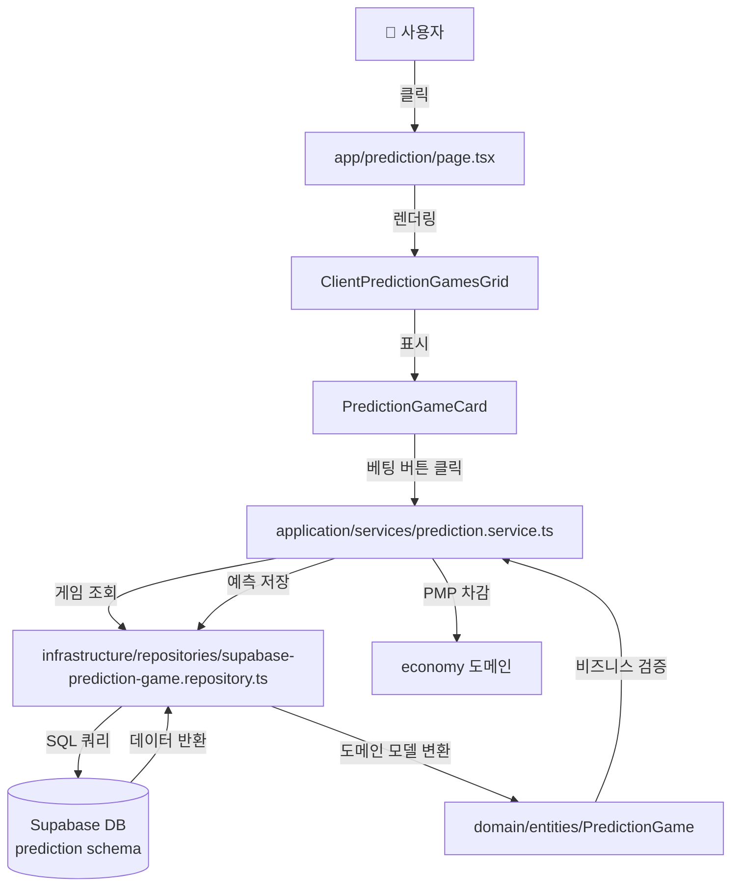

# PosMul DDD 아키텍처 완벽 가이드

> 🎯 이 문서는 PosMul 프로젝트의 DDD (Domain-Driven Design) 아키텍처를 **완벽히 이해**하기 위한 가이드입니다.

## 📚 목차

1. [핵심 개념](#핵심-개념)
2. [폴더 구조 전체 맵](#폴더-구조-전체-맵)
3. [각 계층 상세 설명](#각-계층-상세-설명)
4. [실전 예제로 이해하기](#실전-예제로-이해하기)
5. [파일 생성 가이드](#파일-생성-가이드)

---

## 핵심 개념

### DDD란?

**Domain-Driven Design** = 도메인(비즈니스 영역)을 중심으로 설계하는 방법론

```
❌ 기존 방식: 데이터베이스 중심 → UI → 로직
✅ DDD 방식: 도메인(비즈니스) 중심 → 계층 분리
```

### PosMul의 DDD 구조

```
src/
├── app/                    ← 🎨 프론트엔드 (Next.js Pages)
└── bounded-contexts/       ← 🏗️ 백엔드 (도메인 로직)
```

**핵심 포인트**:
- `app/` = **프레젠테이션 계층** (사용자가 보는 화면)
- `bounded-contexts/` = **비즈니스 로직** (실제 기능)

---

## 폴더 구조 전체 맵

### 전체 구조 (한눈에 보기)

```
posmul-web/src/
│
├── 🎨 app/                          # Next.js App Router (UI)
│   ├── prediction/                  # 예측 게임 페이지
│   │   ├── page.tsx                # /prediction 메인 페이지
│   │   ├── [gameId]/              
│   │   │   └── page.tsx            # /prediction/123 상세 페이지
│   │   └── components/             # 페이지 전용 컴포넌트
│   │       └── ClientPredictionGamesGrid.tsx
│   ├── invest/                      # 투자 페이지
│   ├── donate/                      # 기부 페이지
│   └── forum/                       # 포럼 페이지
│
├── 🏗️ bounded-contexts/            # DDD Bounded Contexts
│   ├── prediction/                  # 예측 게임 도메인
│   │   ├── domain/                 # 1️⃣ 도메인 계층
│   │   │   ├── entities/          # 엔티티 (핵심 비즈니스 객체)
│   │   │   │   ├── PredictionGame.ts
│   │   │   │   └── Prediction.ts
│   │   │   ├── value-objects/     # 값 객체
│   │   │   │   └── prediction-types.ts
│   │   │   └── repositories/      # 인터페이스만
│   │   │       └── IPredictionGameRepository.ts
│   │   │
│   │   ├── application/            # 2️⃣ 애플리케이션 계층
│   │   │   ├── services/          # 비즈니스 로직 조합
│   │   │   └── use-cases/         # 사용 사례
│   │   │
│   │   ├── infrastructure/         # 3️⃣ 인프라 계층
│   │   │   ├── repositories/      # DB 접근 구현
│   │   │   │   └── supabase-prediction-game.repository.ts
│   │   │   └── migrations/        # DB 마이그레이션
│   │   │       ├── 000_create_prediction_schema.sql
│   │   │       └── 001_prediction_games.sql
│   │   │
│   │   └── presentation/           # 4️⃣ 프레젠테이션 계층
│   │       └── components/        # 재사용 가능한 UI
│   │           ├── PredictionGameCard.tsx
│   │           └── mobile/
│   │               └── MobilePredictionCard.tsx
│   │
│   ├── investment/                  # 투자 도메인
│   ├── donation/                    # 기부 도메인
│   └── forum/                       # 포럼 도메인
│
├── 🔧 lib/                          # 공통 라이브러리
│   ├── supabase/                   # Supabase 클라이언트
│   └── utils/                      # 유틸리티
│
└── 🎯 shared/                       # 공유 컴포넌트
    └── ui/                         # 범용 UI 컴포넌트
        └── components/
```

---

## 각 계층 상세 설명

### 1️⃣ Domain (도메인 계층)

> **"비즈니스의 핵심 로직"** - 기술에 독립적

#### 📁 `domain/entities/` - 엔티티

**역할**: 비즈니스의 핵심 개념을 표현하는 객체

```typescript
// PredictionGame.ts
export class PredictionGame {
  constructor(
    public readonly id: PredictionGameId,
    public title: string,
    public description: string,
    public options: PredictionOption[],
    // ... 비즈니스 데이터
  ) {}
  
  // 비즈니스 로직
  canParticipate(): boolean {
    return this.status === GameStatus.ACTIVE;
  }
}
```

**특징**:
- ✅ 비즈니스 규칙 포함
- ✅ DB, API 모름 (순수 비즈니스)
- ✅ 도메인 전문가와 대화 가능

#### 📁 `domain/value-objects/` - 값 객체

**역할**: 도메인 개념을 표현하지만 ID가 없는 객체

```typescript
// prediction-types.ts
export enum PredictionType {
  BINARY = 'BINARY',      // 예/아니오
  WIN_DRAW_LOSE = 'WIN_DRAW_LOSE',  // 승/무/패
  RANKING = 'RANKING'     // 순위
}

export enum GameStatus {
  CREATED = 'CREATED',
  ACTIVE = 'ACTIVE',
  ENDED = 'ENDED',
  SETTLED = 'SETTLED'
}
```

#### 📁 `domain/repositories/` - 리포지토리 인터페이스

**역할**: 데이터 접근 **계약**만 정의 (구현 X)

```typescript
// IPredictionGameRepository.ts
export interface IPredictionGameRepository {
  findById(id: PredictionGameId): Promise<Result<PredictionGame | null>>;
  findActiveGames(): Promise<Result<PredictionGame[]>>;
  save(game: PredictionGame): Promise<Result<void>>;
}
```

---

### 2️⃣ Application (애플리케이션 계층)

> **"유스케이스 조율자"** - 도메인을 조합

#### 📁 `application/services/`

**역할**: 여러 도메인 로직을 조합

```typescript
// prediction.service.ts
export class PredictionService {
  async participateInGame(
    userId: string,
    gameId: string,
    optionId: string,
    stakeAmount: number
  ) {
    // 1. 게임 조회
    const game = await this.gameRepository.findById(gameId);
    
    // 2. 비즈니스 검증
    if (!game.canParticipate()) {
      throw new Error("참여 불가");
    }
    
    // 3. PMP 차감
    await this.economyService.deductPMP(userId, stakeAmount);
    
    // 4. 예측 저장
    await this.predictionRepository.save(prediction);
  }
}
```

---

### 3️⃣ Infrastructure (인프라 계층)

> **"외부 세계와의 연결"** - DB, API 등

#### 📁 `infrastructure/repositories/` - 리포지토리 구현

**역할**: 실제 DB 접근 코드

```typescript
// supabase-prediction-game.repository.ts
export class SupabasePredictionGameRepository 
  implements IPredictionGameRepository {
  
  async findById(id: PredictionGameId) {
    const { data, error } = await this.supabase
      .schema('prediction')  // ✅ prediction 스키마 사용
      .from('prediction_games')
      .select('*')
      .eq('id', id.value)
      .single();
      
    return this.toDomain(data);
  }
}
```

**현재 문제** ⚠️:
- `SupabasePredictionGameRepository`는 모든 메서드가 "Not implemented"
- 실제로는 `app/` 폴더에서 Supabase를 직접 호출 중

**올바른 방식**:
```typescript
// ❌ page.tsx에서
const { data } = await supabase.from('prediction_games').select('*');

// ✅ page.tsx에서
const games = await predictionRepository.findActiveGames();
```

#### 📁 `infrastructure/migrations/` - DB 마이그레이션

**역할**: 데이터베이스 스키마 관리

```sql
-- 000_create_prediction_schema.sql
CREATE SCHEMA IF NOT EXISTS prediction;

-- 001_prediction_games.sql
CREATE TABLE IF NOT EXISTS prediction.prediction_games (
  id UUID PRIMARY KEY,
  title TEXT NOT NULL,
  -- ...
);
```

---

### 4️⃣ Presentation (프레젠테이션 계층)

> **"재사용 가능한 UI 컴포넌트"**

#### 📁 `presentation/components/`

**역할**: 여러 페이지에서 재사용 가능한 컴포넌트

```typescript
// PredictionGameCard.tsx
export const PredictionGameCard = ({ game }: Props) => {
  return (
    <Card>
      <h3>{game.title}</h3>
      <p>{game.description}</p>
      <Button onClick={handleBet}>베팅하기</Button>
    </Card>
  );
};
```

**차이점**:
- `bounded-contexts/prediction/presentation/` = **도메인 전용** 재사용 컴포넌트
- `app/prediction/components/` = **페이지 전용** 컴포넌트 (Client Wrapper 등)

---

## 실전 예제로 이해하기

### 시나리오: "예측 게임에 참여하기"

#### 데이터 흐름



#### 코드 레벨 흐름

```typescript
// 1️⃣ UI에서 시작 (app/prediction/page.tsx)
export default async function PredictionPage() {
  // Server Component에서 데이터 fetch
  const games = await predictionRepository.findActiveGames();
  
  return <ClientPredictionGamesGrid games={games} />;
}

// 2️⃣ Client Component (app/prediction/components/)
export function ClientPredictionGamesGrid({ games }) {
  return games.map(game => (
    <PredictionGameCard 
      game={game}
      onBet={() => handleBet(game.id)}
    />
  ));
}

// 3️⃣ 재사용 컴포넌트 (bounded-contexts/prediction/presentation/)
export const PredictionGameCard = ({ game, onBet }) => {
  return (
    <Card>
      <Button onClick={onBet}>베팅하기</Button>
    </Card>
  );
};

// 4️⃣ 비즈니스 로직 (application/services/)
class PredictionService {
  async participateInGame(gameId, optionId, stake) {
    // 도메인 로직 사용
    const game = await this.repository.findById(gameId);
    
    if (!game.canParticipate()) {
      throw new DomainError("참여 불가");
    }
    
    // 저장
    await this.repository.save(prediction);
  }
}

// 5️⃣ DB 접근 (infrastructure/repositories/)
class SupabasePredictionGameRepository {
  async findById(id) {
    const { data } = await this.supabase
      .schema('prediction')  // ✅ DDD 원칙
      .from('prediction_games')
      .select('*')
      .eq('id', id);
    
    return PredictionGame.fromDatabase(data);
  }
}

// 6️⃣ 도메인 모델 (domain/entities/)
class PredictionGame {
  canParticipate(): boolean {
    return this.status === GameStatus.ACTIVE 
      && new Date() < this.endTime;
  }
}
```

---

## 파일 생성 가이드

### 새로운 기능을 추가할 때

#### 1. **UI만 필요한 경우** (간단한 페이지)

```
app/my-feature/
├── page.tsx              ← 페이지
└── components/           ← 페이지 전용 컴포넌트
    └── MyClientGrid.tsx
```

#### 2. **비즈니스 로직이 있는 경우** (DDD 적용)

```
bounded-contexts/my-feature/
├── domain/
│   ├── entities/
│   │   └── MyEntity.ts
│   ├── value-objects/
│   │   └── my-types.ts
│   └── repositories/
│       └── IMyRepository.ts
├── application/
│   └── services/
│       └── my.service.ts
├── infrastructure/
│   ├── repositories/
│   │   └── supabase-my.repository.ts
│   └── migrations/
│       └── 001_my_table.sql
└── presentation/
    └── components/
        └── MyCard.tsx

app/my-feature/
├── page.tsx              ← UI
└── components/
    └── ClientMyGrid.tsx  ← Client Wrapper
```

#### 생성 순서

1. **도메인 먼저** (비즈니스 이해)
   ```
   bounded-contexts/my-feature/domain/entities/MyEntity.ts
   ```

2. **인프라** (DB 설정)
   ```
   infrastructure/migrations/001_my_table.sql
   infrastructure/repositories/supabase-my.repository.ts
   ```

3. **애플리케이션** (로직 조합)
   ```
   application/services/my.service.ts
   ```

4. **프레젠테이션** (UI 컴포넌트)
   ```
   presentation/components/MyCard.tsx
   app/my-feature/page.tsx
   ```

---

## 자주 하는 실수 ❌

### 1. app에서 직접 DB 접근

```typescript
// ❌ 잘못된 방식
// app/prediction/page.tsx
const { data } = await supabase.from('prediction_games').select('*');

// ✅ 올바른 방식
const games = await predictionRepository.findActiveGames();
```

### 2. public 스키마 사용

```typescript
// ❌ 잘못된 방식
supabase.from('prediction_games')  // public 스키마

// ✅ 올바른 방식
supabase.schema('prediction').from('prediction_games')
```

### 3. 도메인에 기술 의존성

```typescript
// ❌ domain/entities/에서
import { supabase } from '@/lib/supabase';

// ✅ domain/entities/는 순수 비즈니스 로직만
export class PredictionGame {
  canParticipate(): boolean {
    return this.status === GameStatus.ACTIVE;
  }
}
```

---

## 체크리스트

새 기능 개발 시:

- [ ] 도메인 엔티티 정의
- [ ] DB 마이그레이션 작성 (✅ `prediction` 스키마 사용)
- [ ] Repository 인터페이스 정의
- [ ] Repository 구현 (Supabase)
- [ ] Application Service 작성
- [ ] Presentation Component 작성
- [ ] Page에서 사용

---

## 참고 문서

- [CLAUDE.md](./20251121/CLAUDE.md) - 전체 프로젝트 개요
- [DATABASE_SCHEMA_DDD.md](./20251121/DATABASE_SCHEMA_DDD.md) - DB 스키마 구조
- [Clean Architecture](https://blog.cleancoder.com/uncle-bob/2012/08/13/the-clean-architecture.html)
