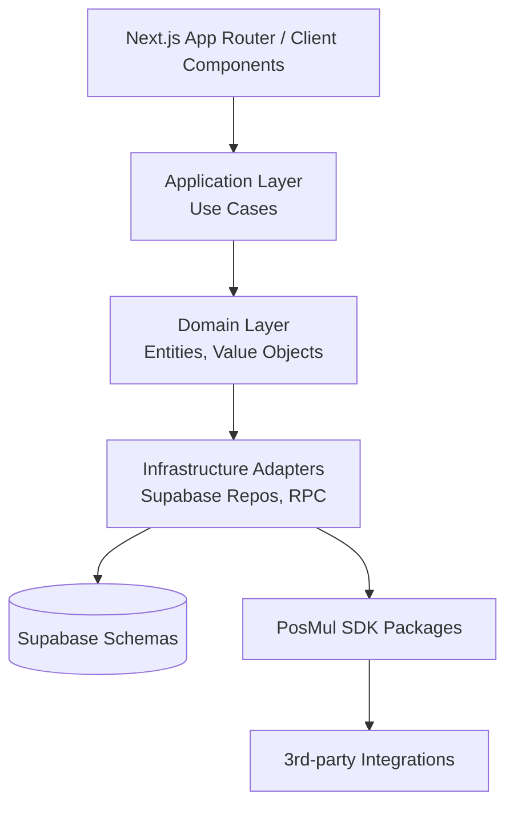
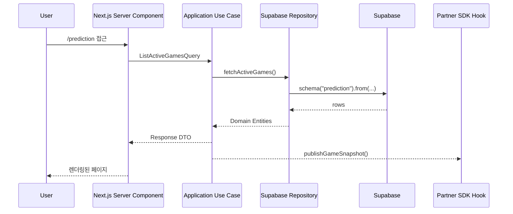
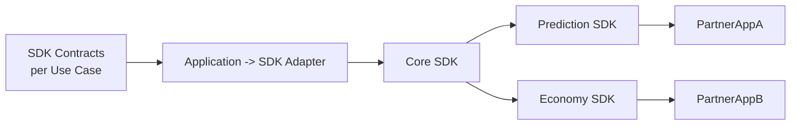

# PosMul DDD + Clean Architecture + SDK 확장 플랜

> 프로젝트 매니저 시점에서 정리한 차세대 구조 청사진입니다. 다음 개발자가 그대로 따라도 일관된 DDD 경계, 클린 계층, SDK 확장 전략을 유지할 수 있도록 세부 절차를 포함했습니다.

## 1. 비전과 성공 기준
- **Bounded Context 독립성**: `prediction`, `economy`, `user`, `donation`, `forum` 등 핵심 컨텍스트가 각자 스키마·리포지토리·SDK 모듈을 보유합니다.
- **Clean Architecture 계층 준수**: UI → Application Service → Domain → Infrastructure → 외부 리소스 순서만 허용합니다. 역방향 의존성 금지.
- **SDK-First 플랫폼**: PosMul SDK는 내부 웹앱이든 외부 파트너든 동일한 API 표면을 사용하며, 각 컨텍스트는 "SDK Contracts"를 우선 정의합니다.
- **테스트/릴리스 거버넌스**: 모든 유스케이스는 단위 테스트(도메인) + 통합 테스트(애플리케이션) + SDK 계약 테스트를 거쳐야 합니다.

## 2. 전체 구조 한눈에 보기

### 계층별 요약
| 계층 | 책임 | 구현 지침 |
| --- | --- | --- |
| Presentation (`apps/posmul-web/src/app`) | 서버/클라이언트 컴포넌트, 라우팅 | 데이터 로딩 로직 금지. `application` 계층만 호출. |
| Application (`bounded-contexts/*/application`) | 유스케이스, 서비스, DTO 매핑 | 트랜잭션/흐름 제어, Repo 인터페이스 사용. |
| Domain (`bounded-contexts/*/domain`) | 엔티티, 값 객체, 정책 | 상태 변화 규칙만 포함. 외부 기술 의존 금지. |
| Infrastructure (`bounded-contexts/*/infrastructure`) | Supabase, RPC, SDK 어댑터 | 모든 `.from`, `.rpc` 호출 위치. 스키마 명시 필수. |
| SDK (`packages/auth-economy-sdk`, 향후 `packages/*`) | 외부 개발자용 API 표면 | 내부 유스케이스를 감싸 동일 기능 제공. |

## 3. Bounded Context 운영 전략
- **폴더 규약**: `bounded-contexts/{context}/{domain|application|infrastructure|presentation|types}` 동일 구조 강제.
- **스키마 매핑**: 각 컨텍스트는 동일 이름의 Supabase 스키마만 접근. 예) `prediction` 컨텍스트는 `supabase.schema('prediction')`만 사용.
- **Context API Surface**: 유스케이스마다 `UseCaseResponseDTO` 정의, Presentation과 SDK 모두 이 DTO만 소비.

| 컨텍스트 | 핵심 유스케이스 | 우선순위 아티팩트 |
| --- | --- | --- |
| Prediction | 게임 등록, 참여, 정산 | `ListActiveGames`, `ParticipateInGame`, Supabase trigger 및 RPC | 
| Economy | PMP/PMC 지갑, 웨이브 배분 | `GetWalletSummary`, `TriggerMoneyWave`, `economy` 마이그레이션 | 
| User | 인증, 신뢰도, KYC | `GetCurrentUserProfile`, `UpdateReputation` | 
| Donation/Forum | 커뮤니티 활동/기부 | `ListCampaigns`, `PostForumThread` | 

## 4. 요청 흐름 예시

## 5. PosMul SDK 통합 전략
1. **계약 정의**: 각 유스케이스는 `sdk-contracts/{context}/{UseCase}.ts`에 타입 선언.
2. **내부 Adapter**: Application 계층이 결과를 `SdkPublisher` 포트로 전달 → SDK 패키지가 이벤트/HTTP/GraphQL 등으로 노출.
3. **패키지 구성**
   - `packages/posmul-core-sdk`: DTO, 에러, 공통 툴.
   - `packages/posmul-prediction-sdk`: 예측 게임 특화 API (`listGames`, `participate`).
   - `packages/posmul-economy-sdk`: 지갑 조회, MoneyWave 이벤트 스트림.

### SDK 제공 방식
- **Server SDK**: Node 런타임용. 내부 API Route, 파트너 백엔드에서 사용.
- **Client SDK**: Browser/Federated 모듈(필요 시). 민감 연산은 Server SDK 경유.
- **CLI/Automation**: `mcp-automation`에서 SDK 계약을 토대로 타입/문서 자동 생성.

## 6. 개발 플로우 & 체크리스트
1. **유스케이스 정의** → Notion/Linear 티켓에 입력, DTO 초안 확정.
2. **Domain Model 업데이트** → 값 객체/엔티티 + 단위 테스트.
3. **Application Use Case 구현** → Repo 인터페이스 주입, 에러 정책 문서화.
4. **Infrastructure Adapter 작성** → Supabase 쿼리, RPC, 스키마 프리픽스 확인.
5. **SDK Adapter 연동** → `SdkPublisher` 호출, 패키지 버전 증가.
6. **Presentation 연결** → 서버 컴포넌트에서 use-case 호출만 수행.
7. **검증 루틴**
   - `pnpm test {context}` (도메인)
   - `pnpm test:sdk {package}`
   - `pnpm lint && pnpm check` (계약 변경 감지)

## 7. 인수인계 메모
- **문서 위치**: 본 파일 + `docs/dev_guide/DDD_ARCHITECTURE_GUIDE.md` + `docs/dev_guide/SDK_ARCHITECTURE_ANALYSIS.md`
- **우선 리팩터링 후보**: `apps/posmul-web/src/app/*` 에 남아있는 Supabase 호출 → 해당 컨텍스트 use-case로 이동.
- **SDK 차기 목표**: `auth-economy-sdk`를 `posmul-core-sdk`로 리네이밍하고, Prediction/Economy 패키지를 분리.
- **추가 작업 제안**: Supabase codegen을 컨텍스트별로 재실행하여 타입 중복 제거.

---
이 플랜을 기준으로 티켓을 쪼개면 신규 개발자도 DDD + Clean Architecture + SDK 전략을 바로 이해하고 실행할 수 있습니다.
