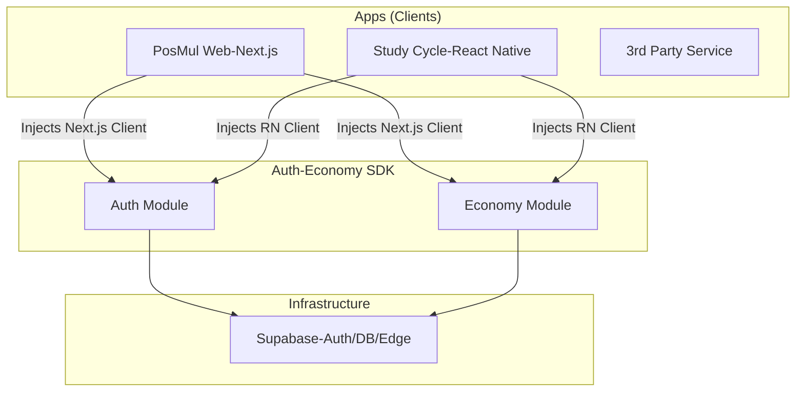

# Auth-Economy SDK 아키텍처 분석 및 제언

## 1. 분석 개요
사용자님께서 제기하신 `packages/auth-economy-sdk`의 적절성 여부와 향후 Supabase Social Auth 통합 방향성을 분석했습니다.

### 결론 요약
> **"SDK 방식은 PosMul의 생태계 확장 비전(Web + Mobile + 3rd Party)에 매우 적합합니다. 단, Auth 모듈은 Next.js SSR 환경과 Social Auth 지원을 위해 일부 리팩토링이 필요합니다."**

---

## 2. 모듈별 상세 분석

### ✅ Economy SDK (매우 적절함)
현재 `SupabaseEconomyService` 구현은 매우 훌륭합니다.
- **의존성 주입(DI)**: 생성자에서 `SupabaseClient`를 주입받도록 설계되어 있어, Next.js의 `createServerClient`나 `createBrowserClient` 등 어떤 클라이언트와도 유연하게 결합됩니다.
- **로직 캡슐화**: `transferPmp`, `stakePmp` 등 복잡한 경제 로직을 RPC 호출로 추상화하여, 프론트엔드에서 비즈니스 로직을 몰라도 되게 했습니다.
- **재사용성**: 향후 모바일 앱(`study-cycle`)이나 파트너사가 생기더라도 이 모듈만 import하면 즉시 경제 시스템 연동이 가능합니다.

### ⚠️ Auth SDK (보완 필요)
현재 `SupabaseAuthService`는 개선이 필요합니다.
- **클라이언트 생성 방식**: 내부에서 `createClient`를 직접 호출하고 `localStorage`를 강제하고 있습니다. 이는 Next.js의 **SSR(Server Side Rendering)** 환경에서 쿠키 기반 세션 관리와 충돌할 수 있습니다.
- **Social Auth 부재**: 현재 `signInWithOAuth` 메서드가 구현되어 있지 않습니다.

---

## 3. 향후 개선 제언 (Action Plan)

### 1단계: Auth SDK 리팩토링 (Next.js 호환성 강화)
Auth 서비스도 Economy 서비스처럼 **외부에서 Supabase Client를 주입받도록** 변경해야 합니다.
```typescript
// 변경 전
constructor(url: string, anonKey: string) {
  this.supabase = createClient(url, anonKey, ...); // 내부 생성 (유연성 부족)
}

// 변경 후 (권장)
constructor(private supabase: SupabaseClient) {} // 외부 주입 (Next.js 쿠키 클라이언트 사용 가능)
```

### 2단계: Social Auth 추가
SDK에 소셜 로그인 기능을 추가하여 3rd Party도 쉽게 사용할 수 있게 합니다.
```typescript
async signInWithSocial(provider: 'google' | 'kakao', redirectTo: string) {
  return this.supabase.auth.signInWithOAuth({
    provider,
    options: { redirectTo }
  });
}
```

### 3단계: "PosMul Connect" (장기 비전)
SDK를 통해 다른 서비스가 PosMul 아이디로 로그인(`Sign in with PosMul`)할 수 있도록, SDK가 OAuth Provider 역할을 대행하거나 래핑하는 구조로 발전시킬 수 있습니다.

---

## 4. 추천 아키텍처 다이어그램


