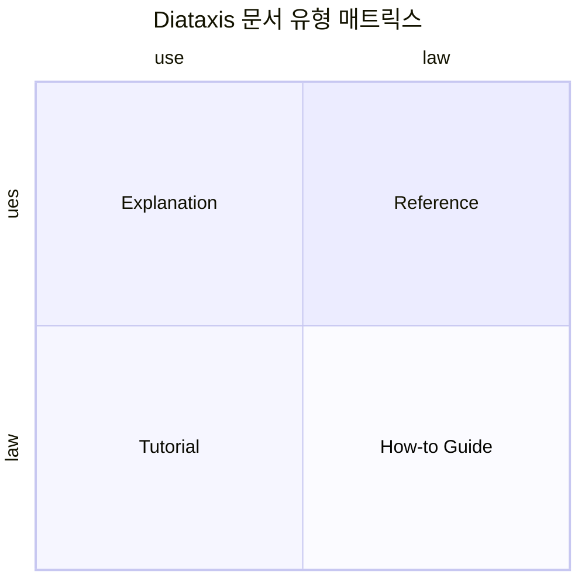
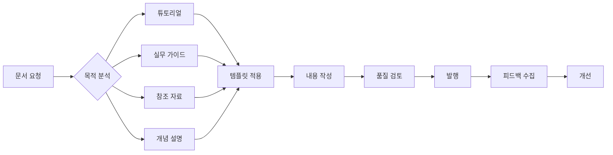

# Diataxis 문서 템플릿 시스템

> **"체계적인 기술 문서 작성을 위한 종합 프레임워크"**

## 📖 개요

Diataxis는 사용자의 요구사항을 4가지 핵심 유형으로 분류하여 체계적이고 효과적인 기술 문서를 작성할 수 있도록 도와주는 프레임워크입니다.

## 🎯 Diataxis 4가지 문서 유형



### 1. 📚 Tutorial (튜토리얼)

- **목적**: 안전한 환경에서의 학습 경험 제공
- **특징**: 단계별 안내, 실습 중심
- **대상**: 초보자, 처음 접하는 사용자
- **형태**: "학습을 위한 여행"

### 2. 🔧 How-to Guide (실무 가이드)

- **목적**: 구체적 문제 해결
- **특징**: 목적 지향적, 실무 중심
- **대상**: 중급 사용자, 문제 해결자
- **형태**: "레시피"

### 3. 📋 Reference (참조 자료)

- **목적**: 정확한 기술 정보 제공
- **특징**: 체계적, 포괄적, 정확성
- **대상**: 숙련된 사용자
- **형태**: "사전"

### 4. 💡 Explanation (개념 설명)

- **목적**: 깊이 있는 이해 제공
- **특징**: 배경 지식, 컨텍스트, 이론
- **대상**: 전문가, 심화 학습자
- **형태**: "토론"

## 📁 템플릿 구조

```
diataxis_template/
├── README.md                    # 이 파일
├── templates/
│   ├── tutorial.md             # 튜토리얼 템플릿
│   ├── how-to-guide.md         # 실무 가이드 템플릿
│   ├── reference.md            # 참조 자료 템플릿
│   ├── explanation.md          # 개념 설명 템플릿
│   └── landing-page.md         # 랜딩 페이지 템플릿
├── examples/
│   ├── tutorial-example.md     # 튜토리얼 예시
│   ├── how-to-example.md       # 실무 가이드 예시
│   ├── reference-example.md    # 참조 자료 예시
│   └── explanation-example.md  # 개념 설명 예시
├── guidelines/
│   ├── writing-style.md        # 작성 스타일 가이드
│   ├── content-strategy.md     # 콘텐츠 전략
│   └── quality-checklist.md    # 품질 체크리스트
└── tools/
    ├── content-audit.md        # 콘텐츠 감사 도구
    └── migration-guide.md      # 기존 문서 마이그레이션 가이드
```

## 🚀 빠른 시작

1. **문서 유형 식별**: 작성하려는 내용의 목적과 대상을 파악
2. **적절한 템플릿 선택**: 4가지 유형 중 가장 적합한 템플릿 사용
3. **템플릿 커스터마이징**: 프로젝트 요구사항에 맞게 조정
4. **품질 검증**: 체크리스트를 통한 최종 검토

## 📊 사용 이점

- ✅ **사용자 중심 설계**: 사용자의 실제 요구사항에 기반한 구조
- ✅ **명확한 목적성**: 각 문서의 목적과 역할이 명확
- ✅ **일관성 보장**: 표준화된 템플릿으로 일관된 품질
- ✅ **유지보수성 향상**: 체계적 구조로 관리 효율성 증대
- ✅ **검색성 개선**: 명확한 분류로 필요한 정보 빠른 접근

## 🔄 워크플로우



## 📈 성과 측정

- **사용자 만족도**: 문서 유용성 평가
- **완료율**: 튜토리얼/가이드 완주율
- **검색 성공률**: 원하는 정보 찾기 성공률
- **유지보수 효율성**: 문서 업데이트 소요 시간

## 🤝 기여 가이드

1. 이슈 등록을 통한 개선 제안
2. Pull Request를 통한 템플릿 개선
3. 예시 문서 추가 기여
4. 사용 경험 공유 및 피드백

## 📚 추가 자료

- [Diataxis 공식 웹사이트](https://diataxis.fr/)
- [Daniele Procida의 원본 프레젠테이션](https://www.youtube.com/watch?v=t4vKPhjcMZg)
- [PosMul 프로젝트 문서화 가이드](./guidelines/writing-style.md)

---

> 💡 **팁**: Diataxis는 강제적인 규칙이 아닌 가이드라인입니다. 프로젝트의 특성에 맞게 유연하게 적용하세요.
