# 💡 Explanation 템플릿

> **목적**: 깊이 있는 이해와 컨텍스트 제공  
> **대상**: 전문가, 심화 학습자  
> **형태**: "토론"

## 📋 메타데이터

```yaml
---
type: explanation
title: "[개념/주제] 심화 이해"
description: "[개념/주제]의 배경, 원리, 그리고 깊이 있는 통찰"
complexity: advanced
reading_time: "15-25분"
last_updated: "YYYY-MM-DD"
topics:
  - "[핵심 주제 1]"
  - "[핵심 주제 2]"
  - "[핵심 주제 3]"
related_concepts:
  - "[관련 개념 1]"
  - "[관련 개념 2]"
prerequisites:
  - "[필요한 배경 지식 1]"
  - "[필요한 배경 지식 2]"
tags: [explanation, concept, theory, deep-dive]
---
```

## 📚 목차 (Table of Contents)

- [🌟 개념 소개](#-개념-소개)
- [📜 역사적 배경과 맥락](#-역사적-배경과-맥락)
- [🔬 핵심 원리와 메커니즘](#-핵심-원리와-메커니즘)
- [🎯 실용적 관점과 적용](#-실용적-관점과-적용)
- [🤔 철학적 관점과 설계 원칙](#-철학적-관점과-설계-원칙)
- [⚖️ 장단점과 트레이드오프](#️-장단점과-트레이드오프)
- [🔮 미래 전망과 발전 방향](#-미래-전망과-발전-방향)
- [🔗 연관 개념과 관계](#-연관-개념과-관계)
- [📚 추가 학습 자료](#-추가-학습-자료)
- [🤝 토론과 논쟁점](#-토론과-논쟁점)
- [📝 결론과 핵심 인사이트](#-결론과-핵심-인사이트)

## 🌟 개념 소개

### 핵심 질문

이 설명 문서는 다음과 같은 근본적인 질문들에 답합니다:

- 🤔 **왜?** [개념/주제]가 필요한가?
- 🔍 **어떻게?** [개념/주제]가 작동하는가?
- 🌐 **언제?** [개념/주제]를 사용해야 하는가?
- 📊 **어떤 영향?** [개념/주제]의 장단점은?

### 정의와 범위

**[개념/주제]란**: [명확하고 포괄적인 정의]

**범위**: 이 문서에서 다루는 내용

- ✅ [포함 내용 1]
- ✅ [포함 내용 2]
- ❌ [제외 내용 1] (→ [관련 문서 링크])
- ❌ [제외 내용 2] (→ [관련 문서 링크])

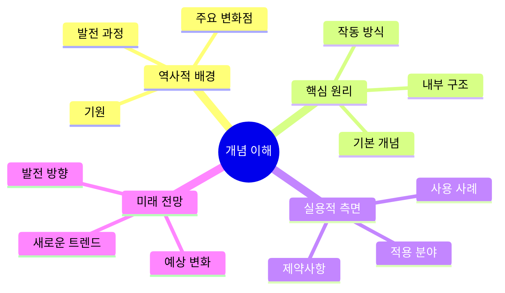

## 📜 역사적 배경과 맥락

### 기원과 발전

[개념/주제]의 역사적 발전 과정을 살펴보겠습니다.

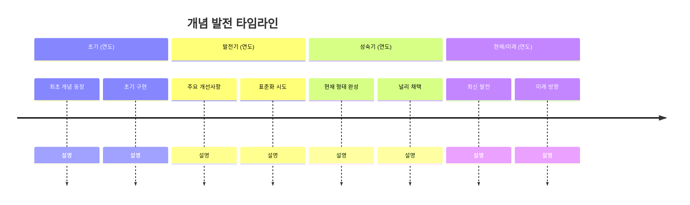

#### 주요 이정표들

**1단계: 초기 개념 (연도-연도)**

- **배경**: [당시 상황과 필요성]
- **핵심 인물**: [주요 인물들과 기여도]
- **초기 형태**: [원시적 형태의 특징]

**2단계: 발전과 개선 (연도-연도)**

- **주요 변화**: [어떤 변화가 있었는지]
- **기술적 발전**: [기술적 개선사항들]
- **도입 확산**: [어떻게 퍼져나갔는지]

**3단계: 현재 형태 (연도-현재)**

- **표준화**: [표준이 된 형태]
- **널리 채택**: [현재 사용 현황]
- **지속적 개선**: [현재진행형 발전]

### 왜 이 개념이 중요한가?

#### 해결하는 문제들

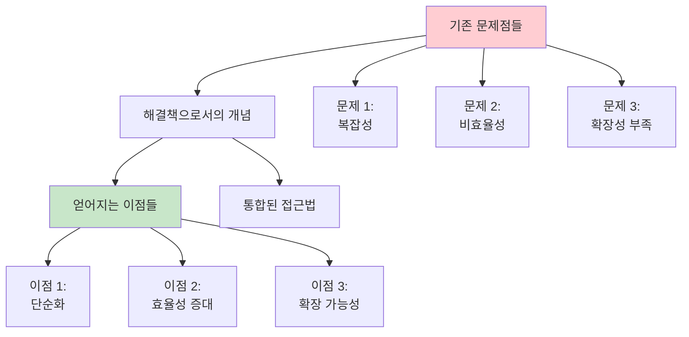

1. **복잡성 관리**: [어떻게 복잡한 문제를 단순화하는가]
2. **효율성 향상**: [기존 방식 대비 어떤 개선을 가져오는가]
3. **확장성 제공**: [규모 증가에 어떻게 대응하는가]

## 🔬 핵심 원리와 메커니즘

### 기본 작동 원리

#### 구조적 관점

[개념/주제]를 구조적으로 분해해 보겠습니다.

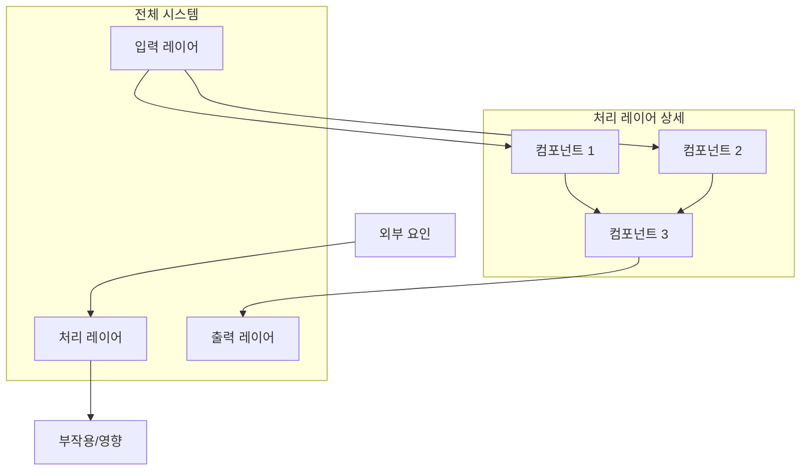

**주요 구성 요소:**

1. **입력 메커니즘**

   - 역할: [입력의 역할과 처리 방식]
   - 특징: [특별한 특징들]
   - 제약: [입력의 제약사항들]

2. **핵심 처리 로직**

   - 알고리즘: [사용되는 알고리즘이나 방법론]
   - 최적화: [효율성을 위한 최적화 방법]
   - 변형: [다양한 변형들과 차이점]

3. **출력 및 결과**
   - 형태: [결과물의 형태와 특성]
   - 검증: [결과 검증 방법]
   - 활용: [결과물 활용 방안]

### 심화 메커니즘

#### 내부 동작 과정

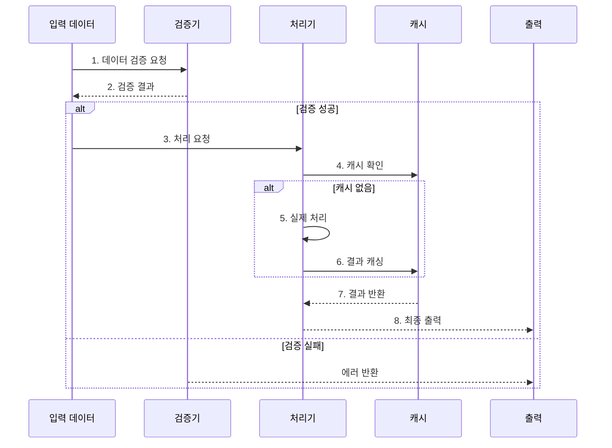

## 🎯 실용적 관점과 적용

### 언제 사용해야 하는가?

#### 적용 시나리오

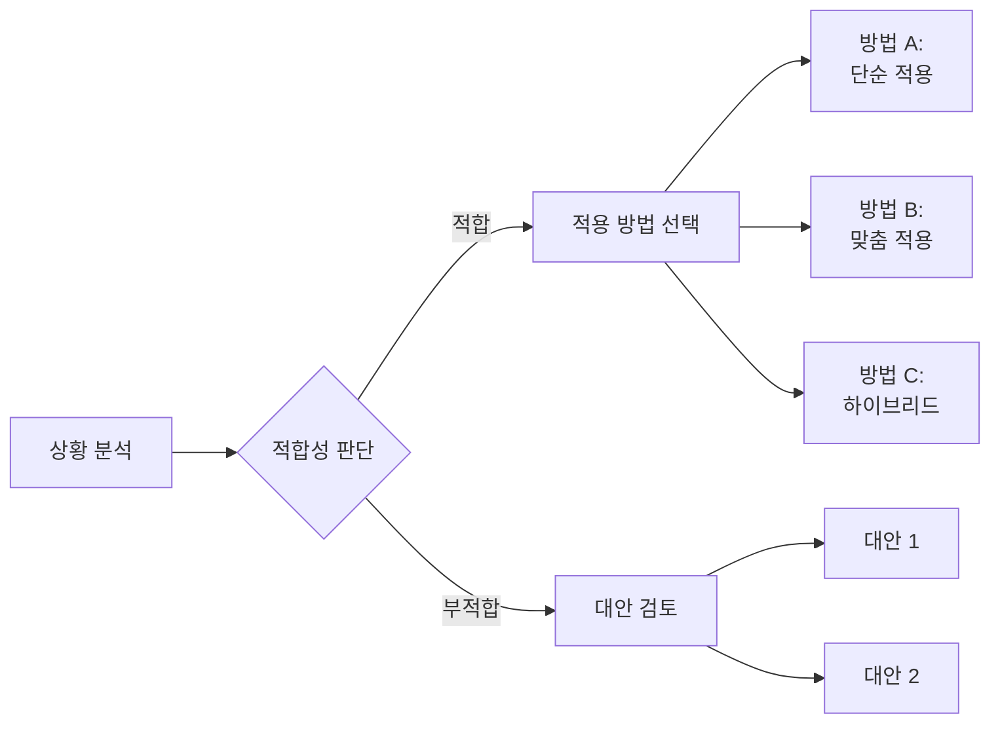

**적합한 상황들:**

- ✅ **규모**: [어느 정도 규모에서 효과적인가]
- ✅ **복잡도**: [어떤 복잡도 수준에 적합한가]
- ✅ **리소스**: [필요한 리소스 수준]
- ✅ **시간**: [시간적 제약 고려사항]

**부적합한 상황들:**

- ❌ **과도한 단순함**: [너무 단순한 경우의 문제점]
- ❌ **제약 사항**: [기술적/비즈니스적 제약]
- ❌ **대안의 우수성**: [더 나은 대안이 있는 경우]

### 실제 적용 사례

#### 사례 1: [구체적 도메인]

**배경**: [상황 설명]
**도전과제**: [해결해야 할 문제들]
**적용 방법**: [어떻게 개념을 적용했는가]
**결과**: [얻어진 결과와 효과]

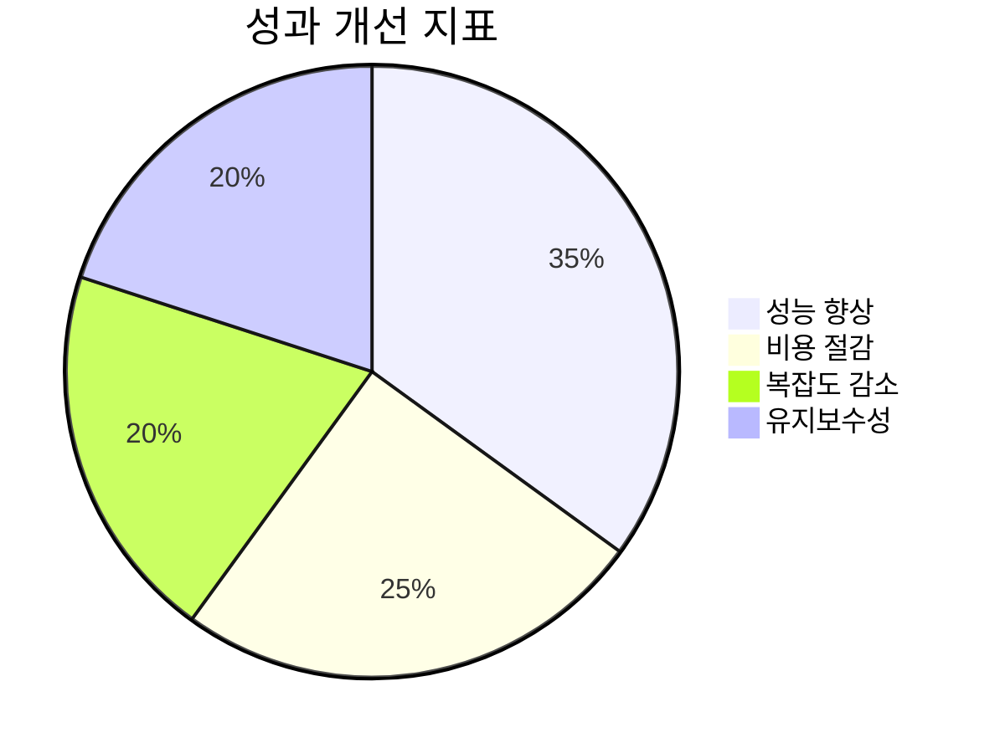

#### 사례 2: [다른 도메인]

**배경**: [다른 상황의 설명]
**특별한 고려사항**: [이 사례만의 특수성]
**변형 적용**: [기본 개념을 어떻게 변형했는가]
**교훈**: [얻은 교훈과 인사이트]

## 🤔 철학적 관점과 설계 원칙

### 기본 철학

[개념/주제]의 근본적인 철학과 가치관을 탐구해 보겠습니다.

#### 핵심 가치들

1. **[가치 1]**: [설명과 중요성]
2. **[가치 2]**: [설명과 중요성]
3. **[가치 3]**: [설명과 중요성]

#### 설계 원칙들

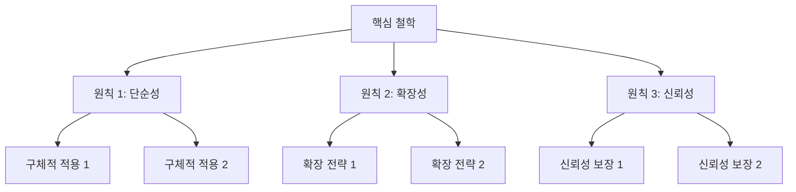

**원칙 1: [첫 번째 원칙]**

- 의미: [원칙의 구체적 의미]
- 적용: [실제 적용 방법]
- 예외: [예외 상황과 처리]

**원칙 2: [두 번째 원칙]**

- 의미: [원칙의 구체적 의미]
- 적용: [실제 적용 방법]
- 트레이드오프: [다른 원칙과의 균형]

## ⚖️ 장단점과 트레이드오프

### 이점 분석

#### 주요 장점들

```mermaid
radar
    title 개념의 강점 분석
    options:
      wrap: true
      tickInterval: 20
    data:
      effectiveness: 85
      efficiency: 90
      scalability: 75
      maintainability: 80
      flexibility: 70
      reliability: 95
```

1. **효과성 (85/100)**

   - **측면**: [어떤 측면에서 효과적인가]
   - **측정**: [효과성을 어떻게 측정하는가]
   - **비교**: [다른 접근법 대비 우위점]

2. **효율성 (90/100)**

   - **리소스**: [리소스 사용 효율성]
   - **시간**: [시간 효율성]
   - **비용**: [비용 효율성]

3. **확장성 (75/100)**
   - **수직적**: [성능 확장]
   - **수평적**: [기능 확장]
   - **제약**: [확장의 한계점]

### 단점과 한계

#### 주요 단점들

1. **복잡성 증가**

   - **원인**: [복잡성이 생기는 이유]
   - **영향**: [복잡성이 미치는 영향]
   - **완화**: [복잡성 완화 방법]

2. **학습 곡선**

   - **난이도**: [학습의 어려움 정도]
   - **필요 시간**: [숙달에 필요한 시간]
   - **지원**: [학습 지원 방안]

3. **의존성**
   - **기술적 의존성**: [의존하는 기술들]
   - **인적 의존성**: [필요한 전문성]
   - **리스크**: [의존성으로 인한 위험]

### 트레이드오프 분석

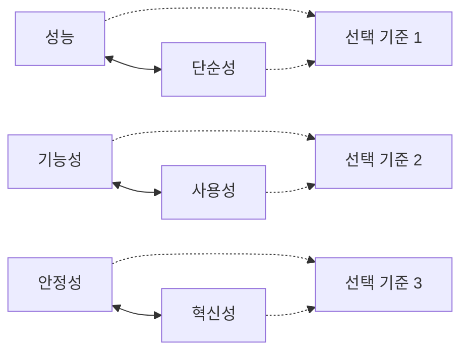

**성능 vs 단순성**

- 상황: [어떤 상황에서 이 트레이드오프가 중요한가]
- 선택 기준: [어떤 기준으로 선택하는가]
- 균형점: [적절한 균형점은 어디인가]

## 🔮 미래 전망과 발전 방향

### 현재 트렌드

#### 최신 발전사항

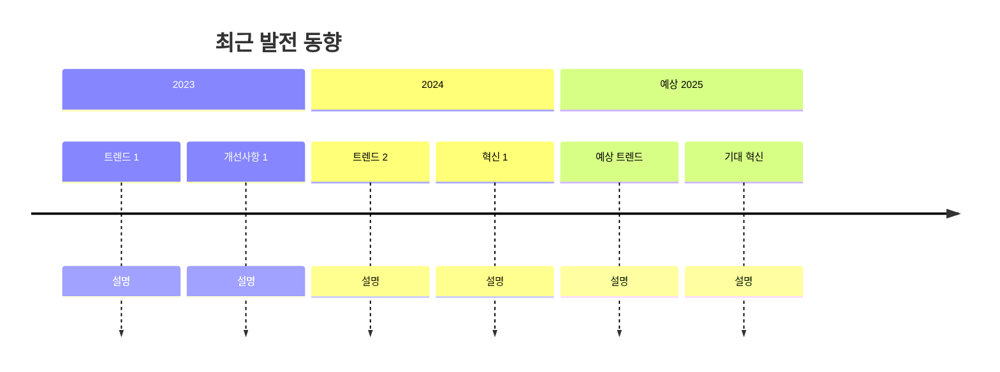

1. **기술적 발전**

   - AI/ML 통합: [인공지능과의 결합]
   - 자동화: [자동화 가능 영역]
   - 최적화: [성능 최적화 방향]

2. **생태계 변화**
   - 도구의 발전: [관련 도구들의 개선]
   - 표준화: [표준화 진행 상황]
   - 커뮤니티: [커뮤니티 성장]

### 미래 예측

#### 예상 변화들

- **단기 (1-2년)**

  - [구체적 예상 변화 1]
  - [구체적 예상 변화 2]

- **중기 (3-5년)**

  - [중기적 변화 전망]
  - [새로운 패러다임 가능성]

- **장기 (5년+)**
  - [혁명적 변화 가능성]
  - [완전히 새로운 접근법]

#### 영향받을 분야들

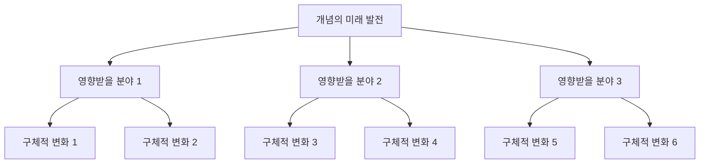

## 🔗 연관 개념과 관계

### 관련 개념들

#### 직접 관련 개념들

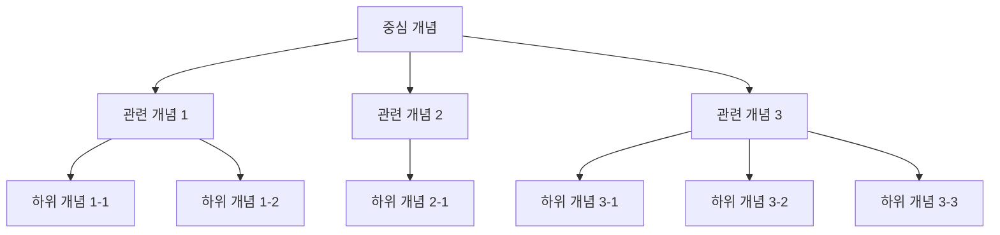

1. **[관련 개념 1]**

   - 관계: [어떤 관계인가]
   - 상호작용: [어떻게 상호작용하는가]
   - 시너지: [함께 사용시 이점]

2. **[관련 개념 2]**
   - 차이점: [주요 차이점들]
   - 보완관계: [어떻게 보완하는가]
   - 선택 기준: [언제 어떤 것을 선택하는가]

### 대안 접근법들

#### 경쟁 개념들

| 접근법       | 장점          | 단점          | 적합한 상황        |
| ------------ | ------------- | ------------- | ------------------ |
| **[대안 1]** | [주요 장점들] | [주요 단점들] | [적합한 사용 사례] |
| **[대안 2]** | [주요 장점들] | [주요 단점들] | [적합한 사용 사례] |
| **[대안 3]** | [주요 장점들] | [주요 단점들] | [적합한 사용 사례] |

## 📚 추가 학습 자료

### 심화 학습을 위한 리소스

#### 필수 읽기 자료

1. **[책/논문 제목 1]** by [저자]

   - 핵심 내용: [주요 내용 요약]
   - 읽어야 하는 이유: [왜 중요한가]
   - 난이도: [초급/중급/고급]

2. **[책/논문 제목 2]** by [저자]
   - 핵심 내용: [주요 내용 요약]
   - 읽어야 하는 이유: [왜 중요한가]
   - 난이도: [초급/중급/고급]

#### 실습 자료

- **[Tutorial 제목]**: [링크]
- **[How-to Guide 제목]**: [링크]
- **[실습 프로젝트]**: [링크]

#### 커뮤니티와 토론

- **포럼**: [주요 토론 포럼들]
- **컨퍼런스**: [관련 컨퍼런스들]
- **전문가**: [팔로우할 전문가들]

## 🤝 토론과 논쟁점

### 현재 진행중인 논쟁들

#### 논쟁점 1: [구체적 논쟁 주제]

**찬성 입장:**

- 근거 1: [찬성하는 이유]
- 근거 2: [추가 근거]

**반대 입장:**

- 근거 1: [반대하는 이유]
- 근거 2: [추가 근거]

**중립적 관점:**

- 분석: [객관적 분석]
- 결론: [현재까지의 결론]

#### 논쟁점 2: [또 다른 논쟁 주제]

[유사한 구조로 분석]

### 미해결 문제들

1. **[문제 1]**: [문제 설명과 현재 상황]
2. **[문제 2]**: [문제 설명과 해결 시도들]
3. **[문제 3]**: [문제 설명과 미래 전망]

## 📝 결론과 핵심 인사이트

### 핵심 메시지

이 개념에 대한 가장 중요한 이해는:

1. **[핵심 인사이트 1]**: [상세 설명]
2. **[핵심 인사이트 2]**: [상세 설명]
3. **[핵심 인사이트 3]**: [상세 설명]

### 실무자를 위한 조언

- **시작하는 사람들**: [초보자를 위한 조언]
- **중급 실무자들**: [중급자를 위한 조언]
- **전문가들**: [고급 전문가를 위한 조언]

### 마지막 생각

[개념에 대한 최종적인 철학적/실용적 관점]

---

**마지막 업데이트**: [날짜]  
**작성자**: [이름]  
**검토자**: [이름]  
**복잡도**: [초급/중급/고급]

## 🔖 용어집

- **[용어 1]**: [정의]
- **[용어 2]**: [정의]
- **[용어 3]**: [정의]

## 📖 참고문헌

1. [참고문헌 1] - [설명]
2. [참고문헌 2] - [설명]
3. [참고문헌 3] - [설명]
