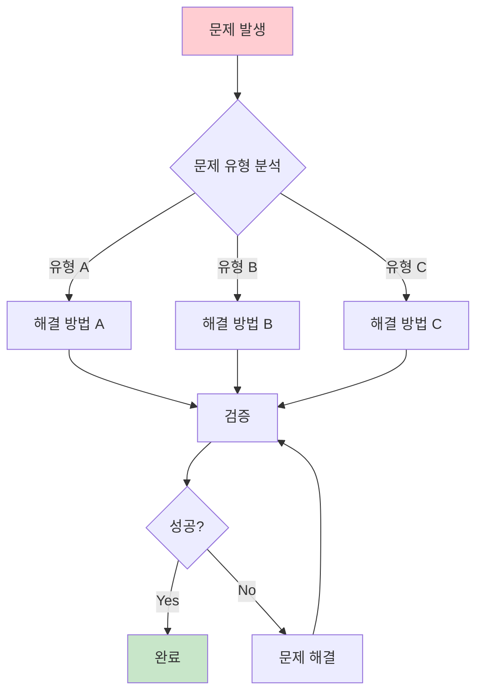
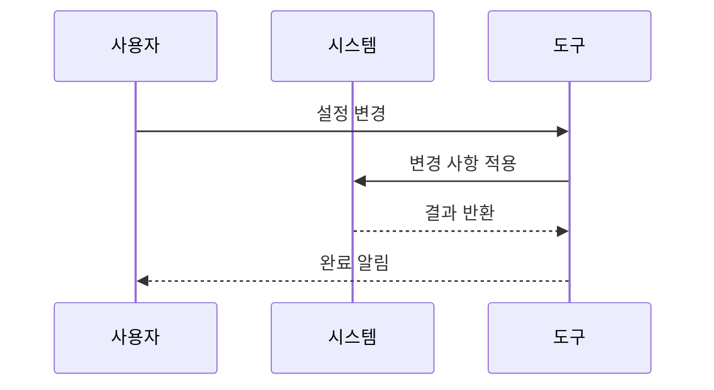
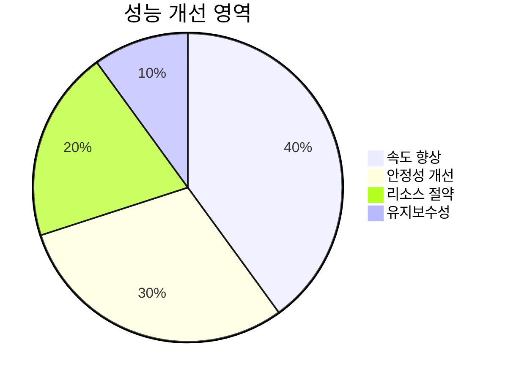

# 🔧 How-to Guide 템플릿

> **목적**: 구체적 문제 해결을 위한 실무 가이드  
> **대상**: 중급 사용자, 문제 해결이 필요한 사용자  
> **형태**: "레시피"

## 📋 메타데이터

```yaml
---
type: how-to-guide
title: "How to [구체적 작업/문제]"
description: "[문제/작업]을 해결하는 단계별 방법"
difficulty: intermediate
estimated_time: "15-30분"
last_updated: "YYYY-MM-DD"
prerequisites:
  - "[기본 지식/경험]"
  - "[필요한 도구/권한]"
use_cases:
  - "[사용 사례 1]"
  - "[사용 사례 2]"
related_guides:
  - "[관련 가이드 1]"
  - "[관련 가이드 2]"
tags: [how-to, guide, problem-solving]
---
```

## 📚 목차 (Table of Contents)

- [🎯 해결할 문제](#-해결할-문제)
- [🛠️ 사전 요구사항](#️-사전-요구사항)
- [📖 해결 단계](#-해결-단계)
  - [단계 1: [문제 진단]](#단계-1-문제-진단-️-5분)
  - [단계 2: [해결 방법 적용]](#단계-2-해결-방법-적용-️-10-15분)
  - [단계 3: [검증 및 마무리]](#단계-3-검증-및-마무리-️-5분)
- [🔍 문제 해결](#-문제-해결)
- [✅ 완료 체크리스트](#-완료-체크리스트)
- [🔄 대안 방법](#-대안-방법)
- [📊 성능 최적화](#-성능-최적화)
- [🔗 관련 가이드](#-관련-가이드)
- [🆘 도움 요청](#-도움-요청)
- [📈 모니터링 및 유지보수](#-모니터링-및-유지보수)

## 🎯 해결할 문제

이 가이드는 다음 상황에서 도움이 됩니다:

**문제 상황:**

- 🔴 [구체적 문제 상황 1]
- 🔴 [구체적 문제 상황 2]
- 🔴 [구체적 문제 상황 3]

**달성 목표:**

- ✅ [해결 후 달성할 목표 1]
- ✅ [해결 후 달성할 목표 2]



## 🛠️ 사전 요구사항

### 필수 준비사항

- **권한**: [필요한 권한/액세스]
- **도구**: [사용할 도구들]
- **지식**: [기본 이해도]
- **시간**: [예상 소요 시간]

### 사전 확인

작업 전 다음을 확인하세요:

```bash
# 권한 확인
command-to-check-permissions

# 도구 버전 확인
tool --version
```

> ⚠️ **중요**: [백업/복구 관련 주의사항]

## 📖 해결 단계

### 단계 1: [문제 진단] ⏱️ 5분

먼저 문제의 정확한 원인을 파악합니다.

#### 1.1 상태 확인

```bash
# 현재 상태 확인 명령어
status-command
```

**예상 출력:**

```
현재 상태: [상태 정보]
```

#### 1.2 로그 확인

```bash
# 관련 로그 확인
log-command --level=error
```

**문제 패턴 식별:**

- `Error Type A`: [해결 방법 A로 이동]
- `Error Type B`: [해결 방법 B로 이동]
- `Unknown Error`: [단계 2로 진행]

---

### 단계 2: [해결 방법 적용] ⏱️ 10-15분

#### 방법 A: [빠른 해결책]

**적용 조건**: [이 방법이 적합한 조건]

```bash
# 해결 명령어
fix-command --option=value
```

**확인:**

```bash
# 결과 확인
verify-command
```

#### 방법 B: [고급 해결책]

**적용 조건**: [이 방법이 적합한 조건]



1. **설정 백업**

   ```bash
   # 현재 설정 백업
   backup-config --output=backup.json
   ```

2. **설정 수정**

   ```json
   {
     "option1": "new_value",
     "option2": true,
     "option3": ["item1", "item2"]
   }
   ```

3. **변경 사항 적용**
   ```bash
   # 새 설정 적용
   apply-config --file=new-config.json
   ```

---

### 단계 3: [검증 및 마무리] ⏱️ 5분

#### 3.1 동작 확인

```bash
# 최종 테스트
test-command --comprehensive
```

**성공 지표:**

- ✅ [확인 항목 1]
- ✅ [확인 항목 2]
- ✅ [확인 항목 3]

#### 3.2 모니터링 설정

```bash
# 향후 모니터링 활성화
monitor-setup --alert=true
```

## 🔍 문제 해결

### 일반적인 문제들

#### 문제: [자주 발생하는 문제 1]

**증상**: [구체적 증상]
**원인**: [원인 설명]
**해결**:

```bash
# 해결 명령어
specific-fix-command
```

#### 문제: [자주 발생하는 문제 2]

**증상**: [구체적 증상]
**해결**: [해결 방법]

### 고급 문제 해결

**복잡한 상황**: [특수한 케이스]

1. [단계 1]
2. [단계 2]
3. [확인 방법]

## ✅ 완료 체크리스트

작업 완료를 확인하세요:

- [ ] **문제 해결**: 원래 문제가 해결됨
- [ ] **기능 확인**: 모든 기능이 정상 작동
- [ ] **부작용 확인**: 다른 기능에 영향 없음
- [ ] **문서화**: 변경 사항이 기록됨
- [ ] **모니터링**: 향후 추적 체계 구축

## 🔄 대안 방법

주 방법이 작동하지 않을 경우:

### 대안 1: [다른 접근법]

```bash
# 대안 명령어
alternative-command
```

### 대안 2: [수동 방법]

1. [수동 단계 1]
2. [수동 단계 2]

## 📊 성능 최적화

작업 후 성능 개선:



- **속도**: [개선 방법]
- **안정성**: [개선 방법]
- **리소스**: [절약 방법]

## 🔗 관련 가이드

**연관 작업:**

- [How-to: 관련 작업 1](link)
- [How-to: 관련 작업 2](link)
- [Tutorial: 기초 학습](link)
- [Reference: API 문서](link)

**고급 주제:**

- [복잡한 시나리오 가이드](link)
- [자동화 방법](link)
- [모니터링 설정](link)

## 🆘 도움 요청

막힌 부분이 있다면:

1. **로그 수집**:

   ```bash
   collect-logs --verbose
   ```

2. **상태 덤프**:

   ```bash
   dump-state --include-config
   ```

3. **지원 요청**:
   - 📧 이메일: [support@email.com]
   - 💬 채팅: [실시간 지원 링크]
   - 🎫 티켓: [지원 시스템 링크]

## 📈 모니터링 및 유지보수

### 정기 점검

```bash
# 주간 점검 스크립트
weekly-check.sh
```

### 알림 설정

```yaml
alerts:
  - type: error
    threshold: 5
    action: notify
  - type: performance
    threshold: 90%
    action: escalate
```

---

**마지막 업데이트**: [날짜]  
**작성자**: [이름]  
**검토자**: [이름]  
**난이도**: [초급/중급/고급]
