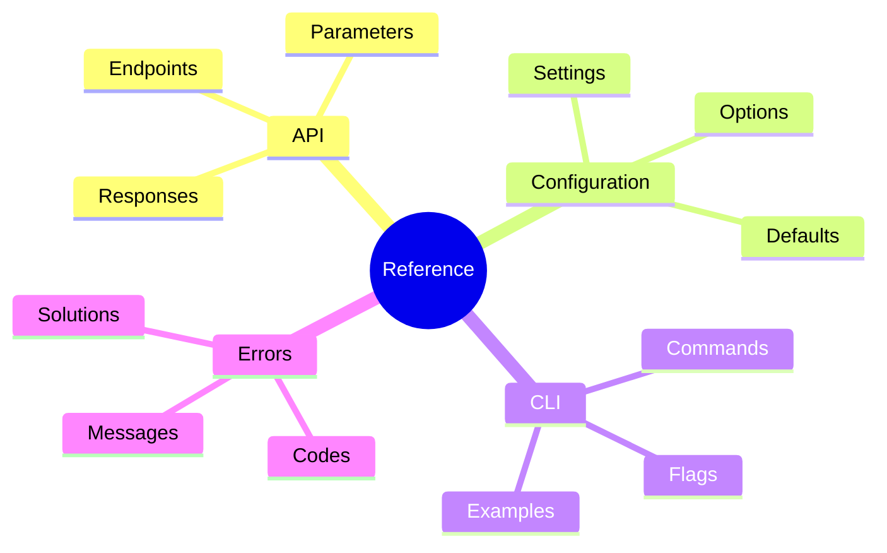
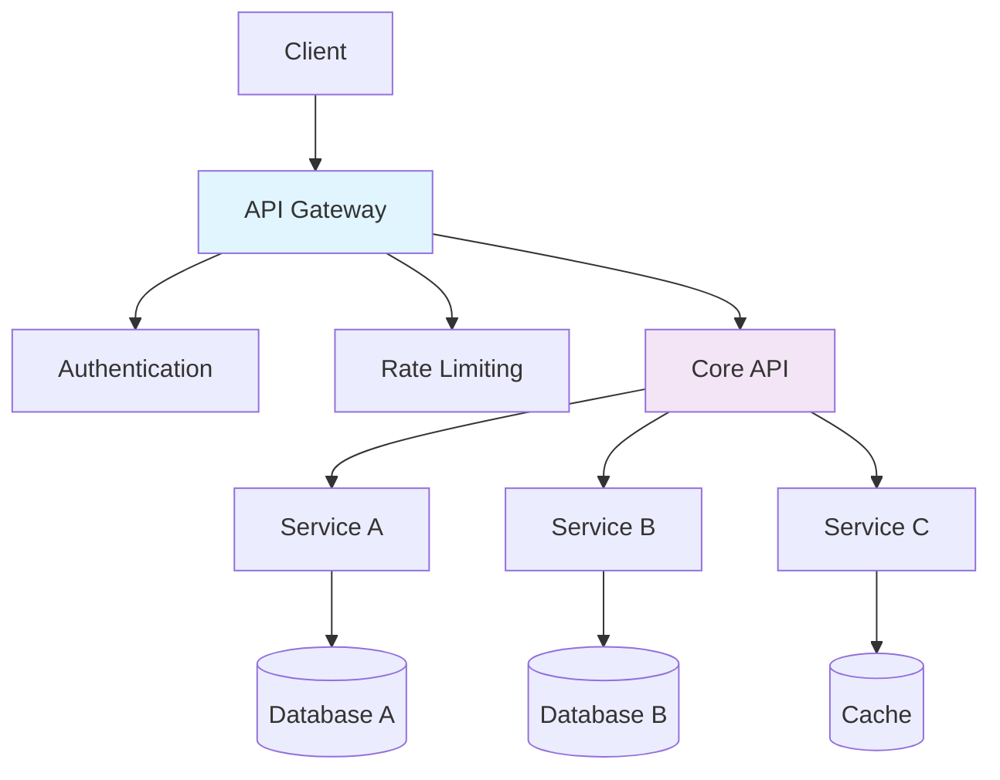
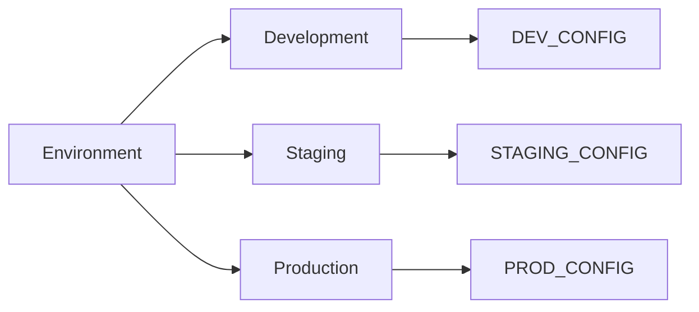
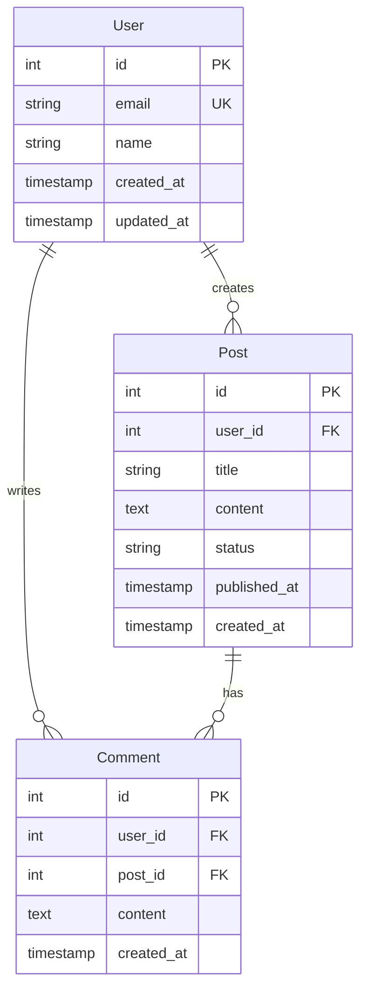
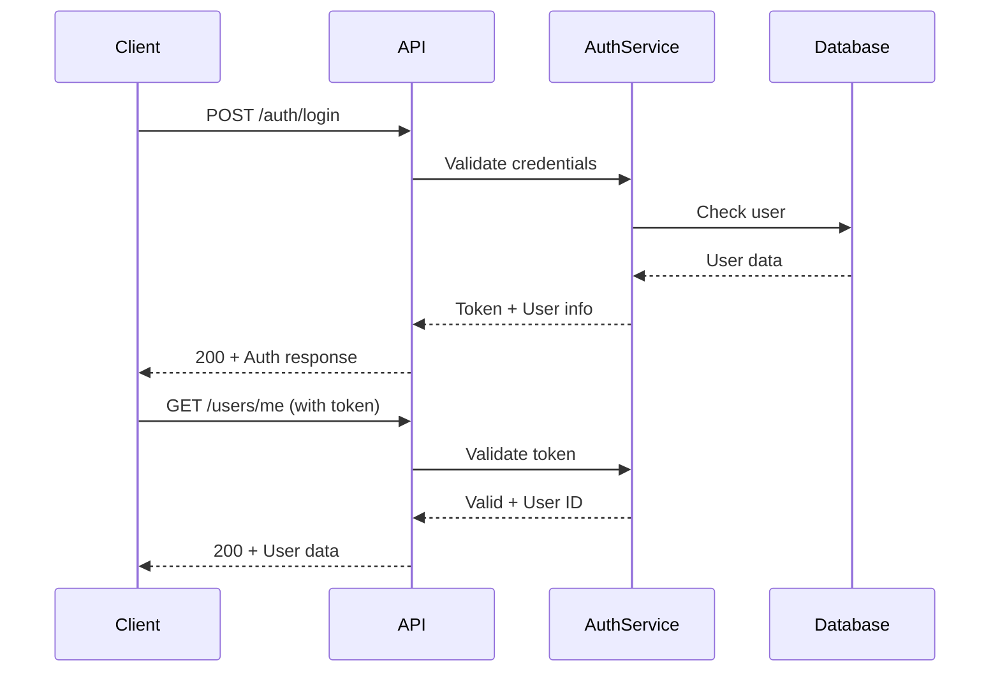

# 📋 Reference 템플릿

> **목적**: 정확한 기술 정보 제공  
> **대상**: 숙련된 사용자, 개발자  
> **형태**: "사전"

## 📋 메타데이터

```yaml
---
type: reference
title: "[기능/API/도구] Reference"
description: "[기능/API/도구]의 완전한 기술 참조 문서"
version: "v1.0.0"
last_updated: "YYYY-MM-DD"
api_version: "v2.0"
compatibility:
  - "Platform A v1.x"
  - "Platform B v2.x"
categories:
  - "API"
  - "Configuration"
  - "Commands"
tags: [reference, api, documentation]
---
```

## 📚 목차 (Table of Contents)

- [📖 개요](#-개요)
- [🏗️ 아키텍처 개요](#️-아키텍처-개요)
- [🔗 API 레퍼런스](#-api-레퍼런스)
  - [인증 (Authentication)](#인증-authentication)
  - [사용자 관리 (Users)](#사용자-관리-users)
- [⚙️ 설정 레퍼런스](#️-설정-레퍼런스)
- [💻 CLI 레퍼런스](#-cli-레퍼런스)
- [📊 데이터 스키마](#-데이터-스키마)
- [❌ 에러 레퍼런스](#-에러-레퍼런스)
- [🔧 SDK 및 라이브러리](#-sdk-및-라이브러리)
- [📚 예제 모음](#-예제-모음)
- [🔄 버전 히스토리](#-버전-히스토리)
- [📞 지원 및 문의](#-지원-및-문의)

## 📖 개요

### 목적

[기능/API/도구]의 모든 기술적 세부사항을 정확하고 포괄적으로 제공합니다.

### 범위

이 레퍼런스는 다음을 포함합니다:

- ✅ 모든 함수/메서드/엔드포인트
- ✅ 매개변수 및 반환값
- ✅ 설정 옵션
- ✅ 에러 코드 및 메시지
- ✅ 예제 코드



## 🏗️ 아키텍처 개요

### 구조도



### 핵심 컴포넌트

| 컴포넌트           | 설명                | 버전 | 상태      |
| ------------------ | ------------------- | ---- | --------- |
| **API Gateway**    | 요청 라우팅 및 인증 | v2.1 | 🟢 Stable |
| **Core API**       | 핵심 비즈니스 로직  | v1.8 | 🟢 Stable |
| **Authentication** | 사용자 인증/인가    | v1.2 | 🟡 Beta   |
| **Rate Limiting**  | 요청 제한 관리      | v1.0 | 🟢 Stable |

## 🔗 API 레퍼런스

### 기본 정보

**Base URL**: `https://api.example.com/v2`  
**Authentication**: Bearer Token  
**Content-Type**: `application/json`  
**Rate Limit**: 1000 requests/hour

### 엔드포인트 목록

#### 인증 (Authentication)

##### POST `/auth/login`

사용자 인증을 수행합니다.

**Parameters:**

```json
{
  "email": "string (required)",
  "password": "string (required)",
  "remember_me": "boolean (optional, default: false)"
}
```

**Request Example:**

```bash
curl -X POST https://api.example.com/v2/auth/login \
  -H "Content-Type: application/json" \
  -d '{
    "email": "user@example.com",
    "password": "securepassword"
  }'
```

**Response:**

```json
{
  "success": true,
  "data": {
    "token": "eyJhbGciOiJIUzI1NiIsInR5cCI6IkpXVCJ9...",
    "user": {
      "id": 123,
      "email": "user@example.com",
      "name": "John Doe"
    },
    "expires_at": "2024-01-01T00:00:00Z"
  }
}
```

**Status Codes:**

- `200`: 성공
- `400`: 잘못된 요청
- `401`: 인증 실패
- `429`: 요청 한도 초과

---

#### 사용자 관리 (Users)

##### GET `/users/{id}`

특정 사용자 정보를 조회합니다.

**Path Parameters:**

- `id` (integer, required): 사용자 ID

**Query Parameters:**

- `include` (string, optional): 포함할 관련 데이터 (`profile,settings,permissions`)

**Headers:**

- `Authorization`: Bearer {token}

**Response Schema:**

```json
{
  "id": "integer",
  "email": "string",
  "name": "string",
  "status": "enum [active, inactive, suspended]",
  "created_at": "string (ISO 8601)",
  "updated_at": "string (ISO 8601)",
  "profile": {
    "avatar_url": "string",
    "bio": "string",
    "website": "string"
  }
}
```

---

## ⚙️ 설정 레퍼런스

### 환경 변수



#### 필수 환경 변수

| 변수명         | 타입    | 기본값 | 설명                                 |
| -------------- | ------- | ------ | ------------------------------------ |
| `API_KEY`      | string  | -      | API 인증 키 (필수)                   |
| `DATABASE_URL` | string  | -      | 데이터베이스 연결 URL                |
| `PORT`         | integer | 3000   | 서버 포트                            |
| `LOG_LEVEL`    | enum    | info   | 로그 레벨 (debug, info, warn, error) |

#### 선택적 환경 변수

| 변수명            | 타입    | 기본값 | 설명                |
| ----------------- | ------- | ------ | ------------------- |
| `CACHE_TTL`       | integer | 3600   | 캐시 만료 시간 (초) |
| `MAX_CONNECTIONS` | integer | 100    | 최대 동시 연결 수   |
| `TIMEOUT`         | integer | 30000  | 요청 타임아웃 (ms)  |

### 설정 파일

#### config.yaml

```yaml
# 기본 설정
server:
  host: "0.0.0.0"
  port: 3000
  ssl:
    enabled: false
    cert_file: ""
    key_file: ""

# 데이터베이스 설정
database:
  type: "postgresql"
  host: "localhost"
  port: 5432
  name: "myapp"
  ssl_mode: "disable"

# 로깅 설정
logging:
  level: "info"
  format: "json"
  output: "stdout"

# 기능 플래그
features:
  new_ui: true
  analytics: false
  experimental_api: false
```

## 💻 CLI 레퍼런스

### 설치 및 업데이트

```bash
# 설치
npm install -g @company/cli-tool

# 업데이트
npm update -g @company/cli-tool

# 버전 확인
cli-tool --version
```

### 글로벌 옵션

| 옵션        | 단축 | 타입    | 기본값    | 설명           |
| ----------- | ---- | ------- | --------- | -------------- |
| `--help`    | `-h` | -       | -         | 도움말 표시    |
| `--version` | `-v` | -       | -         | 버전 정보 표시 |
| `--config`  | `-c` | string  | ~/.config | 설정 파일 경로 |
| `--verbose` | -    | boolean | false     | 상세 출력 모드 |
| `--quiet`   | `-q` | boolean | false     | 조용한 모드    |

### 명령어

#### init

새 프로젝트를 초기화합니다.

**사용법:**

```bash
cli-tool init [project-name] [options]
```

**옵션:**

- `--template <name>`: 템플릿 선택 (default, minimal, full)
- `--git`: Git 저장소 초기화
- `--force`: 기존 파일 덮어쓰기

**예제:**

```bash
# 기본 프로젝트 생성
cli-tool init my-project

# 템플릿으로 생성
cli-tool init my-project --template=minimal --git

# 강제 덮어쓰기
cli-tool init existing-project --force
```

#### deploy

애플리케이션을 배포합니다.

**사용법:**

```bash
cli-tool deploy [environment] [options]
```

**매개변수:**

- `environment`: 배포 환경 (dev, staging, prod)

**옵션:**

- `--build`: 배포 전 빌드 실행
- `--watch`: 변경 사항 감시
- `--rollback <version>`: 특정 버전으로 롤백

## 📊 데이터 스키마

### 데이터베이스 스키마



### 데이터 타입

#### User

```typescript
interface User {
  id: number;
  email: string;
  name: string;
  status: "active" | "inactive" | "suspended";
  profile?: UserProfile;
  created_at: string; // ISO 8601
  updated_at: string; // ISO 8601
}
```

#### UserProfile

```typescript
interface UserProfile {
  avatar_url?: string;
  bio?: string;
  website?: string;
  social_links?: {
    twitter?: string;
    github?: string;
    linkedin?: string;
  };
}
```

## ❌ 에러 레퍼런스

### HTTP 상태 코드

| 코드 | 이름                  | 설명             | 해결 방법          |
| ---- | --------------------- | ---------------- | ------------------ |
| 200  | OK                    | 요청 성공        | -                  |
| 201  | Created               | 리소스 생성 성공 | -                  |
| 400  | Bad Request           | 잘못된 요청      | 요청 파라미터 확인 |
| 401  | Unauthorized          | 인증 필요        | 토큰 확인          |
| 403  | Forbidden             | 권한 없음        | 권한 확인          |
| 404  | Not Found             | 리소스 없음      | URL 및 ID 확인     |
| 429  | Too Many Requests     | 요청 한도 초과   | 요청 빈도 조절     |
| 500  | Internal Server Error | 서버 오류        | 관리자 문의        |

### 애플리케이션 에러 코드

#### 인증 관련 (AUTH\_\*)

```json
{
  "error": {
    "code": "AUTH_INVALID_TOKEN",
    "message": "제공된 토큰이 유효하지 않습니다.",
    "details": {
      "token_type": "bearer",
      "expires_at": "2024-01-01T00:00:00Z"
    }
  }
}
```

**에러 코드 목록:**

- `AUTH_MISSING_TOKEN`: 토큰 누락
- `AUTH_INVALID_TOKEN`: 잘못된 토큰
- `AUTH_EXPIRED_TOKEN`: 만료된 토큰
- `AUTH_INSUFFICIENT_PERMISSIONS`: 권한 부족

#### 유효성 검사 (VALIDATION\_\*)

```json
{
  "error": {
    "code": "VALIDATION_FAILED",
    "message": "입력 데이터 검증에 실패했습니다.",
    "details": {
      "field_errors": {
        "email": ["올바른 이메일 형식이 아닙니다."],
        "password": ["비밀번호는 최소 8자 이상이어야 합니다."]
      }
    }
  }
}
```

## 🔧 SDK 및 라이브러리

### JavaScript SDK

#### 설치

```bash
npm install @company/sdk
```

#### 기본 사용법

```javascript
import { ApiClient } from "@company/sdk";

const client = new ApiClient({
  apiKey: "your-api-key",
  baseUrl: "https://api.example.com/v2",
});

// 사용자 조회
const user = await client.users.get(123);
console.log(user);
```

#### 메서드 레퍼런스

##### `ApiClient`

```typescript
class ApiClient {
  constructor(options: ApiClientOptions);

  // 사용자 관련
  users: {
    get(id: number): Promise<User>;
    create(data: CreateUserData): Promise<User>;
    update(id: number, data: UpdateUserData): Promise<User>;
    delete(id: number): Promise<void>;
  };

  // 인증 관련
  auth: {
    login(credentials: LoginCredentials): Promise<AuthResponse>;
    logout(): Promise<void>;
    refresh(): Promise<AuthResponse>;
  };
}
```

### Python SDK

#### 설치

```bash
pip install company-sdk
```

#### 기본 사용법

```python
from company_sdk import ApiClient

client = ApiClient(
    api_key='your-api-key',
    base_url='https://api.example.com/v2'
)

# 사용자 조회
user = client.users.get(123)
print(user)
```

## 📚 예제 모음

### 인증 플로우



### CRUD 작업 예제

```javascript
// Create
const newUser = await client.users.create({
  email: "new@example.com",
  name: "New User",
  password: "securepassword",
});

// Read
const user = await client.users.get(newUser.id);

// Update
const updatedUser = await client.users.update(user.id, {
  name: "Updated Name",
});

// Delete
await client.users.delete(user.id);
```

## 🔄 버전 히스토리

### v2.0.0 (2024-01-01)

- ✨ **신기능**: 새로운 인증 시스템
- 🔄 **변경**: API 응답 형식 개선
- ⚠️ **호환성**: v1.x와 호환되지 않음

### v1.8.0 (2023-12-01)

- ✨ **신기능**: 배치 처리 API 추가
- 🐛 **버그수정**: 타임아웃 이슈 해결
- 📈 **성능**: 응답 속도 20% 개선

### v1.7.0 (2023-11-01)

- ✨ **신기능**: 웹훅 지원
- 🔄 **변경**: 에러 메시지 표준화

## 📞 지원 및 문의

### 기술 지원

- 📧 **이메일**: api-support@company.com
- 💬 **채팅**: [Discord 커뮤니티](https://discord.gg/company)
- 📚 **문서**: [지식 베이스](https://docs.company.com)
- 🎫 **티켓**: [지원 시스템](https://support.company.com)

### 제품팀 연락

- 💼 **비즈니스**: business@company.com
- 🔧 **파트너십**: partners@company.com
- 🚀 **기능 요청**: [GitHub Issues](https://github.com/company/api/issues)

---

**마지막 업데이트**: [날짜]  
**문서 버전**: v2.0  
**API 버전**: v2.0  
**작성자**: [API Team]
