# [Domain Name] Task List 📝

> **목적**: [도메인명] 도메인의 체계적인 개발 계획과 작업 우선순위 관리  
> **범위**: MVP 개발부터 고급 기능까지 단계별 로드맵  
> **기간**: [X주] 개발 일정 (총 [Y]개 작업)

## 📚 목차 (Table of Contents)

- [🚀 Phase 1: MVP Development Tasks](#-phase-1-mvp-development-tasks)
  - [🥇 Week 1: [핵심 영역] (최고 우선순위)](#-week-1-핵심-영역-최고-우선순위)
  - [🥈 Week 2: Business Logic & Use Cases](#-week-2-business-logic--use-cases)
  - [🥉 Week 3: Frontend & Integration](#-week-3-frontend--integration)
  - [🔧 Week 4: Database & Infrastructure](#-week-4-database--infrastructure)
- [🧪 Testing Tasks](#-testing-tasks)
- [📊 Phase 2: Advanced Features (Week 5-8)](#-phase-2-advanced-features-week-5-8)
- [🎯 Task 우선순위 매트릭스](#-task-우선순위-매트릭스)
- [🔄 Task Dependencies Graph](#-task-dependencies-graph)
- [⚡ Quick Start Commands](#-quick-start-commands)
- [🎉 MVP 완성 체크리스트](#-mvp-완성-체크리스트)
- [📊 [Domain] 시스템 아키텍처](#-domain-시스템-아키텍처)
- [🔍 위험 관리 및 대응 계획](#-위험-관리-및-대응-계획)
- [📈 진행률 추적](#-진행률-추적)

## 🚀 **Phase 1: MVP Development Tasks**

### **🥇 Week 1: [핵심 영역] (최고 우선순위)**

#### **T1.1 - [핵심 엔티티] 구현**

- **Task ID**: `[DOMAIN]-001`
- **Priority**: 🔥 Critical
- **Estimate**: X days
- **Assignee**: [담당자 역할]
- **Dependencies**: None
- **Description**:
  ```typescript
  // 구현할 파일들:
  // src/bounded-contexts/[domain]/domain/entities/[entity].aggregate.ts
  // src/bounded-contexts/[domain]/domain/entities/[sub-entity].entity.ts
  // src/bounded-contexts/[domain]/domain/value-objects/[value-object].ts
  ```
- **Acceptance Criteria**:
  - [ ] [Entity] Aggregate 클래스 구현
  - [ ] [기능1, 기능2, 기능3] 지원
  - [ ] [상태 관리 로직] 구현
  - [ ] [Sub-Entity] Entity 구현
  - [ ] 도메인 규칙 검증 로직 포함

#### **T1.2 - [Value Objects] 구현**

- **Task ID**: `[DOMAIN]-002`
- **Priority**: 🔥 Critical
- **Estimate**: X days
- **Assignee**: [담당자 역할]
- **Dependencies**: `[DOMAIN]-001`
- **Description**:
  ```typescript
  // 구현할 파일들:
  // src/bounded-contexts/[domain]/domain/value-objects/[domain]-id.ts
  // src/bounded-contexts/[domain]/domain/value-objects/[status].ts
  // src/bounded-contexts/[domain]/domain/value-objects/[result].ts
  ```
- **Acceptance Criteria**:
  - [ ] [Domain]Id 브랜드 타입 구현
  - [ ] [Status] enum ([상태1, 상태2, 상태3])
  - [ ] [Result] value objects
  - [ ] 입력 검증 및 에러 처리

#### **T1.3 - Economy-Kernel 연동 인터페이스**

- **Task ID**: `EK-[XXX]`
- **Priority**: 🔥 Critical
- **Estimate**: X days
- **Assignee**: Backend Developer
- **Dependencies**: None
- **Description**:
  ```typescript
  // 구현할 파일들:
  // src/bounded-contexts/[domain]/domain/services/[domain]-economic.service.ts
  // src/shared/economy-kernel/events/[domain]-economic-events.ts
  ```
- **Acceptance Criteria**:
  - [ ] [Domain]EconomicService 구현
  - [ ] PMP/PMC 잔액 확인 기능
  - [ ] 경제 이벤트 정의 ([이벤트1, 이벤트2])
  - [ ] Result 패턴으로 에러 처리

---

### **🥈 Week 2: Business Logic & Use Cases**

#### **T2.1 - Repository 인터페이스**

- **Task ID**: `[DOMAIN]-003`
- **Priority**: 🔥 Critical
- **Estimate**: X days
- **Assignee**: Backend Developer
- **Dependencies**: `[DOMAIN]-001, [DOMAIN]-002`
- **Description**:
  ```typescript
  // 구현할 파일:
  // src/bounded-contexts/[domain]/domain/repositories/[entity].repository.ts
  ```
- **Acceptance Criteria**:
  - [ ] I[Entity]Repository 인터페이스 정의
  - [ ] CRUD 기본 메서드 ([메서드1, 메서드2, 메서드3])
  - [ ] Result 패턴 적용
  - [ ] 도메인 계층에서 인프라 의존성 없음

#### **T2.2 - Core Use Cases 구현**

- **Task ID**: `[DOMAIN]-004`
- **Priority**: 🔥 Critical
- **Estimate**: X days
- **Assignee**: Backend Developer
- **Dependencies**: `[DOMAIN]-003, EK-[XXX]`
- **Status**: 🚧 **진행 중** | ✅ **완료** | ⏳ **대기**
- **Description**:
  ```typescript
  // 구현할 파일들:
  // src/bounded-contexts/[domain]/application/use-cases/[action1].use-case.ts
  // src/bounded-contexts/[domain]/application/use-cases/[action2].use-case.ts
  // src/bounded-contexts/[domain]/application/dto/[domain]-use-case.dto.ts
  ```
- **Acceptance Criteria**:
  - [ ] [Action1] UseCase ([목적 설명])
  - [ ] [Action2] UseCase ([목적 설명])
  - [ ] [Action3] UseCase ([목적 설명])
  - [ ] 경제 시스템 연동 로직
  - [ ] 각 UseCase별 DTO 정의 및 비즈니스 규칙 검증

#### **T2.3 - Domain Events 구현**

- **Task ID**: `[DOMAIN]-005`
- **Priority**: 🔥 Critical
- **Estimate**: X days
- **Assignee**: Backend Developer
- **Dependencies**: `[DOMAIN]-004`
- **Status**: 🚧 **진행 중** | ✅ **완료** | ⏳ **대기**
- **Description**:
  ```typescript
  // 구현할 파일들:
  // src/bounded-contexts/[domain]/domain/events/[domain]-events.ts
  // src/bounded-contexts/[domain]/application/event-handlers/[event]-handler.ts
  ```
- **Acceptance Criteria**:
  - [ ] [Event1] ([발생 조건])
  - [ ] [Event2] ([발생 조건])
  - [ ] [Event3] ([발생 조건])
  - [ ] Event Handler 구현
  - [ ] Event-Driven Architecture 연동

---

### **🥉 Week 3: Frontend & Integration**

#### **T3.1 - [Domain]-Economy Service 연동**

- **Task ID**: `[DOMAIN]-006`
- **Priority**: 🟡 High
- **Estimate**: X days
- **Assignee**: Backend Developer
- **Dependencies**: `[DOMAIN]-004, [DOMAIN]-005`
- **Status**: 🚧 **진행 중** | ✅ **완료** | ⏳ **대기**
- **Description**:
  ```typescript
  // 구현할 파일:
  // src/bounded-contexts/[domain]/domain/services/[domain]-economic.service.ts
  ```
- **Acceptance Criteria**:
  - [ ] [Domain]EconomicService 구현
  - [ ] [경제적 제약 조건] 확인
  - [ ] 경제 이벤트 발행 로직
  - [ ] Anti-Corruption Layer 패턴 적용
  - [ ] Agency Theory & CAPM 알고리즘 구현

#### **T3.2 - [Domain] UI 컴포넌트**

- **Task ID**: `UI-[XXX]`
- **Priority**: 🟡 High
- **Estimate**: X days
- **Assignee**: Frontend Developer
- **Dependencies**: `[DOMAIN]-004`
- **Status**: 🚧 **진행 중** | ✅ **완료** | ⏳ **대기**
- **Description**:
  ```typescript
  // 구현할 파일들:
  // src/bounded-contexts/[domain]/presentation/components/[Component1].tsx
  // src/bounded-contexts/[domain]/presentation/components/[Component2].tsx
  // src/app/[domain]/page.tsx
  ```
- **Acceptance Criteria**:
  - [ ] [기능] 목록 컴포넌트 (Server Component)
  - [ ] [기능] 폼 (Client Component)
  - [ ] 실시간 [데이터] 시각화
  - [ ] 반응형 모바일 디자인
  - [ ] 로딩 상태 및 에러 처리
  - [ ] 경제 시스템 UI 연동

#### **T3.3 - [Domain] 대시보드**

- **Task ID**: `UI-[XXX]`
- **Priority**: 🟡 High
- **Estimate**: X days
- **Assignee**: Frontend Developer
- **Dependencies**: `EK-[XXX], UI-[XXX]`
- **Status**: 🚧 **진행 중** | ✅ **완료** | ⏳ **대기**
- **Description**:
  ```typescript
  // 구현할 파일들:
  // src/bounded-contexts/[domain]/presentation/components/[Domain]Dashboard.tsx
  // src/bounded-contexts/[domain]/presentation/components/[Feature]Panel.tsx
  ```
- **Acceptance Criteria**:
  - [ ] [Domain] 현황 대시보드
  - [ ] [특화 기능] 패널
  - [ ] [성과 지표] 시각화
  - [ ] 반응형 디자인과 Suspense 로딩 관리

---

### **🔧 Week 4: Database & Infrastructure**

#### **T4.1 - Supabase 스키마 마이그레이션**

- **Task ID**: `DB-[XXX]`
- **Priority**: 🟡 High
- **Estimate**: X days
- **Assignee**: Backend Developer
- **Dependencies**: `[DOMAIN]-001, [DOMAIN]-002`
- **Status**: 🚧 **진행 중** | ✅ **완료** | ⏳ **대기**
- **Description**:
  ```sql
  -- 구현할 파일들:
  -- src/bounded-contexts/[domain]/infrastructure/migrations/001_[tables].sql
  -- src/bounded-contexts/[domain]/infrastructure/migrations/run-migrations.ts
  ```
- **Acceptance Criteria**:
  - [ ] [main_table] 테이블 스키마
  - [ ] [related_tables] 테이블 스키마
  - [ ] 외래키 제약조건 및 인덱스
  - [ ] RLS (Row Level Security) 정책

#### **T4.2 - Repository 구현체**

- **Task ID**: `[DOMAIN]-007`
- **Priority**: 🟡 High
- **Estimate**: X days
- **Assignee**: Backend Developer
- **Dependencies**: `DB-[XXX], [DOMAIN]-003`
- **Status**: 🚧 **진행 중** | ✅ **완료** | ⏳ **대기**
- **Description**:
  ```typescript
  // 구현할 파일들:
  // src/bounded-contexts/[domain]/infrastructure/repositories/supabase-[entity].repository.ts
  ```
- **Acceptance Criteria**:
  - [ ] Supabase[Entity]Repository 완전 구현
  - [ ] 도메인 객체 ↔ 데이터베이스 매핑
  - [ ] 에러 처리 및 로깅
  - [ ] MCP 기반 트랜잭션 처리

#### **T4.3 - API Routes & Edge Functions**

- **Task ID**: `API-[XXX]`
- **Priority**: 🟡 High
- **Estimate**: X days
- **Assignee**: Backend Developer
- **Dependencies**: `[DOMAIN]-007`
- **Status**: 🚧 **진행 중** | ✅ **완료** | ⏳ **대기**
- **Description**:
  ```typescript
  // 구현할 파일들:
  // src/app/api/[domain]/route.ts
  // src/app/api/[domain]/[action]/route.ts
  ```
- **Acceptance Criteria**:
  - [ ] RESTful API 엔드포인트
  - [ ] [핵심 기능] API
  - [ ] API 문서화
  - [ ] 입력 검증 및 보안

---

## 🧪 **Testing Tasks**

#### **T5.1 - Domain Layer Tests**

- **Task ID**: `TEST-[XXX]`
- **Priority**: 🟢 Medium
- **Estimate**: X days
- **Assignee**: Backend Developer
- **Dependencies**: `[DOMAIN]-001, [DOMAIN]-002, [DOMAIN]-004`
- **Description**:
  ```typescript
  // 구현할 파일들:
  // src/bounded-contexts/[domain]/domain/entities/__tests__/[entity].test.ts
  // src/bounded-contexts/[domain]/application/use-cases/__tests__/
  ```
- **Acceptance Criteria**:
  - [ ] [Entity] Aggregate 테스트 (15+ 테스트 케이스)
  - [ ] Value Objects 검증 테스트
  - [ ] Use Cases 단위 테스트
  - [ ] Mock을 사용하지 않는 도메인 순수성 테스트

#### **T5.2 - Integration Tests**

- **Task ID**: `TEST-[XXX]`
- **Priority**: 🟢 Medium
- **Estimate**: X days
- **Assignee**: Backend Developer
- **Dependencies**: `[DOMAIN]-007, API-[XXX]`
- **Description**:
  ```typescript
  // 구현할 파일들:
  // src/bounded-contexts/[domain]/__tests__/integration/
  ```
- **Acceptance Criteria**:
  - [ ] [워크플로우] End-to-End 테스트
  - [ ] 경제 시스템 통합 테스트
  - [ ] 데이터베이스 트랜잭션 테스트

---

## 📊 **Phase 2: Advanced Features (Week 5-8)**

#### **T6.1 - [고급 기능] 구현**

- **Task ID**: `[DOMAIN]-[XXX]`
- **Priority**: 🟢 Medium
- **Estimate**: X days
- **Dependencies**: Phase 1 완료
- **Description**:
  ```typescript
  // 구현할 파일들:
  // src/bounded-contexts/[domain]/domain/services/[advanced-service].ts
  ```
- **Acceptance Criteria**:
  - [ ] [고급 기능1] 구현
  - [ ] [고급 기능2] 구현
  - [ ] [고급 기능3] 구현

#### **T6.2 - [특화 기능] 시스템**

- **Task ID**: `[FEATURE]-[XXX]`
- **Priority**: 🟢 Medium
- **Estimate**: X days
- **Dependencies**: `API-[XXX]`
- **Description**: [특화 기능 설명]

#### **T6.3 - [분석/도구] 기능**

- **Task ID**: `UI-[XXX]`
- **Priority**: 🟢 Medium
- **Estimate**: X days
- **Dependencies**: `TEST-[XXX]`
- **Description**: [분석 도구 설명]

---

## 🎯 **Task 우선순위 매트릭스**

| Task ID        | 우선순위    | 사용자 임팩트 | 기술적 복잡도 | 완료 예상일 | 비고       |
| -------------- | ----------- | ------------- | ------------- | ----------- | ---------- |
| `[DOMAIN]-001` | 🔥 Critical | High          | Medium        | Week 1      | 🚧 진행 중 |
| `[DOMAIN]-002` | 🔥 Critical | High          | Low           | Week 1      | ⏳ 대기    |
| `EK-[XXX]`     | 🔥 Critical | High          | Medium        | Week 1      | ⏳ 대기    |
| `[DOMAIN]-003` | 🔥 Critical | Medium        | Low           | Week 2      | ⏳ 대기    |
| `[DOMAIN]-004` | 🔥 Critical | High          | High          | Week 2      | ⏳ 대기    |
| `[DOMAIN]-005` | 🔥 Critical | Medium        | Medium        | Week 2      | ⏳ 대기    |
| `[DOMAIN]-006` | 🟡 High     | High          | Medium        | Week 3      | ⏳ 대기    |
| `UI-[XXX]`     | 🟡 High     | Very High     | Medium        | Week 3      | ⏳ 대기    |
| `DB-[XXX]`     | 🟡 High     | Medium        | Medium        | Week 4      | ⏳ 대기    |
| `[DOMAIN]-007` | 🟡 High     | Medium        | High          | Week 4      | ⏳ 대기    |
| `API-[XXX]`    | 🟡 High     | High          | High          | Week 4      | ⏳ 대기    |

---

## 🔄 **Task Dependencies Graph**

```mermaid
graph TD
    D001[DOMAIN-001 Core Entities ⏳] --> D002[DOMAIN-002 Value Objects ⏳]
    D002 --> D003[DOMAIN-003 Repository Interface ⏳]

    EK001[EK-XXX Economy Integration ⏳] --> D004[DOMAIN-004 Use Cases ⏳]
    D003 --> D004
    D004 --> D005[DOMAIN-005 Domain Events ⏳]

    D005 --> D006[DOMAIN-006 Economy Service ⏳]
    D004 --> UI001[UI-XXX Domain UI ⏳]
    EK001 --> UI002[UI-XXX Dashboard ⏳]

    D002 --> DB001[DB-XXX Database Schema ⏳]
    DB001 --> D007[DOMAIN-007 Repository Impl ⏳]
    D007 --> API001[API-XXX API Routes ⏳]

    style D001 fill:#fff3e0,stroke:#ff9800,stroke-width:2px
    style D002 fill:#fff3e0,stroke:#ff9800,stroke-width:2px
    style EK001 fill:#fff3e0,stroke:#ff9800,stroke-width:2px
    style D003 fill:#fff3e0,stroke:#ff9800,stroke-width:2px
    style D004 fill:#fff3e0,stroke:#ff9800,stroke-width:2px
    style D005 fill:#fff3e0,stroke:#ff9800,stroke-width:2px
    style D006 fill:#fff3e0,stroke:#ff9800,stroke-width:2px
    style DB001 fill:#fff3e0,stroke:#ff9800,stroke-width:2px
    style UI001 fill:#fff3e0,stroke:#ff9800,stroke-width:2px
    style UI002 fill:#fff3e0,stroke:#ff9800,stroke-width:2px
    style D007 fill:#fff3e0,stroke:#ff9800,stroke-width:2px
    style API001 fill:#fff3e0,stroke:#ff9800,stroke-width:2px
```



---

## ⚡ **Quick Start Commands**

### **이번 주 시작할 작업 (PowerShell)**

```powershell
# DOMAIN-001: [Domain] 엔티티 구현
cd src\bounded-contexts\[domain]\domain\entities
# [entity].aggregate.ts 파일 생성 및 구현

# EK-XXX: Economy-Kernel 연동
cd src\bounded-contexts\[domain]\domain\services
# [domain]-economic.service.ts 파일 생성 및 구현

# 개발 서버 실행 및 테스트
cd ..\..\..\..\..; npm run dev; npm test
```

---

## 🎉 **MVP 완성 체크리스트**

### **✅ Phase 1 완료 기준**

- [ ] **[DOMAIN]-001~007**: [Domain] Domain 완전 구현
- [ ] **EK-[XXX]**: Economy-Kernel 연동 완료
- [ ] **UI-[XXX]**: [Domain] UI 구현 완료
- [ ] **DB-[XXX]**: 데이터베이스 연동 완료
- [ ] **API-[XXX]**: API 연동 완료
- [ ] **TEST-[XXX]**: 핵심 기능 테스트 완료

### **🚀 출시 준비 현황**

- [ ] 사용자가 [핵심 기능] 사용 가능
- [ ] [경제적 보상] 시스템 작동
- [ ] 실시간 [데이터] 확인
- [ ] 모바일 반응형 UI
- [ ] 3초 이내 로딩 시간

**현재 상태**: 🎯 **MVP [X]% 완성, [남은 작업] 마무리하면 출시 가능**

---

## 📊 **[Domain] 시스템 아키텍처**

```mermaid
graph TD
    subgraph "[Domain] Core Flow"
        direction TB

        subgraph "[Feature Type 1]"
            F1[/"[기능 설명] <br/> ([조건])"/]
            F2["[사용자 액션]"]
            F3["[시스템 처리]"]
            F4["[결과 계산]"]

            F1 --> F2
            F2 --> F3
            F3 --> F4
        end

        subgraph "[Feature Type 2]"
            G1[/"[기능 설명] <br/> ([조건])"/]
            G2["[사용자 액션]"]
            G3["[시스템 처리]"]
            G4["[결과 계산]"]

            G1 --> G2
            G2 --> G3
            G3 --> G4
        end
    end

    subgraph "💰 Economic Integration"
        direction LR
        PMP["🪙 PMP<br/>([용도])"]
        PMC["💎 PMC<br/>([보상])"]
        MW["🌊 Money Wave<br/>([분배 방식])"]

        PMP -->|"[액션]"| F2
        PMP -->|"[액션]"| G2

        F4 -->|"[조건]"| PMC
        G4 -->|"[조건]"| PMC

        PMC --> MW
        MW -->|"재분배"| PMC
    end

    subgraph "📈 [Performance Metrics]"
        direction TB
        M1["[지표1]: [기준]"]
        M2["[지표2]: [기준]"]
        M3["[지표3]: [기준]"]
        M4["[지표4]: [기준]"]

        M1 --> M2 --> M3 --> M4
    end

    style F1 fill:#e3f2fd,stroke:#2196f3,stroke-width:2px
    style F2 fill:#e3f2fd,stroke:#2196f3,stroke-width:2px
    style F3 fill:#e3f2fd,stroke:#2196f3,stroke-width:2px
    style F4 fill:#e3f2fd,stroke:#2196f3,stroke-width:2px

    style G1 fill:#e8f5e9,stroke:#4caf50,stroke-width:2px
    style G2 fill:#e8f5e9,stroke:#4caf50,stroke-width:2px
    style G3 fill:#e8f5e9,stroke:#4caf50,stroke-width:2px
    style G4 fill:#e8f5e9,stroke:#4caf50,stroke-width:2px

    style PMP fill:#ffebee,stroke:#f44336,stroke-width:2px
    style PMC fill:#f3e5f5,stroke:#9c27b0,stroke-width:2px
    style MW fill:#e0f2f1,stroke:#009688,stroke-width:2px
```



---

## 🔍 **위험 관리 및 대응 계획**

### **🚨 주요 위험 요소**

| 위험 요소      | 확률   | 영향도 | 대응 전략 | 담당자   |
| -------------- | ------ | ------ | --------- | -------- |
| [기술적 위험1] | Medium | High   | [대응책1] | [담당자] |
| [리소스 위험]  | Low    | Medium | [대응책2] | [담당자] |
| [통합 위험]    | High   | High   | [대응책3] | [담당자] |

### **📋 위험 모니터링**

```mermaid
pie title 위험 분포
    "[위험유형1]" : 40
    "[위험유형2]" : 30
    "[위험유형3]" : 20
    "[위험유형4]" : 10
```



---

## 📈 **진행률 추적**

### **🎯 마일스톤**


### **📊 현재 진행률**

- **전체 진행률**: [X]% ([완료된 작업 수]/[전체 작업 수])
- **이번 주 목표**: [Y]% 달성
- **다음 마일스톤**: [날짜] - [마일스톤명]

---

_작성일: YYYY년 MM월_  
_Last Updated: [업데이트 내용]_
