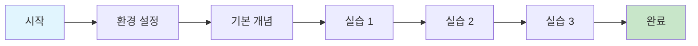
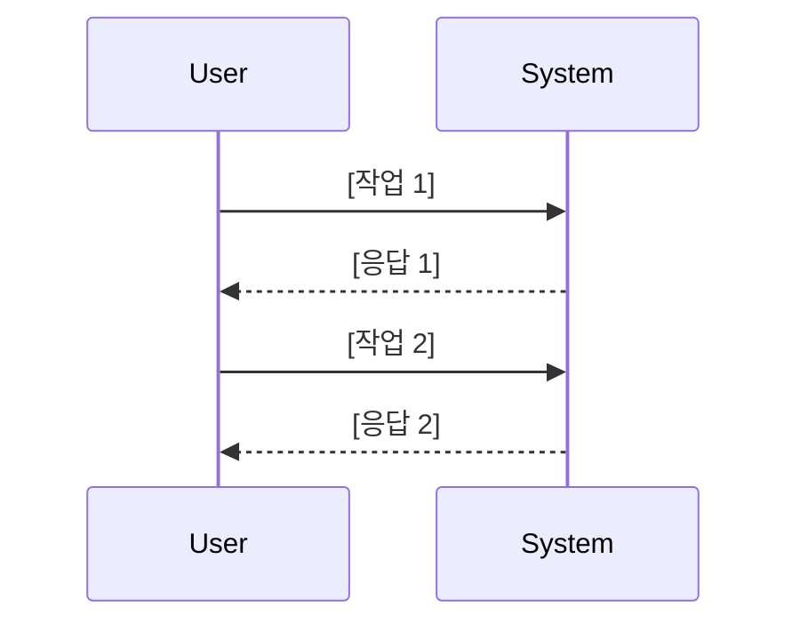

# 📚 Tutorial 템플릿

> **목적**: 안전한 환경에서 단계별 학습 경험 제공  
> **대상**: 초보자, 처음 접하는 사용자  
> **형태**: "학습을 위한 여행"

## 📋 메타데이터

```yaml
---
type: tutorial
title: "[제목] 시작하기"
description: "이 튜토리얼을 통해 [기능/도구]의 기본 사용법을 익힐 수 있습니다"
difficulty: beginner
estimated_time: "30-60분"
last_updated: "YYYY-MM-DD"
prerequisites:
  - "기본적인 [관련 지식]"
  - "[필요한 도구] 설치"
learning_outcomes:
  - "[학습 목표 1]"
  - "[학습 목표 2]"
  - "[학습 목표 3]"
tags: [tutorial, beginner, getting-started]
---
```

## 📚 목차 (Table of Contents)

- [🎯 학습 목표](#-학습-목표)
- [🛠️ 사전 준비사항](#️-사전-준비사항)
- [📖 단계별 가이드](#-단계별-가이드)
  - [1단계: 환경 설정](#1단계-환경-설정-10분)
  - [2단계: [단계 제목]](#2단계-단계-제목-15분)
  - [3단계: [실제 프로젝트 만들기]](#3단계-실제-프로젝트-만들기-20분)
- [✅ 완료 확인](#-완료-확인)
- [🎉 축하합니다!](#-축하합니다)
- [🚀 다음 단계](#-다음-단계)
- [🆘 문제 해결](#-문제-해결)
- [📝 피드백](#-피드백)

## 🎯 학습 목표

이 튜토리얼을 완료하면 다음을 할 수 있게 됩니다:

- [ ] **[구체적 목표 1]**: [상세 설명]
- [ ] **[구체적 목표 2]**: [상세 설명]
- [ ] **[구체적 목표 3]**: [상세 설명]



## 🛠️ 사전 준비사항

### 필수 요구사항

- **시스템**: [운영체제/버전]
- **소프트웨어**: [필요한 도구들]
- **지식**: [기본 지식 수준]

### 설치 확인

다음 명령어로 준비상태를 확인하세요:

```bash
# 예시 확인 명령어
command --version
```

**예상 출력:**

```
version x.x.x
```

> ⚠️ **주의**: 다른 결과가 나오면 [링크]를 참조하여 설정을 완료하세요.

## 📖 단계별 가이드

### 1단계: 환경 설정 (10분)

**목표**: [1단계에서 달성할 목표]

#### 1.1 [세부 작업]

1. [구체적 행동 1]

   ```bash
   # 예시 명령어
   command action
   ```

2. [구체적 행동 2]
   - [세부 설명]
   - [주의사항]

**확인하기**: [결과 확인 방법]

```bash
# 확인 명령어
check-command
```

**예상 결과**:

```
Expected output here
```

> 💡 **팁**: [도움이 되는 추가 정보]

---

### 2단계: [단계 제목] (15분)

**목표**: [2단계에서 달성할 목표]



#### 2.1 [세부 작업]

[상세한 단계별 설명]

**코드 예시**:

```javascript
// 예시 코드
function example() {
  return "Hello World";
}
```

**실행 결과**:

```
Hello World
```

#### 2.2 [다음 세부 작업]

[계속된 설명...]

---

### 3단계: [실제 프로젝트 만들기] (20분)

**목표**: [실용적인 예제 완성]

이제 배운 내용을 활용해 실제 [프로젝트/예제]를 만들어보겠습니다.

#### 3.1 프로젝트 구조

```
project/
├── src/
│   ├── main.js
│   └── utils.js
├── docs/
│   └── README.md
└── package.json
```

#### 3.2 구현

[단계별 구현 가이드...]

**최종 코드**:

```javascript
// 완성된 코드 예시
const result = processData(input);
console.log(result);
```

## ✅ 완료 확인

다음 체크리스트로 학습 완료를 확인하세요:

- [ ] **환경 설정**: 모든 도구가 올바르게 설치됨
- [ ] **기본 개념**: [핵심 개념] 이해
- [ ] **실습 완료**: 모든 예제가 정상 작동
- [ ] **프로젝트**: 최종 프로젝트가 완성됨

## 🎉 축하합니다!

튜토리얼을 완료했습니다! 이제 다음을 할 수 있습니다:

- ✨ [달성한 능력 1]
- ✨ [달성한 능력 2]
- ✨ [달성한 능력 3]

## 🚀 다음 단계

학습을 계속하려면:

1. **How-to 가이드**: [관련 실무 가이드 링크]
2. **심화 튜토리얼**: [다음 레벨 튜토리얼]
3. **레퍼런스**: [관련 API 문서]
4. **커뮤니티**: [포럼/채팅 링크]

## 🆘 문제 해결

### 자주 발생하는 문제

#### 문제 1: [일반적 에러]

**증상**: [에러 메시지 또는 현상]
**해결**: [단계별 해결 방법]

#### 문제 2: [또 다른 문제]

**증상**: [증상 설명]
**해결**: [해결 방법]

### 추가 도움

- 📧 **이메일**: [support@email.com]
- 💬 **채팅**: [Discord/Slack 링크]
- 📚 **문서**: [추가 문서 링크]
- 🐛 **버그 신고**: [GitHub Issues]

## 📝 피드백

이 튜토리얼을 개선하는 데 도움을 주세요:

- ⭐ **만족도**: [1-5점 평가]
- 🕐 **소요 시간**: [실제 소요 시간]
- 💭 **개선 제안**: [의견 작성란]

---

**마지막 업데이트**: [날짜]  
**작성자**: [이름]  
**검토자**: [이름]
