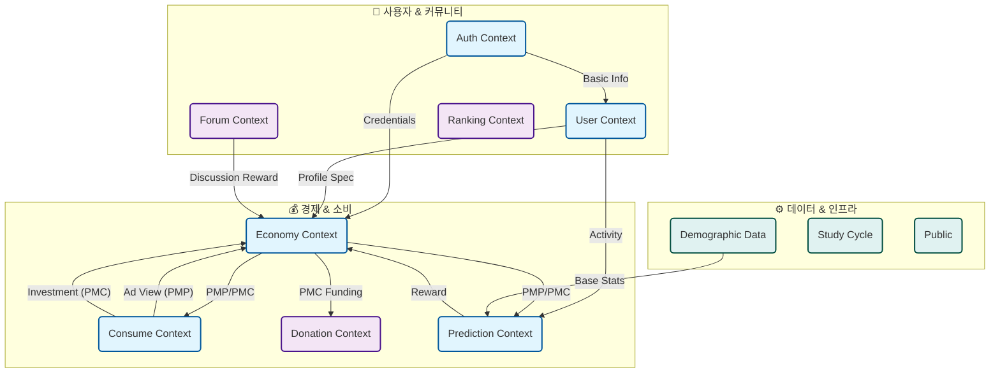

# PosMul 플랫폼 도메인 아키텍처 개요

> **작성일**: 2025-12-25
> **목적**: 플랫폼 전체 구조와 11개 핵심 도메인의 역할을 한눈에 파악하기 위함

---

## 🏗️ 전체 시스템 아키텍처 (Overview)

PosMul 플랫폼은 **11개의 Bounded Context(도메인)**로 구성되어 있으며, 각 도메인은 독립적인 역할을 수행하면서도 유기적으로 연결되어 거대한 **경제 민주주의 생태계**를 형성합니다.

### 도메인 관계도 (Domain Relationship Diagram)

---

## 🏛️ 아키텍처 원칙 (Architecture Principles)

우리는 시스템의 복잡성을 관리하고 안정성을 높이기 위해 다음 원칙을 따릅니다.

1.  **Schema-per-Bounded-Context**: 모든 도메인은 **자신만의 데이터베이스**를 가집니다. 다른 도메인의 데이터를 직접 조회하지 않고, API나 이벤트를 통해 소통합니다.
2.  **Hexagonal Architecture**: 비즈니스 로직(도메인)을 외부 기술(DB, UI)로부터 철저히 분리하여 보호합니다.
3.  **Local First UI**: 복잡한 UI 컴포넌트는 해당 도메인 내부에 위치시켜 응집도를 높입니다.

---

## 🧩 도메인별 상세 설명 (Domain Guide)

### 1. 💰 경제 및 소비 그룹 (The Engine)

플랫폼의 핵심 동력이 되는 경제 시스템과 가치 교환이 일어나는 곳입니다.

| 도메인 | 핵심 역할 (Key Responsibility) | 주요 개념 |
| :--- | :--- | :--- |
| **Economy** | **중앙 은행 & 경제 관제탑** 전체 화폐(PMP/PMC) 발행, 유통, 회수 및 경제 이론(MoneyWave) 구현 | `PMP`(무위험 자산), `PMC`(위험/보상 자산), `MoneyWave`(재분배) |
| **Consume** | **경제 활동의 장 (Marketplace)** 광고 시청(Major League), 지역 소비(Local League) 등 포인트 획득/사용처 | `Merchant`(가맹점), `Advertisement`(광고), `CrowdFunding`(투자) |
| **Prediction** | **집단 지성 & 예측 시장** 미래 정책/이슈를 예측하고 결과에 따라 보상을 받는 게임화된 민주주의 | `PredictionGame`(예측 게임), `Prediction`(참여), `Settlement`(정산) |
| **Donation** | **사회적 환원 (Social Impact)** 획득한 PMC를 실제 사회적 가치(기부)로 전환하는 출구 | `Donation`(기부), `Institute`(기관), `OpinionLeader`(후원 대상) |

### 2. 👤 사용자 및 커뮤니티 그룹 (The Participants)

사용자를 식별하고, 연결하고, 평가하는 사회적 상호작용 영역입니다.

| 도메인 | 핵심 역할 (Key Responsibility) | 주요 개념 |
| :--- | :--- | :--- |
| **Auth** | **신원 증명 (Identity)** 로그인, 권한 관리, 보안 토큰 발급 및 기본 자산(잔액) 안전 보관 | `User`(계정), `AuthSession`, `Role`, `Permission` |
| **User** | **자아 실현 (Persona)** 사용자의 상세 프로필, 개인 취향, 활동 통계 관리 | `UserProfile`, `UserStatistics`, `Reputation`(평판) |
| **Forum** | **공론장 (Agora)** 이슈 토론 및 예측 게임의 근거(Narrative) 형성 | `Post`, `Comment`, `Vote`, `Wiki`(지식) |
| **Ranking** | **명예의 전당 (Hall of Fame)** 기부 및 예측 성과에 따른 사용자 랭킹 산정 | `RankingBoard`, `Tier`(등급), `Badge`(뱃지) |

### 3. ⚙️ 데이터 및 공용 그룹 (Infrastructure)

서비스 운영을 돕는 기반 데이터와 공통 기능을 제공합니다.

| 도메인 | 핵심 역할 (Key Responsibility) | 주요 개념 |
| :--- | :--- | :--- |
| **Demographic Data** | **통계청 (Statistics)** 예측 모델의 기준이 되는 인구/경제/사회 통계 데이터 제공 | `Statistic`(인구/경제 지표), `KOSIS Client`(외부 연동) |
| **Study Cycle** | **시민 교육 (Academy)** 플랫폼 사용법 및 민주주의/경제 개념 교육 | `Course`, `Curriculum`, `Certificate` |
| **Public** | **공공재 (Common Goods)** 모든 도메인에서 공통적으로 사용하는 유틸리티 및 데이터 | `CommonCode`, `Policy`, `Terms` |

---

## 📈 데이터 흐름 예시 (Flow Example)

사용자가 **광고를 보고 → 포인트를 얻어 → 예측 게임을 하고 → 기부하는** 흐름:

1.  **[Consume]** 사용자가 `Major League` 광고를 시청합니다.
2.  **[Economy]** 보상으로 `PMP`가 지급됩니다. (**Auth**의 잔액 update)
3.  **[Prediction]** 사용자가 `PMP`를 걸고 선거 결과를 예측합니다.
4.  **[Economy]** 예측 성공 시 `PMC`로 변환되어 지급됩니다.
5.  **[Donation]** 사용자가 `PMC`를 사용하여 지역 보육원에 기부합니다.
6.  **[Ranking]** 기부 내역이 반영되어 사용자의 명예 등급이 올라갑니다.

---
*이 문서는 PosMul 프로젝트의 기술적/비즈니스적 이해를 돕기 위해 작성되었습니다.*
