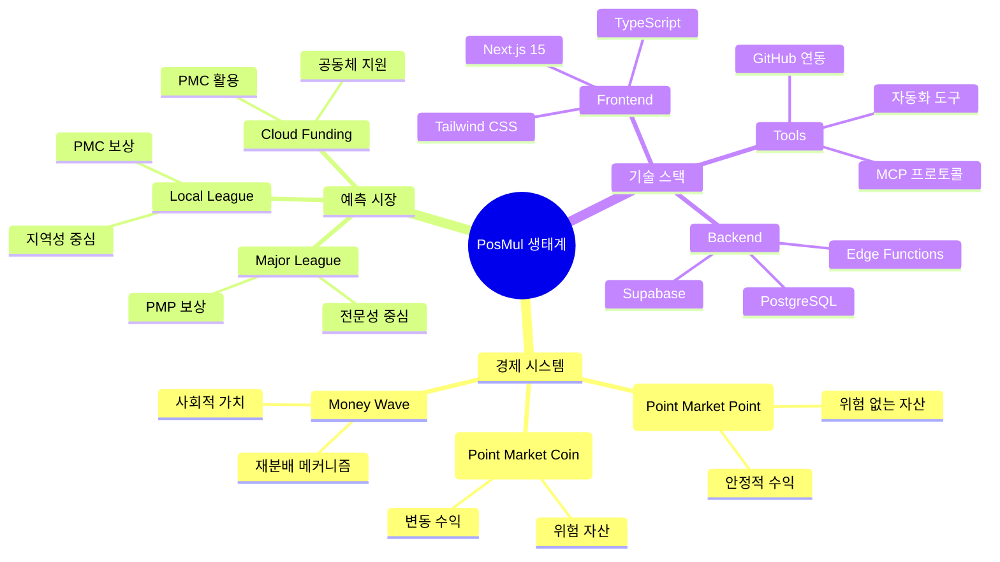

# 💡 Explanation - 깊이 있는 이해

> **목적**: 깊이 있는 이해와 컨텍스트 제공  
> **대상**: 전문가, 심화 학습자

## 🎯 Explanation 특징

- ✅ **이해 중심**: 왜, 어떻게, 언제에 대한 답변
- ✅ **맥락 제공**: 역사적, 기술적 배경
- ✅ **관계 설명**: 다른 개념과의 연관성
- ✅ **통찰 제공**: 깊이 있는 분석과 해석

## 📁 카테고리별 설명

### 🏗️ [Architecture](./architecture/) - 아키텍처 이해

시스템 설계의 철학과 원리:

- Domain-Driven Design 철학
- Clean Architecture 적용
- Microservices vs Monolith
- 확장성과 유지보수성

### 🎨 [Design Principles](./design-principles/) - 설계 원칙

PosMul의 설계 철학:

- Agency Theory 적용 배경
- CAPM 모델 도입 이유
- 경제 시스템 설계 원칙
- 사용자 경험 설계 철학

### ⭐ [Best Practices](./best-practices/) - 베스트 프랙티스

경험에서 나온 지혜:

- 코드 품질 관리
- 테스트 전략
- 보안 고려사항
- 성능 최적화 전략

## 🌍 PosMul 생태계 이해



## 📝 Explanation 작성 가이드

새로운 설명 문서를 작성할 때는 다음 템플릿을 사용하세요:

```markdown
# 💡 [개념] 심화 이해

## 🌟 개념 소개

- 정의
- 핵심 질문

## 📜 역사적 배경

- 기원
- 발전 과정

## 🔬 핵심 원리

- 작동 메커니즘
- 설계 철학

## 🎯 실용적 관점

- 적용 시나리오
- 장단점 분석

## 🔮 미래 전망

- 발전 방향
- 예상 변화
```

## 🔗 관련 문서

- [Tutorials](../tutorials/) - 실습을 통한 학습
- [How-to Guides](../how-to/) - 실무 적용
- [Reference](../reference/) - 기술 세부사항
