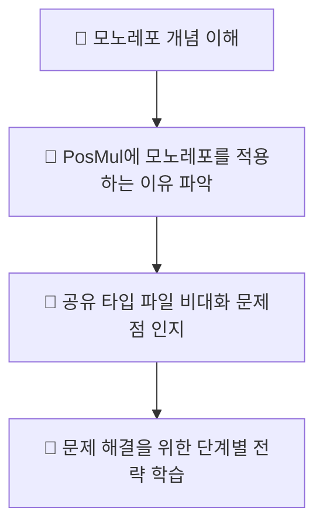
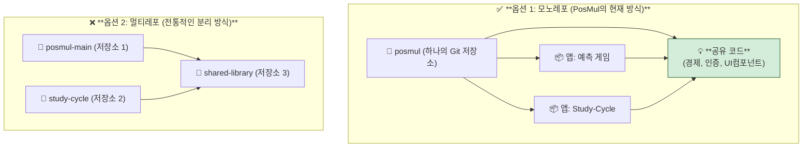
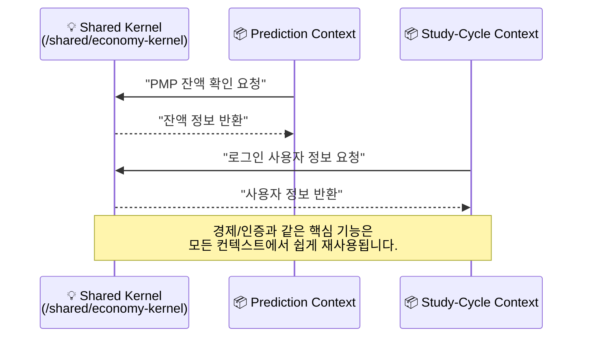
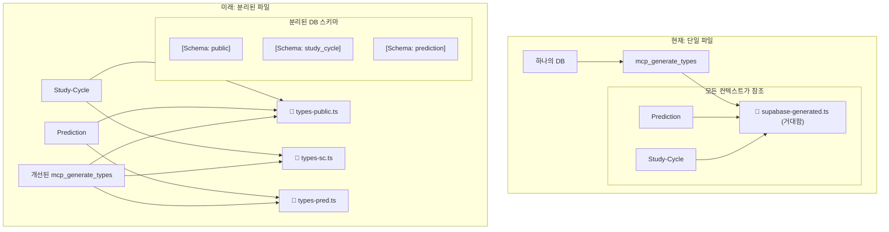

## 1. 개요 (Overview)

이 문서는 PosMul 프로젝트가 채택한 **모노레포(Monorepo)** 아키텍처에 대해 설명합니다. 모노레포의 기본 개념부터 시작하여, PosMul이 얻는 이점과 발생할 수 있는 문제점, 특히 공유 자원(`supabase-generated.ts`) 관리 방안에 대한 심층적인 해결책과 미래 전략을 제시합니다.

### 📊 이 문서의 목표

---

## 2. 모노레포란 무엇인가? (What is a Monorepo?)

모노레포는 아주 간단한 아이디어에서 출발합니다: **"관련 있는 여러 프로젝트를 단 하나의 Git 저장소에서 관리하는 것"** 입니다.

`PosMul`의 경우, 예측 게임 시스템, 포럼, 투자, 그리고 새로 추가된 `Study-Cycle`까지 모두 `posmul`이라는 단일 저장소 안에 함께 있는 것이 바로 모노레포입니다.

### 🏛️ 모노레포 vs 멀티레포 (기존 방식)

멀티레포는 각 프로젝트를 별도의 저장소로 관리하여 독립성을 높이지만, 프로젝트 간 코드 공유가 복잡해지고 버전 관리가 어려워지는 단점이 있습니다. PosMul은 **코드 공유의 이점을 극대화**하기 위해 모노레포를 선택했습니다.

---

## 3. PosMul이 모노레포를 선택한 이유

PosMul은 단순한 앱의 집합이 아니라, **"경제 시스템"** 이라는 강력한 공유 커널을 중심으로 모든 서비스가 유기적으로 연결되는 플랫폼입니다. 모노레포는 이러한 비전을 기술적으로 실현하는 가장 효과적인 방법입니다.

### ✨ 모노레포의 핵심 장점

1.  **원자적 커밋 (Atomic Commits)**: 공유 경제 시스템의 변경과, 그를 사용하는 예측 게임 및 Study-Cycle의 변경을 **단 하나의 커밋**으로 묶어낼 수 있습니다. 이로 인해 시스템 전체의 일관성이 깨질 위험이 없습니다.
2.  **간소화된 의존성 관리**: 모든 프로젝트가 최상위 `package.json`을 공유하므로, 라이브러리 버전 충돌 문제가 원천적으로 방지됩니다.
3.  **통합된 개발 환경**: 모든 프로젝트를 한 번에 빌드하고, 테스트하고, 배포하는 일관된 CI/CD 파이프라인을 구축할 수 있습니다.
4.  **최고의 장점: 쉬운 코드 공유**: 이것이 핵심입니다.

### 🌐 코드 공유 시각화

---

## 4. 대표님의 핵심 질문: `supabase-generated.ts`는 어떡하죠?

> "모든 프로젝트의 DB 타입이 `supabase-generated.ts` 하나에 다 들어가면, 이 파일이 너무 거대해지고 관리가 불가능해지지 않을까요?"

**매우 정확하고 중요한 지적이십니다.** 이는 모노레포의 대표적인 단점 중 하나인 **"암묵적 결합(Implicit Coupling)"** 문제와 직결됩니다. Study-Cycle은 예측 게임의 테이블 타입을 알 필요가 없는데도, 거대한 `supabase-generated.ts` 파일 때문에 모든 것을 알게 되는 상황이 발생합니다.

이 문제를 해결하기 위해, 우리는 다음과 같은 **단계적 진화 전략**을 사용할 것입니다.

### 🌊 타입 관리의 단계적 진화 전략

#### 1️⃣ **단계 (현재): 통합된 단일 타입 파일 (`supabase-generated.ts`)**

-   **설명**: 지금처럼 `mcp_supabase_generate_typescript_types`를 사용하여 데이터베이스의 모든 테이블에 대한 타입을 단일 파일로 생성합니다.
-   **장점**: 구현이 가장 간단하고, 항상 DB와 100% 동기화됩니다. MVP 개발 단계에서는 속도가 생명입니다.
-   **단점**: 대표님께서 우려하신 대로 파일이 비대해지고, 컨텍스트 간 불필요한 의존성이 생깁니다.
-   **결론**: **지금은 괜찮습니다.** 초기 개발 단계에서는 이 방식의 단순함이 단점보다 더 큰 이점을 제공합니다.

#### 2️⃣ **단계 (중기 목표): 데이터베이스 스키마(Schema) 분리**

-   **설명**: 논리적으로 관련된 테이블들을 별도의 DB 스키마로 묶습니다. 이는 DDD의 Bounded Context 개념을 데이터베이스 레벨에서 구현하는 것입니다.
-   **예시**:
    -   `public` 스키마: `users`, `profiles` 등 모든 서비스가 공유하는 핵심 테이블
    -   `study_cycle` 스키마: `sc_textbooks`, `sc_chapters` 등 Study-Cycle 전용 테이블
    -   `prediction` 스키마: `prediction_games` 등 예측 게임 전용 테이블
-   **장점**: 데이터베이스 수준에서 컨텍스트의 경계가 명확해집니다.

#### 3️⃣ **단계 (장기 목표): 스키마별 타입 생성 자동화**

-   **설명**: 우리의 MCP 도구나 별도의 스크립트를 개선하여, 특정 스키마에 대한 타입만 생성하도록 만듭니다.
-   **가상 명령어**:
    -   `mcp_supabase_generate_typescript_types --schema public > types/supabase-public.ts`
    -   `mcp_supabase_generate_typescript_types --schema study_cycle > types/supabase-sc.ts`
-   **장점**:
    -   `supabase-generated.ts` 파일이 작고 관리 가능한 여러 파일로 분리됩니다.
    -   각 Bounded Context는 오직 자신에게 필요한 타입 파일만 참조하게 되어, 컨텍스트 간의 결합이 완벽하게 분리됩니다.

### 💡 최종 아키텍처 시각화

---

## 5. 결론 및 다음 단계

**대표님의 우려는 정확하며, 이는 우리가 앞으로 해결해야 할 중요한 기술 과제입니다.** 하지만 동시에, 이는 우리가 처음부터 올바른 방향(모노레포)으로 가고 있다는 증거이기도 합니다.

-   **단기적으로는** 현재의 단일 `supabase-generated.ts` 파일을 그대로 사용하며 빠르게 MVP 기능을 개발합니다.
-   **장기적으로는** 데이터베이스 스키마 분리와 타입 생성 도구의 고도화를 통해 이 문제를 근본적으로 해결할 것입니다.

모노레포는 복잡성을 동반하지만, PosMul과 같이 여러 서비스가 긴밀하게 상호작용하는 플랫폼에서는 그 복잡성을 뛰어넘는 강력한 이점을 제공합니다. 우리는 이 구조 위에서 더 빠르고, 더 안정적으로, 더 일관되게 프로젝트를 발전시켜 나갈 수 있을 것입니다. 