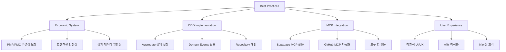

# ⭐ Best Practices Explanations

> 경험에서 나온 지혜와 베스트 프랙티스에 대한 깊이 있는 이해

## 📋 베스트 프랙티스 주제

### 💻 Code Quality

- [ ] **TypeScript 활용 베스트 프랙티스**
- [ ] **Domain Model 설계 원칙**
- [ ] **테스트 전략과 품질 관리**
- [ ] **코드 리뷰와 협업 문화**

### 🏗️ Architecture Practices

- [ ] **Clean Architecture 실무 적용**
- [ ] **의존성 관리 전략**
- [ ] **모듈 분리와 응집도**
- [ ] **확장성 고려한 설계**

### 🔒 Security Practices

- [ ] **인증과 권한 관리**
- [ ] **데이터 보호와 암호화**
- [ ] **API 보안 고려사항**
- [ ] **사용자 데이터 프라이버시**

### 📊 Performance Practices

- [ ] **프론트엔드 성능 최적화**
- [ ] **데이터베이스 쿼리 최적화**
- [ ] **캐싱 전략**
- [ ] **모니터링과 알림**

### 🚀 DevOps Practices

- [ ] **CI/CD 파이프라인 설계**
- [ ] **환경 관리와 배포 전략**
- [ ] **로깅과 디버깅**
- [ ] **장애 대응과 복구**

## 🎯 PosMul 특화 베스트 프랙티스

## 💡 베스트 프랙티스 평가 기준

### 1. **효과성** (Effectiveness)

- 문제를 실제로 해결하는가?
- 측정 가능한 개선을 가져오는가?

### 2. **효율성** (Efficiency)

- 리소스를 효율적으로 사용하는가?
- 개발 생산성을 향상시키는가?

### 3. **유지보수성** (Maintainability)

- 장기적으로 지속 가능한가?
- 변화에 유연하게 대응하는가?

### 4. **확장성** (Scalability)

- 규모 증가에 대응할 수 있는가?
- 팀 크기 증가에도 적용 가능한가?

## 📚 학습과 적용 가이드

### 단계별 적용 전략

1. **이해** - 왜 이것이 베스트 프랙티스인가?
2. **실험** - 작은 범위에서 시도해보기
3. **적응** - 우리 상황에 맞게 조정하기
4. **정착** - 팀 전체에 확산하기
5. **개선** - 지속적으로 발전시키기

## 📝 새 베스트 프랙티스 문서 추가하기

새로운 베스트 프랙티스 설명을 추가할 때는 다음 형식을 따르세요:

`best-practices-[category].md`
