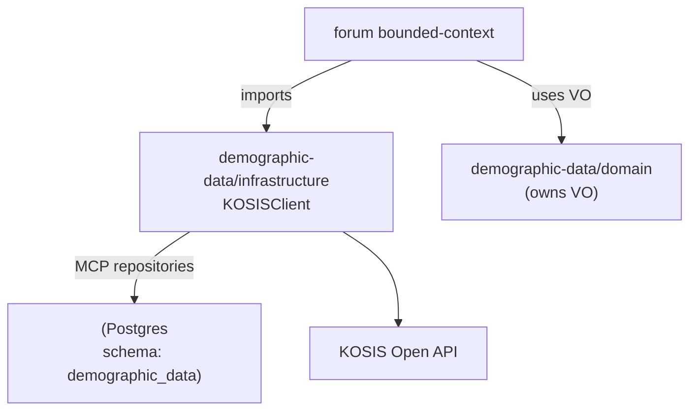

# Demographic Data Domain (demographic-data)

## TL;DR

- `demographic-data`는 **KOSIS(국가통계포털) 기반 인구통계 데이터**를 다루기 위한 bounded context입니다.
- 현재 코드에서 이 도메인은 **forum의 “인구통계 예측(토론→예측 게임 생성, 결과 검증/정산)” 기능**에 직접 연결되어 있습니다.
- 최초 추가는 git 히스토리 기준 `positivemultiplier`가 2025-12-07에 커밋(`d470a035`)로 넣었습니다.

---

## Runtime Prereqs (KOSIS)

- `KOSIS_API_KEY`: KOSIS OpenAPI 인증 키
- `KOSIS_USER_STATS_ID_*`: 카테고리별 `userStatsId` (통계 조회가 `statisticsData.do` + `userStatsId` 기반)
  - 예: `KOSIS_USER_STATS_ID_BIRTH`, `KOSIS_USER_STATS_ID_DEATH` 등

## Where It’s Used

### 1) Forum → Demographic Prediction Game 생성

- Forum 유스케이스가 `StatCategory`, `PeriodType`(인구통계 예측용 VO)을 사용해서 예측 게임 템플릿/범위/단위를 정합니다.
- 파일 예시
  - `apps/posmul-web/src/bounded-contexts/forum/application/use-cases/create-prediction-from-forum.use-case.ts`

### 2) Forum → KOSIS 실데이터로 예측 결과 검증/정산

- `VerifyPredictionResultUseCase`가 `KOSISClient.fetchMonthlyData(...)`로 실측 데이터를 가져와서
  - 파싱 후 `predictionRepository.settle(...)` 호출
  - (옵션) settlementService가 있으면 정산 트리거
- 파일 예시
  - `apps/posmul-web/src/bounded-contexts/forum/application/use-cases/verify-prediction-result.use-case.ts`

### 3) Client Hook → `/api/demographic-data`

- Forum 쪽 client hook이 `/api/demographic-data?category&regionCode&year&month`를 호출해 통계 데이터를 화면에 표시합니다.
- 파일 예시
  - `apps/posmul-web/src/bounded-contexts/forum/presentation/hooks/use-demographic-prediction.ts`

---

## Data Flow

```mermaid
flowchart TD
  UI[Forum UI / Hook
useDemographicData] -->|GET /api/demographic-data| API[Next Route
app/api/demographic-data]
  API -->|KOSISClient.fetchMonthlyData
(statisticsData.do + userStatsId)| KOSIS[KOSIS Open API]
  KOSIS --> API
  API --> UI

  ForumUC[VerifyPredictionResultUseCase] -->|KOSISClient.fetchMonthlyData
(statisticsData.do + userStatsId)| KOSIS
  ForumUC -->|predictionRepository.settle| PredRepo[Prediction Repository]
```

---

## Repository & Storage (Optional)

- `demographic-data`에는 MCP 기반 repository 구현이 포함돼 있고, 스키마는 `demographic_data.*`를 전제로 합니다.
- 현재 구현은 다음 테이블을 가정합니다.
  - `demographic_data.statistics`
  - `demographic_data.data_sources`



---

## Notes / Risks

- 현재 인구통계 관련 Value Object(`StatCategory`, `PeriodType`, `StatisticPeriod` 등)는 **demographic-data 도메인이 소유**하며, forum은 필요 시 이를 import 해서 사용합니다.
  - (호환성 목적) 일부 forum 코드 경로에서 re-export가 남아 있을 수 있습니다.
- `/api/demographic-data`는 `KOSIS_API_KEY`가 없으면 동작하지 않습니다.
- 또한 통계 조회는 `userStatsId` 기반이므로, 카테고리별 `KOSIS_USER_STATS_ID_*`가 없으면 500(`missing_kosis_user_stats_id`)로 실패합니다.

---

## Suggested Next Steps

1) KOSIS 기반 통계 데이터의 “조회/캐싱/저장” 전략을 결정 (DB 저장이 목적이면 수집/조회 API를 명확히 분리)
2) 인구통계 Value Object 소유권을 재검토 (forum ↔ demographic-data 결합도 줄이기)
3) 현재 구현된 MCP repository가 실제 DB 스키마와 일치하는지 점검 (migration/RLS 포함)
