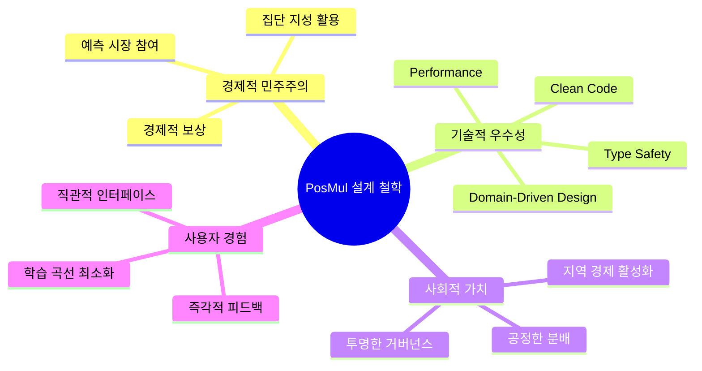

# 🎨 Design Principles Explanations

> PosMul 프로젝트의 설계 철학과 원칙에 대한 깊이 있는 이해

## 📋 설계 원칙 주제

### 💡 Core Philosophy

- [ ] **Agency Theory 기반 플랫폼 설계**
- [ ] **Direct Democracy와 기술의 만남**
- [ ] **경제 이론의 코드 구현**
- [ ] **사용자 중심 경험 설계**

### 💰 Economic Design Principles

- [ ] **이중 토큰 경제 시스템의 철학**
- [ ] **위험과 수익의 균형 설계**
- [ ] **Money Wave 재분배 원리**
- [ ] **예측 시장의 인센티브 설계**

### 🏗️ Technical Design Principles

- [ ] **DDD 중심 도메인 설계**
- [ ] **MCP 기반 도구 통합 철학**
- [ ] **TypeScript 타입 안전성 원칙**
- [ ] **성능과 사용성의 균형**

### 🎯 User Experience Principles

- [ ] **직관적 경제 시스템 인터페이스**
- [ ] **복잡성 숨기기와 투명성의 균형**
- [ ] **접근성과 포용성 설계**
- [ ] **게이미피케이션과 진정성**

## 💭 PosMul 설계 철학

## 🔍 설계 원칙 분석 틀

### 1. **철학적 근거**

- 왜 이 원칙이 중요한가?
- 어떤 가치를 추구하는가?

### 2. **실무적 적용**

- 코드에서 어떻게 구현되는가?
- 일상적 개발에 어떤 영향을 주는가?

### 3. **트레이드오프 분석**

- 어떤 것을 포기했는가?
- 그 선택이 합리적인가?

### 4. **진화 가능성**

- 미래에 어떻게 발전할 수 있는가?
- 어떤 제약이나 기회가 있는가?

## 📝 새 설계 원칙 문서 추가하기

새로운 설계 원칙 설명을 추가할 때는 다음 형식을 따르세요:

`understanding-[principle-name].md`
