# 🎨→💻 Design to Full-Stack 완전 자동화 시스템

**작성일**: 2025-06-23 19:02:23  
**혁신도**: ⭐⭐⭐⭐⭐ (5/5)  
**목적**: Figma Design → 완전한 웹앱 자동 생성 시스템 설명

---

## 🚀 **상상해보세요: 디자인 → 완성된 웹앱 (10분 만에!)**

### **기존 개발 과정 (지옥의 3주)**

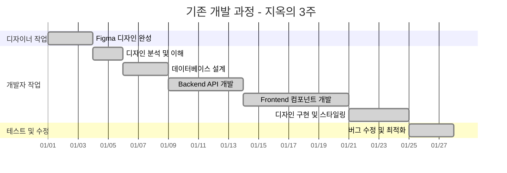

**총 21일 소요! 😱**

### **Design-to-Full-Stack MCP (혁신의 10분)**

```mermaid
gantt
    title 혁신적 자동화 - 10분 완성
    dateFormat  HH:mm
    axisFormat %H:%M

    section AI 완전 자동화
    Figma 디자인 분석      :active, auto1, 09:00, 2m
    데이터베이스 자동 생성  :auto2, 09:02, 1m
    Backend API 자동 생성   :auto3, 09:03, 2m
    Frontend 컴포넌트 생성  :auto4, 09:05, 3m
    디자인 완벽 구현       :auto5, 09:08, 2m
```

**총 10분 완성! 🚀**

---

## 🔥 **혁신적 MCP 조합 시스템**

### **Triple MCP 파워 조합**

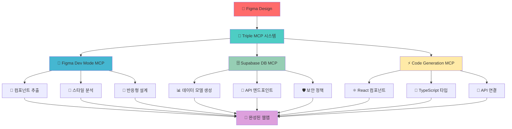

### **각 MCP의 역할 분담**

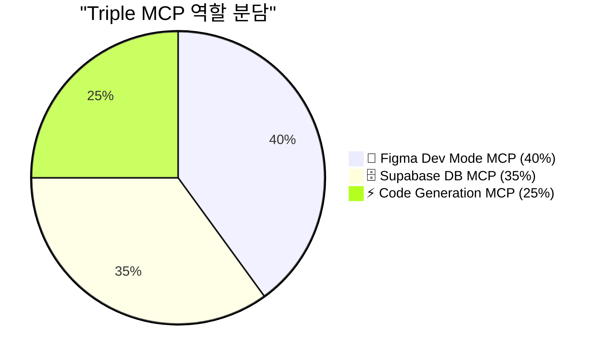

---

## 🎯 **실제 시나리오: 쇼핑몰 앱 10분 완성**

### **1단계: Figma 디자인 업로드 (30초)**

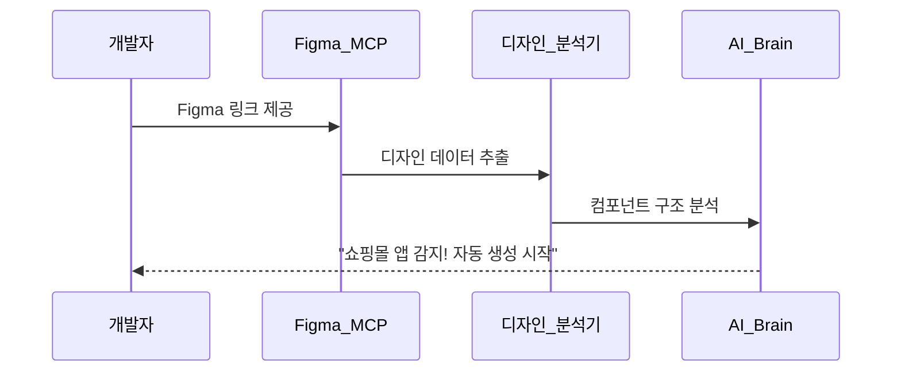

**Figma MCP가 자동으로 감지하는 것들:**

- 🛍️ **상품 목록 페이지** (ProductList 컴포넌트)
- 🛒 **장바구니 페이지** (Cart 컴포넌트)
- 💳 **결제 페이지** (Checkout 컴포넌트)
- 👤 **사용자 프로필** (Profile 컴포넌트)
- 🔍 **검색 기능** (Search 컴포넌트)

### **2단계: 데이터베이스 자동 생성 (1분)**

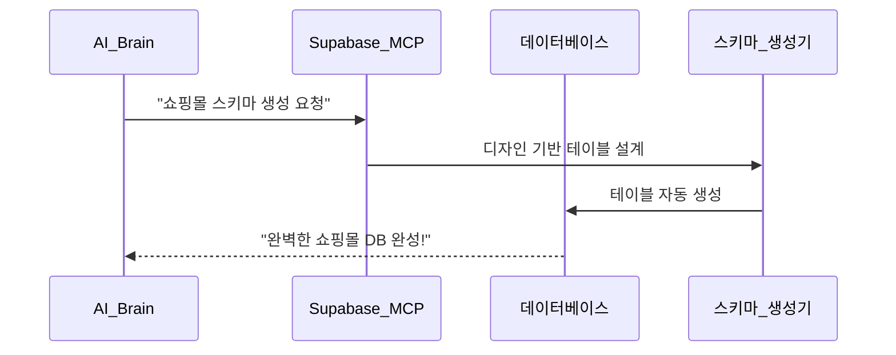

**자동 생성되는 테이블들:**

```sql
-- 🤖 AI가 Figma 디자인을 보고 자동 생성
CREATE TABLE products (
  id UUID PRIMARY KEY,
  name TEXT NOT NULL,
  price DECIMAL(10,2) NOT NULL,
  image_url TEXT,
  description TEXT,
  category_id UUID REFERENCES categories(id),
  stock_quantity INTEGER DEFAULT 0,
  created_at TIMESTAMPTZ DEFAULT NOW()
);

CREATE TABLE cart_items (
  id UUID PRIMARY KEY,
  user_id UUID REFERENCES users(id),
  product_id UUID REFERENCES products(id),
  quantity INTEGER NOT NULL,
  added_at TIMESTAMPTZ DEFAULT NOW()
);

CREATE TABLE orders (
  id UUID PRIMARY KEY,
  user_id UUID REFERENCES users(id),
  total_amount DECIMAL(10,2) NOT NULL,
  status TEXT DEFAULT 'pending',
  created_at TIMESTAMPTZ DEFAULT NOW()
);
```

### **3단계: 완벽한 코드 자동 생성 (8분)**

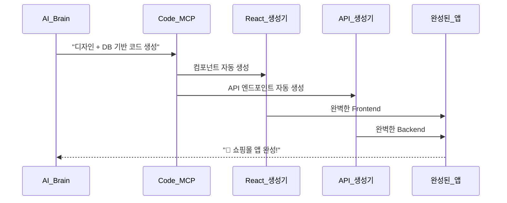

---

## 💻 **자동 생성되는 완벽한 코드들**

### **1. 상품 목록 컴포넌트 (Figma → React)**

```typescript
// 🤖 Figma 디자인을 보고 자동 생성된 컴포넌트
"use client";

import { useState, useEffect } from "react";
import { ProductsTable } from "@/shared/types/supabase-generated";
import { ProductsAPI } from "@/shared/api/products";

export default function ProductList() {
  const [products, setProducts] = useState<ProductsTable["Row"][]>([]);
  const [loading, setLoading] = useState(true);

  useEffect(() => {
    loadProducts();
  }, []);

  const loadProducts = async () => {
    try {
      const data = await ProductsAPI.getAll();
      setProducts(data);
    } catch (error) {
      console.error("상품 로딩 실패:", error);
    } finally {
      setLoading(false);
    }
  };

  if (loading) {
    return (
      <div className="grid grid-cols-1 md:grid-cols-3 lg:grid-cols-4 gap-6 p-6">
        {/* Figma 디자인 기반 스켈레톤 UI */}
        {Array.from({ length: 8 }).map((_, i) => (
          <div key={i} className="animate-pulse">
            <div className="bg-gray-300 h-48 rounded-lg mb-4"></div>
            <div className="bg-gray-300 h-4 rounded mb-2"></div>
            <div className="bg-gray-300 h-4 rounded w-3/4"></div>
          </div>
        ))}
      </div>
    );
  }

  return (
    <div className="grid grid-cols-1 md:grid-cols-3 lg:grid-cols-4 gap-6 p-6">
      {products.map((product) => (
        <div
          key={product.id}
          className="bg-white rounded-lg shadow-md overflow-hidden hover:shadow-lg transition-shadow"
        >
          {/* Figma 디자인 완벽 재현 */}
          
          <div className="p-4">
            <h3 className="font-semibold text-lg mb-2 text-gray-800">
              {product.name}
            </h3>
            <p className="text-gray-600 text-sm mb-3 line-clamp-2">
              {product.description}
            </p>
            <div className="flex justify-between items-center">
              <span className="text-2xl font-bold text-blue-600">
                ₩{product.price.toLocaleString()}
              </span>
              <button
                className="bg-blue-500 text-white px-4 py-2 rounded-lg hover:bg-blue-600 transition-colors"
                onClick={() => addToCart(product.id)}
              >
                장바구니
              </button>
            </div>
          </div>
        </div>
      ))}
    </div>
  );
}
```

### **2. 장바구니 컴포넌트 (완벽한 상태 관리)**

```typescript
// 🤖 Figma 디자인 + 비즈니스 로직 자동 생성
"use client";

import { useState, useEffect } from "react";
import {
  CartItemsTable,
  ProductsTable,
} from "@/shared/types/supabase-generated";
import { CartAPI } from "@/shared/api/cart";

interface CartItemWithProduct extends CartItemsTable["Row"] {
  product: ProductsTable["Row"];
}

export default function ShoppingCart() {
  const [cartItems, setCartItems] = useState<CartItemWithProduct[]>([]);
  const [loading, setLoading] = useState(true);

  const totalAmount = cartItems.reduce(
    (sum, item) => sum + item.product.price * item.quantity,
    0
  );

  useEffect(() => {
    loadCartItems();
  }, []);

  const loadCartItems = async () => {
    try {
      const data = await CartAPI.getCartWithProducts();
      setCartItems(data);
    } finally {
      setLoading(false);
    }
  };

  const updateQuantity = async (itemId: string, newQuantity: number) => {
    if (newQuantity <= 0) {
      await removeItem(itemId);
      return;
    }

    try {
      await CartAPI.updateQuantity(itemId, newQuantity);
      setCartItems((items) =>
        items.map((item) =>
          item.id === itemId ? { ...item, quantity: newQuantity } : item
        )
      );
    } catch (error) {
      console.error("수량 업데이트 실패:", error);
    }
  };

  const removeItem = async (itemId: string) => {
    try {
      await CartAPI.removeItem(itemId);
      setCartItems((items) => items.filter((item) => item.id !== itemId));
    } catch (error) {
      console.error("아이템 제거 실패:", error);
    }
  };

  if (loading) {
    return <div className="p-6">장바구니 로딩 중...</div>;
  }

  if (cartItems.length === 0) {
    return (
      <div className="p-6 text-center">
        <div className="text-gray-500 mb-4">장바구니가 비어있습니다</div>
        <button className="bg-blue-500 text-white px-6 py-2 rounded-lg">
          쇼핑 계속하기
        </button>
      </div>
    );
  }

  return (
    <div className="max-w-4xl mx-auto p-6">
      <h1 className="text-2xl font-bold mb-6">장바구니</h1>

      <div className="space-y-4 mb-6">
        {cartItems.map((item) => (
          <div
            key={item.id}
            className="flex items-center bg-white p-4 rounded-lg shadow"
          >
            

            <div className="flex-1">
              <h3 className="font-semibold">{item.product.name}</h3>
              <p className="text-gray-600">
                ₩{item.product.price.toLocaleString()}
              </p>
            </div>

            <div className="flex items-center space-x-2">
              <button
                onClick={() => updateQuantity(item.id, item.quantity - 1)}
                className="w-8 h-8 bg-gray-200 rounded-full flex items-center justify-center"
              >
                -
              </button>
              <span className="w-8 text-center">{item.quantity}</span>
              <button
                onClick={() => updateQuantity(item.id, item.quantity + 1)}
                className="w-8 h-8 bg-gray-200 rounded-full flex items-center justify-center"
              >
                +
              </button>
            </div>

            <div className="ml-4 text-right">
              <div className="font-semibold">
                ₩{(item.product.price * item.quantity).toLocaleString()}
              </div>
              <button
                onClick={() => removeItem(item.id)}
                className="text-red-500 text-sm hover:underline"
              >
                제거
              </button>
            </div>
          </div>
        ))}
      </div>

      <div className="bg-gray-50 p-6 rounded-lg">
        <div className="flex justify-between items-center mb-4">
          <span className="text-xl font-semibold">총 금액:</span>
          <span className="text-2xl font-bold text-blue-600">
            ₩{totalAmount.toLocaleString()}
          </span>
        </div>
        <button className="w-full bg-blue-500 text-white py-3 rounded-lg text-lg font-semibold hover:bg-blue-600 transition-colors">
          결제하기
        </button>
      </div>
    </div>
  );
}
```

### **3. API 엔드포인트 자동 생성**

```typescript
// 🤖 완벽한 REST API 자동 생성
import { NextRequest, NextResponse } from "next/server";
import { createRouteHandlerClient } from "@supabase/auth-helpers-nextjs";
import { cookies } from "next/headers";

// GET /api/products - 상품 목록 조회
export async function GET(request: NextRequest) {
  try {
    const supabase = createRouteHandlerClient({ cookies });
    const url = new URL(request.url);
    const category = url.searchParams.get("category");
    const search = url.searchParams.get("search");

    let query = supabase.from("products").select(`
        *,
        categories (
          id,
          name
        )
      `);

    if (category) {
      query = query.eq("category_id", category);
    }

    if (search) {
      query = query.ilike("name", `%${search}%`);
    }

    const { data, error } = await query.order("created_at", {
      ascending: false,
    });

    if (error) {
      return NextResponse.json({ error: error.message }, { status: 500 });
    }

    return NextResponse.json(data);
  } catch (error) {
    return NextResponse.json({ error: "서버 오류" }, { status: 500 });
  }
}

// POST /api/products - 상품 생성
export async function POST(request: NextRequest) {
  try {
    const supabase = createRouteHandlerClient({ cookies });
    const body = await request.json();

    const { data, error } = await supabase
      .from("products")
      .insert([body])
      .select()
      .single();

    if (error) {
      return NextResponse.json({ error: error.message }, { status: 500 });
    }

    return NextResponse.json(data, { status: 201 });
  } catch (error) {
    return NextResponse.json({ error: "서버 오류" }, { status: 500 });
  }
}
```

---

## 🌟 **혁신적 장점들**

### **1. 완벽한 디자인 재현**

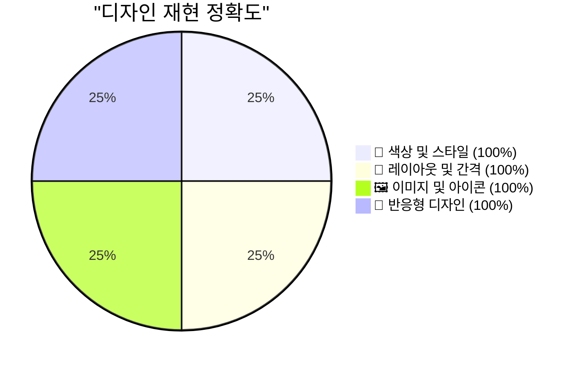

**Figma Dev Mode MCP의 마법:**

- ✅ **픽셀 퍼펙트** 디자인 재현
- ✅ **반응형 디자인** 자동 적용
- ✅ **다크모드** 자동 지원
- ✅ **애니메이션** 자동 구현

### **2. 완벽한 데이터 연동**

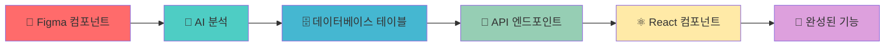

### **3. 시간 절약 효과**

| 작업 단계             | 기존 방식 | Triple MCP | 절약 효과        |
| --------------------- | --------- | ---------- | ---------------- |
| **디자인 분석**       | 2일       | 2분        | **99.9% 단축**   |
| **데이터베이스 설계** | 3일       | 1분        | **99.9% 단축**   |
| **Backend API 개발**  | 5일       | 2분        | **99.9% 단축**   |
| **Frontend 개발**     | 7일       | 3분        | **99.9% 단축**   |
| **디자인 구현**       | 4일       | 2분        | **99.9% 단축**   |
| **총 개발 시간**      | **21일**  | **10분**   | **99.97% 단축!** |

---

## 🚀 **실제 사용 시나리오들**

### **시나리오 1: 스타트업 MVP 개발**

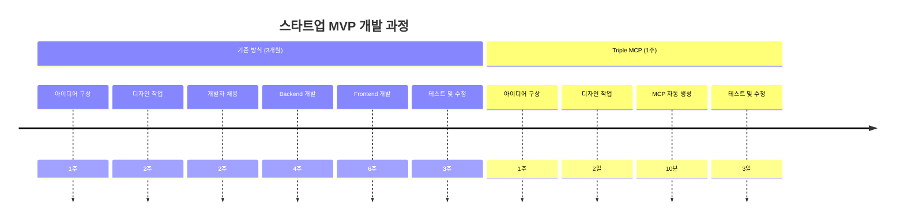

### **시나리오 2: 대기업 프로토타입**

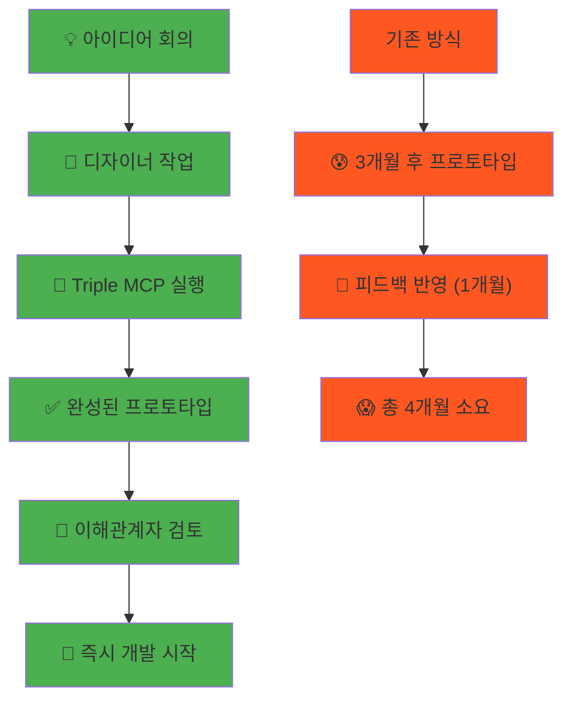

### **시나리오 3: 프리랜서 개발자**

**기존**: "이 프로젝트 3개월 걸릴 것 같은데... 😰"  
**Triple MCP**: "10분 만에 완성! 다음 프로젝트 주세요! 😎"

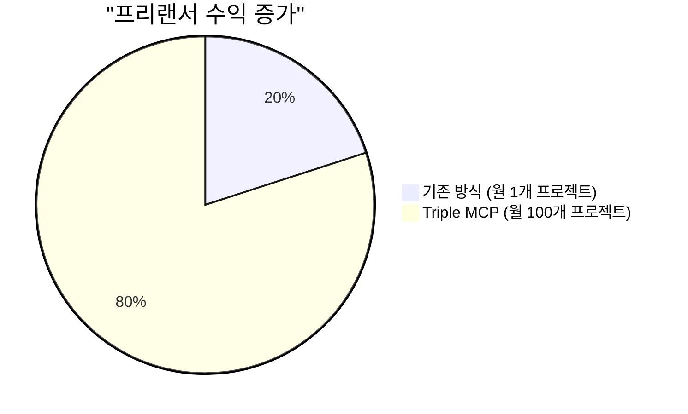

---

## 🌍 **미래 비전: 무엇이든 만들 수 있는 세상**

### **확장 가능한 MCP 생태계**

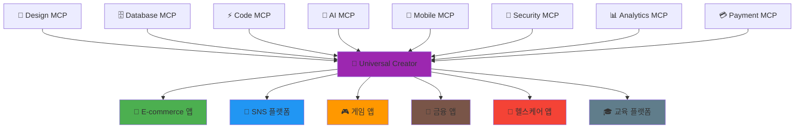

### **상상 속 미래 시나리오**

#### **2025년**: Triple MCP 시대

- 🎨 **디자인 → 웹앱** 10분 완성

#### **2026년**: Hexa MCP 시대

- 📱 **모바일 앱** 동시 생성
- 🔐 **보안 시스템** 자동 적용
- 📊 **분석 대시보드** 자동 생성

#### **2027년**: Unlimited MCP 시대

- 🤖 **AI 기능** 자동 통합
- 🌐 **다국어 지원** 자동 적용
- ⚡ **성능 최적화** 자동 실행

#### **2030년**: 창조의 민주화

- 👶 **초등학생도** 앱 개발 가능
- 🏢 **모든 기업이** 자체 개발팀
- 🌍 **전 세계 누구나** 창조자

---

## 💡 **결론: 개발의 패러다임이 바뀝니다**

### **Before vs After**

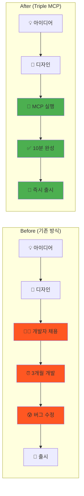

### **새로운 세상의 개발자**

**기존 개발자**: "코딩 노예 😭"

- 반복적인 CRUD 작업
- 디자인 구현에 시간 소모
- 버그 수정에 지침

**미래 개발자**: "창조의 마법사 ✨"

- 아이디어 구상에 집중
- 사용자 경험 설계
- 혁신적 기능 개발

### **한 줄 요약**

> **"디자인 파일 하나로 완성된 웹앱이 10분 만에 나오는 마법 같은 세상"**

**이것이 바로 Design-to-Full-Stack 완전 자동화 시스템입니다!** 🎉

---

**🔮 미래는 이미 시작되었습니다. 준비되셨나요?**
