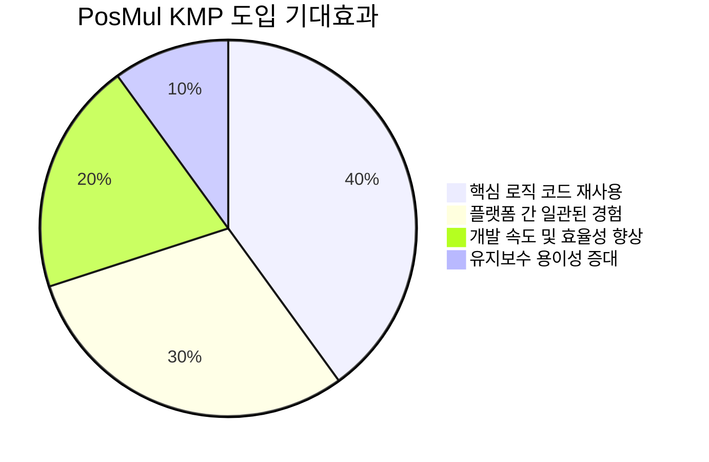
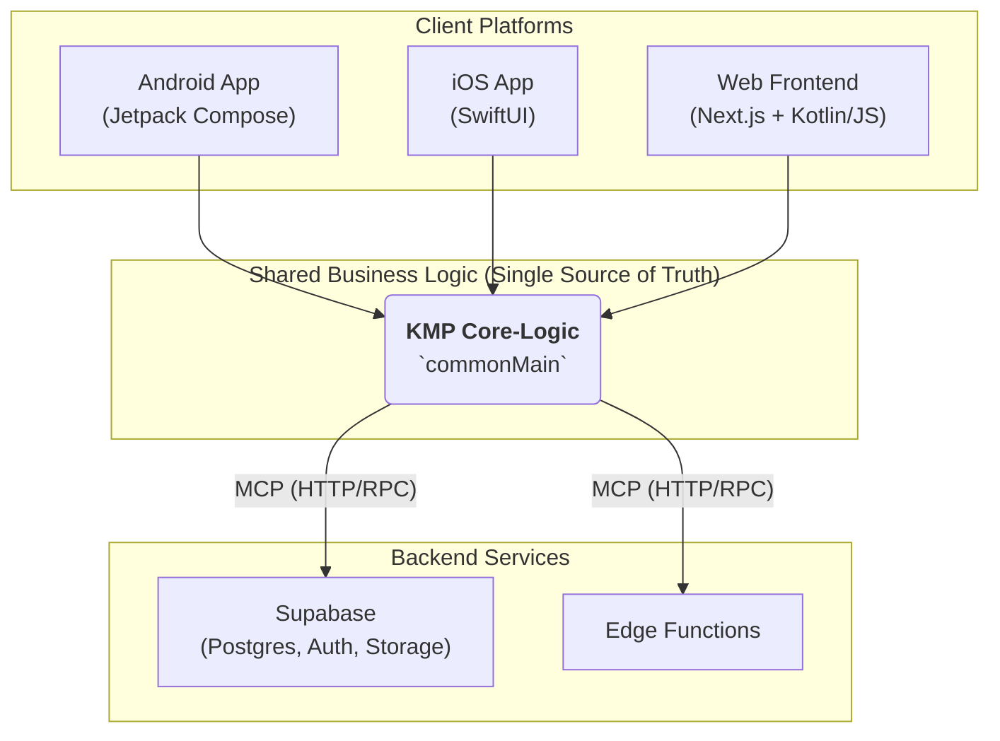
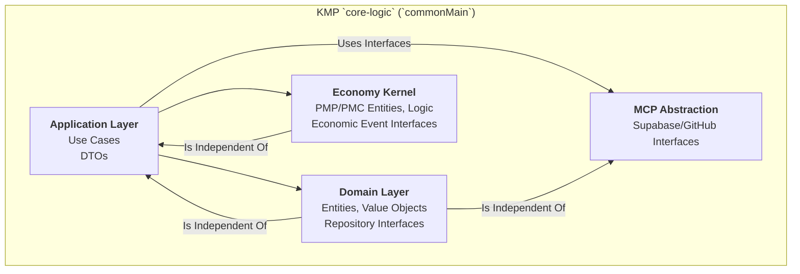
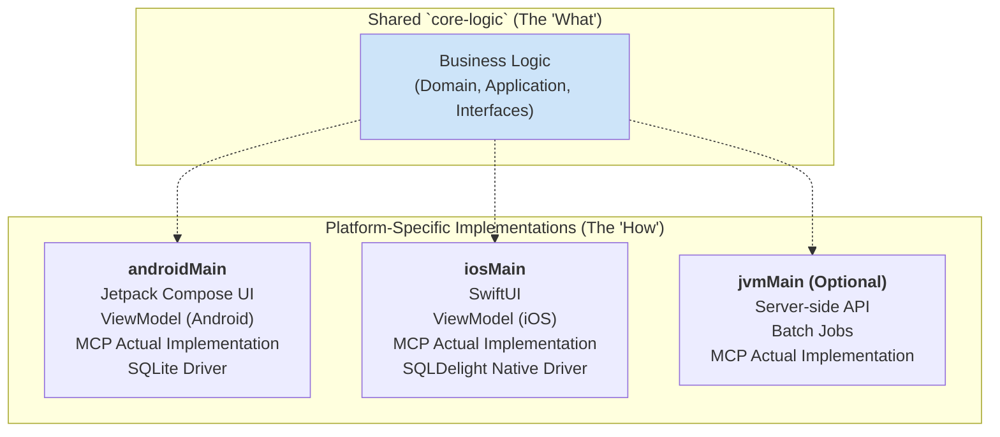
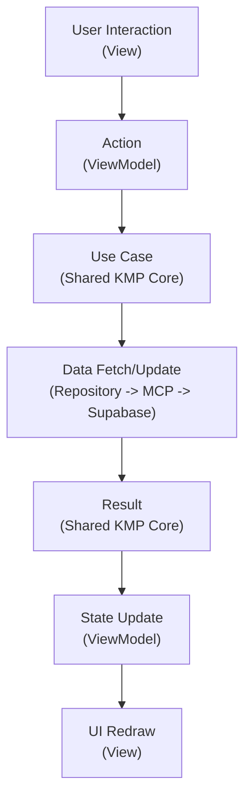
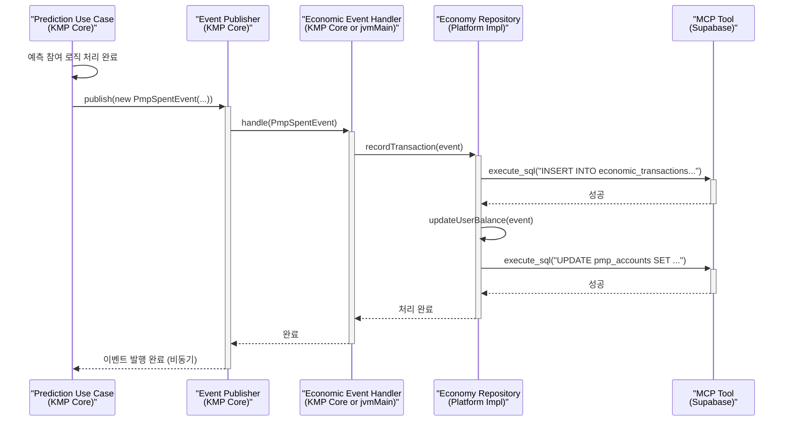
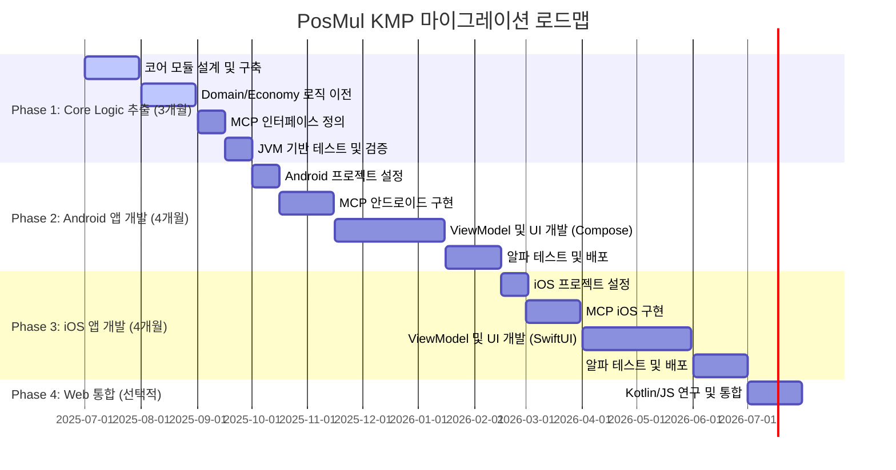
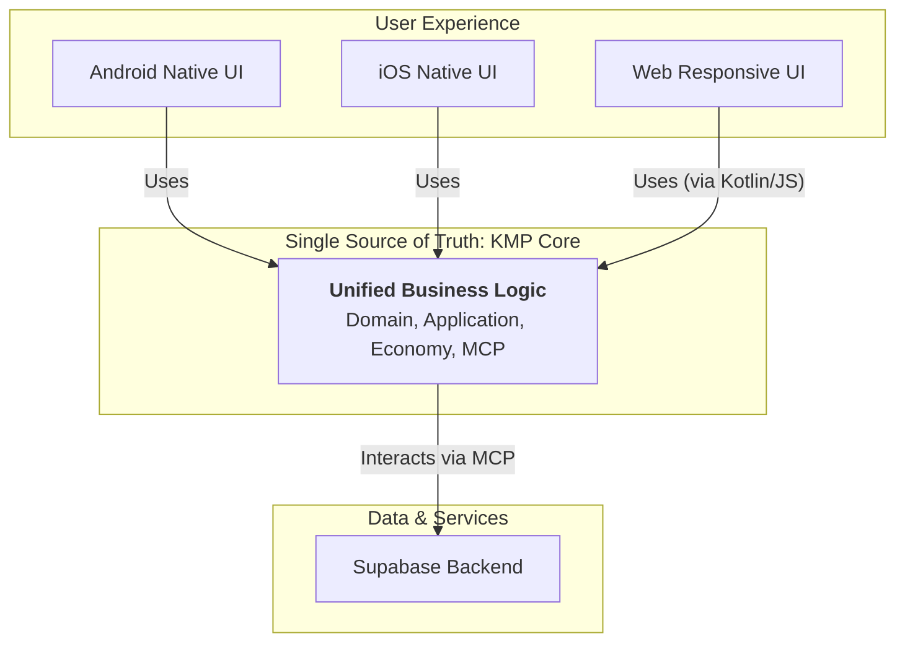

# PosMul 플랫폼의 Kotlin Multiplatform(KMP) 아키텍처 비전

**문서 버전**: 1.0  
**작성일**: 2025-06-24
**작성자**: AI Agent

## 1. 개요: 왜 PosMul에 KMP를 도입하는가?

PosMul은 복잡한 경제 시스템과 비즈니스 로직을 가진 플랫폼입니다. 현재의 Next.js 기반 웹 아키텍처는 훌륭하지만, Android, iOS 등 네이티브 모바일 플랫폼으로 확장할 때 비즈니스 로직의 파편화와 중복 개발 문제가 발생할 수 있습니다.

Kotlin Multiplatform(KMP)은 이 문제에 대한 이상적인 해결책입니다. UI를 제외한 모든 비즈니스 로직(도메인, 유스케이스, 경제 시스템, MCP 연동 등)을 단일 코드로 작성하고, 이를 Android, iOS, Web, 심지어 서버(JVM)까지 공유할 수 있습니다. 이는 "하나의 코어, 모든 플랫폼" 비전을 실현하는 길입니다.



---

## 2. KMP 기반 고수준 아키텍처

PosMul의 KMP 아키텍처는 다음과 같이 구성됩니다. 모든 클라이언트 플랫폼(Android, iOS, Web)이 중앙의 `KMP Core-Logic` 모듈을 공유하고, 이 코어 모듈이 MCP 프로토콜을 통해 Supabase 백엔드와 통신하는 구조입니다.



---

## 3. 공유 코어 (`core-logic`): 비즈니스 로직의 심장

`core-logic` 모듈은 프로젝트의 두뇌 역할을 하며, 플랫폼에 독립적인 순수 Kotlin 코드로 작성됩니다. 이 모듈은 PosMul의 클린 아키텍처를 그대로 따릅니다.

### 3.1. 공유 코어 의존성 구조

클린 아키텍처의 의존성 규칙이 `commonMain` 내에서 엄격하게 지켜집니다. Application 계층은 Domain 계층에 의존하며, Domain 계층은 외부 세계에 대해 아무것도 알지 못합니다.



- **Domain Layer (The "Rules")**: `PredictionGame`, `User`와 같은 엔티티, 값 객체, 그리고 리포지토리 *인터페이스*가 위치합니다. 플랫폼이나 프레임워크에 대한 의존성이 전혀 없는 순수한 비즈니스 규칙의 집합입니다.
- **Application Layer (The "Orchestrator")**: `CreatePredictionGameUseCase`와 같은 유스케이스가 위치합니다. Domain 객체들을 조율하여 애플리케이션의 핵심 기능을 수행합니다.
- **Shared Economy Kernel**: PMP/PMC와 관련된 모든 로직이 이곳에 포함되어, 모든 도메인에서 일관된 경제 정책을 적용할 수 있도록 합니다.
- **MCP Integration Layer**: `mcp_supabase_execute_sql`과 같은 MCP 함수들을 위한 *인터페이스*를 정의합니다. 실제 네트워크 통신을 포함한 구현은 각 플랫폼에서 `expect`/`actual` 메커니즘을 통해 이루어집니다.

---

## 4. 플랫폼별 구현: 네이티브 UI와 인프라

`core-logic`이 "무엇을" 할지 정의한다면, 각 플랫폼의 `androidMain`, `iosMain` 등은 "어떻게" 그것을 수행할지 구현합니다.



- **UI Layer**: Android는 Jetpack Compose, iOS는 SwiftUI를 사용하여 각 플랫폼에 최적화된 네이티브 UI를 구축합니다.
- **ViewModel**: 각 플랫폼의 UI 프레임워크에 맞는 ViewModel(Android ViewModel, Swift ObservableObject 등)을 구현하여 UI 상태를 관리하고 `core-logic`의 유스케이스를 호출합니다.
- **Infrastructure Layer**: `core-logic`에 정의된 리포지토리 및 MCP 인터페이스에 대한 실제 구현(`actual` class)이 위치합니다. Ktor HTTP 클라이언트를 사용해 실제 MCP 호출을 수행하고, SQLDelight 같은 라이브러리로 로컬 캐싱을 구현할 수 있습니다.

---

## 5. 상세 워크플로우 예시: "예측 참여"

사용자가 예측에 참여하는 과정을 KMP 아키텍처를 통해 살펴보겠습니다.

```mermaid
sequenceDiagram
    participant User as "사용자"
    participant UI as "Platform UI<br>(Compose/SwiftUI)"
    participant VM as "ViewModel"
    participant Core as "KMP Core<br>(UseCase)"
    participant Repo as "KMP Core<br>(Repository Impl)"
    participant MCP as "MCP Tool<br>(Supabase)"

    User->>+UI: 예측 참여 버튼 클릭
    UI->>+VM: participateInPrediction(gameId, stake)
    VM->>+Core: Execute ParticipateInPredictionUseCase
    Core->>+Repo: getPmpBalance(userId)
    Repo->>+MCP: execute_sql("SELECT balance...")
    MCP-->>-Repo: PMP 잔액 반환
    Core-->>-VM: 잔액 확인 (충분함)
    Core->>Core: Create PmpSpentEvent
    Core->>+Repo: save(prediction)
    Repo->>+MCP: execute_sql("INSERT INTO predictions...")
    MCP-->>-Repo: 저장 성공
    Repo-->>-Core: 예측 참여 성공
    Core-->>-VM: UI 상태 업데이트 요청
    VM-->>-UI: UI 업데이트 (성공 메시지)
    UI-->>-User: 참여 완료 피드백 표시
```

---

## 6. 데이터 흐름과 상태 관리

KMP 아키텍처에서는 단방향 데이터 흐름(Unidirectional Data Flow)을 적용하여 데이터의 일관성과 예측 가능성을 높입니다. UI 이벤트는 ViewModel을 통해 KMP 코어로 전달되고, 코어 로직의 결과는 다시 ViewModel의 상태(State)를 업데이트하여 UI를 갱신합니다.



---

## 7. 경제 시스템 통합 심화

PosMul의 핵심인 경제 시스템 역시 `core-logic`에 통합됩니다. 경제 관련 이벤트가 발생하면, Event Publisher를 통해 비동기적으로 처리하여 시스템의 결합도를 낮춥니다.



---

## 8. KMP 도입의 장점과 고려사항

| 구분               | 장점 (Pros)                                                                    | 고려사항 (Cons)                                           |
| :----------------- | :----------------------------------------------------------------------------- | :-------------------------------------------------------- |
| **개발 효율성**    | 비즈니스 로직, 데이터 모델, 네트워크 로직을 100% 재사용하여 개발 속도 향상     | 초기 설정 및 학습 곡선 존재. KMP 생태계에 대한 이해 필요. |
| **품질 및 일관성** | 모든 플랫폼에서 동일한 로직을 사용하므로 버그 감소 및 일관된 사용자 경험 제공. | 네이티브 API와 완전한 통합이 어려운 경우가 있을 수 있음.  |
| **테스트**         | 공유 로직에 대한 단위 테스트를 한 번만 작성하면 모든 플랫폼에 적용 가능.       | UI 테스트는 각 플랫폼별로 별도 작성 필요.                 |
| **팀 구성**        | Kotlin 개발자가 Android, iOS, 백엔드 로직에 모두 기여 가능.                    | 각 플랫폼(특히 iOS)에 대한 전문 지식은 여전히 필요.       |

---

## 9. 단계적 마이그레이션 전략

기존 웹 프로젝트에서 KMP 아키텍처로 한 번에 전환하는 것은 위험이 큽니다. 따라서 다음과 같은 단계적 마이그레이션 전략을 제안합니다.



---

## 10. 결론: 하나의 코드로 모든 것을 지배한다

KMP를 도입하는 것은 단순한 기술 스택 변경이 아니라, PosMul 플랫폼의 미래 확장성과 개발 효율성을 극대화하는 전략적 결정입니다. 단일화된 `core-logic`은 비즈니스의 복잡성을 효과적으로 관리하고, 어떤 플랫폼으로든 빠르고 일관되게 확장할 수 있는 강력한 기반이 될 것입니다.



이 아키텍처 비전이 PosMul의 다음 단계를 위한 성공적인 로드맵이 되기를 기대합니다.
