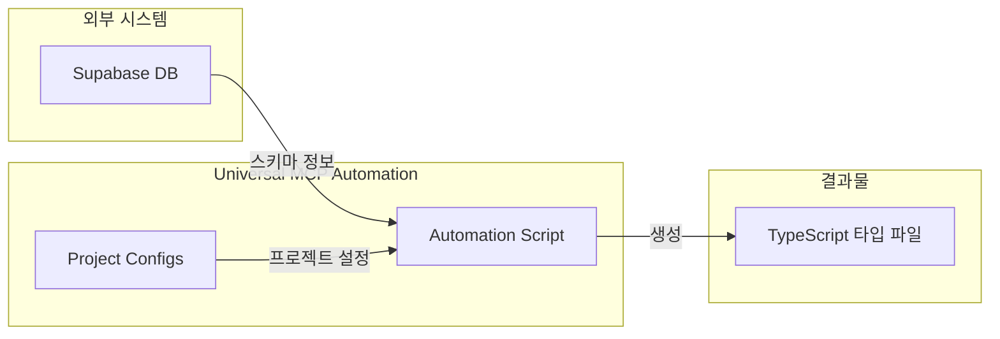
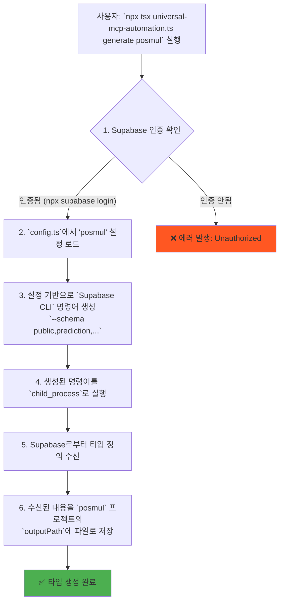

# Universal MCP Automation 시스템 작동 원리 보고서

---
- **type**: `explanation`
- **title**: `Universal MCP Automation 시스템 심층 분석`
- **description**: `독립 실행형 MCP 자동화 시스템의 내부 작동 원리, 실행 흐름, 그리고 빌드 프로세스를 상세히 설명합니다.`
- **last_updated**: `2025-06-25`
- **tags**: `mcp`, `automation`, `typescript`, `supabase`, `architecture`
- **related_docs**: `mcp-automation/README.md`
---

## 📚 목차

- [1. 시스템 개요](#1-시스템-개요)
- [2. 핵심 실행 흐름](#2-핵심-실행-흐름)
- [3. `npm run build`의 역할과 과정](#3-npm-run-build의-역할과-과정)
- [4. 아키텍처 및 주요 구성 요소](#4-아키텍처-및-주요-구성-요소)
- [5. 미래 비전: 완전 자동화 MCP 연동](#5-미래-비전-완전-자동화-mcp-연동)

---

## 1. 시스템 개요

Universal MCP Automation 시스템은 특정 프로젝트에 종속되지 않고, **독립적으로 실행**되어 Supabase 데이터베이스 스키마로부터 TypeScript 타입을 생성하는 범용 자동화 도구입니다.

이 시스템의 핵심 목표는 여러 프로젝트와 다양한 도메인 구조에 유연하게 대응하면서, 개발자가 수동으로 타입을 관리하는 비효율을 제거하고 타입 안정성을 극대화하는 것입니다.



## 2. 핵심 실행 흐름

사용자가 터미널에서 스크립트를 실행할 때, 시스템은 다음과 같은 단계를 거칩니다. 이는 현재 가장 안정적인 **수동 실행 방식**을 기준으로 합니다.



1.  **인증 확인**: 스크립트는 `npx supabase login`을 통해 로컬 환경에 저장된 인증 토큰을 사용하여 Supabase에 접근합니다. 토큰이 없거나 만료되면 `Unauthorized` 오류가 발생합니다.
2.  **설정 로드**: `generate posmul` 명령어에서 `posmul` 인자를 받아, `config.ts` 파일에 미리 정의된 프로젝트 설정을 로드합니다. 여기에는 프로젝트 ID, 출력 경로, 그리고 가장 중요한 **도메인 스키마 목록**이 포함됩니다.
3.  **명령어 생성**: 로드된 설정을 바탕으로 동적으로 `supabase gen types typescript` 명령어를 조립합니다. 이때 `--schema` 플래그에 설정된 모든 도메인 스키마를 쉼표로 구분하여 추가합니다.
4.  **자식 프로세스 실행**: 조립된 CLI 명령어를 Node.js의 `child_process.execSync`를 통해 터미널에서 직접 실행합니다.
5.  **결과 저장**: Supabase CLI가 성공적으로 타입 정의를 반환하면, 스크립트는 이 결과를 받아 지정된 `outputPath`에 `.ts` 파일로 저장하여 모든 과정을 마칩니다.

## 3. `npm run build`의 역할과 과정

`package.json`에 정의된 `build` 스크립트는 이 자동화 시스템을 **배포 가능한 JavaScript 코드로 변환**하는 역할을 합니다.

**`package.json` 스크립트 정의:**
```json
"scripts": {
  "build": "tsc universal-mcp-automation.ts --outDir dist"
}
```

`npm run build` 실행 시 발생하는 과정은 다음과 같습니다.

```mermaid
graph TD
    A["`npm run build` 실행"] --> B["TypeScript Compiler (`tsc`) 호출"];
    B --> C["`universal-mcp-automation.ts` 파일 분석"];
    C --> D["TypeScript 코드를<br/>JavaScript 코드로 변환 (컴파일)"];
    D --> E["결과물을 `dist` 디렉터리에 저장"];
    E --> F["완료: 배포 가능한<br/>`universal-mcp-automation.js` 파일 생성"];
    
    subgraph "소스 코드"
        style C fill:#E3F2FD
        C
    end
    subgraph "빌드 결과물"
        style E fill:#C8E6C9
        E
    end
```

- **핵심 역할**: 현재 `.ts` (TypeScript) 파일은 `tsx`와 같은 실행기를 통해서만 실행할 수 있습니다. `npm run build`는 `tsc`를 이용해 이 파일을 순수 JavaScript 파일로 컴파일하여, Node.js가 설치된 어떤 환경에서든 `node dist/universal-mcp-automation.js` 명령어로 직접 실행할 수 있게 만듭니다.
- **배포 준비**: 이 과정은 스크립트를 NPM 패키지로 만들어 배포하거나, 다른 시스템에 실행 파일만 간단히 복사하여 이식하고자 할 때 필수적인 단계입니다.

## 4. 아키텍처 및 주요 구성 요소

이 시스템은 매우 단순하지만 확장 가능한 구조를 가지고 있습니다.

-   **`universal-mcp-automation.ts`**: 메인 실행 파일. 사용자 입력을 파싱하고, 설정을 로드하며, 실제 명령어 실행을 조율하는 오케스트레이터 역할을 합니다.
-   **`config.ts`**: 프로젝트별 설정을 중앙에서 관리하는 파일. 새로운 프로젝트를 지원하려면 이 파일에 설정을 추가하기만 하면 됩니다.
-   **`package.json`**: 프로젝트의 의존성(`tsx`, `typescript` 등)과 실행 스크립트(`build`, `start` 등)를 정의합니다.

## 5. 미래 비전: 완전 자동화 MCP 연동

현재의 수동 실행 방식은 안정적이지만, 최종 목표는 AI Agent가 MCP 도구를 호출했을 때 이 모든 과정이 자동으로 일어나는 것입니다.

```mermaid
graph TD
    subgraph "AI Agent"
        A["`mcp_supabase_...` 호출"]
    end
    
    subgraph "이상적인 자동화 시스템"
        B[MCP 서버] --> C[Universal Automation 호출]
        C --> D[자동 인증 및 실행]
    end

    subgraph "결과"
        E[타입 파일 자동 생성]
    end

    A --> B --> E
```

이 구조가 완성되면, 개발자는 스키마 변경 후 타입 생성을 전혀 신경 쓸 필요 없이 AI Agent와의 대화를 통해 모든 것을 완료할 수 있게 될 것입니다. 이 내용은 `README.md`의 개발 계획에도 반영되어 있습니다. 