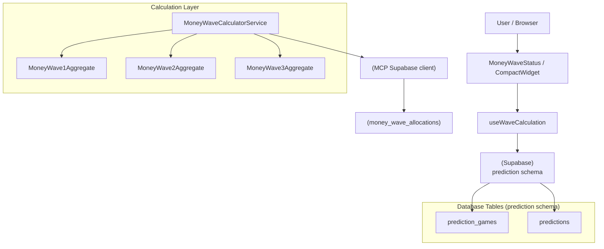
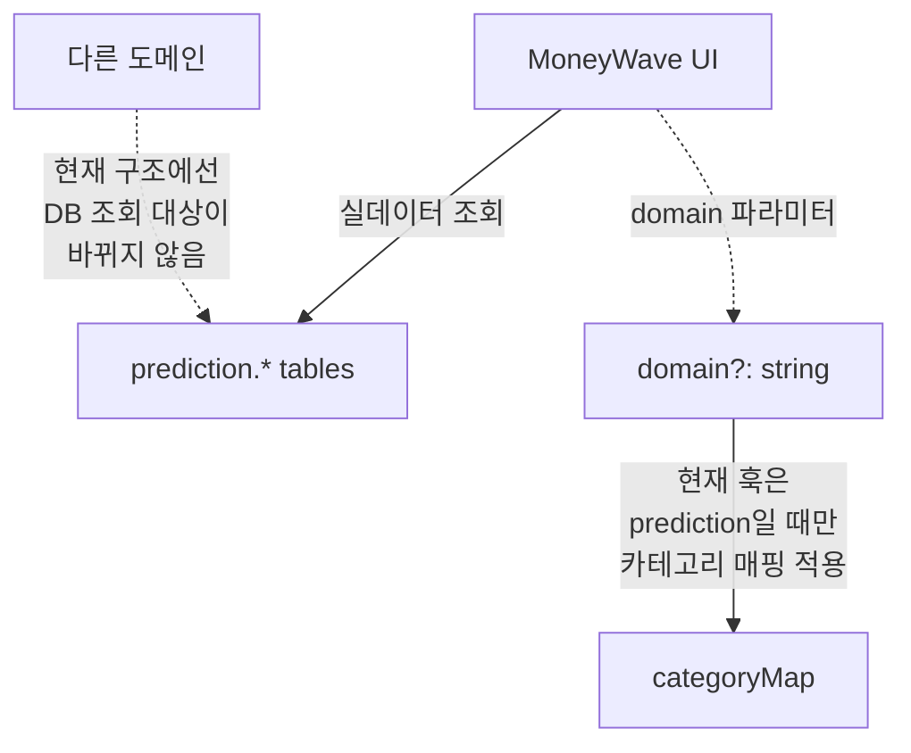
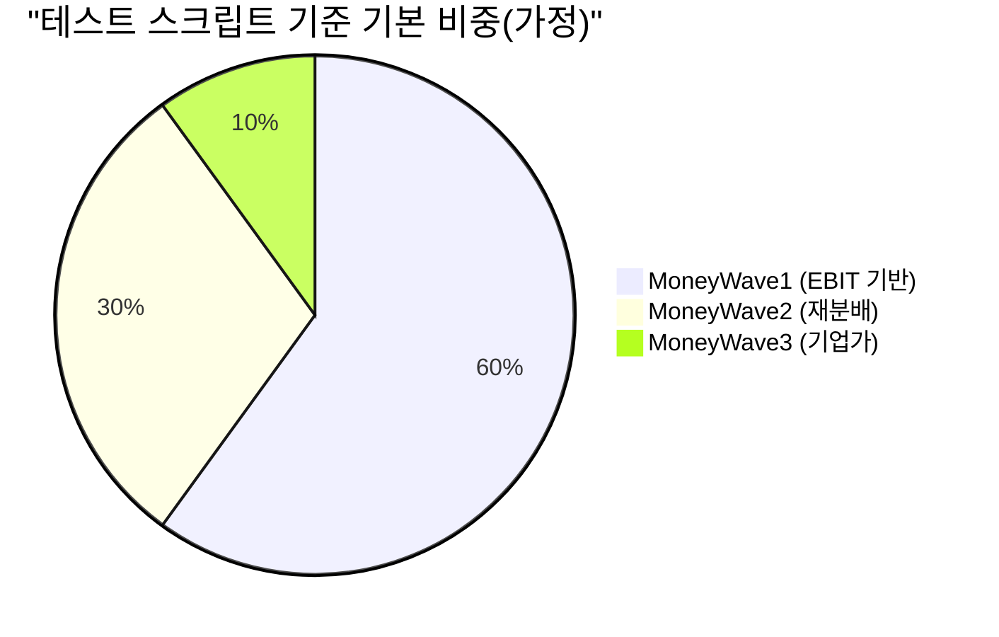

# MoneyWave (1/2/3) 문서 모음

## TL;DR
- MoneyWave **계산 로직**은 크게 3군데에 존재합니다.
  1) **Economy 도메인 Aggregate**: MoneyWave1/2/3의 불변성/상태 전이(DDD)
  2) **shared/economy-kernel 서비스**: 풀 계산/배분 로직(런타임 계산)
  3) **UI 훅(useWaveCalculation)**: 화면 표시용 간단 계산 + DB 카운트 조회
- 현재 UI 훅/컴포넌트는 **prediction 스키마 테이블을 직접 조회**하므로, 사실상 MoneyWave는 **prediction 전용으로 동작**합니다.

## 소스(핵심 파일)
- 계산(서비스): [apps/posmul-web/src/shared/economy-kernel/services/money-wave-calculator.service.ts](../../apps/posmul-web/src/shared/economy-kernel/services/money-wave-calculator.service.ts)
- DDD Aggregate
  - MoneyWave1: [apps/posmul-web/src/bounded-contexts/economy/domain/entities/money-wave1.aggregate.ts](../../apps/posmul-web/src/bounded-contexts/economy/domain/entities/money-wave1.aggregate.ts)
  - MoneyWave2: [apps/posmul-web/src/bounded-contexts/economy/domain/entities/money-wave2.aggregate.ts](../../apps/posmul-web/src/bounded-contexts/economy/domain/entities/money-wave2.aggregate.ts)
  - MoneyWave3: [apps/posmul-web/src/bounded-contexts/economy/domain/entities/money-wave3.aggregate.ts](../../apps/posmul-web/src/bounded-contexts/economy/domain/entities/money-wave3.aggregate.ts)
- UI(표시)
  - 훅: [apps/posmul-web/src/shared/ui/components/layout/MoneyWave/useWaveCalculation.ts](../../apps/posmul-web/src/shared/ui/components/layout/MoneyWave/useWaveCalculation.ts)
  - 위젯: [apps/posmul-web/src/shared/ui/components/layout/MoneyWaveStatus.tsx](../../apps/posmul-web/src/shared/ui/components/layout/MoneyWaveStatus.tsx)
  - 네비바용 컴팩트 위젯: [apps/posmul-web/src/shared/ui/components/layout/MoneyWave/CompactWidget.tsx](../../apps/posmul-web/src/shared/ui/components/layout/MoneyWave/CompactWidget.tsx)
- DB 기록/할당(MCP)
  - 할당 기록: [apps/posmul-web/src/shared/mcp/supabase-client.ts](../../apps/posmul-web/src/shared/mcp/supabase-client.ts)

## 문서 목록
- MoneyWave1: EBIT 기반 풀(발행/적립) — [moneywave1.md](moneywave1.md)
- MoneyWave2: 미소비 PMC 재분배(행동경제학) — [moneywave2.md](moneywave2.md)
- MoneyWave3: 기업가/파트너십 PMC(네트워크 효과) — [moneywave3.md](moneywave3.md)
- UI/컴포넌트/운영 범위(prediction 전용) — [moneywave-ui.md](moneywave-ui.md)

---

## 전체 플로우(현재 구현 기준)

## “prediction 전용” 관점에서의 정리

## (참고) 테스트/실험 스크립트
- MoneyWave 통합 테스트: [apps/posmul-web/scripts/prediction/test-moneywave-integration.ts](../../apps/posmul-web/scripts/prediction/test-moneywave-integration.ts)
- Phase2 계산 가정(60/30/10): [apps/posmul-web/scripts/prediction/test-phase2-moneywave23.js](../../apps/posmul-web/scripts/prediction/test-phase2-moneywave23.js)

> 주의: 위 비중은 "스크립트" 가정입니다. 실제 런타임 계산은 `MoneyWaveCalculatorService` 내부 구현과 DB 연동 여부(TODO)에 따라 달라질 수 있습니다.
