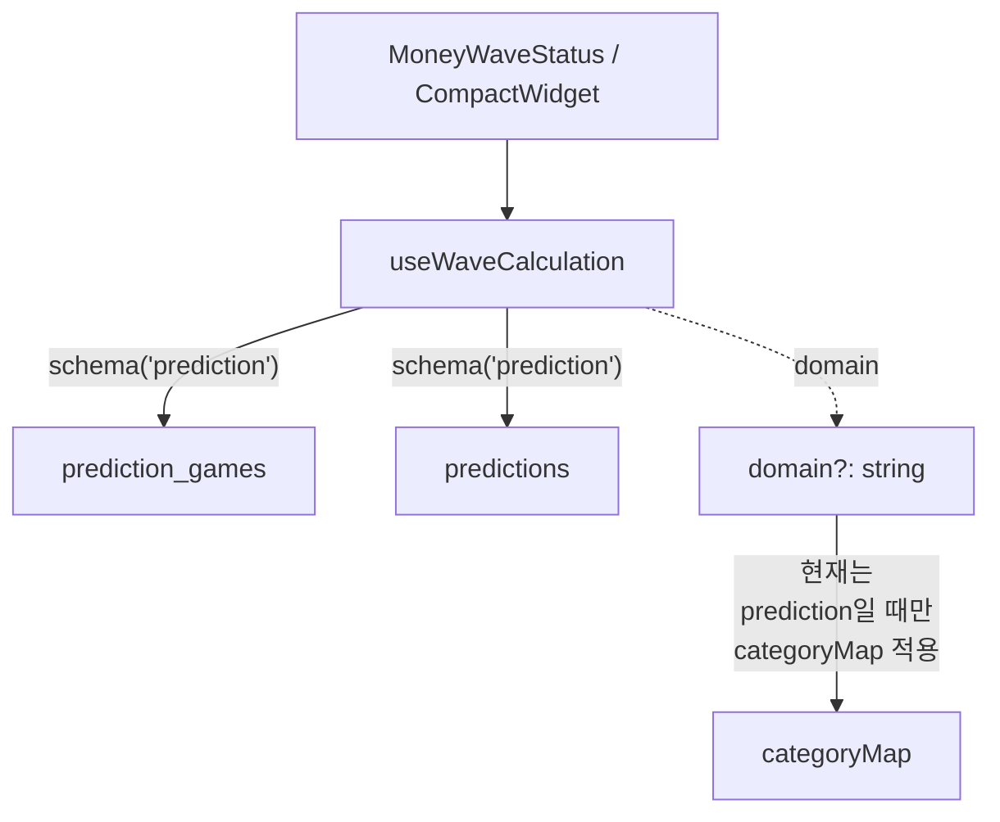
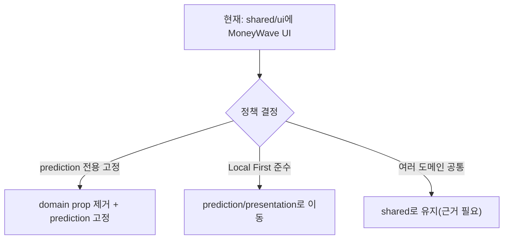

# MoneyWave UI/컴포넌트는 어디서 관리하나?

## 현재 위치(코드 기준)
- MoneyWave 상태 카드: [apps/posmul-web/src/shared/ui/components/layout/MoneyWaveStatus.tsx](../../apps/posmul-web/src/shared/ui/components/layout/MoneyWaveStatus.tsx)
- 네비바 컴팩트 위젯: [apps/posmul-web/src/shared/ui/components/layout/MoneyWave/CompactWidget.tsx](../../apps/posmul-web/src/shared/ui/components/layout/MoneyWave/CompactWidget.tsx)
- 계산 훅(브라우저): [apps/posmul-web/src/shared/ui/components/layout/MoneyWave/useWaveCalculation.ts](../../apps/posmul-web/src/shared/ui/components/layout/MoneyWave/useWaveCalculation.ts)

## 실제 데이터 소스(중요)
`useWaveCalculation`은 아래처럼 **항상** `prediction` 스키마의 테이블만 조회합니다.
- `prediction.prediction_games` (ACTIVE 게임 count)
- `prediction.predictions` (참여 count)

즉, props에 `domain`이 있어도, 현재 구현은 사실상 **prediction 전용 UI**입니다.



## 표시 계산(현재)
- UI는 `economy.money_wave_daily_snapshots.hourly_pool_total_pmc`(서버 계산 스냅샷)을 읽어 **시간당 풀(Truth)** 을 가져옵니다.
- 이후 `카테고리 활성 게임 수 / 전체 활성 게임 수`(+ 카테고리 multiplier)를 가중치로 적용해 **카테고리별 Truth 금액**을 산출합니다.
- 마지막으로 UI는 “연출(Display)”을 위해 해당 시간의 진행률을 기반으로 **50% → 100% reveal** 을 적용해 화면 표시값을 만듭니다.

```mermaid
flowchart TD
  A[DB snapshot: hourly_pool_total_pmc] --> B[Truth hourly total]
  B --> C[count(active games by category)]
  B --> D[count(active games total)]
  C --> E[weight by counts (+ multipliers)]
  D --> E
  E --> F[truthWave = hourlyTotal * weight]
  F --> G[revealRatio 0.5 -> 1.0]
  G --> H[displayWave = truthWave * revealRatio]
```

## “prediction 이외 도메인 MoneyWave는 쓸모 없다”에 대한 정리
- 현재 UI/훅이 이미 prediction 데이터만 보므로, “다른 도메인 moneywave”는 **표시/계산 관점에서 이미 무력화**되어 있습니다.
- 다만 컴포넌트가 `shared/ui`에 있어서, 프로젝트 규칙(Local First)에 비추면 성격이 애매합니다.

### 추천 정리 방향(작업 후보)
1) (가장 단순) `domain` prop 제거/고정: API를 단순화하고 “prediction 전용”을 타입/코드로 고정
2) (규칙 준수) MoneyWave UI를 prediction 도메인으로 이동
   - `shared/ui`는 primitive 위주 유지
   - MoneyWave는 `bounded-contexts/prediction/presentation`로 이동하는 편이 더 DDD 정합



## 사용처(대표)
- `MoneyWaveStatus`는 여러 라우트 레이아웃에서 기본 렌더링됩니다.
  - [apps/posmul-web/src/app/consume/layout.tsx](../../apps/posmul-web/src/app/consume/layout.tsx)
  - [apps/posmul-web/src/app/donation/layout.tsx](../../apps/posmul-web/src/app/donation/layout.tsx)
  - [apps/posmul-web/src/app/forum/layout.tsx](../../apps/posmul-web/src/app/forum/layout.tsx)
  - [apps/posmul-web/src/app/invest/layout.tsx](../../apps/posmul-web/src/app/invest/layout.tsx)

> “다른 도메인 페이지에서 보여줄지/안 보여줄지”는 UX/제품 정책이라서, 필요하면 별도 이슈로 분리해 정리하는 걸 추천합니다.
