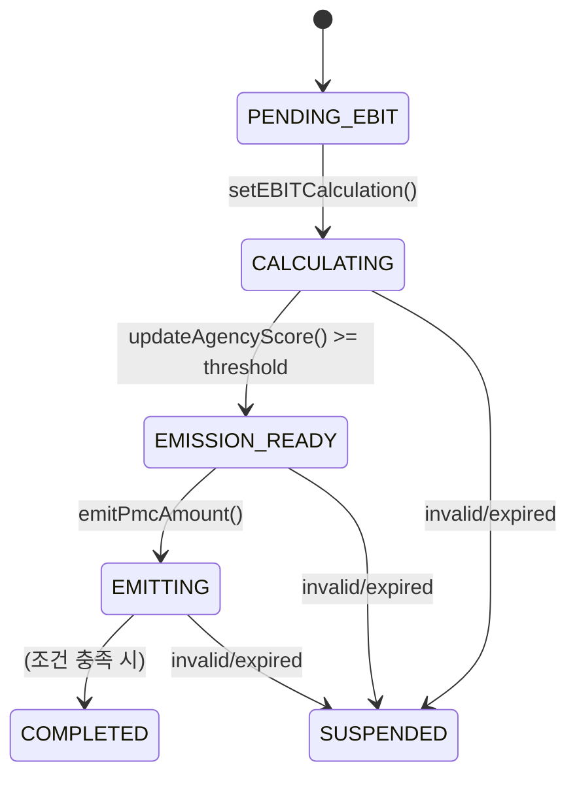
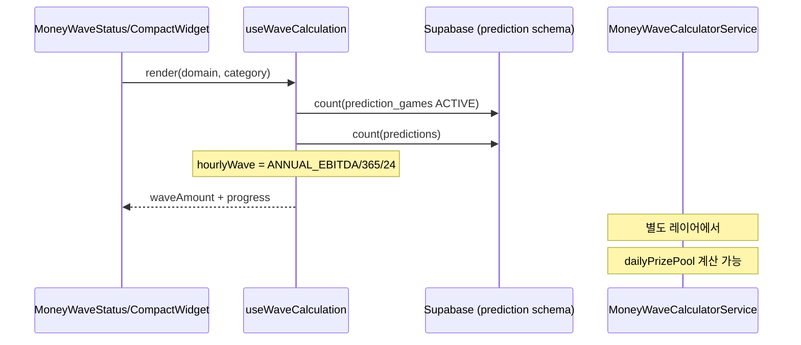

# MoneyWave1 (EBIT 기반 풀)

## 역할
- 기업의 연간 EBIT(또는 유사 지표)를 기반으로, **일일 풀(또는 발행 한도)**을 계산하고 PMC 발행/적립 근거를 제공합니다.
- DDD 관점에서는 **불변성/상태 전이**가 핵심이며, 계산 서비스(`MoneyWaveCalculatorService`)는 “풀 크기 산출”에 초점이 있습니다.

## 구현 위치
- Aggregate(DDD): [apps/posmul-web/src/bounded-contexts/economy/domain/entities/money-wave1.aggregate.ts](../../apps/posmul-web/src/bounded-contexts/economy/domain/entities/money-wave1.aggregate.ts)
- 계산 서비스(풀 계산): [apps/posmul-web/src/shared/economy-kernel/services/money-wave-calculator.service.ts](../../apps/posmul-web/src/shared/economy-kernel/services/money-wave-calculator.service.ts)

## 핵심 불변성(aggregate 기준)
- EBIT가 양수일 때만 발행/진행 가능
- 데이터 유효기간(`validUntil`)이 만료되면 진행 불가
- 일일 발행량은 “연간 순이익 기대치의 1/365”를 초과하지 않음(aggregate 내부에서 `maxDailyEmission` 설정)

## 상태 전이

## 계산(서비스) 관점: 일일 풀 계산식
`MoneyWaveCalculatorService.calculateDailyPrizePool()`에서 “EBIT 기반 풀”은 아래처럼 계산됩니다.

- 세후/이자 차감 후
$$\text{netEbit} = E \times (1 - taxRate - interestRate)$$
- 일일 풀
$$\text{ebitBasedPool} = \text{netEbit} \times \frac{1}{365}$$

> 구현 상세: [apps/posmul-web/src/shared/economy-kernel/services/money-wave-calculator.service.ts](../../apps/posmul-web/src/shared/economy-kernel/services/money-wave-calculator.service.ts)

## MoneyWave1이 prediction에 연결되는 지점(현재)
- UI는 `useWaveCalculation`에서 **prediction 게임 수/참여자 수**를 보고 “시간당” 표시 금액을 계산합니다.
- 서비스/aggregate의 계산 결과가 그대로 UI로 연결되기보다는, 현재는 **UI가 단순화된 모델로 보여주는 구조**에 가깝습니다.

## 확인 포인트(운영/정확성)
- UI 훅의 `ANNUAL_EBITDA`는 상수(10억)로 박혀 있어, 실제 경제 지표/DB 기반 값으로 대체할지 결정 필요
- “일일 풀”과 “시간당 표기”가 혼재되어 있어, 용어/단위 정리 필요(일일 풀을 시간으로 나누는지, 별도 시간당 풀인지)
