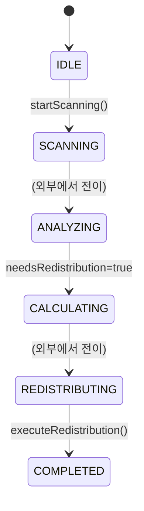
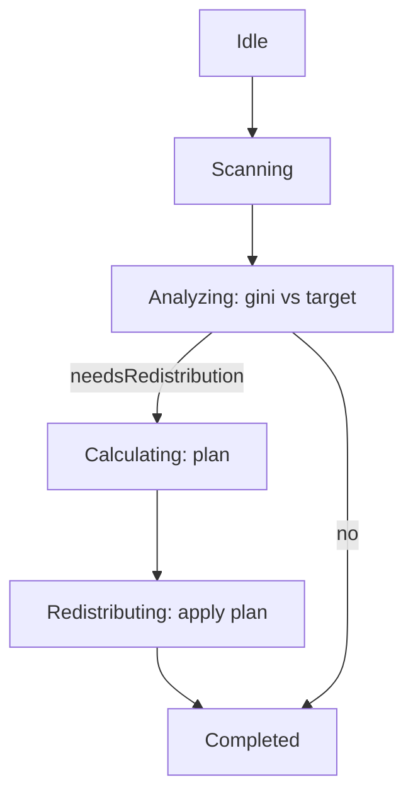

# MoneyWave2 (미소비 PMC 재분배)

## 역할
- 일정 기간 미사용(휴면) PMC를 재분배하는 개념(행동경제학/불평등 완화 지표 등)을 담습니다.
- 현재 코드 기준으로는 2개 레이어가 공존합니다.
  - **서비스 레이어**(`MoneyWaveCalculatorService`): “일일 재분배 풀”을 계산(현재는 TODO 포함)
  - **Aggregate 레이어**(`MoneyWave2Aggregate`): 스캔→분석→계산→재분배의 상태 전이/결과 산출

## 구현 위치
- Aggregate(DDD/레거시 성격): [apps/posmul-web/src/bounded-contexts/economy/domain/entities/money-wave2.aggregate.ts](../../apps/posmul-web/src/bounded-contexts/economy/domain/entities/money-wave2.aggregate.ts)
- 계산 서비스(재분배 풀): [apps/posmul-web/src/shared/economy-kernel/services/money-wave-calculator.service.ts](../../apps/posmul-web/src/shared/economy-kernel/services/money-wave-calculator.service.ts)

## 상태 전이(aggregate)

## 계산(서비스) 관점: 기본 재분배 풀
`calculateRedistributedPmc()`는 현재 “일일 EBIT 기반 * 0.3”을 기본 풀로 사용합니다.

$$\text{dailyEbitBase} = E \times \frac{1}{365}$$
$$\text{baseRedistributionPool} = \text{dailyEbitBase} \times 0.3$$

> 주의: 주석에 실제 DB 쿼리(TODO)가 있으며, 아직 “30일 이상 미사용 PMC”를 실측 조회해 합산하는 단계로 완전히 연결되지는 않았습니다.

## (중요) 레거시/정합성 메모
- `MoneyWave2Aggregate`는 `legacy-compatibility`의 `Result`를 사용하고, 정책 타입에 `any`가 포함되어 있습니다.
- TypeScript strict/DDD 정합 관점에서는 “실제로 쓰는지(런타임 경로)”를 먼저 확인한 뒤 정리하는 것이 안전합니다.

## prediction 전용 관점
- UI 훅/컴포넌트는 `prediction.*` 테이블만 조회하므로, MoneyWave2가 “다른 도메인”을 기준으로 계산/표시되지는 않습니다.
- 따라서 MoneyWave2를 prediction 전용으로 운영한다면, **재분배 대상/룰의 데이터 소스도 prediction과 연결**할지(예: prediction 참여/보상 기반) 정책 결정이 필요합니다.
