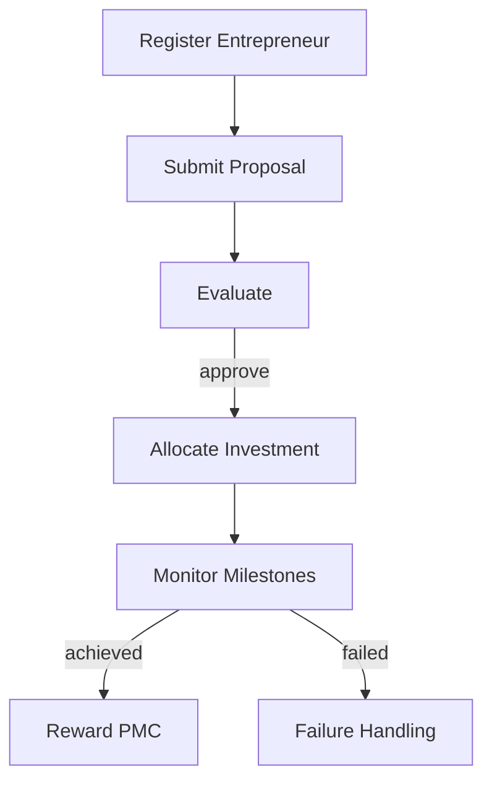
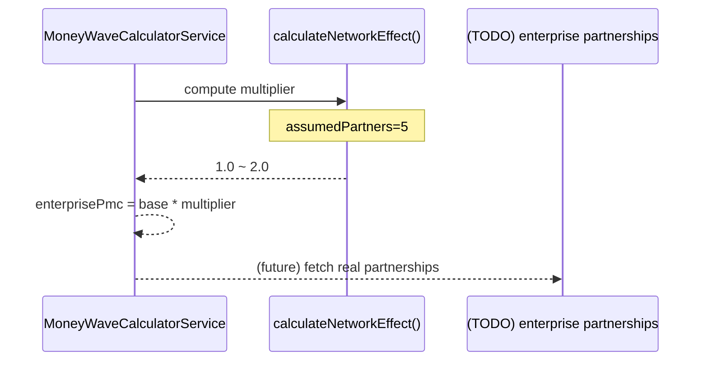

# MoneyWave3 (기업가/파트너십 풀)

## 역할
- 기업가 생태계(파트너/벤처/투자) 기반의 PMC 공급/보상 로직을 담습니다.
- 현재 코드 기준으로는 2개 형태가 공존합니다.
  - **Aggregate(DDD)**: 기업가 등록/제안서/투자 배분/마일스톤 보상 등 큰 모델
  - **서비스 계산**: 일일 EBIT 기반 0.1 * 네트워크 효과(가정)로 “기본 기업가 풀” 산정

## 구현 위치
- Aggregate(DDD): [apps/posmul-web/src/bounded-contexts/economy/domain/entities/money-wave3.aggregate.ts](../../apps/posmul-web/src/bounded-contexts/economy/domain/entities/money-wave3.aggregate.ts)
- 계산 서비스(기업가 풀): [apps/posmul-web/src/shared/economy-kernel/services/money-wave-calculator.service.ts](../../apps/posmul-web/src/shared/economy-kernel/services/money-wave-calculator.service.ts)

## 상태/유스케이스(aggregate 하이라이트)
- `registerEntrepreneur(profile)` : 기업가 등록(혁신/실행/잠재력 검증)
- `submitVentureProposal(proposal)` : 벤처 제안 검증(투자금/ROI/혁신도)
- (이후) 투자 배분/성과 이벤트/보상 등

## 계산(서비스) 관점: 기업가 풀
기본 로직은 “일일 EBIT 기반 * 0.1”에 네트워크 효과(가정)를 곱합니다.

$$\text{baseEnterprisePool} = (E \times \frac{1}{365}) \times 0.1$$
$$\text{enterprisePmc} = \text{baseEnterprisePool} \times \text{networkMultiplier}$$

> `networkMultiplier`는 현재 “파트너 수 가정(5)”으로 1.0~2.0 범위를 반환합니다. 실제 파트너 수는 TODO로 남아 있습니다.

## prediction 전용 관점
- 현재 UI는 prediction 데이터로만 MoneyWave 금액/가중치를 산정합니다.
- MoneyWave3가 “기업가 생태계”로써 독자 도메인이 된다면, UI/DB/정책을 별도의 BC로 분리하는 것이 자연스럽습니다.
- 반대로 “prediction 전용 보상 풀”로만 운영한다면, aggregate의 범위를 축소하고 “보상 정책/풀 계산”만 남기는 방향이 더 단순합니다.
