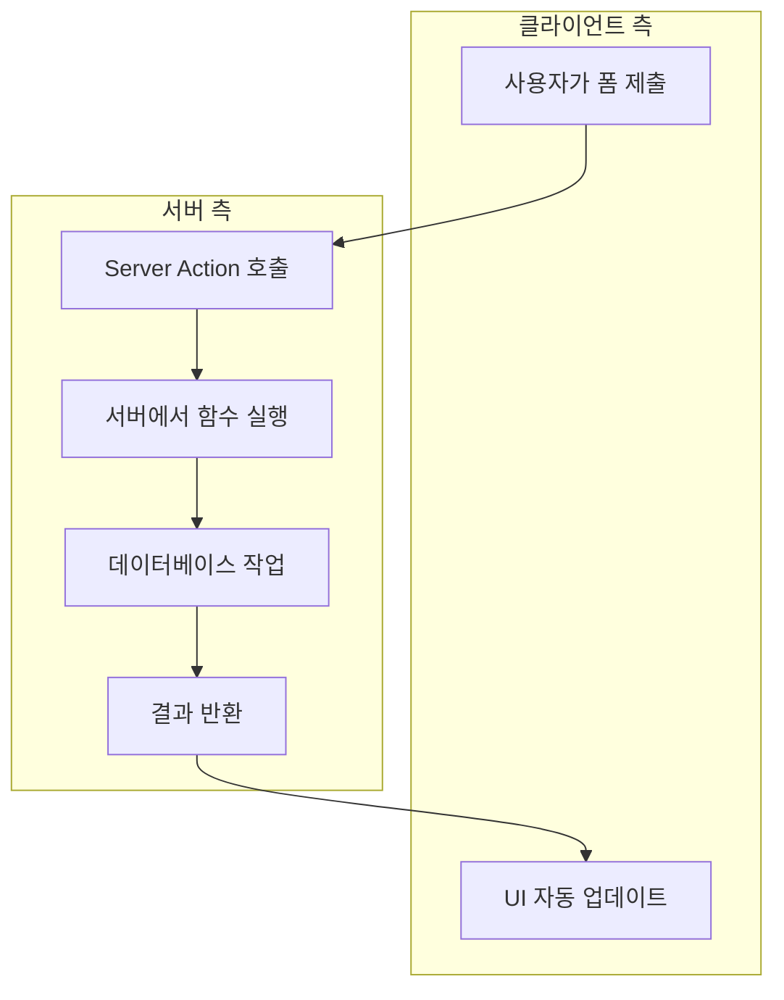
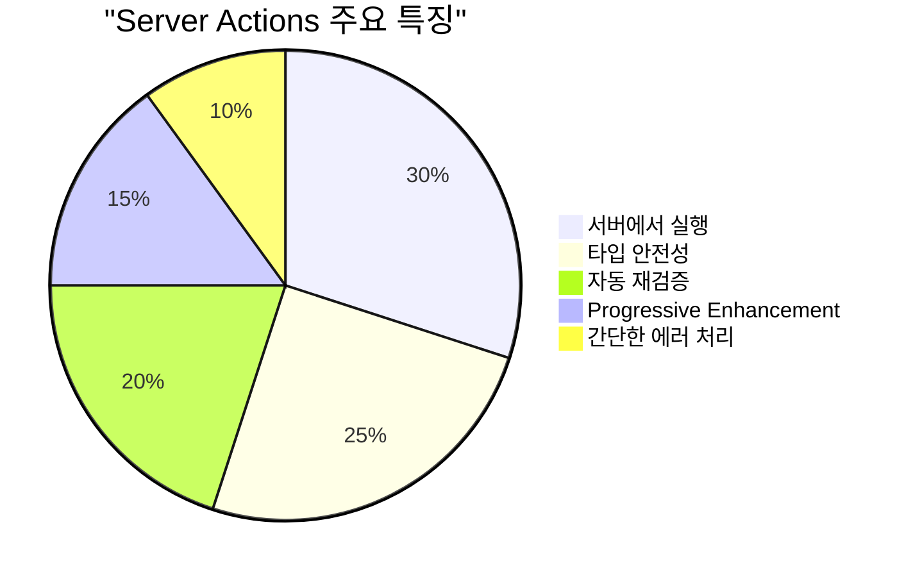
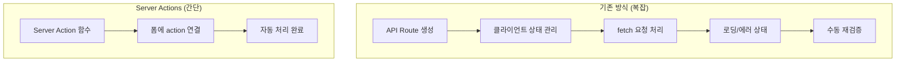
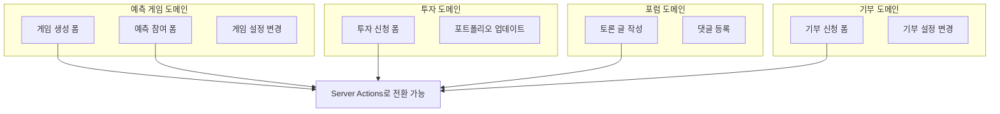
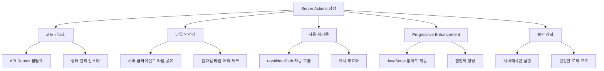
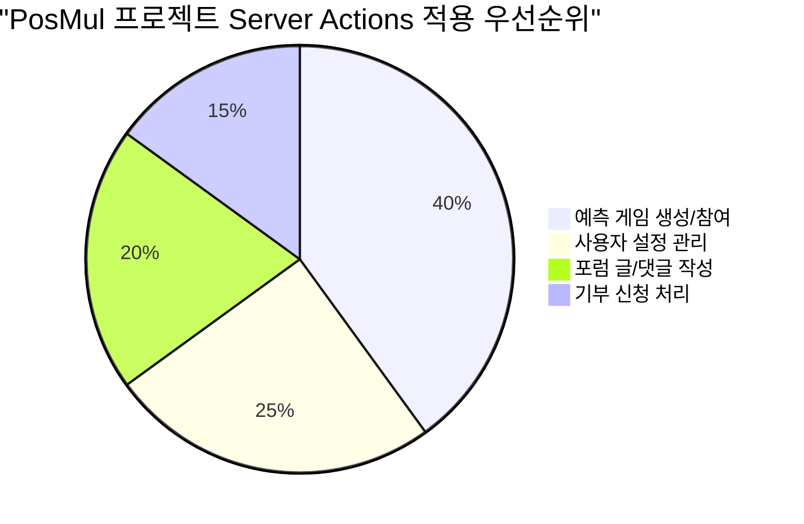

# Next.js Server Actions 완전 가이드

> **문서 목적**: Next.js App Router의 Server Actions 개념 이해 및 PosMul 프로젝트 적용 방법  
> **대상 독자**: 프론트엔드 개발자, Next.js 학습자  
> **기준 버전**: Next.js 15 App Router  
> **프로젝트**: PosMul 예측 게임 플랫폼

## 📋 목차

1. [Server Actions란 무엇인가?](#server-actions란-무엇인가)
2. [기존 방식 vs Server Actions](#기존-방식-vs-server-actions)
3. [PosMul 프로젝트에서의 활용](#posmul-프로젝트에서의-활용)
4. [실제 구현 예제](#실제-구현-예제)
5. [장단점 및 사용 시나리오](#장단점-및-사용-시나리오)
6. [실습 가이드](#실습-가이드)

## Server Actions란 무엇인가?

### 🎯 핵심 개념

**Server Actions**는 Next.js 13.4+에서 도입된 기능으로, **서버에서 실행되는 비동기 함수**입니다. 클라이언트에서 직접 호출할 수 있지만 실제로는 서버에서 실행됩니다.



### 📊 Server Actions의 특징



## 기존 방식 vs Server Actions

### ❌ 기존 방식 (API Routes + fetch)

```typescript
// 기존: app/api/predictions/route.ts
export async function POST(request: Request) {
  const body = await request.json();
  // 데이터 처리 로직
  return Response.json({ success: true });
}

// 기존: 클라이언트 컴포넌트
("use client");
export function PredictionForm() {
  const [loading, setLoading] = useState(false);
  const [error, setError] = useState<string | null>(null);

  const handleSubmit = async (e: FormEvent) => {
    e.preventDefault();
    setLoading(true);
    setError(null);

    try {
      const response = await fetch("/api/predictions", {
        method: "POST",
        headers: { "Content-Type": "application/json" },
        body: JSON.stringify(formData),
      });

      if (!response.ok) {
        throw new Error("Failed to submit");
      }

      // 성공 처리
    } catch (err) {
      setError(err.message);
    } finally {
      setLoading(false);
    }
  };

  return <form onSubmit={handleSubmit}>{/* 복잡한 상태 관리 코드 */}</form>;
}
```

### ✅ Server Actions 방식

```typescript
// 새로운: app/actions/prediction-actions.ts
"use server";

export async function createPrediction(formData: FormData) {
  // 서버에서 직접 실행
  const title = formData.get("title") as string;
  const description = formData.get("description") as string;

  // 데이터 검증
  if (!title || title.length < 3) {
    return { error: "제목은 3글자 이상이어야 합니다." };
  }

  // 데이터베이스 작업 (Supabase MCP 사용)
  const result = await mcp_supabase_execute_sql({
    project_id: "your-project-id",
    query: `
      INSERT INTO prediction_games (title, description, creator_id)
      VALUES ($1, $2, $3)
      RETURNING id
    `,
  });

  // 성공 시 리다이렉트
  redirect("/predictions");
}

// 새로운: 컴포넌트 (서버 컴포넌트도 가능!)
export function PredictionForm() {
  return (
    <form action={createPrediction}>
      <input name="title" required />
      <input name="description" />
      <button type="submit">예측 게임 생성</button>
    </form>
  );
}
```

### 📈 복잡도 비교



## PosMul 프로젝트에서의 활용

### 🎮 현재 프로젝트 구조 분석

현재 PosMul 프로젝트에서 Server Actions를 적용할 수 있는 영역:



### 🔧 PosMul 프로젝트 적용 계획

1. **우선순위 1**: 예측 게임 생성/참여 폼
2. **우선순위 2**: 사용자 설정 및 프로필 업데이트
3. **우선순위 3**: 포럼 글/댓글 작성

## 실제 구현 예제

### 📝 예제 1: 예측 게임 생성

```typescript
// src/app/actions/prediction-actions.ts
"use server";

import { redirect } from "next/navigation";
import { mcp_supabase_execute_sql } from "@/shared/mcp/supabase-client";
import { revalidatePath } from "next/cache";

export async function createPredictionGame(formData: FormData) {
  // 1. 폼 데이터 추출
  const title = formData.get("title") as string;
  const description = formData.get("description") as string;
  const predictionType = formData.get("predictionType") as string;
  const endTime = formData.get("endTime") as string;

  // 2. 서버 측 검증
  const errors: Record<string, string> = {};

  if (!title || title.length < 3) {
    errors.title = "제목은 3글자 이상이어야 합니다.";
  }

  if (!description || description.length < 10) {
    errors.description = "설명은 10글자 이상이어야 합니다.";
  }

  if (Object.keys(errors).length > 0) {
    return { errors };
  }

  try {
    // 3. 데이터베이스 저장 (Supabase MCP 사용)
    const result = await mcp_supabase_execute_sql({
      project_id: process.env.SUPABASE_PROJECT_ID!,
      query: `
        INSERT INTO prediction_games (
          title, 
          description, 
          prediction_type, 
          end_time,
          creator_id,
          status
        ) VALUES ($1, $2, $3, $4, $5, 'PENDING')
        RETURNING id, title
      `,
    });

    const gameId = result.data?.[0]?.id;

    // 4. 캐시 재검증
    revalidatePath("/prediction");
    revalidatePath("/dashboard");

    // 5. 성공 시 리다이렉트
    redirect(`/prediction/games/${gameId}`);
  } catch (error) {
    console.error("게임 생성 실패:", error);
    return {
      errors: {
        general: "게임 생성 중 오류가 발생했습니다. 다시 시도해주세요.",
      },
    };
  }
}
```

### 🎯 예제 2: 예측 참여

```typescript
// src/app/actions/prediction-actions.ts
"use server";

export async function participateInPrediction(
  gameId: string,
  formData: FormData
) {
  const selectedOption = formData.get("selectedOption") as string;
  const stakeAmount = parseFloat(formData.get("stakeAmount") as string);

  // 1. 경제 시스템 검증 (PMP 잔액 확인)
  const userBalance = await mcp_supabase_execute_sql({
    project_id: process.env.SUPABASE_PROJECT_ID!,
    query: `
      SELECT balance FROM pmp_accounts 
      WHERE user_id = $1
    `,
  });

  if (userBalance.data?.[0]?.balance < stakeAmount) {
    return {
      errors: {
        stake: "PMP 잔액이 부족합니다.",
      },
    };
  }

  try {
    // 2. 트랜잭션으로 예측 참여 + 잔액 차감
    await mcp_supabase_execute_sql({
      project_id: process.env.SUPABASE_PROJECT_ID!,
      query: `
        BEGIN;
        
        INSERT INTO predictions (
          game_id, user_id, selected_option, stake_amount
        ) VALUES ($1, $2, $3, $4);
        
        UPDATE pmp_accounts 
        SET balance = balance - $4 
        WHERE user_id = $2;
        
        COMMIT;
      `,
    });

    revalidatePath(`/prediction/games/${gameId}`);
    return { success: true };
  } catch (error) {
    return {
      errors: {
        general: "예측 참여 중 오류가 발생했습니다.",
      },
    };
  }
}
```

### 🖥️ 컴포넌트에서 사용

```typescript
// src/app/prediction/create/page.tsx
import { createPredictionGame } from "@/app/actions/prediction-actions";

export default function CreatePredictionPage() {
  return (
    <div className="max-w-2xl mx-auto p-6">
      <h1 className="text-3xl font-bold mb-8">새 예측 게임 만들기</h1>

      <form action={createPredictionGame} className="space-y-6">
        <div>
          <label htmlFor="title" className="block text-sm font-medium mb-2">
            게임 제목
          </label>
          <input
            type="text"
            id="title"
            name="title"
            required
            className="w-full px-3 py-2 border border-gray-300 rounded-md"
            placeholder="예: 2024년 대선 결과 예측"
          />
        </div>

        <div>
          <label
            htmlFor="description"
            className="block text-sm font-medium mb-2"
          >
            게임 설명
          </label>
          <textarea
            id="description"
            name="description"
            required
            rows={4}
            className="w-full px-3 py-2 border border-gray-300 rounded-md"
            placeholder="게임에 대한 자세한 설명을 입력하세요..."
          />
        </div>

        <div>
          <label
            htmlFor="predictionType"
            className="block text-sm font-medium mb-2"
          >
            예측 유형
          </label>
          <select
            id="predictionType"
            name="predictionType"
            required
            className="w-full px-3 py-2 border border-gray-300 rounded-md"
          >
            <option value="">선택하세요</option>
            <option value="binary">이진 선택 (예/아니오)</option>
            <option value="wdl">승무패</option>
            <option value="ranking">순위 예측</option>
          </select>
        </div>

        <div>
          <label htmlFor="endTime" className="block text-sm font-medium mb-2">
            마감 시간
          </label>
          <input
            type="datetime-local"
            id="endTime"
            name="endTime"
            required
            className="w-full px-3 py-2 border border-gray-300 rounded-md"
          />
        </div>

        <button
          type="submit"
          className="w-full bg-blue-600 text-white py-2 px-4 rounded-md hover:bg-blue-700 transition-colors"
        >
          게임 생성하기
        </button>
      </form>
    </div>
  );
}
```

## 장단점 및 사용 시나리오

### ✅ Server Actions의 장점



### ❌ Server Actions의 단점

- **제한적인 에러 처리**: 복잡한 에러 상태 관리 어려움
- **실시간 피드백 부족**: 즉시 UI 업데이트 제한
- **복잡한 폼 검증**: 클라이언트 측 검증과 병행 필요
- **디버깅 복잡성**: 서버/클라이언트 경계에서 디버깅 어려움

### 🎯 사용 시나리오

**✅ Server Actions 적합한 경우:**

- 단순한 CRUD 작업
- 폼 제출 및 데이터 저장
- 사용자 인증 및 권한 관리
- 파일 업로드

**❌ Server Actions 부적합한 경우:**

- 실시간 데이터 업데이트
- 복잡한 클라이언트 상태 관리
- 즉시 피드백이 필요한 인터랙션
- 복잡한 검증 로직

## 실습 가이드

### 🚀 1단계: 첫 번째 Server Action 만들기

```bash
# 1. actions 디렉토리 생성
mkdir src/app/actions

# 2. 첫 번째 Server Action 파일 생성
touch src/app/actions/prediction-actions.ts
```

### 📝 2단계: 기본 Server Action 구현

```typescript
// src/app/actions/prediction-actions.ts
"use server";

export async function testServerAction(formData: FormData) {
  const message = formData.get("message") as string;

  console.log("서버에서 실행됨:", message);

  // 간단한 지연 시뮬레이션
  await new Promise((resolve) => setTimeout(resolve, 1000));

  return {
    success: true,
    message: `서버에서 처리됨: ${message}`,
  };
}
```

### 🖥️ 3단계: 테스트 페이지 생성

```typescript
// src/app/test-server-action/page.tsx
import { testServerAction } from "@/app/actions/prediction-actions";

export default function TestServerActionPage() {
  return (
    <div className="max-w-md mx-auto mt-8 p-6 bg-white rounded-lg shadow-md">
      <h1 className="text-2xl font-bold mb-4">Server Action 테스트</h1>

      <form action={testServerAction} className="space-y-4">
        <div>
          <label htmlFor="message" className="block text-sm font-medium mb-2">
            메시지 입력
          </label>
          <input
            type="text"
            id="message"
            name="message"
            required
            className="w-full px-3 py-2 border border-gray-300 rounded-md"
            placeholder="테스트 메시지를 입력하세요"
          />
        </div>

        <button
          type="submit"
          className="w-full bg-blue-600 text-white py-2 px-4 rounded-md hover:bg-blue-700"
        >
          서버로 전송
        </button>
      </form>
    </div>
  );
}
```

### 🔧 4단계: 고급 기능 추가

```typescript
// src/app/actions/advanced-actions.ts
"use server";

import { revalidatePath } from "next/cache";
import { redirect } from "next/navigation";

export async function advancedServerAction(formData: FormData) {
  const data = {
    name: formData.get("name") as string,
    email: formData.get("email") as string,
  };

  // 검증
  if (!data.name || !data.email) {
    return {
      errors: {
        name: !data.name ? "이름을 입력해주세요" : "",
        email: !data.email ? "이메일을 입력해주세요" : "",
      },
    };
  }

  try {
    // 데이터 저장 로직
    console.log("저장할 데이터:", data);

    // 캐시 재검증
    revalidatePath("/dashboard");

    // 성공 시 리다이렉트
    redirect("/dashboard?success=true");
  } catch (error) {
    return {
      errors: {
        general: "저장 중 오류가 발생했습니다.",
      },
    };
  }
}
```

---

## 🎯 결론

**Server Actions**는 Next.js App Router의 강력한 기능으로, 특히 **PosMul 프로젝트의 폼 처리**를 크게 간소화할 수 있습니다.

### 📊 적용 우선순위



**다음 단계**: T001 태스크에서 실제로 예측 게임 생성 폼에 Server Actions를 적용해보세요! 🚀

---

**문서 작성**: 2025-06-24  
**대상 프로젝트**: PosMul 예측 게임 플랫폼  
**Next.js 버전**: 15 App Router
