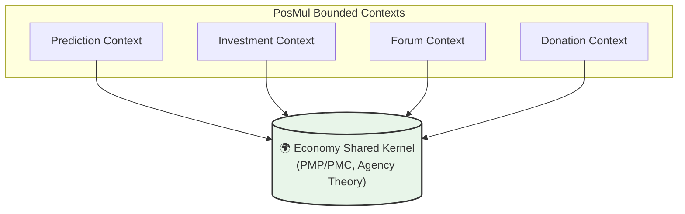
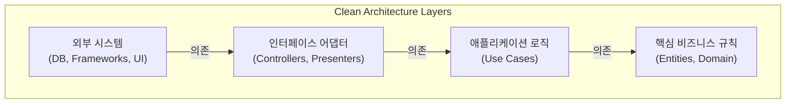
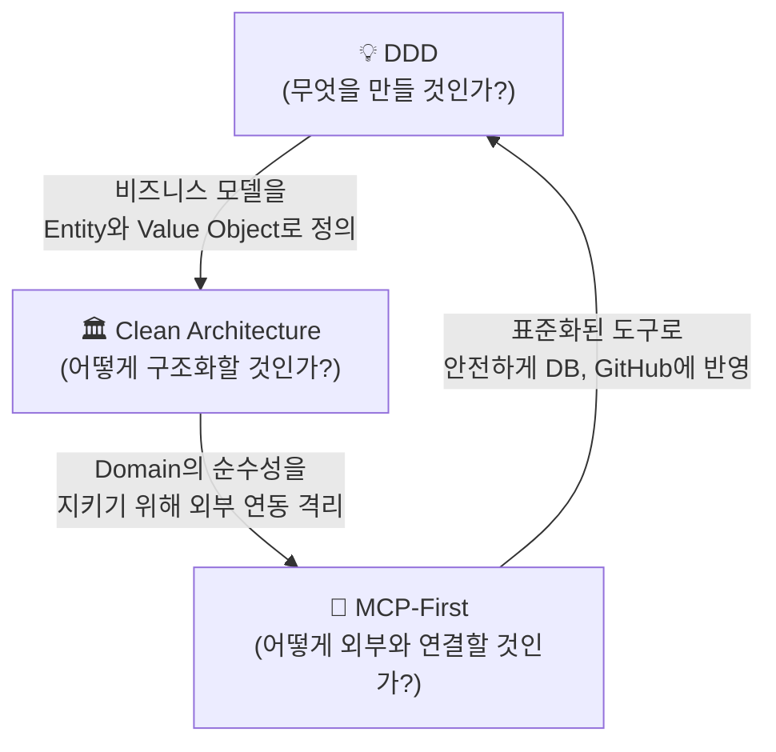

# 💡 PosMul 아키텍처 철학

## 📚 목차 (Table of Contents)

- [🌟 개념 소개: PosMul을 움직이는 세 개의 기둥](#-개념-소개-posmul을-움직이는-세-개의-기둥)
- [🔬 왜 Domain-Driven Design (DDD) 인가?: 복잡한 비즈니스 문제 해결](#-왜-domain-driven-design-ddd-인가-복잡한-비즈니스-문제-해결)
- [🏛️ 왜 Clean Architecture 인가?: 변화에 강한 소프트웨어 구축](#️-왜-clean-architecture-인가-변화에-강한-소프트웨어-구축)
- [🤖 왜 MCP-First 인가?: 자동화와 일관성, 그리고 안전성](#-왜-mcp-first-인가-자동화와-일관성-그리고-안전성)
- [🤝 세 가지 철학의 시너지](#-세-가지-철학의-시너지)
- [📝 결론: 우리가 나아갈 방향](#-결론-우리가-나아갈-방향)

## 🌟 개념 소개: PosMul을 움직이는 세 개의 기둥

PosMul은 단순한 예측 플랫폼이 아닙니다. Agency Theory, CAPM과 같은 복잡한 경제학 이론을 코드로 구현하고, 이를 통해 AI 시대의 새로운 직접 민주주의를 실험하는 사회경제적 시스템입니다.

이러한 거대한 비전을 달성하기 위해, 우리는 세 가지 핵심적인 아키텍처 철학을 채택했습니다:

1.  **Domain-Driven Design (DDD)**: '무엇을' 만들 것인가? (비즈니스 복잡성 관리)
2.  **Clean Architecture**: '어떻게' 구조화할 것인가? (유연하고 테스트 가능한 구조)
3.  **MCP-First**: '어떻게' 연결할 것인가? (안전하고 일관된 외부 연동)

이 문서는 이 세 가지 철학이 왜 PosMul에 필수적인지, 그리고 어떻게 상호작용하여 프로젝트를 성공으로 이끄는지 설명합니다.

## 🔬 왜 Domain-Driven Design (DDD) 인가?: 복잡한 비즈니스 문제 해결

**핵심 질문**: "PosMul처럼 복잡하고 추상적인 경제 모델과 비즈니스 로직을 어떻게 코드에 효과적으로 담아낼 수 있을까?"

DDD는 소프트웨어의 핵심이 기술이 아닌 **도메인(비즈니스 영역)** 그 자체에 있다는 철학에서 출발합니다. PosMul의 도메인은 '예측', '투자', '포럼' 등 명확히 구분되면서도, 'PMP/PMC 경제 시스템'이라는 공유된 개념을 통해 서로 복잡하게 얽혀있습니다.

### Bounded Context와 Shared Kernel

DDD는 이 복잡성을 `Bounded Context`라는 개념으로 분리하여 관리합니다. 각 컨텍스트는 자신만의 독립적인 모델과 언어를 가집니다.

-   **Bounded Context**: 각 도메인(`prediction`, `investment` 등)은 독립적으로 개발 및 배포될 수 있어 팀의 자율성을 높이고 전체 시스템의 복잡도를 낮춥니다.
-   **Shared Kernel**: 모든 도메인이 공유하는 핵심 경제 모델(`Economy`)은 '공유 커널'로 분리하여, 전체 시스템의 경제적 일관성을 유지합니다.

**결론적으로, DDD는 PosMul의 복잡한 비즈니스 요구사항을 체계적으로 코드에 반영하고, 모든 팀원이 동일한 언어(Ubiquitous Language)로 소통하며 오해를 줄이는 핵심적인 역할을 합니다.**

## 🏛️ 왜 Clean Architecture 인가?: 변화에 강한 소프트웨어 구축

**핵심 질문**: "빠르게 변하는 외부 기술(프레임워크, DB, UI)로부터 핵심 비즈니스 로직을 어떻게 보호하고, 오랫동안 유지보수 가능한 시스템을 만들 수 있을까?"

Clean Architecture의 핵심은 **관심사의 분리(Separation of Concerns)**와 **의존성 규칙(Dependency Rule)**입니다.

-   **의존성 규칙**: 모든 의존성은 바깥에서 안쪽으로, 즉 **저수준의 구체적인 정책(UI, DB)이 고수준의 추상적인 정책(도메인)에 의존**합니다.
-   **독립성**:
    -   **UI/프레임워크 독립성**: React가 Vue로 바뀌거나, Next.js 버전이 급격하게 바뀌어도 핵심 도메인 로직은 전혀 영향을 받지 않습니다.
    -   **DB 독립성**: Supabase(Postgres)를 다른 DB로 교체해야 할 경우, Infrastructure 계층의 Repository 구현체만 교체하면 됩니다.
    -   **테스트 용이성**: 외부 시스템에 대한 의존성이 없으므로, 핵심 비즈니스 로직을 빠르고 안정적으로 테스트할 수 있습니다.

**결론적으로, Clean Architecture는 PosMul의 핵심 자산인 비즈니스 로직을 외부 변화로부터 안전하게 보호하는 견고한 성벽 역할을 합니다. 이를 통해 프로젝트의 수명을 늘리고 유지보수 비용을 획기적으로 줄일 수 있습니다.**

## 🤖 왜 MCP-First 인가?: 자동화와 일관성, 그리고 안전성

**핵심 질문**: "모든 개발자가 일관된 방식으로 외부 시스템(GitHub, Supabase)과 상호작용하게 하고, 잠재적인 실수를 줄이며, 개발 과정을 자동화할 방법은 무엇일까?"

MCP-First는 PosMul 프로젝트에서 **모든 외부 시스템과의 연동을 표준화된 MCP(Model Context Protocol) 도구를 통해서만 수행**하는 원칙입니다.

-   **표준화된 Anti-Corruption Layer**: 각 개발자가 다른 버전의 SDK나 CLI를 사용하며 발생할 수 있는 비일관성을 원천 차단합니다. MCP는 모든 외부 상호작용에 대한 단일화된 인터페이스, 즉 거대한 **부패 방지 계층(Anti-Corruption Layer)** 역할을 합니다.
-   **자동화 및 안전장치**: `mcp_supabase_apply_migration` 후 `mcp_supabase_get_advisors`를 실행하도록 강제하는 등, **모범 사례(Best Practice)를 워크플로우에 내장**할 수 있습니다. 이는 개발자의 실수를 줄이고 보안 및 성능 검사를 자동화합니다.
-   **개발 생산성 향상**: 개발자는 복잡한 SDK나 API 문서를 모두 학습할 필요 없이, 간단하고 표준화된 MCP 프롬프트만으로 GitHub 이슈 생성, DB 스키마 변경 등 복잡한 작업을 수행할 수 있습니다.

**결론적으로, MCP-First는 PosMul의 개발 워크플로우를 표준화하고 자동화하여, 개발자가 비즈니스 로직 개발이라는 가장 중요한 작업에만 집중할 수 있는 환경을 제공합니다.**

## 🤝 세 가지 철학의 시너지

DDD, Clean Architecture, MCP-First는 개별적으로도 강력하지만, 함께 사용될 때 PosMul 프로젝트에 엄청난 시너지를 발휘합니다.

1.  **DDD**는 복잡한 비즈니스 문제를 분석하여 `도메인 모델`을 정의합니다.
2.  **Clean Architecture**는 이 `도메인 모델`을 시스템의 핵심에 두고, 외부 변화로부터 보호하는 견고한 구조를 제공합니다.
3.  **MCP-First**는 Clean Architecture가 정의한 외부와의 경계(Boundary)를 넘어, 표준화되고 안전한 방식으로 외부 세계와 통신하는 역할을 수행합니다.

## 📝 결론: 우리가 나아갈 방향

PosMul의 아키텍처는 단순한 기술의 집합이 아닌, 프로젝트의 비전과 철학을 담고 있습니다. 신규 개발자로서 이 세 가지 핵심 원칙을 이해하고 따르는 것은 단순히 규칙을 준수하는 것을 넘어, 복잡하고 의미있는 대규모 시스템을 함께 만들어나가는 여정에 동참하는 것입니다.

이러한 원칙들이 때로는 번거롭게 느껴질 수 있지만, 장기적으로는 우리 모두에게 더 높은 생산성, 안정성, 그리고 개발의 즐거움을 선사할 것입니다. 