# 🔧 How to: 기존 도메인에 새 엔티티 추가하기

## 📚 목차 (Table of Contents)

- [🎯 해결할 문제](#-해결할-문제)
- [🛠️ 사전 요구사항](#️-사전-요구사항)
- [📖 해결 단계 요약](#-해결-단계-요약)
- [STEP 1: Domain Layer - 엔티티 정의](#step-1-domain-layer---엔티티-정의)
- [STEP 2: Infrastructure (Database) - 스키마 마이그레이션](#step-2-infrastructure-database---스키마-마이그레이션)
- [STEP 3: Domain & Infrastructure - Repository 확장](#step-3-domain--infrastructure---repository-확장)
- [STEP 4: Verification - 보안 및 정합성 검증](#step-4-verification---보안-및-정합성-검증)
- [✅ 완료 체크리스트](#-완료-체크리스트)
- [🆘 문제 해결](#-문제-해결)

## 🎯 해결할 문제

**문제 상황:**
`prediction` 도메인에 '게임의 주요 사건(예: 축구 경기의 골, 퇴장)'을 기록하는 기능이 필요합니다. 이를 위해 `GameEvent`라는 새로운 도메인 엔티티를 추가해야 합니다.

**달성 목표:**
- ✅ Clean Architecture 원칙을 위반하지 않고 `GameEvent` 엔티티를 `prediction` 도메인에 추가합니다.
- ✅ MCP 도구를 사용하여 데이터베이스 스키마를 안전하게 변경합니다.
- ✅ 새로운 엔티티를 다루기 위해 Repository 인터페이스와 구현체를 올바르게 확장합니다.

## 🛠️ 사전 요구사항

- **지식**: [PosMul 신규 개발자 온보딩 튜토리얼](posmul-onboarding-for-new-devs.md)을 완료했으며, DDD와 MCP 워크플로우에 익숙합니다.
- **도구**: Supabase, GitHub MCP 도구를 사용할 수 있는 AI 어시스턴트 환경.
- **권한**: Supabase 프로젝트에 `mcp_supabase_apply_migration`을 실행할 수 있는 권한.

## 📖 해결 단계 요약

새로운 엔티티 추가는 항상 **Domain Layer에서 시작하여 바깥으로(Infrastructure) 향하는** 의존성 규칙을 따릅니다.

```mermaid
graph TD
    subgraph "💡 Domain Layer (비즈니스 규칙 정의)"
        A["[1] GameEvent 엔티티 클래스 정의<br>`game-event.entity.ts`"] --> B["[2] Repository 인터페이스 확장<br>`i-prediction-repository.ts`"]
    end

    subgraph "🔩 Infrastructure Layer (외부 시스템 연동)"
        C["[3] DB 스키마 마이그레이션<br>`mcp_supabase_apply_migration`"] --> D["[4] Repository 구현체 업데이트<br>`mcp-prediction-repository.ts`"]
    end
    
    subgraph "🔒 Verification (검증)"
        E["[5] Supabase Advisor 보안 검사<br>`mcp_supabase_get_advisors`"]
    end

    B --> D
    A --> C
    D --> E
```



---

## STEP 1: Domain Layer - 엔티티 정의

**목표**: 순수한 비즈니스 로직을 담은 `GameEvent` 엔티티를 생성합니다.

1.  **파일 생성**: `src/bounded-contexts/prediction/domain/entities/game-event.entity.ts` 파일을 생성합니다.

2.  **엔티티 클래스 작성**:
    ```typescript
    // src/bounded-contexts/prediction/domain/entities/game-event.entity.ts

    import { Entity } from "@/shared/domain/entity";
    import { Result } from "@/shared/types/common";
    import { ValidationError } from "@/shared/errors/validation-error";

    export type GameEventId = string & { readonly brand: unique symbol };
    export type GameEventType = "GOAL" | "RED_CARD" | "SUBSTITUTION";

    interface GameEventProps {
      predictionGameId: PredictionGameId; // 어떤 게임에 속하는지
      eventType: GameEventType;
      eventTime: Date;
      description: string;
    }

    export class GameEvent extends Entity<GameEventProps, GameEventId> {
      private constructor(props: GameEventProps, id?: GameEventId) {
        super(props, id);
      }

      public static create(props: GameEventProps, id?: GameEventId): Result<GameEvent, ValidationError> {
        // 유효성 검사 로직
        if (props.description.length > 500) {
          return { success: false, error: new ValidationError("Description must be 500 chars or less.") };
        }
        return { success: true, data: new GameEvent(props, id) };
      }
    }
    ```

## STEP 2: Infrastructure (Database) - 스키마 마이그레이션

**목표**: MCP를 사용하여 `GameEvent` 엔티티를 저장할 `game_events` 테이블을 생성합니다.

1.  **AI 어시스턴트에게 마이그레이션 요청**:

    > **(AI 어시스턴트에게 보낼 프롬프트)**
    >
    > `mcp_supabase_apply_migration`을 사용해서 "add_game_events_table"이라는 이름으로 마이그레이션을 실행해줘. 쿼리는 다음과 같아:
    >
    > ```sql
    > CREATE TABLE game_events (
    >   id UUID PRIMARY KEY DEFAULT gen_random_uuid(),
    >   prediction_game_id UUID NOT NULL REFERENCES prediction_games(id) ON DELETE CASCADE,
    >   event_type TEXT NOT NULL,
    >   event_time TIMESTAMPTZ NOT NULL,
    >   description TEXT,
    >   created_at TIMESTAMPTZ DEFAULT NOW(),
    >
    >   CONSTRAINT valid_event_type CHECK (event_type IN ('GOAL', 'RED_CARD', 'SUBSTITUTION'))
    > );
    >
    > -- 인덱스 추가
    > CREATE INDEX idx_game_events_prediction_game_id ON game_events(prediction_game_id);
    >
    > -- RLS 활성화 및 정책 추가
    > ALTER TABLE game_events ENABLE ROW LEVEL SECURITY;
    >
    > CREATE POLICY "Users can view all game events" ON game_events
    >   FOR SELECT USING (true);
    >
    > CREATE POLICY "Service roles can insert game events" ON game_events
    >   FOR INSERT WITH CHECK (auth.role() = 'service_role');
    > ```

## STEP 3: Domain & Infrastructure - Repository 확장

**목표**: `GameEvent`를 데이터베이스에 저장하고 조회할 수 있도록 Repository를 확장합니다.

```mermaid
graph LR
    subgraph "📂 src/bounded-contexts/prediction/"
        subgraph "domain/repositories"
            A["i-prediction-repository.ts<br>(인터페이스 업데이트)"]
        end
        subgraph "infrastructure/repositories"
            B["mcp-prediction-repository.ts<br>(구현체 업데이트)"]
        end
    end
    A -- "implements" --> B
```



#### 3.1 Repository 인터페이스 업데이트 (Domain)

`src/bounded-contexts/prediction/domain/repositories/i-prediction-repository.ts` 파일에 `saveGameEvent` 메소드를 추가합니다.

```typescript
// i-prediction-repository.ts

// ... 기존 코드 ...
import { GameEvent } from "../entities/game-event.entity";
import { RepositoryError } from "@/shared/errors/repository-error";

export interface IPredictionRepository {
  // ... 기존 메소드 ...
  saveGameEvent(event: GameEvent): Promise<Result<void, RepositoryError>>;
}
```

#### 3.2 Repository 구현체 업데이트 (Infrastructure)

`src/bounded-contexts/prediction/infrastructure/repositories/mcp-prediction-repository.ts` 파일에 `saveGameEvent`를 구현합니다.

```typescript
// mcp-prediction-repository.ts

// ... 기존 코드 ...
export class McpPredictionRepository implements IPredictionRepository {
  // ... 기존 코드 ...

  async saveGameEvent(event: GameEvent): Promise<Result<void, RepositoryError>> {
    try {
      const { predictionGameId, eventType, eventTime, description } = event.props;
      await this.mcpClient.execute_sql({
        project_id: this.projectId,
        query: `
          INSERT INTO game_events (id, prediction_game_id, event_type, event_time, description)
          VALUES ($1, $2, $3, $4, $5)
        `,
        params: [event.id, predictionGameId, eventType, eventTime, description],
      });
      return { success: true, data: undefined };
    } catch (error) {
      return { success: false, error: new RepositoryError("saveGameEvent failed", error) };
    }
  }
}
```

## STEP 4: Verification - 보안 및 정합성 검증

**목표**: 변경 사항이 올바르게 적용되었고, 새로운 보안 위험이 없는지 확인합니다.

1.  **테이블 생성 확인**: `mcp_supabase_list_tables`를 사용하여 `game_events` 테이블이 생성되었는지 확인합니다.
2.  **보안 검사**: `mcp_supabase_get_advisors`를 실행하여 새로 추가된 테이블에 대한 RLS 정책 등이 올바르게 설정되었는지 확인합니다.

    > **(AI 어시스턴트에게 보낼 프롬프트)**
    > `mcp_supabase_get_advisors`를 실행해서 `security` 타입의 어드바이저 리포트를 확인해줘.

## ✅ 완료 체크리스트

- [ ] `game-event.entity.ts` 파일이 `prediction` 도메인에 생성되었는가?
- [ ] `mcp_supabase_apply_migration`을 통해 `game_events` 테이블이 데이터베이스에 생성되었는가?
- [ ] `IPredictionRepository` 인터페이스에 `saveGameEvent` 메소드가 추가되었는가?
- [ ] `McpPredictionRepository`에 `saveGameEvent` 메소드가 `mcp_supabase_execute_sql`을 사용하여 구현되었는가?
- [ ] `mcp_supabase_get_advisors` 실행 시 새로운 RLS 관련 경고가 없는가?

## 🆘 문제 해결

#### 문제: 마이그레이션 실패

**증상**: `mcp_supabase_apply_migration` 실행 시 에러 발생.
**해결**:
1.  SQL 구문을 다시 확인합니다. (테이블/컬럼명 오타, 참조 키 제약 조건 등)
2.  이미 해당 이름의 마이그레이션이 있는지 확인합니다.
3.  `prediction_games` 테이블이 존재하는지, `id` 컬럼이 있는지 확인합니다.

#### 문제: Clean Architecture 의존성 위반

**증상**: 코드 리뷰 또는 린트에서 의존성 규칙 위반 경고 발생.
**해결**:
- Domain Layer(`domain/`)에서는 절대로 Infrastructure Layer(`infrastructure/`)의 코드를 `import`할 수 없습니다.
- Repository 구현체는 Domain Layer의 인터페이스를 `implements` 해야 합니다.
- 의존성 방향이 항상 `Domain`을 향하는지 확인하세요. 