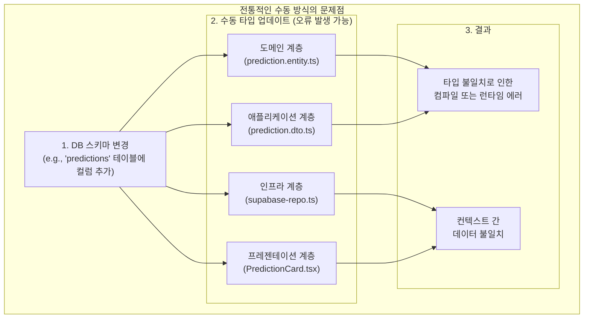
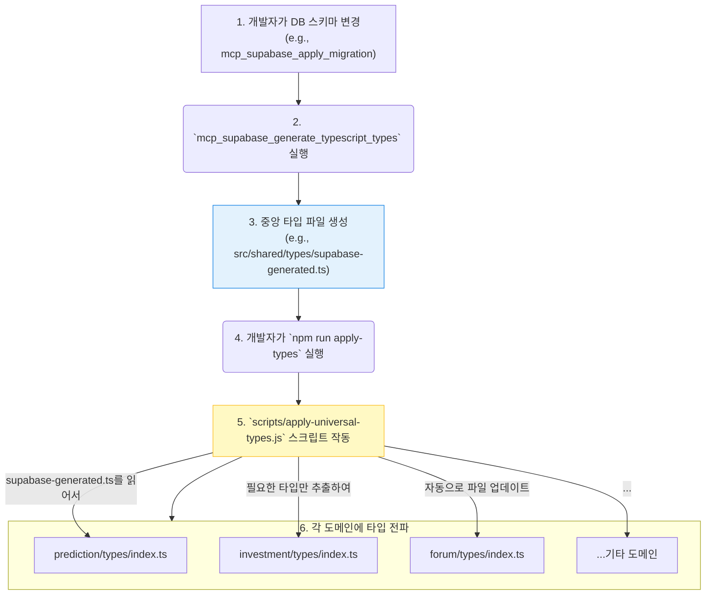
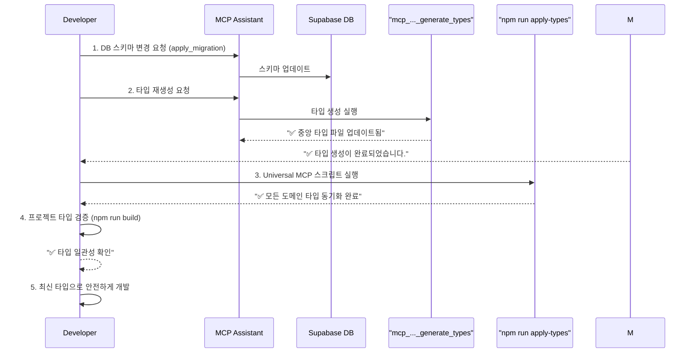
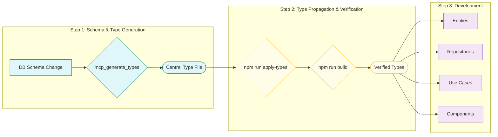

# 📚 Universal MCP를 활용한 중앙 집중식 타입 관리 가이드

> **목표**: 모노레포 환경에서 발생할 수 있는 타입 불일치 문제를 해결하고, `Universal MCP` 시스템을 통해 모든 도메인과 계층에 걸쳐 최신 타입을 자동으로 전파하는 방법을 익힙니다.

## 📖 목차

- [🤔 문제: 왜 타입 관리가 중요한가?](#-문제-왜-타입-관리가-중요한가)
- [💡 해결책: Universal MCP 시스템](#-해결책-universal-mcp-시스템)
- [⚙️ 작동 원리](#️-작동-원리)
- [🚀 개발자 워크플로우](#-개발자-워크플로우)
- [✅ 요약: 타입 관리 흐름](#-요약-타입-관리-흐름)
- [🆘 문제 해결](#-문제-해결)

## 🤔 문제: 왜 타입 관리가 중요한가?

PosMul과 같은 모노레포 프로젝트에서는 여러 바운디드 컨텍스트(Bounded Contexts)가 공존합니다. 데이터베이스 스키마가 변경될 때, 이와 관련된 모든 도메인(e.g., `prediction`, `investment`)과 계층(e.g., `application`, `presentation`)의 타입을 수동으로 업데이트하는 것은 매우 번거롭고 오류가 발생하기 쉽습니다.



이러한 문제를 해결하기 위해 PosMul은 **Universal MCP**라는 중앙 집중식 타입 관리 시스템을 도입했습니다.

## 💡 해결책: Universal MCP 시스템

Universal MCP는 Supabase 데이터베이스를 **단일 진실 공급원(Single Source of Truth)**으로 삼아, 타입 정의를 자동으로 생성하고 프로젝트의 모든 필요한 곳에 전파하는 자동화된 시스템입니다.

이 시스템의 핵심은 두 가지입니다:

1.  **`mcp_supabase_generate_typescript_types`**: Supabase DB 스키마를 읽어 최신 타입 정의(`Database`)를 생성하는 MCP 도구.
2.  **`scripts/apply-universal-types.js`**: 생성된 중앙 타입 정의를 각 바운디드 컨텍스트의 필요에 맞게 분배하고 적용하는 스크립트.

## ⚙️ 작동 원리

Universal MCP의 전체적인 작동 원리는 다음과 같습니다.



`apply-universal-types.js` 스크립트는 `universal-mcp-automation.ts` 내부의 `generateUniversalTypes` 함수를 호출하여, 거대한 중앙 타입 정의(`Database`)를 파싱하고 각 도메인의 이름 규칙(e.g., `predictions` 테이블 -> `prediction` 도메인)에 맞춰 필요한 타입만 추출하여 해당 도메인의 `types/index.ts` 파일에 자동으로 덮어쓰거나 생성합니다.

## 🚀 개발자 워크플로우

데이터베이스 스키마 변경이 필요할 때, 개발자는 다음 워크플로우를 따르면 됩니다.



**단계별 상세 가이드:**

1.  **스키마 변경**: `mcp_supabase_apply_migration`을 사용하여 데이터베이스 스키마를 변경합니다.
2.  **중앙 타입 생성**: AI 어시스턴트에게 `mcp_supabase_generate_typescript_types`를 실행해달라고 요청합니다.
    > **프롬프트 예시**: "Supabase 프로젝트의 최신 타입 정의를 생성해줘."
3.  **타입 전파**: 터미널에서 다음 명령어를 실행하여 변경된 타입을 프로젝트 전체에 적용합니다.
    ```powershell
    npm run apply-types
    ```
4.  **프로젝트 타입 검증 (중요)**: 타입이 올바르게 전파되었고, 기존 코드와 충돌이 없는지 확인하기 위해 프로젝트 전체를 빌드합니다. 이 과정에서 타입 에러가 발생하면 즉시 수정해야 합니다.
    ```powershell
    npm run build
    ```
5.  **개발**: 타입 검증이 완료되었다면, 이제 각 도메인 폴더의 `types/index.ts`에 반영된 최신 타입을 import하여 안전하게 개발을 진행합니다.

## ✅ 요약: 타입 관리 흐름



## 🆘 문제 해결

### 문제 1: `npm run apply-types` 실행 후 타입이 변경되지 않음

**원인**: 중앙 타입 파일(`src/shared/types/supabase-generated.ts` 등)이 먼저 업데이트되지 않았을 수 있습니다.
**해결**:

1.  `mcp_supabase_generate_typescript_types`가 성공적으로 실행되었는지 확인합니다.
2.  중앙 타입 파일의 내용이 최신 스키마를 반영하고 있는지 직접 확인합니다.
3.  문제가 없다면 스크립트 캐시 문제일 수 있으니, 다시 한번 `npm run apply-types`를 실행합니다.

### 문제 2: 특정 도메인에만 타입이 적용되지 않음

**원인**: `universal-mcp-automation.ts`의 도메인 이름 매칭 규칙과 테이블 이름이 일치하지 않을 수 있습니다.
**해결**:

1.  테이블 이름(e.g., `prediction_games`)과 도메인 폴더 이름(`prediction`)이 스크립트의 규칙과 맞는지 확인합니다.
2.  필요하다면 `universal-mcp-automation.ts` 스크립트의 로직을 확인하거나 수정이 필요할 수 있습니다. (전문가에게 문의)
