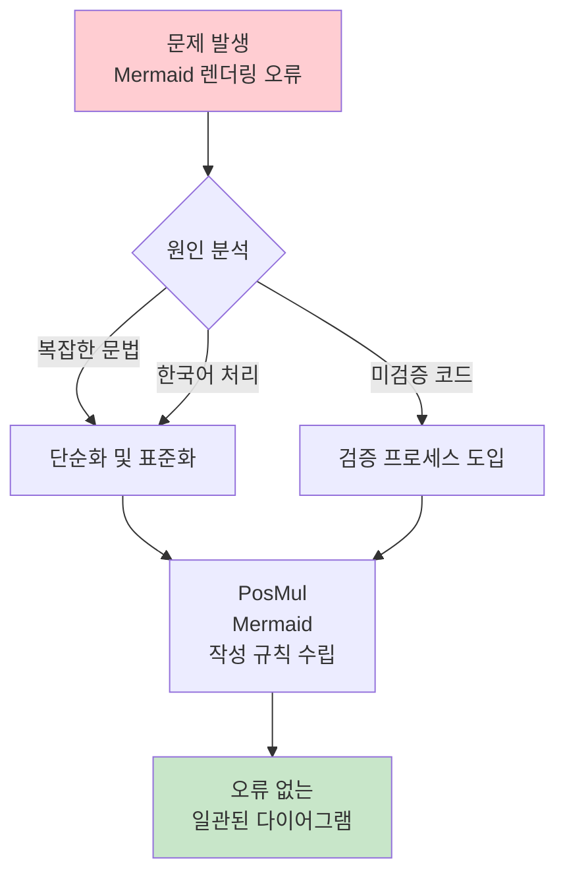
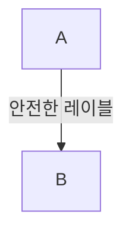
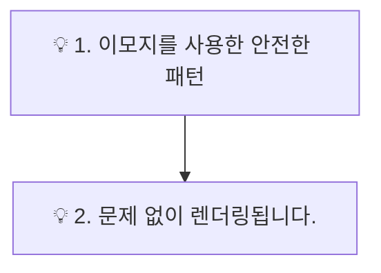
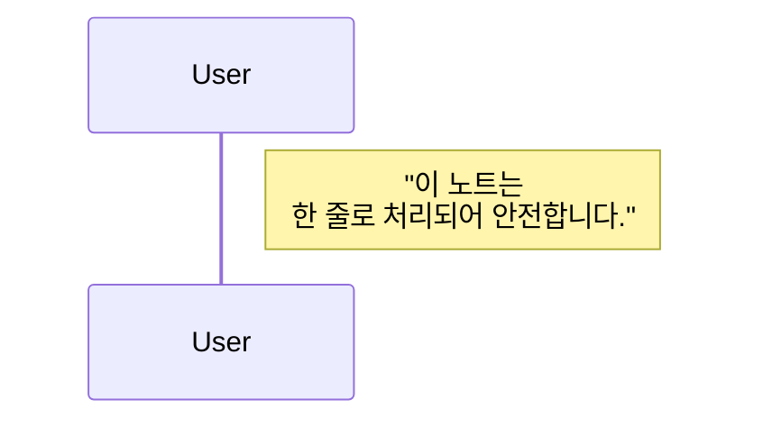
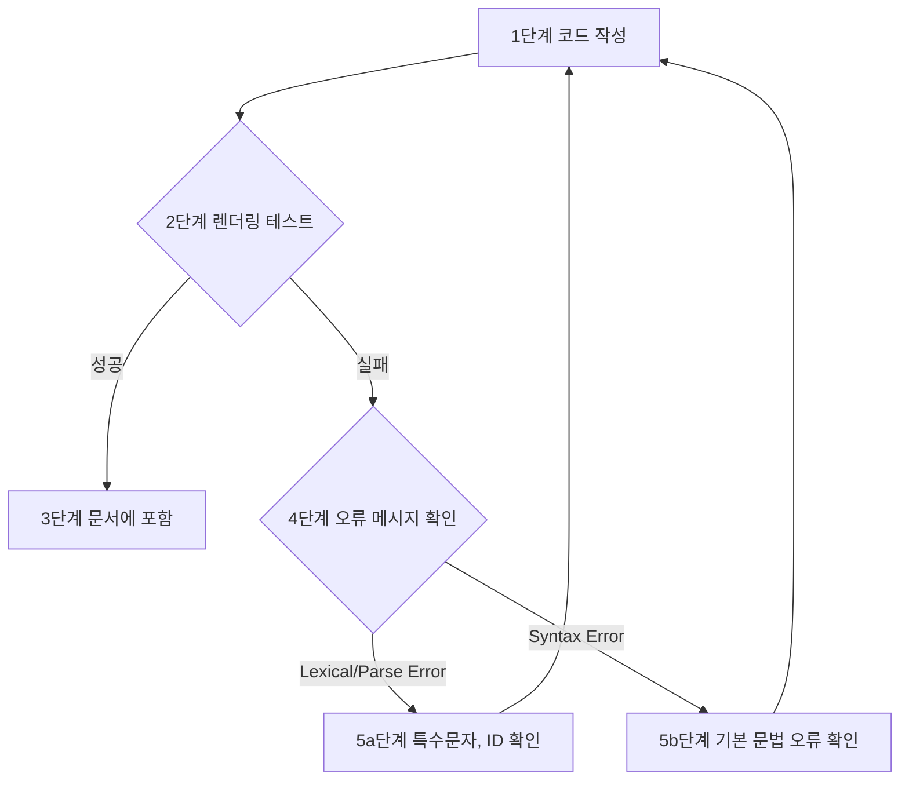

# 🔧 How-to: Mermaid 렌더링 오류 해결 및 베스트 프랙티스

> **목적**: PosMul 프로젝트에서 Mermaid 다이어그램 렌더링 오류를 방지하고, 일관된 고품질 시각화 스타일을 유지하기 위한 실무 가이드
> **대상**: AI 에이전트 및 모든 팀 구성원
> **형태**: "레시피"

## 📋 메타데이터

```yaml
---
type: how-to-guide
title: "How to Create Error-Free Mermaid Diagrams in PosMul"
description: "PosMul 프로젝트에서 Mermaid 다이어그램 렌더링 오류를 방지하고, 일관된 시각화 스타일을 유지하는 단계별 방법"
difficulty: beginner
estimated_time: "15분"
last_updated: "2025-06-25"
prerequisites:
  - "기본적인 Markdown 작성 능력"
  - "Mermaid Live Editor 사용 경험 (권장)"
use_cases:
  - "AI 에이전트가 문서 및 리포트 생성 시"
  - "팀원이 직접 다이어그램을 작성하거나 수정할 때"
related_guides:
  - "AI Agent Collaboration Guidelines (rule.md)"
tags: [how-to, mermaid, diagram, visualization, troubleshooting]
---
```

## 📚 목차 (Table of Contents)

- [🔧 How-to: Mermaid 렌더링 오류 해결 및 베스트 프랙티스](#-how-to-mermaid-렌더링-오류-해결-및-베스트-프랙티스)
  - [📋 메타데이터](#-메타데이터)
  - [📚 목차 (Table of Contents)](#-목차-table-of-contents)
  - [🎯 해결할 문제](#-해결할-문제)
  - [🛠️ 사전 요구사항](#️-사전-요구사항)
    - [필수 도구](#필수-도구)
  - [📖 해결 단계](#-해결-단계)
    - [1단계: 흔히 발생하는 오류 유형 및 원인 분석](#1단계-흔히-발생하는-오류-유형-및-원인-분석)
    - [2단계: PosMul Mermaid 작성 규칙 (Best Practices)](#2단계-posmul-mermaid-작성-규칙-best-practices)
      - [1. **단순성 최우선 (Simplicity First)**](#1-단순성-최우선-simplicity-first)
      - [2. **안전한 차트 유형만 사용 (Use Safe Chart Types)**](#2-안전한-차트-유형만-사용-use-safe-chart-types)
      - [3. **ID 및 레이블 처리 원칙 (ID \& Label Guideline)**](#3-id-및-레이블-처리-원칙-id--label-guideline)
      - [4. **스타일링 최소화 (Minimal Styling)**](#4-스타일링-최소화-minimal-styling)
    - [🔥 중요: 렌더링 오류 방지를 위한 3가지 핵심 구문 규칙](#-중요-렌더링-오류-방지를-위한-3가지-핵심-구문-규칙)
      - [규칙 1: 화살표(Edge) 위 텍스트는 **반드시** 따옴표로 감싸야 합니다.](#규칙-1-화살표edge-위-텍스트는-반드시-따옴표로-감싸야-합니다)
      - [규칙 2: '숫자. 문장' 패턴은 이모지와 함께 사용해야 합니다.](#규칙-2-숫자-문장-패턴은-이모지와-함께-사용해야-합니다)
      - [규칙 3: `sequenceDiagram`의 `note`는 한 줄로 작성해야 합니다.](#규칙-3-sequencediagram의-note는-한-줄로-작성해야-합니다)
    - [3단계: 오류 발생 시 디버깅 플로우차트](#3단계-오류-발생-시-디버깅-플로우차트)
  - [✅ 완료 체크리스트](#-완료-체크리스트)
  - [🔗 관련 가이드](#-관련-가이드)

## 🎯 해결할 문제

이 가이드는 **PosMul 프로젝트 내 모든 문서에서 Mermaid 다이어그램 렌더링 오류를 체계적으로 방지**하고, **일관된 시각화 스타일을 유지**하는 것을 목표로 합니다.

**문제 상황:**

- 🔴 AI 에이전트가 생성한 Mermaid 다이어그램에서 구문 오류(`lexical error`, `syntax error`)가 종종 발생합니다.
- 🔴 복잡한 다이어그램이나 한국어 사용 시 렌더링이 깨지는 경우가 있습니다.
- 🔴 팀원마다 다이어그램 스타일이 달라 문서의 통일성을 저해합니다.

**달성 목표:**

- ✅ 모든 다이어그램이 렌더링 오류 없이 정상적으로 표시됩니다.
- ✅ 프로젝트의 모든 시각 자료가 일관된 스타일과 품질을 유지합니다.
- ✅ 누구나 쉽게 오류 없는 다이어그램을 작성하고 수정할 수 있습니다.



## 🛠️ 사전 요구사항

### 필수 도구

- **Mermaid Live Editor**: 모든 Mermaid 다이어그램은 문서에 포함하기 전, 반드시 [Mermaid Live Editor](https://mermaid.live/)에서 렌더링 테스트를 거쳐야 합니다.
  - **사용법**: 에디터 좌측에 코드를 붙여 넣고, 우측에서 렌더링 결과를 즉시 확인합니다. 오류 발생 시, 에디터 하단에 오류 메시지가 표시됩니다.

## 📖 해결 단계

### 1단계: 흔히 발생하는 오류 유형 및 원인 분석

가장 자주 발생하는 두 가지 오류 유형과 그 원인은 다음과 같습니다.

1.  **`Lexical error` 또는 `Parse error`**
    - **원인**: 문법적으로는 맞지만, Mermaid가 해석할 수 없는 토큰(token)이 포함된 경우입니다. 주로 따옴표, 괄호, 특수문자, 특히 **ID에 한국어를 사용했을 때** 발생합니다.
    - **사례**: `graph TD; [노드 이름] --> [다음 노드];` (ID에 대괄호와 한국어 동시 사용)

2.  **`Syntax error`**
    - **원인**: Mermaid 문법 규칙 자체를 위반한 경우입니다. 키워드 오타, 잘못된 화살표 사용 등 명백한 문법 오류입니다.
    - **사례**: `flowchart TD; A -- B;` (`-->` 대신 `--` 사용)

### 2단계: PosMul Mermaid 작성 규칙 (Best Practices)

오류를 원천적으로 방지하기 위해 다음 규칙을 반드시 준수합니다. 이 규칙은 `rule.md`에도 명시되어 있습니다.

#### 1. **단순성 최우선 (Simplicity First)**
   - 하나의 거대한 다이어그램 대신, 여러 개의 단순한 다이어그램으로 나누어 설명합니다.
   - 복잡도 감소는 오류 가능성을 줄이는 가장 효과적인 방법입니다.

#### 2. **안전한 차트 유형만 사용 (Use Safe Chart Types)**
   - 렌더링 호환성이 높은 다음 4가지 차트 유형 사용을 원칙으로 합니다.
     - `flowchart`
     - `graph TD` (또는 `LR`)
     - `sequenceDiagram`
     - `pie`
   - `quadrantChart`, `gantt` 등은 한국어 처리나 복잡한 구문에서 오류 발생 확률이 높으므로 **사용을 금지**합니다.

#### 3. **ID 및 레이블 처리 원칙 (ID & Label Guideline)**
   - **노드 ID는 반드시 영문**으로 작성합니다.
   - **노드에 표시될 텍스트(레이블)는 큰따옴표(`"`) 안에서 자유롭게 한국어를 사용**합니다.

   ```mermaid
   graph TD
       %% Good
       A["데이터베이스 설계"] --> B["API 구현"];

       %% Bad - ID에 한국어 사용
       %% [데이터베이스 설계] --> [API 구현];
   ```

#### 4. **스타일링 최소화 (Minimal Styling)**
   - Mermaid 기본 스타일 사용을 원칙으로 합니다. 색상이나 선 굵기 등 커스텀 스타일은 꼭 필요한 경우가 아니면 사용하지 않습니다.

### 🔥 중요: 렌더링 오류 방지를 위한 3가지 핵심 구문 규칙

> 위 기본 원칙과 더불어, 아래의 구체적인 구문 규칙을 지키는 것이 렌더링 실패를 막는 데 매우 중요합니다.

#### 규칙 1: 화살표(Edge) 위 텍스트는 **반드시** 따옴표로 감싸야 합니다.
- **문제점**: 가장 흔한 `Cannot read properties of undefined` 오류의 주범입니다. 화살표 위에 글자를 추가할 때는 반드시 큰따옴표(`"`)로 감싸야 합니다.
- **해결책**: `A -- "레이블" --> B` 형태를 항상 유지합니다.



#### 규칙 2: '숫자. 문장' 패턴은 이모지와 함께 사용해야 합니다.
- **문제점**: `"1. 첫 번째"` 와 같은 텍스트는 Mermaid가 순서 있는 리스트로 잘못 해석하여 렌더링 오류를 일으킵니다.
- **해결책**: 텍스트 앞에 이모지(예: `💡`)를 붙여 리스트로 파싱되는 것을 방지합니다.



#### 규칙 3: `sequenceDiagram`의 `note`는 한 줄로 작성해야 합니다.
- **문제점**: `sequenceDiagram`의 `note` 구문은 여러 줄 텍스트(`\n`)를 지원하지 않아 오류가 발생합니다.
- **해결책**: 모든 `note` 내용은 한 줄에 작성해야 합니다.



### 3단계: 오류 발생 시 디버깅 플로우차트

오류가 발생했을 때, 다음 플로우차트에 따라 체계적으로 디버깅합니다.



## ✅ 완료 체크리스트

다이어그램 작성 후 아래 항목을 확인하세요.

- [ ] **사전 검증**: Mermaid Live Editor에서 렌더링이 성공적으로 완료되었는가?
- [ ] **안전한 차트**: `flowchart`, `graph TD`, `sequenceDiagram`, `pie` 중 하나인가?
- [ ] **ID 규칙**: 모든 노드 ID가 영문으로 작성되었는가?
- [ ] **화살표 텍스트**: 모든 화살표 위의 텍스트를 큰따옴표로 감쌌는가? **(중요)**
- [ ] **'숫자.' 패턴**: '1. 문장' 같은 패턴 앞에 이모지(💡)를 추가했는가? **(중요)**
- [ ] **단순성**: 다이어그램이 너무 복잡하지 않고, 이해하기 쉬운가?

## 🔗 관련 가이드

- `posmul/docs/reports/rule.md`: AI 에이전트 협업 가이드라인. 본 문서의 규칙이 요약되어 있습니다. 