# PosMul Prediction 도메인 프론트엔드 구현 계획

> **목적**: PosMul 플랫폼의 Prediction 도메인 프론트엔드 개발 전략 및 구현 로드맵  
> **작성일**: 2025-06-24  
> **버전**: v1.0  
> **대상**: 프론트엔드 개발팀

## 📋 목차

1. [개요](#개요)
2. [현재 상태 분석](#현재-상태-분석)
3. [아키텍처 전략](#아키텍처-전략)
4. [컴포넌트 구현 계획](#컴포넌트-구현-계획)
5. [페이지별 구현 전략](#페이지별-구현-전략)
6. [경제 시스템 통합](#경제-시스템-통합)
7. [개발 우선순위](#개발-우선순위)
8. [일정 계획](#일정-계획)
9. [품질 관리](#품질-관리)

## 개요

PosMul Prediction 도메인은 AI 시대 직접 민주주의 플랫폼의 핵심 기능으로, **Agency Theory**와 **CAPM** 이론을 코드로 구현한 예측 게임 시스템입니다. 백엔드 도메인 로직이 충분히 구축된 상황에서, 이제 사용자 경험을 극대화하는 프론트엔드 구현에 집중해야 합니다.

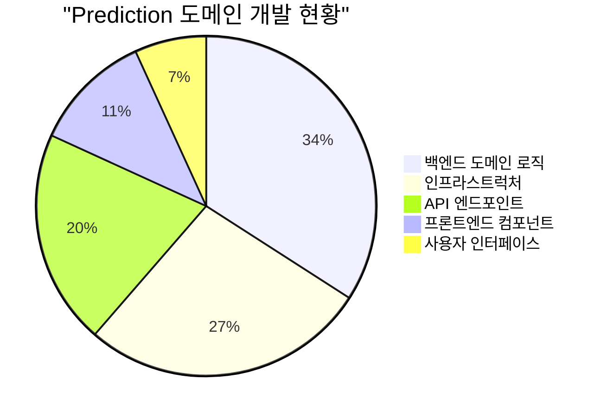

### 🎯 핵심 목표

- **사용자 경험 최적화**: 직관적이고 반응성 높은 예측 게임 인터페이스
- **경제 시스템 통합**: PMP/PMC 기반 MoneyWave 시스템의 완전한 UI 구현
- **실시간 상호작용**: WebSocket 기반 실시간 예측 및 결과 업데이트
- **Agency Theory 구현**: 전문가 vs 일반인 구조의 UI 표현
- **모바일 최적화**: 반응형 디자인으로 모든 기기에서 완벽한 경험

## 현재 상태 분석

### 🔍 기존 구현 현황

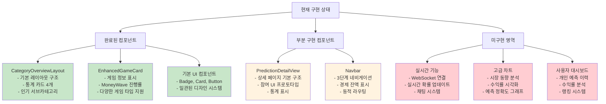

### 📊 구현 우선순위 매트릭스

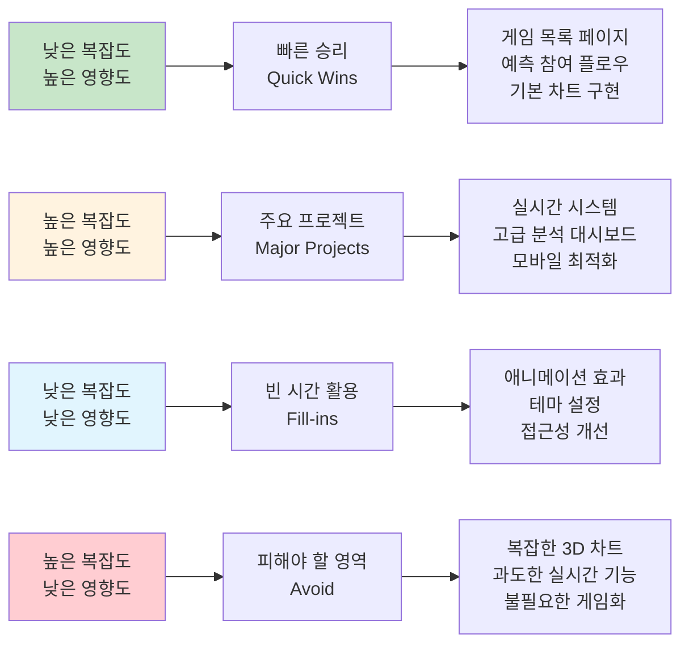

## 아키텍처 전략

### 🏗️ Clean Architecture 기반 프론트엔드 구조

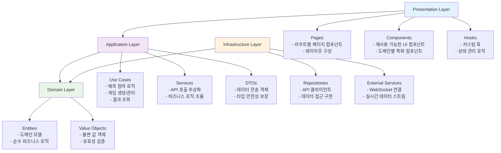

### 🔄 데이터 흐름 아키텍처

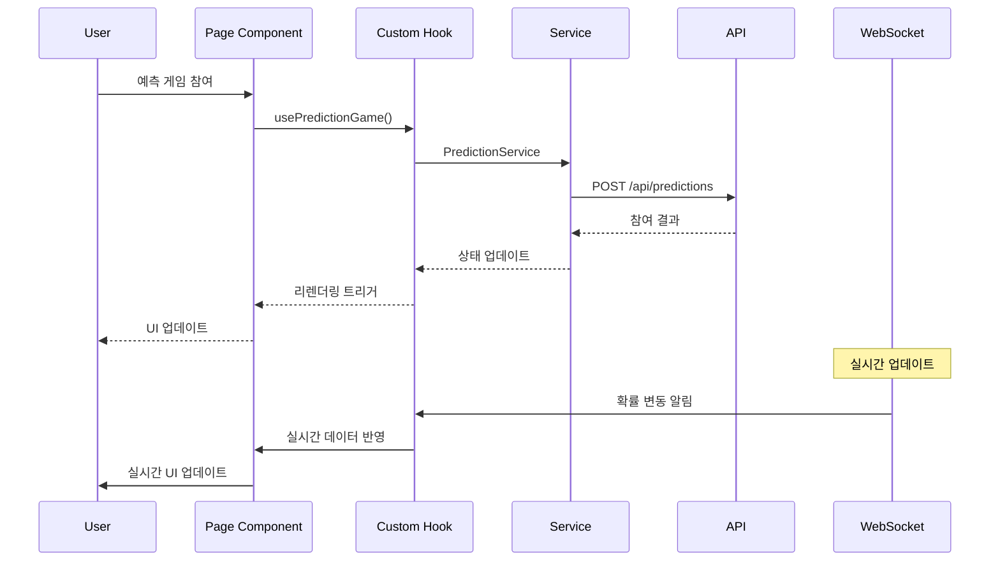

## 컴포넌트 구현 계획

### 🎮 핵심 게임 컴포넌트

#### 1. PredictionGameList (게임 목록)

```typescript
// 구현 위치: src/bounded-contexts/prediction/presentation/components/
interface PredictionGameListProps {
  category?: string;
  subcategory?: string;
  filters?: GameFilters;
  sortBy?: "popularity" | "reward" | "deadline" | "difficulty";
  viewMode?: "grid" | "list";
}
```

**주요 기능:**

- 필터링 및 정렬 기능
- 무한 스크롤 또는 페이지네이션
- 게임 상태별 그룹화
- 즐겨찾기 기능

#### 2. PredictionParticipationFlow (참여 플로우)

```typescript
interface PredictionParticipationFlowProps {
  gameId: string;
  onParticipationComplete: (result: ParticipationResult) => void;
  userBalance: { pmp: number; pmc: number };
}
```

**주요 기능:**

- 단계별 참여 프로세스
- 실시간 배당률 표시
- 예상 수익 계산
- 결제 확인 및 처리

#### 3. RealTimePredictionBoard (실시간 예측 보드)

```typescript
interface RealTimePredictionBoardProps {
  gameId: string;
  showChat?: boolean;
  enableNotifications?: boolean;
}
```

**주요 기능:**

- 실시간 확률 업데이트
- 참여자 수 실시간 표시
- 채팅 기능 (선택사항)
- 알림 시스템

### 📊 분석 및 시각화 컴포넌트

#### 4. MarketTrendChart (시장 동향 차트)

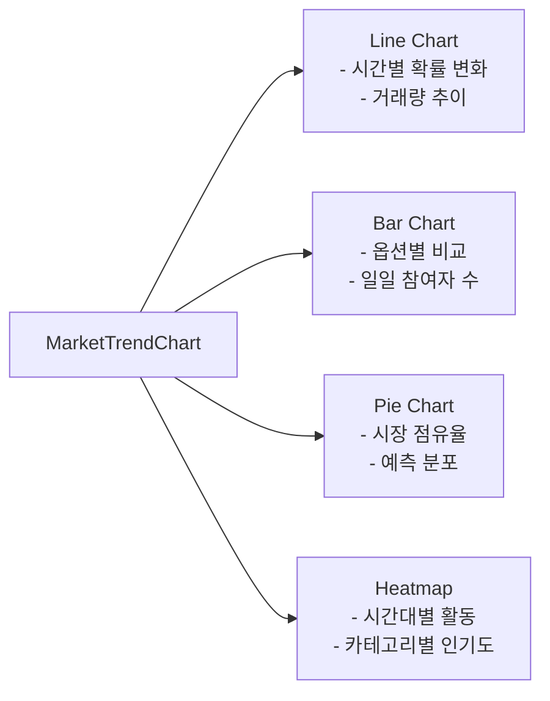

#### 5. UserDashboard (사용자 대시보드)

```typescript
interface UserDashboardProps {
  userId: string;
  timeRange?: "1d" | "1w" | "1m" | "1y" | "all";
  showPrivateData?: boolean;
}
```

**주요 기능:**

- 개인 예측 이력
- 수익률 분석
- 랭킹 위치
- 포트폴리오 구성

### 🔧 유틸리티 컴포넌트

#### 6. CountdownTimer (카운트다운 타이머)

```typescript
interface CountdownTimerProps {
  endTime: Date;
  onComplete?: () => void;
  format?: "full" | "compact" | "minimal";
  showMilliseconds?: boolean;
}
```

#### 7. EconomicBalanceDisplay (경제 잔액 표시)

```typescript
interface EconomicBalanceDisplayProps {
  pmpBalance: number;
  pmcBalance: number;
  showDetails?: boolean;
  showHistory?: boolean;
}
```

## 페이지별 구현 전략

### 🏠 메인 페이지 구조

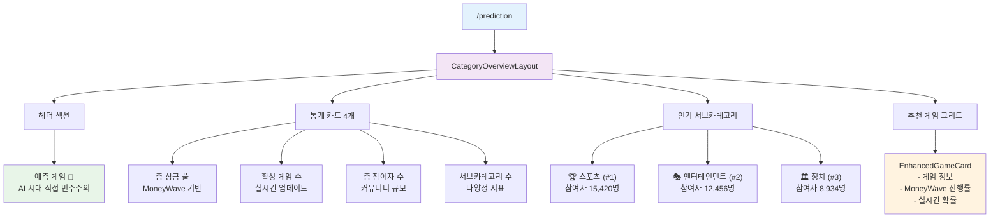

### 🎯 게임 상세 페이지

**URL**: `/prediction/[category]/[subcategory]/[gameId]`

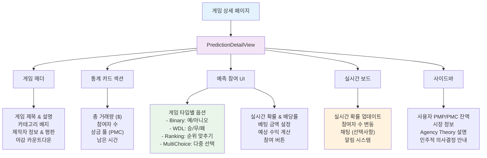

### 📱 카테고리별 페이지

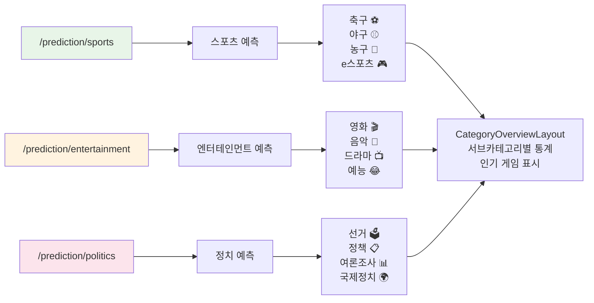

## 경제 시스템 통합

### 💰 PMP/PMC 기반 UI 구현

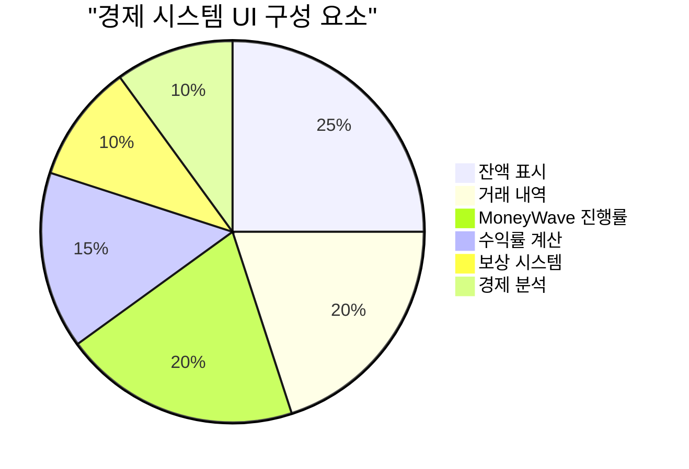

#### 1. 경제 정보 표시 컴포넌트

```typescript
// EconomicInfoPanel.tsx
interface EconomicInfoPanelProps {
  userBalance: {
    pmp: number; // 위험 없는 자산
    pmc: number; // 위험 있는 자산
  };
  showDetails?: boolean;
  showHistory?: boolean;
  showPredictions?: boolean;
}
```

#### 2. MoneyWave 시각화

```typescript
// MoneyWaveVisualization.tsx
interface MoneyWaveVisualizationProps {
  currentWave: number;
  totalPools: number;
  distributionDate: Date;
  participatingGames: number;
  expectedMultiplier: number;
}
```

#### 3. 수익률 계산기

```typescript
// ProfitCalculator.tsx
interface ProfitCalculatorProps {
  betAmount: number;
  selectedOption: PredictionOption;
  gameType: GameType;
  onCalculationChange: (result: ProfitCalculation) => void;
}

interface ProfitCalculation {
  potentialWinnings: number;
  roi: number; // Return on Investment
  pmpReward: number;
  pmcReward: number;
  riskLevel: "low" | "medium" | "high";
}
```

### 🔄 경제 상호작용 플로우

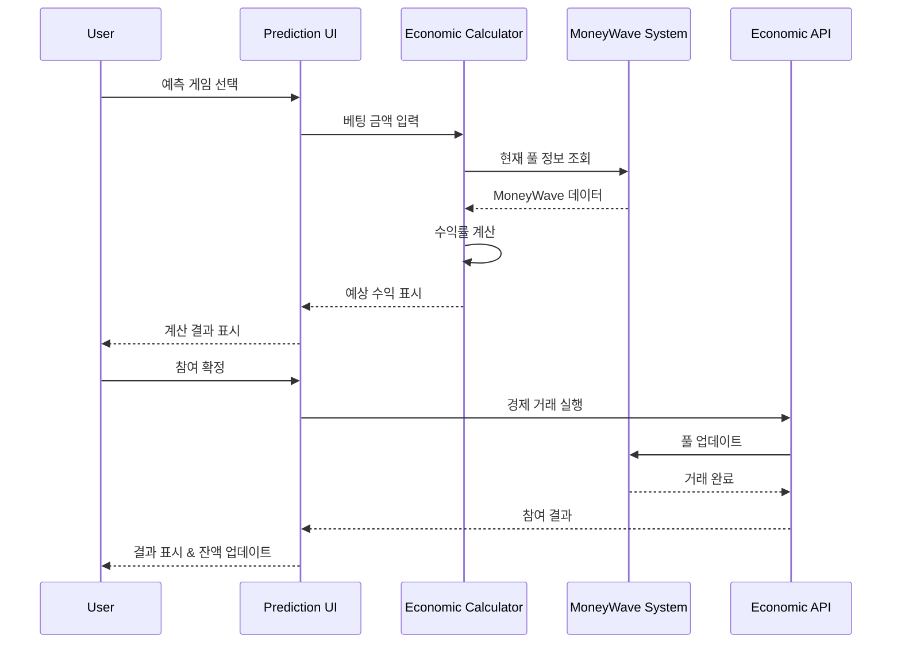

## 개발 우선순위

### 🚀 Phase 1: 기본 기능 구현 (4주)

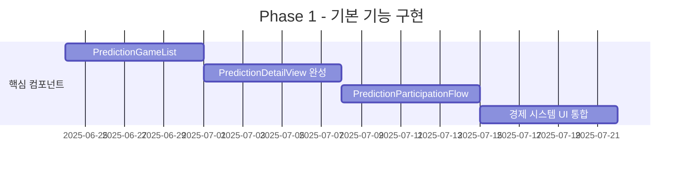

**핵심 목표:**

- 게임 목록 조회 및 표시
- 게임 상세 정보 표시
- 기본 예측 참여 기능
- PMP/PMC 잔액 표시

### ⚡ Phase 2: 고급 기능 구현 (6주)

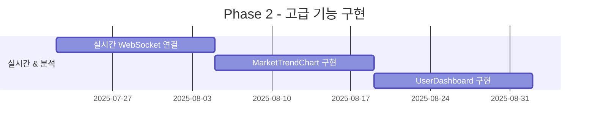

**핵심 목표:**

- 실시간 확률 업데이트
- 시장 동향 분석 차트
- 사용자 개인 대시보드
- 고급 필터링 및 검색

### 🎯 Phase 3: 최적화 및 고도화 (4주)

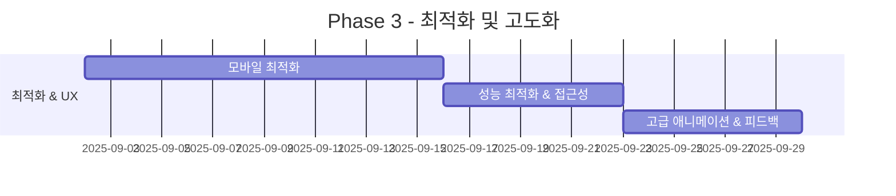

**핵심 목표:**

- 완전한 반응형 디자인
- 성능 최적화 (지연 로딩, 메모이제이션)
- 접근성 개선 (WCAG 2.1 AA 준수)
- 사용자 경험 개선

## 일정 계획

### 📅 전체 개발 일정

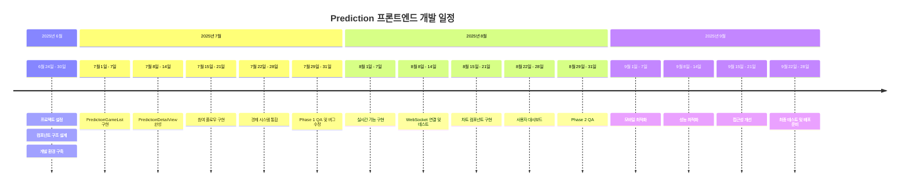

### 🎯 주요 마일스톤

| 마일스톤       | 날짜       | 목표                     | 성공 지표                    |
| -------------- | ---------- | ------------------------ | ---------------------------- |
| **Alpha 버전** | 2025-07-31 | 기본 예측 게임 참여 기능 | 게임 참여율 > 60%            |
| **Beta 버전**  | 2025-08-31 | 실시간 기능 및 분석      | 실시간 업데이트 지연 < 1초   |
| **RC 버전**    | 2025-09-21 | 모바일 최적화 완료       | 모바일 사용자 만족도 > 4.5/5 |
| **Production** | 2025-09-30 | 정식 서비스 출시         | 시스템 안정성 > 99.9%        |

## 품질 관리

### 🧪 테스트 전략

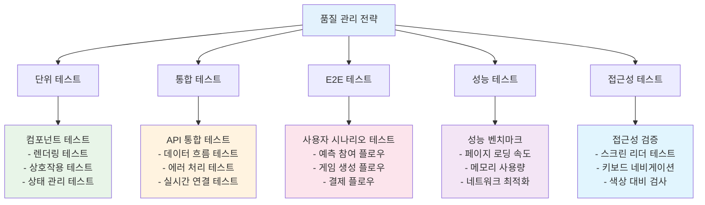

### 📊 품질 지표

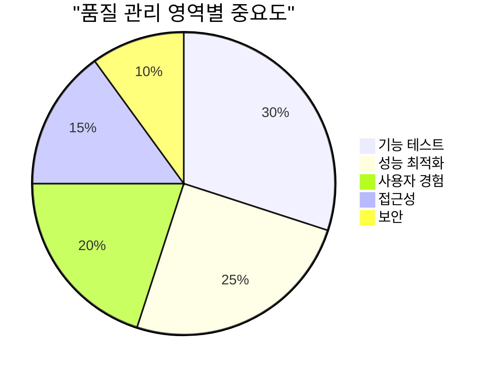

#### 핵심 품질 지표

1. **기능 정확성**
   - 테스트 커버리지 > 80%
   - 버그 발생률 < 1%
   - 기능 완성도 > 95%

2. **성능 최적화**
   - 첫 페이지 로딩 < 2초
   - 상호작용 응답 시간 < 100ms
   - 메모리 사용량 < 50MB

3. **사용자 경험**
   - 사용자 만족도 > 4.5/5
   - 태스크 완료율 > 90%
   - 오류 발생률 < 5%

4. **접근성 준수**
   - WCAG 2.1 AA 레벨 준수
   - 스크린 리더 호환성 100%
   - 키보드 네비게이션 지원

### 🔍 코드 품질 관리

```typescript
// 코드 품질 관리 도구 설정
// eslint.config.js
export default [
  {
    rules: {
      // React 최적화
      "react-hooks/exhaustive-deps": "error",
      "react/jsx-key": "error",

      // TypeScript 엄격성
      "@typescript-eslint/strict-boolean-expressions": "error",
      "@typescript-eslint/no-unused-vars": "error",

      // 성능 최적화
      "react/jsx-no-bind": "error",
      "react/no-array-index-key": "warn",

      // 접근성
      "jsx-a11y/alt-text": "error",
      "jsx-a11y/aria-props": "error",
    },
  },
];
```

### 📋 품질 체크리스트

#### 컴포넌트 구현 체크리스트

- [ ] TypeScript 타입 안전성 확보
- [ ] Props 인터페이스 완전 정의
- [ ] 에러 바운더리 구현
- [ ] 로딩 상태 처리
- [ ] 접근성 속성 (ARIA) 추가
- [ ] 반응형 디자인 적용
- [ ] 단위 테스트 작성
- [ ] Storybook 스토리 작성
- [ ] 성능 최적화 (memo, useMemo, useCallback)
- [ ] 경제 시스템 통합 확인

#### 페이지 구현 체크리스트

- [ ] SEO 메타 태그 설정
- [ ] 페이지 성능 최적화
- [ ] 에러 페이지 구현
- [ ] 로딩 상태 페이지
- [ ] 404 페이지 처리
- [ ] 사용자 인증 확인
- [ ] 경제 잔액 표시
- [ ] 실시간 업데이트 연결
- [ ] 모바일 최적화 확인
- [ ] E2E 테스트 작성

## 🚀 다음 단계

### 즉시 시작 가능한 작업들

1. **개발 환경 설정**

   ```powershell
   # 의존성 설치
   npm install @tanstack/react-query recharts framer-motion
   npm install -D @testing-library/jest-dom @storybook/react
   ```

2. **컴포넌트 구조 생성**

   ```powershell
   # 컴포넌트 디렉토리 생성
   New-Item -ItemType Directory -Path "src\bounded-contexts\prediction\presentation\components\games"
   New-Item -ItemType Directory -Path "src\bounded-contexts\prediction\presentation\components\charts"
   New-Item -ItemType Directory -Path "src\bounded-contexts\prediction\presentation\hooks"
   ```

3. **첫 번째 컴포넌트 구현**
   - `PredictionGameList` 컴포넌트부터 시작
   - 기존 `EnhancedGameCard` 활용
   - 기본 필터링 기능 구현

### 🎯 성공 지표

- **개발 완료**: 2025년 9월 30일
- **사용자 만족도**: 4.5/5 이상
- **성능 목표**: 페이지 로딩 2초 이내
- **접근성**: WCAG 2.1 AA 레벨 준수
- **테스트 커버리지**: 80% 이상

---

## 📞 지원 및 문의

이 구현 계획에 대한 질문이나 개선 사항이 있으시면 개발팀에 문의해 주세요.

- **작성자**: PosMul Development Team
- **문서 버전**: v1.0
- **최종 업데이트**: 2025-06-24 00:18:53

---

_이 문서는 PosMul Prediction 도메인의 프론트엔드 구현을 위한 전략적 가이드입니다. 백엔드 시스템이 충분히 구축된 상황에서 사용자 중심의 인터페이스 개발에 집중하여 AI 시대 직접 민주주의 플랫폼의 비전을 실현하는 것이 목표입니다._
