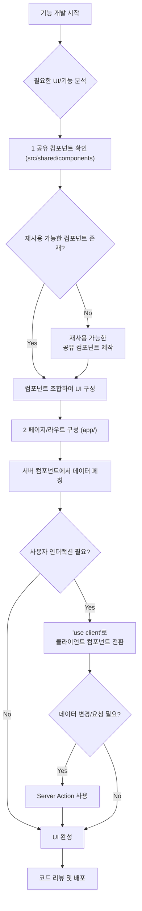
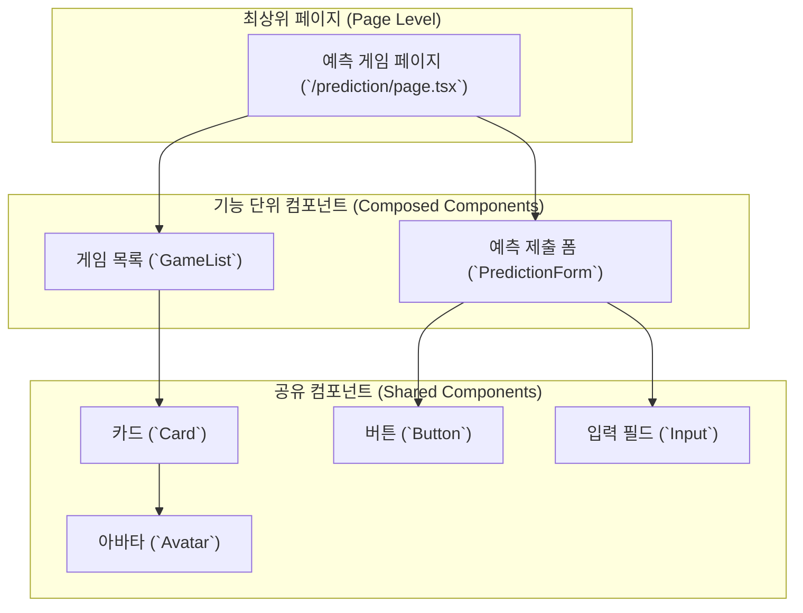
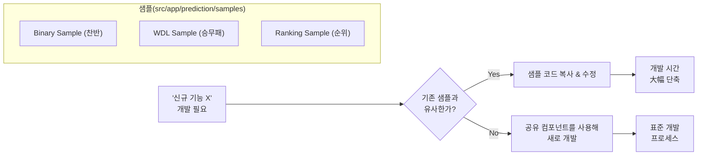
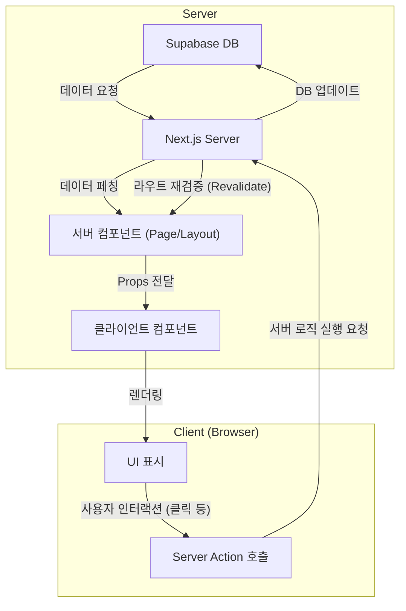
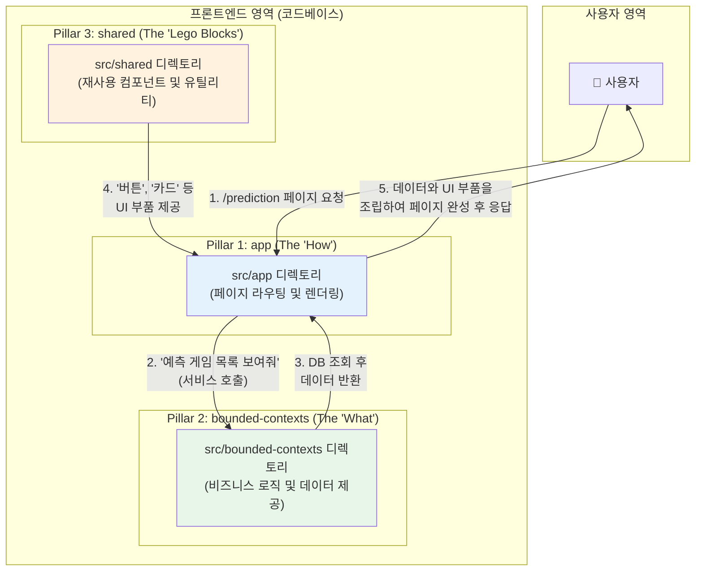
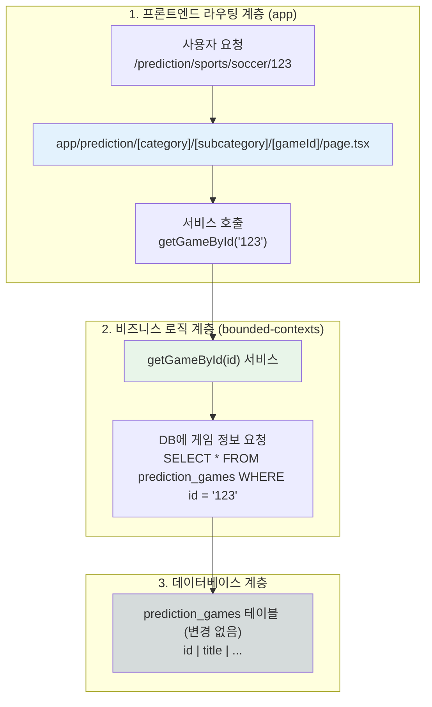

# PosMul 프론트엔드 개발 가이드

> **문서 목적**: PosMul 프로젝트의 프론트엔드 개발 생산성을 높이고, 일관된 개발 패턴을 정립하기 위한 실용적인 가이드라인을 제공합니다.
> **대상 독자**: 프로젝트에 참여하는 모든 프론트엔드 개발자 (신규 및 기존)
> **최종 업데이트**: 2025-06-23

## 🚀 시작하며

PosMul 프로젝트는 DDD와 클린 아키텍처를 기반으로 한 복잡한 시스템입니다. 이로 인해 프론트엔드 개발이 어렵게 느껴질 수 있지만, Next.js 15 App Router의 강력한 기능과 잘 정립된 프로젝트 구조를 활용하면 오히려 더 쉽고 체계적으로 개발을 진행할 수 있습니다.

이 문서는 프론트엔드 개발의 복잡성을 낮추고, 더 빠르고 즐겁게 개발할 수 있는 몇 가지 핵심 전략과 패턴을 소개합니다.

## 📊 개발 워크플로우 시각화

본격적인 설명에 앞서, 우리가 지향하는 프론트엔드 개발 전체 워크플로우를 시각적으로 이해해 봅시다.

---

## 1. 컴포넌트 기반 개발 (Component-Driven Development)

**원칙**: "페이지를 만들기 전에, 부품(컴포넌트)부터 생각한다."

가장 중요한 원칙은 **재사용성**입니다. `src/shared/components` 디렉토리는 우리 프로젝트의 레고 블록 상자입니다. 새로운 화면이나 기능을 만들 때, 항상 이 디렉토리의 컴포넌트를 먼저 활용하세요.

### 컴포넌트 활용 전략

1.  **찾기 (Find)**: 만들기 전에, 필요한 기능의 컴포넌트가 이미 있는지 확인합니다. (`Button`, `Card`, `Input`, `Modal` 등)
2.  **조합 (Combine)**: 찾은 컴포넌트들을 조합하여 더 큰 컴포넌트나 페이지를 만듭니다.
3.  **만들기 (Create)**: 만약 적절한 컴포넌트가 없다면, 다른 곳에서도 쓸 수 있도록 **범용적으로** 설계하여 `src/shared/components`에 추가합니다.

### 컴포넌트 계층 구조 예시

---

## 2. Next.js 15 App Router 최적 활용법

Next.js 15, 특히 App Router는 이전보다 훨씬 개발을 단순하게 만들어줍니다.

### 서버 컴포넌트 우선 (Server Components First)

- **데이터 페칭**: 데이터가 필요한 컴포넌트는 기본적으로 **서버 컴포넌트**로 만드세요. `async/await`를 사용하여 컴포넌트 내에서 직접 데이터를 가져올 수 있습니다. 이는 클라이언트 측의 로딩, 에러, 상태 관리를 대폭 줄여줍니다.
- **클라이언트 전환 최소화**: 브라우저 이벤트(e.g., `onClick`, `onChange`)나 상태(`useState`), 훅(`useEffect`)이 필요한 경우에만 `'use client'`를 사용하여 클라이언트 컴포넌트로 전환합니다. 컴포넌트 트리의 가장 말단(leaves)에서 전환하는 것이 가장 좋습니다.

### Server Actions 로 API 레이어 제거

폼(Form) 제출, 데이터 수정/삭제 등 서버에 데이터를 보내는 작업은 **Server Actions**를 사용하세요.

- **장점**: 별도의 API 엔드포인트를 만들고, `fetch`로 호출하고, 로딩/에러 상태를 관리하는 번거로운 과정 없이, 그냥 함수를 호출하듯 서버 로직을 실행할 수 있습니다.
- **사용법**: 서버 컴포넌트나 클라이언트 컴포넌트에서 `action`으로 함수를 전달하여 사용합니다. `useFormState`, `useFormStatus` 훅과 함께 사용하면 사용자 경험을 더욱 향상시킬 수 있습니다.

### 선언적 UI 상태 관리

- **로딩 상태**: `loading.tsx` 파일을 라우트 폴더에 추가하면, 해당 페이지가 로드되는 동안 보여줄 UI(스켈레톤 등)를 자동으로 처리해줍니다.
- **에러 상태**: `error.tsx` 파일을 추가하면, 해당 라우트에서 발생하는 에러를 우아하게 처리하고 사용자에게 복구 옵션을 제공할 수 있습니다.

---

## 3. 샘플 코드를 활용한 쾌속 개발

`src/app/prediction/samples` 디렉토리는 다양한 예측 게임 유형에 대한 모범 답안을 담고 있습니다. 새로운 기능을 개발할 때, 이곳의 코드를 참고하면 큰 도움이 됩니다.

### 샘플 활용 전략

1.  **유사 기능 탐색**: 만들고자 하는 기능과 가장 비슷한 샘플을 찾습니다.
2.  **구조 복사**: 해당 샘플의 디렉토리 구조와 파일(page.tsx, 컴포넌트 등)을 복사하여 새로운 기능의 기반으로 삼습니다.
3.  **수정 및 확장**: 복사한 코드를 바탕으로 실제 요구사항에 맞게 수정하고 확장합니다.

---

## 4. 데이터 및 상태 관리 패턴

### 데이터 흐름

- **읽기 (Read)**: 데이터 읽기는 서버 컴포넌트가 담당합니다.
- **쓰기 (Write)**: 데이터 생성/수정/삭제는 클라이언트 컴포넌트의 사용자 인터랙션을 통해 Server Action을 호출하여 처리합니다.
- **상태 동기화**: Server Action이 성공하면 Next.js가 자동으로 관련 데이터를 재검증(revalidate)하여 화면을 업데이트해줍니다. 복잡한 클라이언트 상태 동기화 로직이 필요 없습니다.

### 클라이언트 상태 관리

- 서버에 저장할 필요가 없는 순수 UI 상태(e.g., 모달 열림/닫힘, 탭 선택 등)는 `useState`를 사용하여 해당 클라이언트 컴포넌트 내에서 관리하는 것이 가장 간단하고 효율적입니다.
- 전역 상태 관리가 꼭 필요한 경우에만 Zustand나 Jotai 같은 경량 라이브러리 사용을 고려합니다. (단, 우선적으로 서버 상태를 활용하는 방법을 고민해야 합니다.)

## 5. 결론

PosMul 프론트엔드 개발을 쉽게 만드는 비결은 **새로 만들기보다 있는 것을 잘 활용하는 것**에 있습니다.

1.  **공유 컴포넌트**를 먼저 찾고,
2.  **서버 컴포넌트**의 힘을 최대한 이용하며,
3.  **Server Action**으로 API 작업을 단순화하고,
4.  필요할 땐 **샘플 코드**를 참고하여 빠르게 시작하세요.

이 가이드라인을 따르면 개발 속도와 코드 품질을 모두 높일 수 있을 것입니다.

