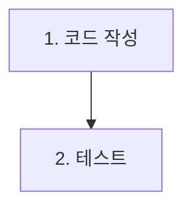
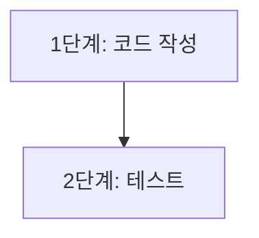
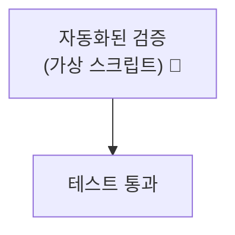
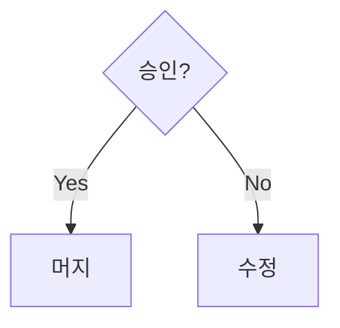
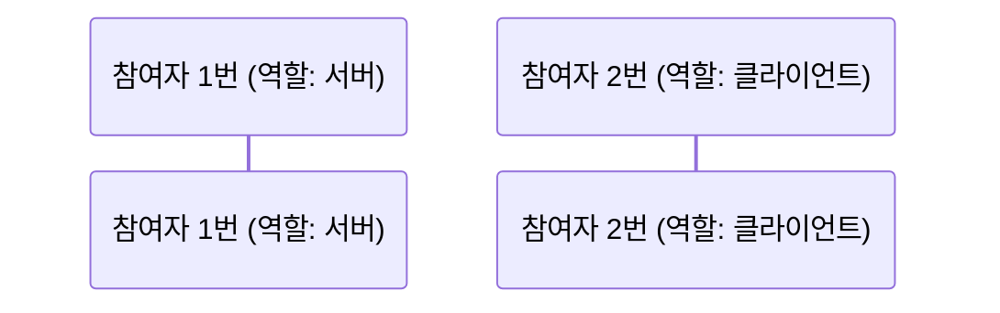
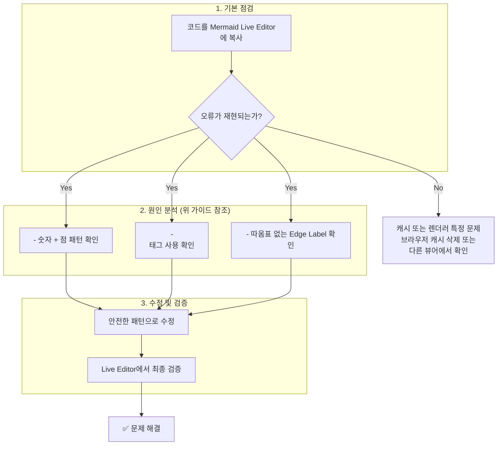

# How to: Mermaid.js 렌더링 오류 문제 해결하기

## 🎯 해결할 문제

Mermaid.js 다이어그램 작성 시, 문법적으로는 올바른 것 같지만 특정 환경(예: GitHub Markdown 뷰어)에서 렌더링되지 않거나 `Parse error`, `Cannot read properties of undefined` 같은 예측 불가능한 오류가 발생하는 문제를 해결합니다.

## 🛠️ 사전 요구사항

-   Markdown 파일에 Mermaid 다이어그램을 작성해 본 경험
-   오류 메시지를 확인할 수 있는 환경 (예: GitHub 미리보기, 로컬 렌더러)
-   [Mermaid Live Editor](https://mermaid.live) 사용 경험

## 📖 해결 단계

다음은 PosMul 프로젝트 진행 중 실제로 발생했던 주요 오류 유형과 그 해결책입니다.

---

### ❌ 오류 1: `Parse error` - 숫자와 점으로 시작하는 노드 ID

-   **문제 현상**: `1.` 과 같이 숫자로 시작하고 바로 뒤에 점(`.`)이 오는 노드 텍스트가 렌더링되지 않습니다.
-   **근본 원인**: 일부 Mermaid 파서는 이 패턴을 순서 있는 목록(Ordered List)의 시작으로 오인하여 다이어그램 노드로 정상적으로 파싱하지 못합니다.

#### ✅ 해결책: 텍스트 패턴 변경

숫자와 점을 직접 사용하는 대신, 의미를 명확히 하는 다른 단어를 사용합니다.

**Before (오류 발생 코드):**


**After (수정 코드):**


---

### ❌ 오류 2: `Parse error` - `<br/>` 태그의 불안정한 동작

-   **문제 현상**: 노드 내에서 줄바꿈을 위해 사용한 `<br/>` 태그가 이모지(e.g., `🤖`), 괄호(`()`), 또는 다른 특수 기호와 함께 사용될 때 렌더링에 실패합니다.
-   **근본 원인**: `<br/>`은 HTML 태그이며, Mermaid의 표준 문법이 아닙니다. 렌더링 환경에 따라 지원 여부가 달라 매우 불안정하며, 특히 다른 문법 요소와 결합될 때 파싱 오류를 유발할 가능성이 높습니다.

#### ✅ 해결책: 큰따옴표와 실제 줄바꿈 사용

가장 안정적이고 공식적으로 권장되는 방법은, 노드 텍스트 전체를 큰따옴표(`"`)로 감싸고 그 안에서 실제 엔터 키를 눌러 줄바꿈하는 것입니다.

**Before (오류 발생 코드):**


**After (수정 코드):**

---

### ❌ 오류 3: `Cannot read properties of undefined (reading 'v')` - 따옴표 없는 화살표 텍스트

-   **문제 현상**: 화살표(Edge) 위에 텍스트를 추가할 때, 텍스트가 렌더링되지 않거나 `Cannot read 'v'` 같은 암호 같은 오류가 발생합니다.
-   **근본 원인**: `A -- Yes --> B` 와 같이 화살표 위에 따옴표 없이 텍스트를 쓰면, 파서는 `Yes`를 단순 문자열이 아닌 예약어나 키워드로 해석하려고 시도하다가 오류를 일으킵니다.

#### ✅ 해결책: 화살표 텍스트를 따옴표로 감싸기

화살표 위에 들어가는 모든 텍스트는 반드시 작은따옴표(`' '`) 또는 큰따옴표(`" "`)로 감싸서, 파서에게 이것이 단순한 문자열임을 명확히 알려주어야 합니다.

**Before (오류 발생 코드):**


**After (수정 코드):**

---

### 오류 사례 3: 화살표(Edge)의 텍스트를 따옴표로 감싸지 않은 경우

-   **현상**: `Cannot read properties of undefined (reading 'v')` 오류 발생.
-   **원인**: `A -- 텍스트 --> B` 와 같이 화살표 위의 텍스트를 따옴표 없이 사용하면 파서가 정상적으로 인식하지 못합니다.
-   **해결책**: 모든 화살표 위 텍스트(Edge Label)는 반드시 따옴표로 감싸야 합니다. (`A -- "텍스트" --> B`)

---

### 오류 사례 4: `sequenceDiagram`에서 `participant` 선언 시 줄바꿈을 포함한 경우

-   **현상**: `Parse error ... expecting 'SOLID_OPEN_ARROW', ... got 'NEWLINE'` 오류 발생.
-   **원인**: `participant`를 선언하고 별칭(alias)을 지정하는 구문은 반드시 한 줄로 작성되어야 합니다. 별칭 내부에 줄바꿈이 포함되면 파서가 문장이 끝났다고 오인합니다.
-   **해결책**: `participant` 선언문의 별칭은 반드시 한 줄로 작성합니다.

#### ❌ 잘못된 코드

```mermaid
sequenceDiagram
    participant P1 as "참여자 1번
(역할: 서버)"
    participant P2 as "참여자 2번
(역할: 클라이언트)"
```

#### ✅ 올바른 코드



## 🔍 문제 해결 워크플로

문제가 발생했을 때 다음 순서로 점검하면 대부분의 렌더링 오류를 해결할 수 있습니다.



이 가이드를 통해 PosMul 프로젝트의 문서 품질을 일관되게 유지하고, 시각 자료 작성에 드는 불필요한 시간을 줄일 수 있기를 바랍니다. 