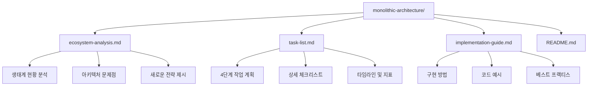
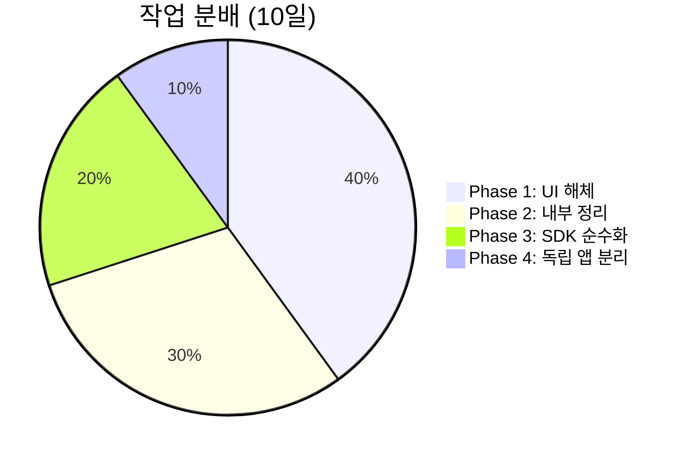
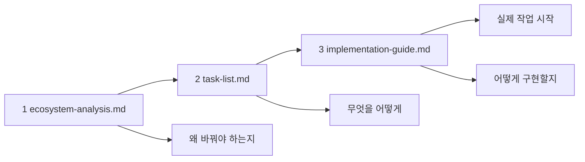
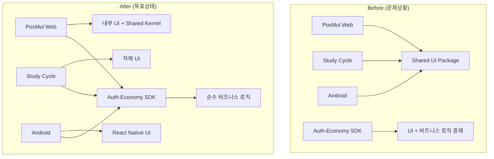
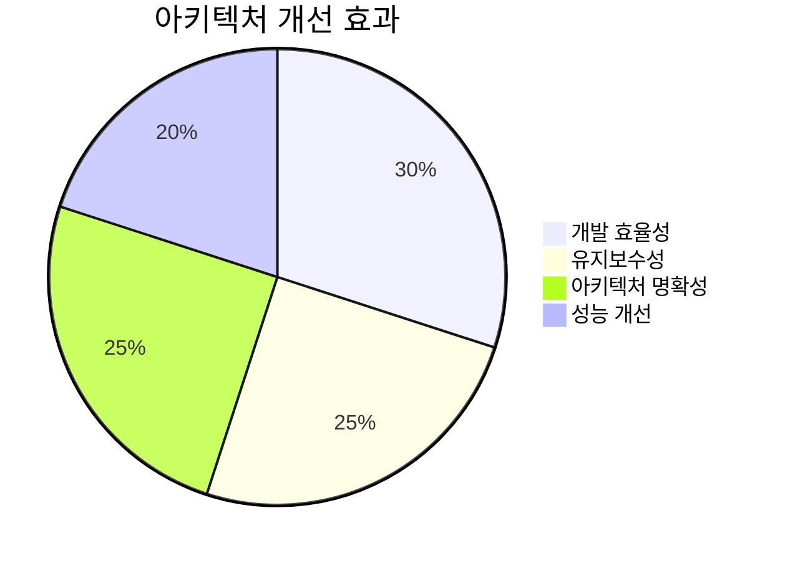
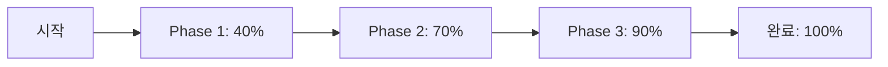

# PosMul 모놀리식 아키텍처 전환 문서

**📁 디렉토리**: `/docs/implementation/monolithic-architecture/`  
**목적**: Shared UI Package 해체 및 도메인 중심 모놀리식 구조 구축  
**상태**: 작업 준비 완료

---

## 📊 **문서 구성 개요**



---

## 📚 **문서별 상세 설명**

### 🔍 **1. ecosystem-analysis.md**
**핵심 발견사항 및 아키텍처 분석**

#### 📊 주요 내용
- **현재 생태계 문제점**: Shared UI Package의 불필요성 입증
- **실제 사용 패턴**: PosMul Web 85%, 타 앱 15% 독립 운영
- **새로운 전략**: 도메인 중심 모놀리식 구조 제안
- **마이그레이션 로드맵**: 4단계 전환 계획

#### 🎯 핵심 메시지
> "Shared UI Package는 과도한 추상화였다!"

---

### 📋 **2. task-list.md**
**실행 가능한 상세 작업 목록**

#### 📊 작업 구성


#### 🎯 주요 특징
- **체크리스트 기반**: 실행 가능한 구체적 작업
- **PowerShell 명령어**: Windows 환경 최적화
- **타임라인 제공**: Gantt 차트로 일정 관리
- **성공 지표**: 정량적/정성적 측정 기준

---

### 🔧 **3. implementation-guide.md**
**개발자를 위한 구현 가이드**

#### 📊 구현 영역
- **Shared Kernel**: 도메인 공통 로직 구현
- **UI 컴포넌트**: 계층화된 컴포넌트 설계
- **Import 최적화**: Path mapping 및 패턴 정의
- **이벤트 시스템**: 도메인 간 통합 방법

#### 🎯 실용적 코드 예시
```typescript
// 도메인 엔티티 예시
export class User {
  earnPmp(amount: PmpAmount): DomainEvent[] {
    return [new PmpEarnedEvent(this.id, amount)];
  }
}

// UI 컴포넌트 예시  
export const PredictionGameCard = ({ game, onJoin }) => {
  // 도메인 특화 UI 로직
};
```

---

## 🚀 **사용 가이드**

### 📅 **읽기 순서**



### 🎯 **역할별 활용법**

#### **🏗️ 아키텍트**
1. `ecosystem-analysis.md` - 아키텍처 결정 근거 이해
2. `implementation-guide.md` - 구조 설계 참고

#### **💻 개발자**
1. `task-list.md` - 작업 순서 및 체크리스트 활용
2. `implementation-guide.md` - 코드 구현 가이드 참고

#### **📋 프로젝트 매니저**
1. `task-list.md` - 일정 관리 및 진행 상황 추적
2. `ecosystem-analysis.md` - 비즈니스 임팩트 이해

---

## 📊 **핵심 아키텍처 변화**

### 🔄 **Before vs After**



### 🎯 **기대 효과**



---

## 🔧 **즉시 실행 가능한 첫 단계**

### 📋 **Quick Start 체크리스트**

```bash
# 1. 현재 상황 분석
cd c:\G\posmul
Get-ChildItem -Recurse "packages\shared-ui" -Name "*.tsx"

# 2. PosMul Web UI 구조 생성 
mkdir "apps\posmul-web\src\shared\ui\components\base"
mkdir "apps\posmul-web\src\shared\ui\components\forms"
mkdir "apps\posmul-web\src\shared\ui\components\feedback"

# 3. 첫 번째 컴포넌트 이동 테스트
Copy-Item "packages\shared-ui\src\components\Button.tsx" "apps\posmul-web\src\shared\ui\components\base\"
```

### ✅ **확인사항**
- [ ] 현재 shared-ui 사용 현황 파악
- [ ] PosMul Web 내부 구조 생성
- [ ] 첫 번째 컴포넌트 이동 테스트
- [ ] Import 경로 수정 테스트
- [ ] 빌드 성공 확인

---

## 📞 **지원 및 문의**

### 🔍 **문제 해결**
- **빌드 오류**: `implementation-guide.md`의 Import 패턴 확인
- **의존성 문제**: `task-list.md`의 단계별 체크리스트 검토
- **아키텍처 질문**: `ecosystem-analysis.md`의 설계 원칙 참고

### 📈 **진행 상황 추적**


---

**🚀 이제 PosMul의 진정한 도메인 중심 아키텍처 여정을 시작하세요!**
