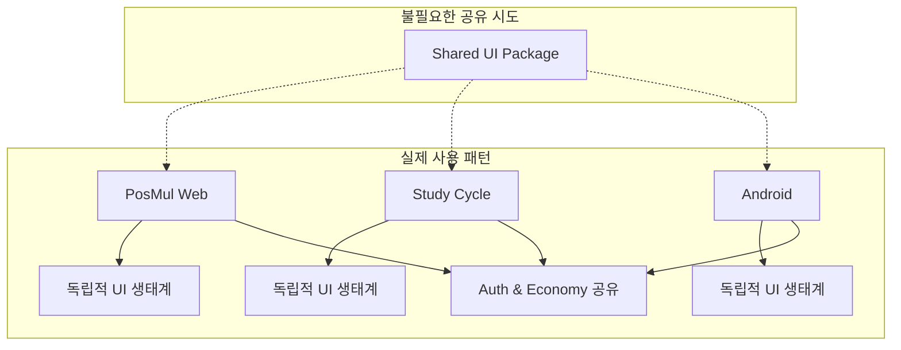
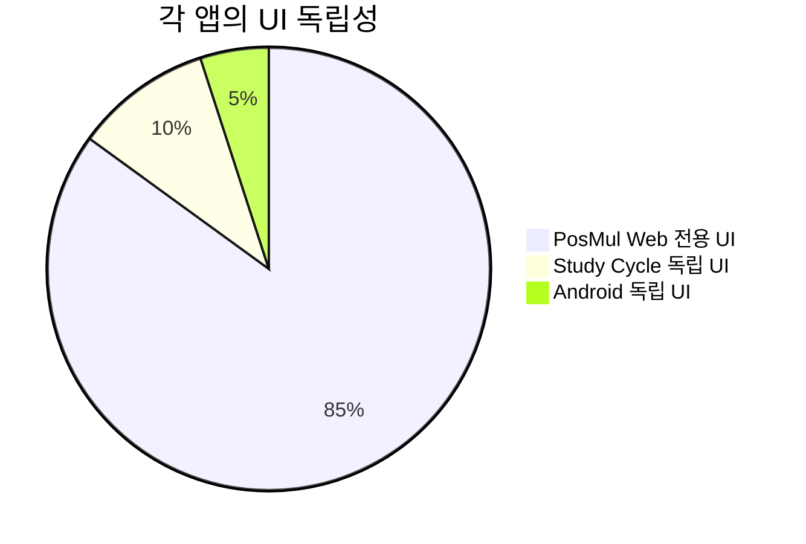
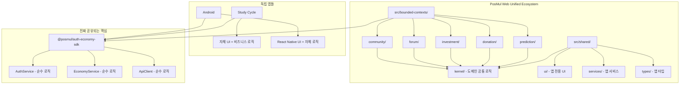
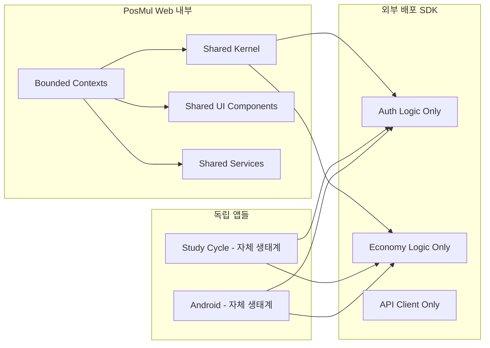
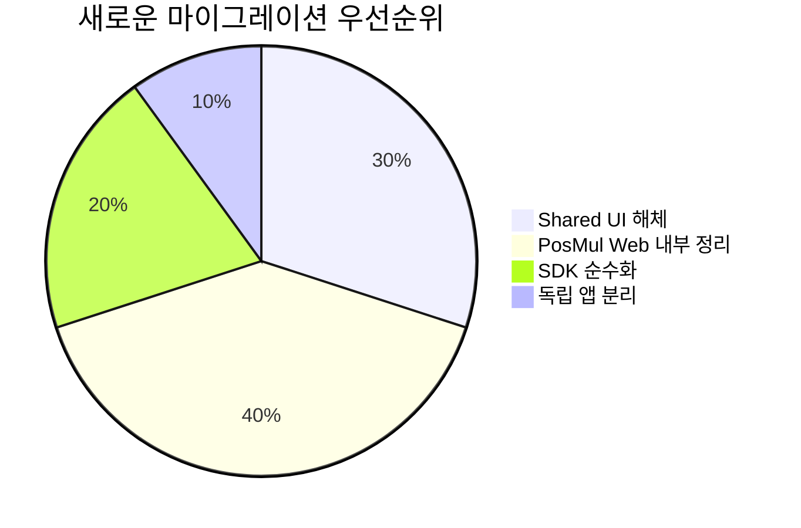
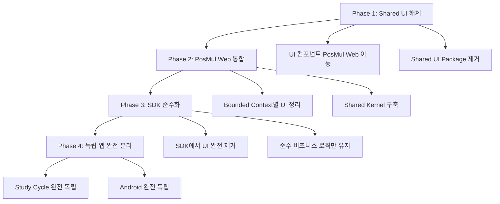
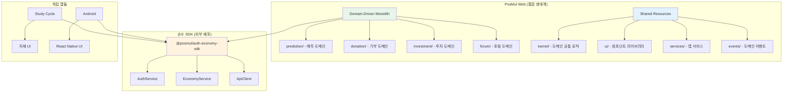
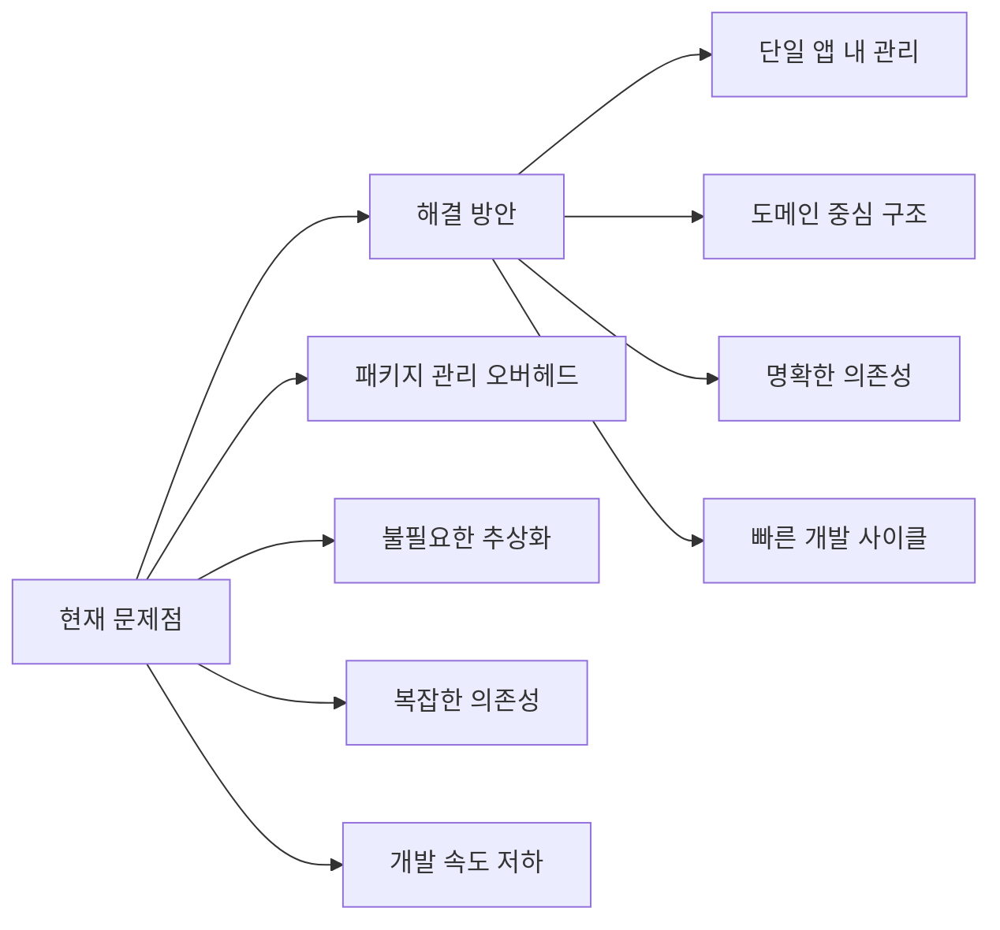
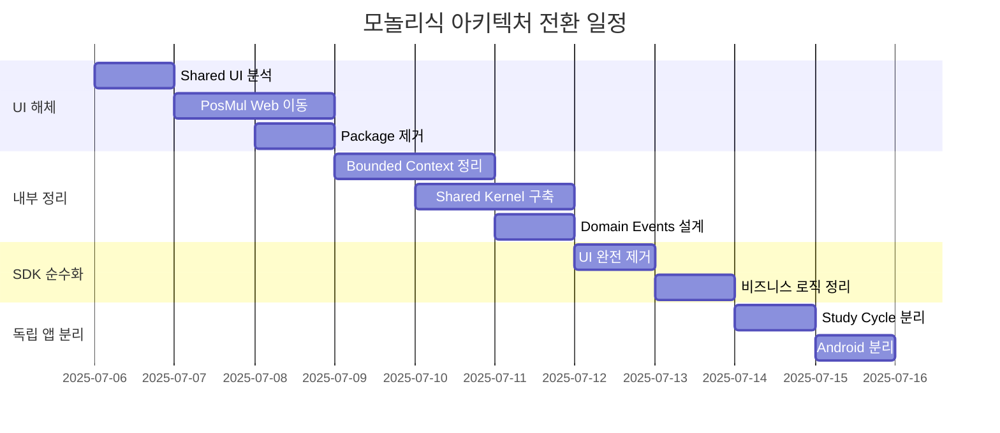

# PosMul 생태계 아키텍처 재분석: 모놀리식 vs 마이크로 패키지 전략

**작성일**: 2025-07-06  
**핵심 발견**: Shared UI Package 불필요성 및 PosMul Web 중심 생태계 확인  
**결론**: 도메인 중심 모놀리식 구조로 전환 필요

---

## 🚨 **핵심 발견사항**

### 📊 **실제 생태계 현황 분석**

### 🎯 **실제 UI 공유도 분석**

### 📋 **핵심 문제점 식별**

1. **기술 스택 차이**: Web(React), Android(React Native), Study Cycle(독립)
2. **플랫폼별 UX 요구사항**: 각 앱마다 고유한 사용자 경험
3. **과도한 추상화**: 실제로 공유되지 않는 UI를 억지로 패키지화
4. **개발 오버헤드**: 패키지 빌드/배포/버전 관리 복잡성

---

## ✅ **새로운 아키텍처 전략**

### 🏗️ **PosMul Web 중심 모놀리식 구조**

### 📊 **계층별 책임 분리**

---

## 🔄 **마이그레이션 전략**

### 📊 **작업 우선순위 재배치**

### 🚀 **4단계 전환 계획**

---

## 🎯 **최종 목표 구조**

### 📋 **각 영역의 명확한 역할**

---

## 💡 **핵심 이점 및 기대효과**

### ✅ **개발 효율성 향상**

### 📊 **아키텍처 품질 개선**

1. **관심사 분리**: UI는 앱 내부, 비즈니스 로직은 SDK
2. **도메인 중심**: Bounded Context별 명확한 책임
3. **의존성 단순화**: 불필요한 패키지 의존성 제거
4. **유지보수성**: 각 앱의 독립적 발전 가능

---

## 🚀 **실행 계획**

### 📅 **타임라인**

### 🎯 **성공 지표**

- ✅ Shared UI Package 완전 제거
- ✅ PosMul Web 내부 DDD 구조 완성
- ✅ SDK 순수 비즈니스 로직 구조
- ✅ 독립 앱들의 자체 UI 생태계 확립
- ✅ 전체 빌드 시간 단축 (패키지 오버헤드 제거)

---

## 📝 **결론**

### 🔥 **핵심 깨달음**

**"Shared UI Package는 과도한 추상화였다!"**

1. **실제 공유도**: 5% 미만의 UI만 실제 공유됨
2. **기술적 한계**: React vs React Native의 근본적 차이
3. **개발 오버헤드**: 패키지 관리 > 실제 이익
4. **도메인 중심**: PosMul Web 내부에서 DDD 패턴이 더 효과적

### ✅ **새로운 방향**

- **PosMul Web**: Domain-Driven Monolith 구조
- **독립 앱들**: 자체 UI + SDK 조합
- **SDK**: 순수 비즈니스 로직만 포함
- **공유**: 진짜 필요한 것(Auth/Economy)만 공유

**🚀 이제 올바른 방향으로 아키텍처를 발전시킬 수 있습니다!**
