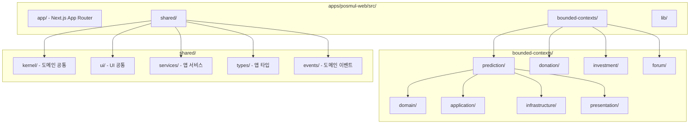
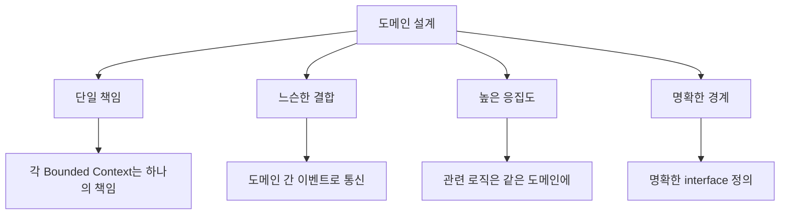
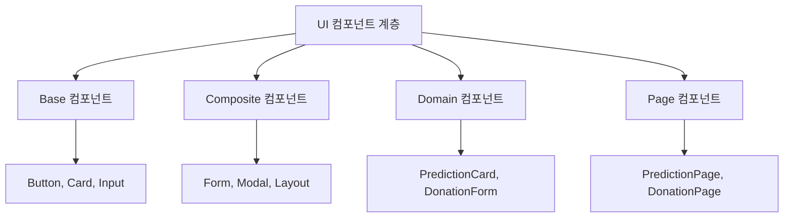
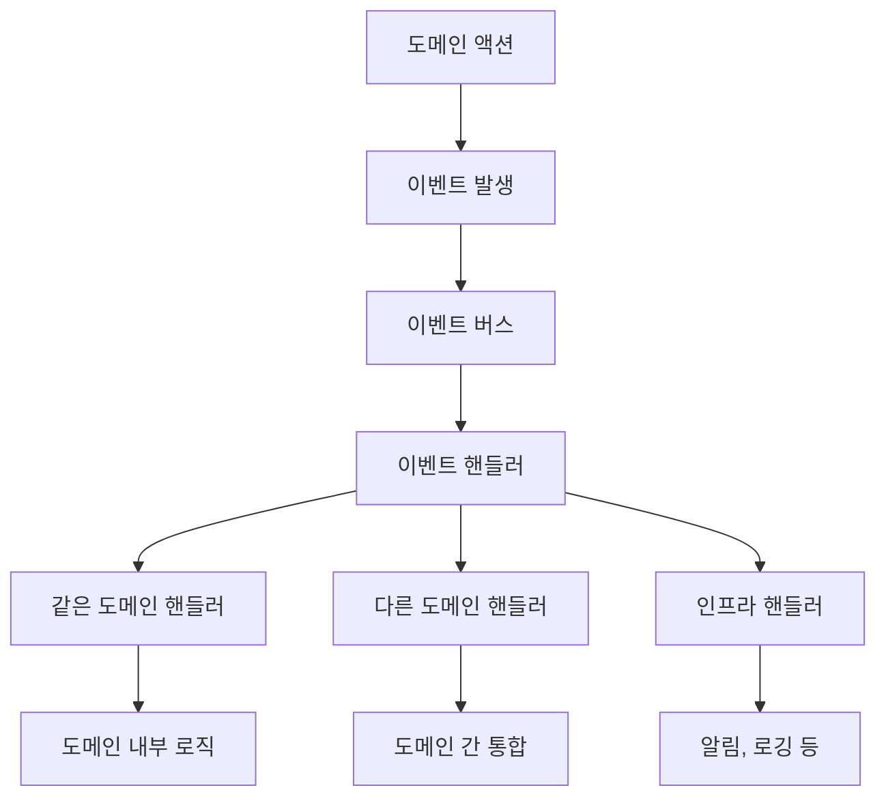
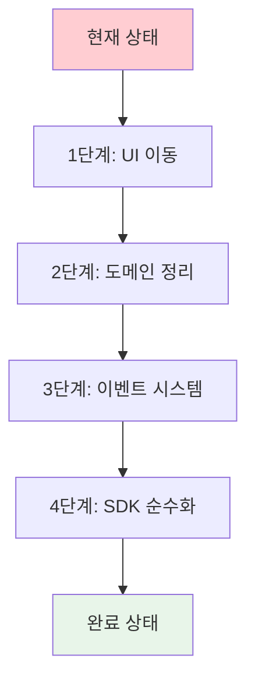
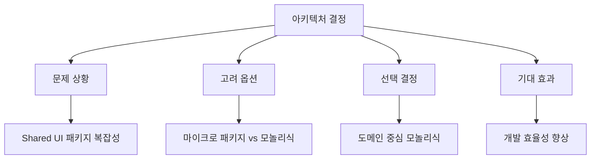

# PosMul 모놀리식 아키텍처 구현 가이드

**작성일**: 2025-07-06  
**목적**: 개발자를 위한 실제 구현 방법 및 베스트 프랙티스  
**적용 범위**: PosMul Web 도메인 중심 모놀리식 구조

---

## 🏗️ **새로운 아키텍처 구조**

### 📊 **PosMul Web 내부 구조**



### 📁 **디렉토리 구조 상세**

```
apps/posmul-web/src/
├── app/                          # Next.js App Router
│   ├── (auth)/
│   ├── prediction/
│   ├── donation/
│   └── ...
├── bounded-contexts/             # DDD Bounded Contexts
│   ├── prediction/
│   │   ├── domain/              # 도메인 로직
│   │   │   ├── entities/
│   │   │   ├── value-objects/
│   │   │   ├── repositories/
│   │   │   └── services/
│   │   ├── application/         # 애플리케이션 로직
│   │   │   ├── use-cases/
│   │   │   ├── services/
│   │   │   └── handlers/
│   │   ├── infrastructure/      # 인프라 구현
│   │   │   ├── repositories/
│   │   │   ├── services/
│   │   │   └── adapters/
│   │   └── presentation/        # 프레젠테이션 로직
│   │       ├── components/
│   │       ├── hooks/
│   │       └── pages/
│   ├── donation/
│   ├── investment/
│   └── forum/
├── shared/                       # 앱 내부 공유
│   ├── kernel/                  # 도메인 공통 로직
│   │   ├── domain/
│   │   ├── events/
│   │   ├── rules/
│   │   ├── services/
│   │   └── types/
│   ├── ui/                      # UI 공통 컴포넌트
│   │   ├── components/
│   │   │   ├── base/
│   │   │   ├── forms/
│   │   │   ├── layout/
│   │   │   ├── feedback/
│   │   │   └── charts/
│   │   ├── hooks/
│   │   └── utils/
│   ├── services/                # 앱 공통 서비스
│   ├── types/                   # 앱 공통 타입
│   └── events/                  # 이벤트 시스템
└── lib/                         # 유틸리티
```

---

## 🔧 **구현 방법**

### 📊 **1. Shared Kernel 구현**

#### 📋 **도메인 공통 로직 예시**

```typescript
// apps/posmul-web/src/shared/kernel/domain/entities/User.ts
export class User {
  constructor(
    public readonly id: UserId,
    public readonly email: Email,
    private pmpBalance: PmpAmount,
    private pmcBalance: PmcAmount
  ) {}

  earnPmp(amount: PmpAmount, source: RewardSource): DomainEvent[] {
    this.pmpBalance += amount;
    return [new PmpEarnedEvent(this.id, amount, source)];
  }

  spendPmc(amount: PmcAmount, purpose: SpendPurpose): Result<DomainEvent[], InsufficientBalanceError> {
    if (this.pmcBalance < amount) {
      return Result.failure(new InsufficientBalanceError(this.pmcBalance, amount));
    }
    
    this.pmcBalance -= amount;
    return Result.success([new PmcSpentEvent(this.id, amount, purpose)]);
  }
}
```

#### 📋 **도메인 이벤트 시스템**

```typescript
// apps/posmul-web/src/shared/kernel/events/DomainEvent.ts
export abstract class DomainEvent {
  public readonly occurredOn: Date;
  public readonly eventId: string;

  constructor() {
    this.occurredOn = new Date();
    this.eventId = crypto.randomUUID();
  }
}

// apps/posmul-web/src/shared/kernel/events/PmpEarnedEvent.ts
export class PmpEarnedEvent extends DomainEvent {
  constructor(
    public readonly userId: UserId,
    public readonly amount: PmpAmount,
    public readonly source: RewardSource
  ) {
    super();
  }
}
```

#### 📋 **비즈니스 규칙 구현**

```typescript
// apps/posmul-web/src/shared/kernel/rules/EconomicRules.ts
export class EconomicRules {
  static calculatePmpReward(action: UserAction): PmpAmount {
    switch (action.type) {
      case 'PREDICTION_WIN':
        return action.accuracy * BASE_PMP_REWARD;
      case 'DONATION_COMPLETE':
        return DONATION_PMP_REWARD;
      case 'FORUM_CONTRIBUTION':
        return action.quality * FORUM_PMP_REWARD;
      default:
        return 0;
    }
  }

  static validatePmcSpending(user: User, amount: PmcAmount): ValidationResult {
    // 비즈니스 규칙 검증 로직
  }
}
```

### 📊 **2. UI 컴포넌트 구조**

#### 📋 **Base UI 컴포넌트**

```typescript
// apps/posmul-web/src/shared/ui/components/base/Button.tsx
interface ButtonProps {
  variant?: 'primary' | 'secondary' | 'outline';
  size?: 'sm' | 'md' | 'lg';
  loading?: boolean;
  disabled?: boolean;
  children: React.ReactNode;
  onClick?: () => void;
}

export const Button: React.FC<ButtonProps> = ({
  variant = 'primary',
  size = 'md',
  loading = false,
  disabled = false,
  children,
  onClick
}) => {
  return (
    <button
      className={cn(
        'font-medium rounded-lg transition-colors',
        {
          'bg-blue-600 text-white hover:bg-blue-700': variant === 'primary',
          'bg-gray-600 text-white hover:bg-gray-700': variant === 'secondary',
          'border border-gray-300 hover:bg-gray-50': variant === 'outline',
        },
        {
          'px-3 py-1.5 text-sm': size === 'sm',
          'px-4 py-2 text-base': size === 'md',
          'px-6 py-3 text-lg': size === 'lg',
        },
        {
          'opacity-50 cursor-not-allowed': disabled || loading,
        }
      )}
      disabled={disabled || loading}
      onClick={onClick}
    >
      {loading ? <LoadingSpinner /> : children}
    </button>
  );
};
```

#### 📋 **도메인별 전용 컴포넌트**

```typescript
// apps/posmul-web/src/bounded-contexts/prediction/presentation/components/PredictionGameCard.tsx
interface PredictionGameCardProps {
  game: PredictionGame;
  onJoin: (gameId: PredictionGameId) => void;
  userBalance: PmpAmount;
}

export const PredictionGameCard: React.FC<PredictionGameCardProps> = ({
  game,
  onJoin,
  userBalance
}) => {
  const canJoin = userBalance >= game.entryFee;

  return (
    <Card className="p-6">
      <CardHeader>
        <CardTitle>{game.title}</CardTitle>
        <CardDescription>{game.description}</CardDescription>
      </CardHeader>
      <CardContent>
        <div className="space-y-4">
          <div className="flex justify-between">
            <span>참가비:</span>
            <span>{game.entryFee} PMP</span>
          </div>
          <div className="flex justify-between">
            <span>예상 보상:</span>
            <span>{game.expectedReward} PMP</span>
          </div>
          <div className="flex justify-between">
            <span>마감일:</span>
            <span>{formatDate(game.deadline)}</span>
          </div>
        </div>
      </CardContent>
      <CardFooter>
        <Button
          variant="primary"
          disabled={!canJoin}
          onClick={() => onJoin(game.id)}
          className="w-full"
        >
          {canJoin ? '게임 참여' : '잔액 부족'}
        </Button>
      </CardFooter>
    </Card>
  );
};
```

### 📊 **3. Import 경로 최적화**

#### 📋 **Import 패턴 정의**

```typescript
// ✅ 올바른 Import 패턴

// 1. Shared UI 컴포넌트
import { Button, Card } from '@/shared/ui/components/base';
import { LoginForm } from '@/shared/ui/components/forms';
import { BaseErrorUI } from '@/shared/ui/components/feedback';

// 2. Shared Kernel 
import { User, PmpEarnedEvent } from '@/shared/kernel/domain';
import { EconomicRules } from '@/shared/kernel/rules';
import { EventBus } from '@/shared/kernel/events';

// 3. 도메인 로직
import { PredictionGame } from '@/bounded-contexts/prediction/domain/entities';
import { CreatePredictionUseCase } from '@/bounded-contexts/prediction/application/use-cases';

// 4. 외부 SDK
import { AuthService, EconomyService } from '@posmul/auth-economy-sdk';
import { UserId, PmpAmount } from '@posmul/shared-types';
```

#### 📋 **Path Mapping 설정**

```json
// apps/posmul-web/tsconfig.json
{
  "compilerOptions": {
    "baseUrl": ".",
    "paths": {
      "@/*": ["./src/*"],
      "@/shared/*": ["./src/shared/*"],
      "@/bounded-contexts/*": ["./src/bounded-contexts/*"],
      "@/app/*": ["./src/app/*"]
    }
  }
}
```

---

## 🚀 **베스트 프랙티스**

### 📊 **1. 도메인 설계 원칙**



#### 📋 **도메인 분리 가이드라인**

```typescript
// ✅ 올바른 도메인 분리
// prediction 도메인은 예측 게임만 담당
export class PredictionGame {
  participate(user: User, choice: PredictionChoice): DomainEvent[] {
    // 예측 게임 참여 로직
    return [new UserParticipatedEvent(user.id, this.id, choice)];
  }
}

// donation 도메인은 기부만 담당
export class DonationCampaign {
  donate(user: User, amount: PmcAmount): DomainEvent[] {
    // 기부 로직
    return [new DonationMadeEvent(user.id, this.id, amount)];
  }
}

// 도메인 간 통합은 이벤트로
export class CrossDomainIntegrationService {
  @EventHandler(DonationMadeEvent)
  async handleDonationMade(event: DonationMadeEvent) {
    // 기부로 인한 PMP 보상 처리
    const pmpReward = EconomicRules.calculatePmpReward({
      type: 'DONATION_COMPLETE',
      amount: event.amount
    });
    
    this.eventBus.publish(new PmpEarnedEvent(event.userId, pmpReward, 'DONATION'));
  }
}
```

### 📊 **2. UI 컴포넌트 설계**



#### 📋 **컴포넌트 재사용 가이드라인**

```typescript
// ✅ 올바른 컴포넌트 계층화

// 1. Base 컴포넌트 (최대 재사용)
export const Button = ({ ... }) => { /* 순수 UI 로직 */ };

// 2. Composite 컴포넌트 (기능 조합)
export const Modal = ({ children, onClose, ... }) => {
  return (
    <div className="modal-overlay">
      <div className="modal-content">
        <Button variant="ghost" onClick={onClose}>×</Button>
        {children}
      </div>
    </div>
  );
};

// 3. Domain 컴포넌트 (도메인 특화)
export const PredictionGameCard = ({ game, onJoin }) => {
  return (
    <Card>
      <CardContent>
        {/* 예측 게임 특화 UI */}
      </CardContent>
      <CardFooter>
        <Button onClick={() => onJoin(game.id)}>
          게임 참여
        </Button>
      </CardFooter>
    </Card>
  );
};

// 4. Page 컴포넌트 (최종 조합)
export const PredictionListPage = () => {
  const games = usePredictionGames();
  
  return (
    <div className="page-container">
      {games.map(game => (
        <PredictionGameCard 
          key={game.id} 
          game={game} 
          onJoin={handleJoin}
        />
      ))}
    </div>
  );
};
```

### 📊 **3. 이벤트 시스템 활용**



#### 📋 **이벤트 시스템 구현**

```typescript
// apps/posmul-web/src/shared/events/EventBus.ts
export class EventBus {
  private handlers = new Map<string, EventHandler[]>();

  subscribe<T extends DomainEvent>(
    eventType: new (...args: any[]) => T,
    handler: EventHandler<T>
  ) {
    const eventName = eventType.name;
    if (!this.handlers.has(eventName)) {
      this.handlers.set(eventName, []);
    }
    this.handlers.get(eventName)!.push(handler);
  }

  async publish(event: DomainEvent) {
    const eventName = event.constructor.name;
    const handlers = this.handlers.get(eventName) || [];
    
    await Promise.all(
      handlers.map(handler => handler.handle(event))
    );
  }
}

// 사용 예시
export class PredictionService {
  constructor(
    private eventBus: EventBus,
    private economyService: EconomyService
  ) {}

  async participateInGame(userId: UserId, gameId: PredictionGameId, choice: PredictionChoice) {
    const user = await this.userRepository.findById(userId);
    const game = await this.gameRepository.findById(gameId);
    
    const events = game.participate(user, choice);
    
    // 이벤트 발행
    for (const event of events) {
      await this.eventBus.publish(event);
    }
  }
}
```

---

## 🎯 **마이그레이션 가이드**

### 📊 **단계별 마이그레이션**



### 📋 **마이그레이션 체크리스트**

#### **Phase 1: UI 마이그레이션**
```bash
# 1. UI 구조 생성
mkdir -p apps/posmul-web/src/shared/ui/components/{base,forms,layout,feedback,charts}

# 2. 컴포넌트 이동
cp packages/shared-ui/src/components/Button.tsx apps/posmul-web/src/shared/ui/components/base/
cp packages/shared-ui/src/components/Card.tsx apps/posmul-web/src/shared/ui/components/base/

# 3. Import 경로 수정
find apps/posmul-web/src -name "*.tsx" -exec sed -i 's/@posmul\/shared-ui/@\/shared\/ui\/components\/base/g' {} \;
```

#### **Phase 2: 도메인 구조 생성**
```bash
# Bounded Context 구조 생성
for domain in prediction donation investment forum; do
  mkdir -p apps/posmul-web/src/bounded-contexts/$domain/{domain,application,infrastructure,presentation}
  mkdir -p apps/posmul-web/src/bounded-contexts/$domain/domain/{entities,value-objects,repositories,services}
  mkdir -p apps/posmul-web/src/bounded-contexts/$domain/application/{use-cases,services,handlers}
  mkdir -p apps/posmul-web/src/bounded-contexts/$domain/infrastructure/{repositories,services,adapters}
  mkdir -p apps/posmul-web/src/bounded-contexts/$domain/presentation/{components,hooks,pages}
done
```

#### **Phase 3: Shared Kernel 구축**
```bash
# Shared Kernel 구조 생성
mkdir -p apps/posmul-web/src/shared/kernel/{domain,events,rules,services,types}
```

---

## 📚 **참고 자료**

### 📊 **아키텍처 결정 기록**



### 📋 **추가 읽을거리**
- [Domain-Driven Design](https://martinfowler.com/bliki/DomainDrivenDesign.html)
- [Modular Monolith Architecture](https://www.kamilgrzybek.com/design/modular-monolith-primer/)
- [Event-Driven Architecture](https://martinfowler.com/articles/201701-event-driven.html)

---

**🚀 이 가이드를 통해 PosMul이 견고하고 확장 가능한 도메인 중심 아키텍처를 갖게 됩니다!**
