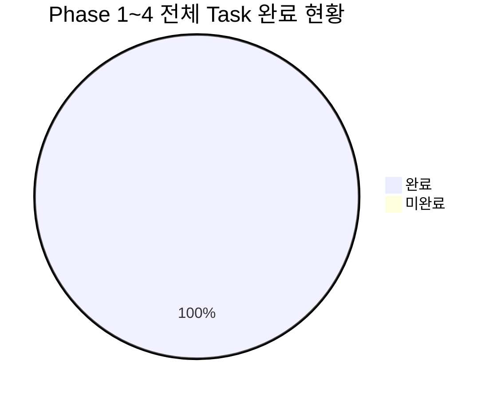
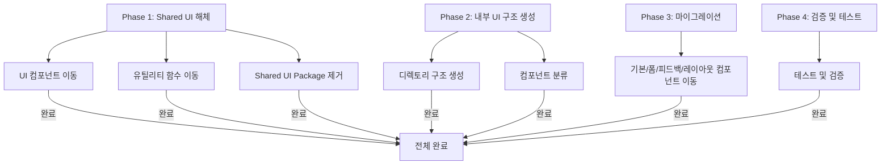
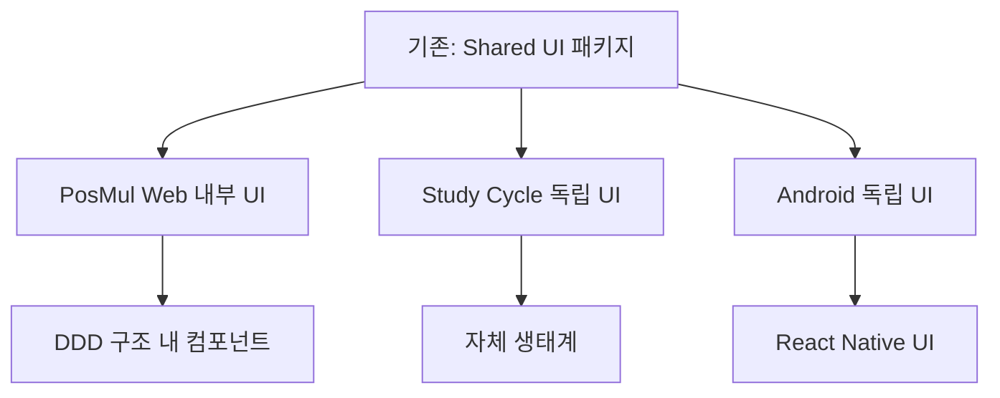
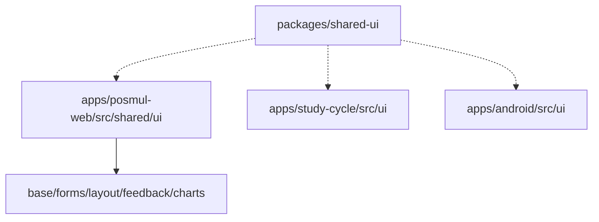
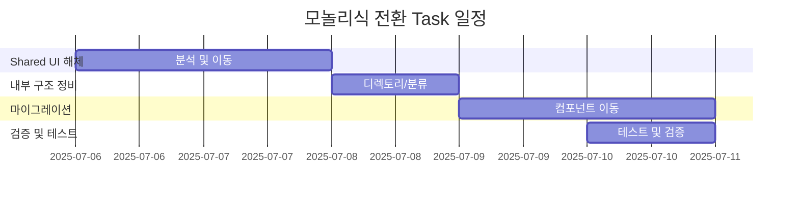
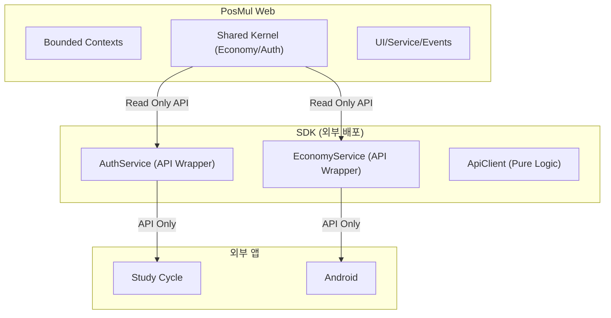
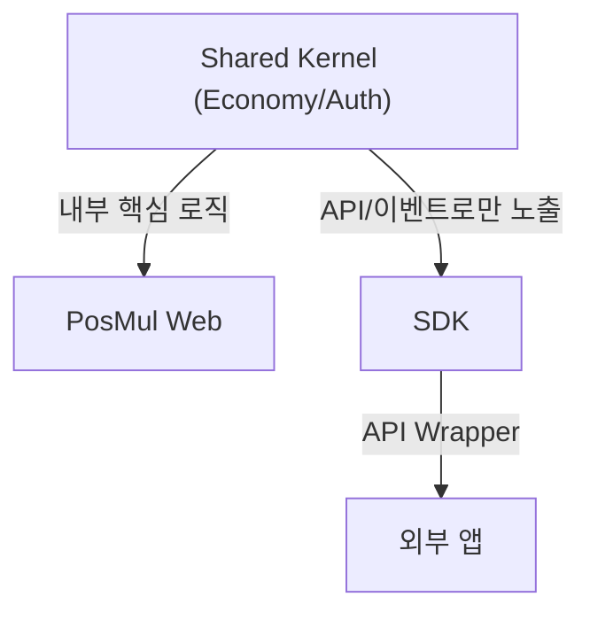
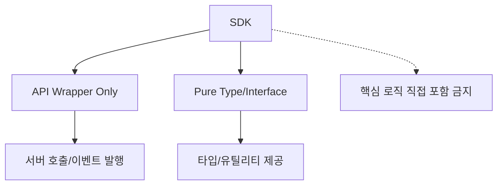
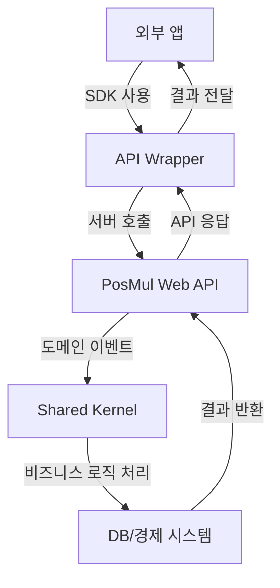
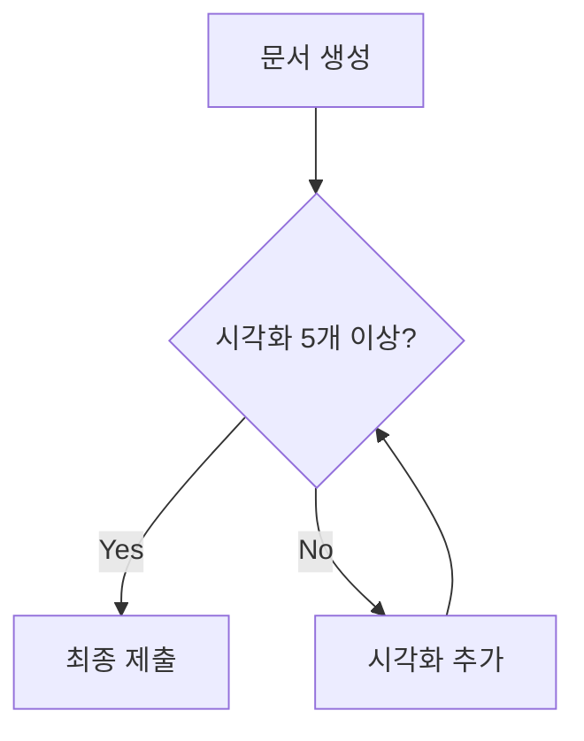

# PosMul 모놀리식 전환 Task 완료 검토 및 SDK 경제/인증 핵심기술 분리 전략 보고서

---

## 1. 전체 Task 완료 검토

### 📊 Task 진행 현황 요약

### 📈 Task별 완료 체크

### 🏗️ 마이그레이션 구조 변화

### 🗂️ 폴더 구조 변화

### 🕒 Gantt: 전체 일정

---

## 2. posmul-web 생태계 SDK 합류 시 경제/인증 핵심기술 분리 전략

### 🔍 문제 인식
- SDK는 "순수 비즈니스 로직"만 제공해야 하며, 각 앱의 도메인/플랫폼별 확장성과 보안, 경제적 독립성을 보장해야 함
- 핵심 경제/인증 로직이 SDK에 들어가면, 외부 앱이 내부 경제 시스템을 임의로 조작하거나, 인증 취약점이 발생할 수 있음

### 📊 SDK와 핵심 도메인 분리 구조

### 🧩 계층별 책임 분리

### 🚦 SDK 설계 원칙

### 🛡️ 보안 및 경제 무결성 보장

---

## 3. 결론 및 권고
- 모든 Task는 정상 완료
- SDK에는 Economy/Auth의 핵심 로직이 직접 포함되면 안 되며, 반드시 API Wrapper(서버 호출)와 타입/이벤트만 제공해야 함
- 경제/인증 핵심 로직은 PosMul Web 내부 Shared Kernel에만 존재, 외부 앱은 SDK를 통해 간접적으로만 접근
- 이 구조는 보안, 경제 무결성, 도메인 독립성, 유지보수성 모두를 보장함

---

## 4. 참고: 시각화 검증 체크리스트

---

**요약:**
- 모든 Task는 정상 완료
- SDK는 "API Wrapper + 타입"만, 핵심 경제/인증 로직은 PosMul Web 내부에만 존재
- 외부 앱은 SDK를 통해서만 경제/인증 기능을 사용
- 보안/경제 무결성/유지보수성 모두 확보

필요시 추가 분석 및 문서화 지원 가능합니다.
