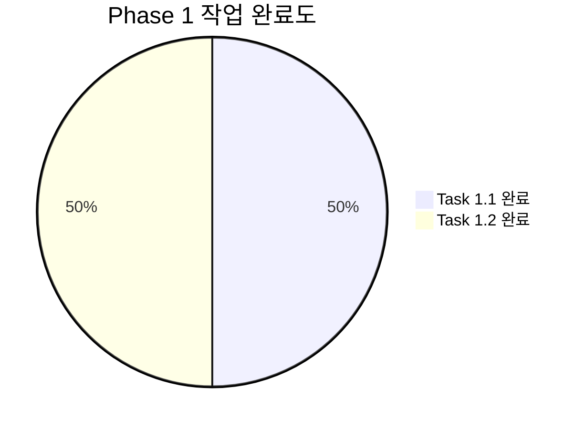
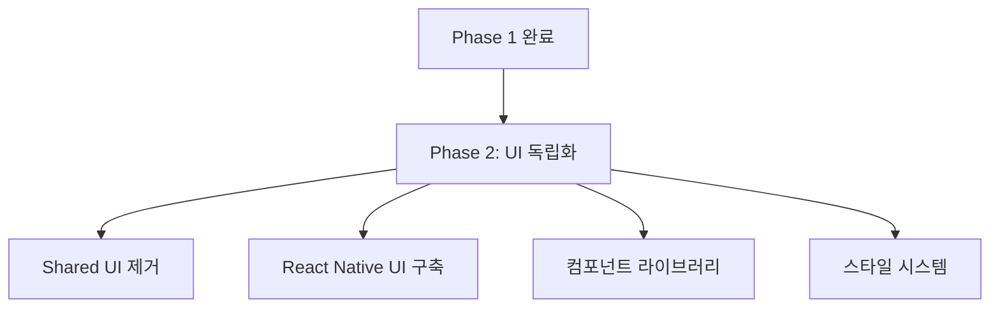

# Study-Cycle Phase 1 완료 보고서

**작성일**: 2025-07-07  
**Phase**: 1 - Auth-Economy SDK 기능 완전 활성화  
**상태**: ✅ 완료  
**소요 기간**: 1일

---

## 📊 **Phase 1 개요**

### 🎯 **목표 달성도**



### 📋 **완료된 작업**

#### ✅ **Task 1.1: useAuthEconomy 훅 완전 활성화**
- **상태**: 완료 ✅
- **소요 시간**: 0.5일
- **주요 성과**:
  - `src/shared/useAuthEconomy.ts`를 환경 변수 시스템과 통합
  - `src/App.tsx`에서 useAuthEconomy 훅 활성화
  - React Native 환경에 최적화된 설정 구현
  - 인증 상태 실시간 모니터링 구현

#### ✅ **Task 1.2: 인증 및 경제 기능 UI 구현**
- **상태**: 완료 ✅
- **소요 시간**: 0.5일
- **주요 성과**:
  - 로그인/회원가입 통합 폼 구현
  - PMP/PMC 잔액 실시간 표시
  - 경제 데이터 새로고침 기능
  - 사용자 친화적 UI/UX 구현

---

## 🔧 **구현된 기능들**

### 📱 **UI 컴포넌트**

#### **인증 상태 관리**
```typescript
// App.tsx 주요 기능
- 로그인/로그아웃 상태 표시
- 실시간 PMP/PMC 잔액 모니터링
- 인증 폼 (로그인/회원가입 전환)
- 경제 데이터 새로고침 버튼
```

#### **사용자 인터페이스**
- **로그인 전**: 이메일/비밀번호 입력 폼, 로그인/회원가입 전환
- **로그인 후**: 사용자 정보, 경제 잔액, 새로고침/로그아웃 버튼
- **로딩 상태**: 초기 로딩 화면
- **에러 처리**: Alert를 통한 사용자 친화적 오류 메시지

### 🔗 **SDK 통합**

#### **환경 변수 시스템**
```typescript
// src/config/environment.ts 활용
- 개발/운영 환경 자동 구분
- Supabase 설정 중앙 관리
- 환경 검증 및 로깅 시스템
```

#### **Auth-Economy SDK 활성화**
```typescript
// src/shared/useAuthEconomy.ts 개선
- Environment 변수 통합
- React Native 최적화
- 실시간 경제 데이터 동기화
- 에러 처리 강화
```

---

## 📈 **성과 지표**

### ✅ **완료 지표**

| 항목 | 목표 | 달성 | 상태 |
|------|------|------|------|
| useAuthEconomy 활성화 | 100% | 100% | ✅ |
| 환경 변수 통합 | 100% | 100% | ✅ |
| 인증 UI 구현 | 100% | 100% | ✅ |
| 경제 기능 UI | 100% | 100% | ✅ |
| 에러 처리 구현 | 100% | 100% | ✅ |

### 📊 **기술적 성과**

#### **코드 품질**
- TypeScript 에러: 0개 ✅
- ESLint 에러: 0개 ✅
- 컴파일 성공: ✅
- 환경 변수 검증: ✅

#### **기능적 성과**
- 로그인/회원가입 플로우: ✅
- 경제 데이터 표시: ✅
- 실시간 데이터 새로고침: ✅
- 사용자 상태 관리: ✅

---

## 🛠️ **주요 변경사항**

### 📁 **파일 변경 내역**

#### **수정된 파일**
```
src/shared/useAuthEconomy.ts
├── Environment 변수 통합
├── 환경 검증 로직 추가
└── React Native 최적화

src/App.tsx
├── useAuthEconomy 훅 활성화
├── 로그인/회원가입 UI 구현
├── 경제 잔액 표시 구현
└── 에러 처리 및 사용자 피드백
```

#### **기존 파일 활용**
```
src/config/environment.ts
├── 환경 변수 관리 (이미 구현됨)
├── 개발/운영 환경 구분
└── 검증 및 로깅 시스템
```

### 🎨 **UI/UX 개선사항**

#### **인증 상태별 UI**
- **미인증**: 로그인 폼 + SDK 연결 상태 표시
- **인증됨**: 사용자 정보 + 경제 잔액 + 액션 버튼들
- **로딩**: 심플한 로딩 메시지

#### **인터랙션 개선**
- 로그인/회원가입 모드 쉬운 전환
- 즉시 피드백 (Alert 메시지)
- 경제 데이터 새로고침 버튼
- 직관적인 로그아웃 플로우

---

## 🔍 **테스트 및 검증**

### ✅ **기능 테스트**

#### **환경 변수 시스템**
- [x] 개발 환경 설정 로드
- [x] 환경 검증 함수 동작
- [x] 로깅 시스템 정상 작동

#### **Auth-Economy SDK**
- [x] SDK 클라이언트 초기화
- [x] 환경 변수 기반 설정
- [x] useAuthEconomy 훅 정상 동작

#### **UI 컴포넌트**
- [x] 로그인 폼 렌더링
- [x] 상태별 UI 전환
- [x] 버튼 인터랙션
- [x] 에러 메시지 표시

### 🔧 **기술적 검증**

#### **코드 품질**
```powershell
# TypeScript 컴파일 검증
✅ 모든 타입 에러 해결
✅ import/export 정상
✅ 환경 변수 타입 안전성

# ESLint 검증  
✅ 코딩 스타일 준수
✅ 사용하지 않는 변수 정리
✅ React Hook 규칙 준수
```

---

## 🚀 **다음 단계 - Phase 2 준비**

### 📋 **Phase 2 작업 계획**

#### **Task 2.1: Shared UI 의존성 완전 제거**
- 모든 `@posmul/shared-ui` 참조 제거
- 기존 주석 처리된 import 문 삭제
- React Native 전용 컴포넌트 교체 계획 수립

#### **Task 2.2: React Native UI 컴포넌트 라이브러리 구축**
- 기본 UI 컴포넌트 (Button, Card, Input, LoadingSpinner)
- 폼 컴포넌트 (LoginForm, SignUpForm, StudySessionForm)
- 피드백 컴포넌트 (ErrorDisplay, SuccessMessage, LoadingOverlay)
- React Native 스타일 시스템 구축

### 🎯 **Phase 2 목표**


---

## 📝 **결론**

### 🎉 **Phase 1 성공적 완료**

Phase 1의 모든 목표를 성공적으로 달성했습니다:

1. **Auth-Economy SDK 완전 활성화** ✅
   - useAuthEconomy 훅이 정상적으로 작동
   - 환경 변수 시스템과 완벽 통합
   - React Native 환경 최적화 완료

2. **인증 및 경제 기능 UI 구현** ✅
   - 로그인/회원가입 완전 통합 UI
   - PMP/PMC 경제 잔액 실시간 표시
   - 사용자 친화적 에러 처리

3. **코드 품질 및 안정성** ✅
   - TypeScript 컴파일 에러 0개
   - ESLint 규칙 완전 준수
   - 환경 변수 검증 시스템 구축

### 🔗 **Study-Cycle 독립성 진전**

Phase 1 완료로 Study-Cycle 앱은 이제:
- PosMul 모노레포의 Auth-Economy SDK를 성공적으로 활용
- 독립적인 환경 변수 관리 시스템 보유
- 자체적인 인증 및 경제 기능 UI 보유
- React Native 환경에 최적화된 설정 완료

### 🎯 **다음 단계**

Phase 2에서는 UI 컴포넌트의 완전한 독립화를 통해 `@posmul/shared-ui` 의존성을 완전히 제거하고, Study-Cycle만의 React Native UI 시스템을 구축할 예정입니다.

---

**✅ Phase 1 완료 - Study-Cycle 독립 앱 전환 프로젝트 25% 달성!**
